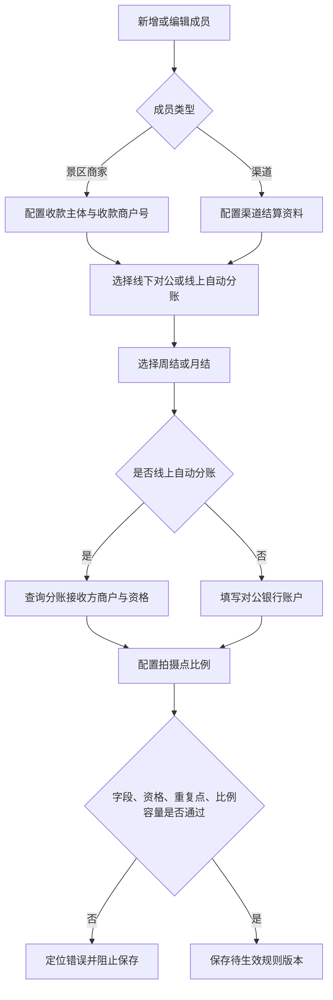

# 成员新增/编辑——景区商家与渠道结算配置 PRD

> 文档状态：已确认  
> 对应页面：成员管理－新增成员/编辑成员  
> 需求基线：[结算能力改造需求分析](./结算能力改造-需求分析-20260916.md)

## 一、需求背景

景区商家与渠道可采用线上自动分账或线下对公结算，并可按自然周或自然月形成账期。原配置缺少一致的收款商户查询、分账接收方资格校验、周期生效规则和拍摄点比例容量校验，容易造成商户信息错误、规则超配或修改后影响历史账期。

本需求在成员新增/编辑页中，分别完善景区商家和渠道的结算配置。

## 二、需求目标

- 景区商家和渠道新增时默认月结，可选择周结或月结。
- 手动输入收款商户号与分账接收方商户均使用“输入框 + 查询按钮”，支持回车查询。
- 线上自动分账必须查询并确认接收方商户名称和分账资格。
- 线下对公结算维护银行账户。
- 按拍摄点校验分成比例总和不超过 100%，剩余比例仅作为景区商家收款商户的溢价。
- 配置以版本方式延后生效，历史订单和账期不重算。

## 三、需求核心业务流程图

## 四、需求功能清单

| 终端 | 模块 | 功能 | 描述 |
|------|------|------|------|
| 自营后台 | 成员新增/编辑 | 景区商家收款配置 | 配置收款主体、商户号和查询结果 |
| 自营后台 | 成员新增/编辑 | 景区商家分成配置 | 自动带出拍摄点，配置自留、商家分成并计算溢价 |
| 自营后台 | 成员新增/编辑 | 渠道结算配置 | 配置结算方式、周期、接收方/银行账户 |
| 自营后台 | 成员新增/编辑 | 渠道分成配置 | 选择拍摄点并配置渠道比例 |
| 自营后台 | 成员新增/编辑 | 商户查询 | 回车或按钮查询名称与分账资格 |
| 自营后台 | 成员新增/编辑 | 周/月结周期 | 默认月结、选项提示、变更延后生效 |
| 后端 | 规则服务 | 容量与版本 | 校验单点合计并保存可追溯规则版本 |

## 五、需求功能详述

### 5.1 自营后台——成员新增/编辑——公共交互与周期

**原型描述**：
结算配置区域使用 Ant Design 表单。结算周期为“周结”“月结”选项，每个选项后有提示图标；悬浮图标或选中后显示对应说明。

**用户故事**：
> 作为运营人员，我想直观配置合作方结算周期，以便系统按合作约定形成账期。

**前置条件**：

- 用户具有成员新增/编辑权限。
- 成员类型为景区商家或渠道。

**核心逻辑**：

- 新增时默认选择月结，可改为周结。
- 周结说明：按自然周统计，周一 00:00 至下周一 00:00。
- 月结说明：按自然月统计，当月 1 日 00:00 至次月 1 日 00:00；月度线下账单于次月 20 日出账。
- 提示内容收纳在对应选项图标，不长期占用表单空间；选中时可显示当前项辅助说明。
- 编辑已有对象改变周期时，弹窗提示当前周期、新周期和生效时点；当前账期结束后生效。
- 所有启用/禁用使用 Switch；管理员账号不可被停用。

**边界条件与异常处理**：

- 周期为空或非法时阻止保存。
- 存在待生效版本时再次修改，以最新保存内容替换待生效版本。
- 保存失败时当前有效版本保持不变。

**技术难点分析**：

- 周/月切换时保证账期无空档、无重叠。

**验收标准 (Acceptance Criteria)**：

- 🎯 新增景区商家或渠道默认月结。
- ✔️ 两个周期选项各自展示对应说明。
- ✔️ 编辑周期不重算当前及历史账期。
- ❌ 非法周期不能保存。

**测试用例**：

- 新增默认月结
- 选择自然周
- 查看周期提示
- 周期变更延后生效
- 非法周期拦截

### 5.2 自营后台——成员新增/编辑——商户号查询

**原型描述**：
“收款商户号”和“分账接收方商户”均为输入框右侧带“查询”按钮，支持按 Enter；查询后在下方回显商户名称与分账资格。

**用户故事**：
> 作为运营人员，我想在保存前确认商户身份和分账资格，以避免资金发往错误主体。

**前置条件**：

- 已输入非空商户号。

**核心逻辑**：

- 输入后点击查询或按 Enter 触发同一查询。
- 查询成功展示商户名称和分账资格。
- 修改商户号立即清空旧名称与资格，必须重新查询。
- 未查询到展示“未查询到”；资格未同步展示“未同步”。
- 线上自动分账时，“分账接收方商户”查询成功且资格有效才允许保存。
- 字段命名统一使用“分账接收方商户”，不再使用“汇付商户号”。

**边界条件与异常处理**：

- 空值不发请求并提示输入。
- 查询超时保留输入值，但不保留旧查询结果。
- 接口返回名称但资格无效时允许展示结果，不允许保存线上配置。
- 防止快速多次查询导致旧响应覆盖新输入。

**技术难点分析**：

- 查询请求竞态和查询结果与当前输入值绑定。

**验收标准 (Acceptance Criteria)**：

- 🎯 Enter 与查询按钮均可获得一致结果。
- ✔️ 修改号码后旧结果被清空。
- ✔️ 无有效资格的线上配置不能保存。
- ❌ 过期响应不得覆盖新号码结果。

**测试用例**：

- Enter 查询成功
- 按钮查询成功
- 修改后清空结果
- 未查询到提示
- 无资格阻止保存
- 旧响应不覆盖

### 5.3 自营后台——成员新增/编辑——景区商家配置

**原型描述**：
景区商家配置依次展示收款主体、收款商户号、结算周期、分账方式、按需展示接收方或银行账户，以及自动带出的拍摄点分成表。

**用户故事**：
> 作为运营人员，我想配置景区商家的收款与分成规则，以便系统计算基础分成和收款商户溢价。

**前置条件**：

- 成员角色包含景区商家。

**核心逻辑**：

- 收款主体支持平台/自营方或景区商家；景区商家收款时必须填写并查询收款商户号。
- 根据收款商户号自动带出其名下运营拍摄点，不支持在景区商家配置中手工新增或删除拍摄点。
- 分账方式支持线下对公结算、线上自动分账。
- 线上显示并校验分账接收方商户；线下显示开户名、开户行、银行账号等对公资料。
- 每个拍摄点配置“收款商户自留比例”和“分给景区商家比例”；系统结合渠道、推广方比例计算剩余比例。
- 说明文案为：“各方分成比例合计 ≤ 100%，剩余比例自动计为收款商户溢价。”文案前不显示图标。
- 溢价只读，不允许手工输入。
- 每个拍摄点满足：自留比例 + 景区商家比例 + 渠道比例 + 推广方比例 ≤ 100%。

**边界条件与异常处理**：

- 商户号未匹配拍摄点时展示空态并阻止生成规则。
- 比例为空、非数字、低于 0、高于 100 或合计超限时，在对应行提示并阻止保存。
- 自动带出重复拍摄点时合并并记录数据异常。
- 银行资料或线上接收方资料缺失时按所选分账方式阻止保存。

**技术难点分析**：

- 多参与方单点容量的实时计算和错误定位。

**验收标准 (Acceptance Criteria)**：

- 🎯 有效配置保存后生成新规则版本。
- ✔️ 拍摄点随收款商户号自动带出。
- ✔️ 溢价等于 100% 减去各方比例合计。
- ✔️ 简化说明无前置图标。
- ❌ 单点超限时保存请求为 0 次。

**测试用例**：

- 自动带出拍摄点
- 线上接收方校验
- 线下银行资料校验
- 自动计算溢价
- 拦截比例超限
- 拦截无拍摄点

### 5.4 自营后台——成员新增/编辑——渠道配置

**原型描述**：
渠道配置展示结算周期、分账方式、接收方/银行账户和可新增删除的拍摄点比例行。

**用户故事**：
> 作为运营人员，我想配置渠道参与的拍摄点与比例，以便渠道按规则获得基础分成。

**前置条件**：

- 成员角色包含渠道。

**核心逻辑**：

- 分账方式支持线下对公结算、线上自动分账。
- 线上显示“分账接收方商户”查询；线下显示对公银行账户。
- 支持添加、删除、选择拍摄点，并填写渠道分成比例。
- 同一渠道不得重复配置同一拍摄点。
- 渠道比例计入该拍摄点总容量，合计不得超过 100%。
- 渠道只获得基础分成，不计算、不展示溢价。
- 保存成功生成分成规则版本与周期规则版本。

**边界条件与异常处理**：

- 拍摄点为空、重复、比例非法或容量不足时定位对应行并阻止保存。
- 编辑时容量校验需排除本对象当前有效旧版本，避免重复占用。
- 保存失败保留原有效配置。

**技术难点分析**：

- 编辑场景中的旧版本排除与并发容量复核。

**验收标准 (Acceptance Criteria)**：

- 🎯 有效渠道配置可保存并用于新订单。
- ✔️ 同一渠道同一拍摄点仅有一条有效规则。
- ✔️ 渠道页面不出现溢价。
- ❌ 容量超限或重复点不能保存。

**测试用例**：

- 新增渠道拍摄点
- 删除渠道拍摄点
- 拦截重复拍摄点
- 拦截容量超限
- 渠道无溢价
- 保存失败保留原版

### 5.5 后端——规则服务——版本与订单快照

**原型描述**：
无；为页面保存后的业务支撑能力。

**用户故事**：
> 作为财务，我想历史账期始终使用当时规则，以便金额可追溯。

**前置条件**：

- 配置通过全部校验。

**核心逻辑**：

- 保存产生不可变规则版本，区分当前有效与待生效。
- 订单达到可结算状态时固化对象、分账方式、商户、比例、周期、规则版本和资格时间。
- 订单仅归属一个自然周或自然月账期。
- 新规则只影响生效时点后的订单，不重算已归期订单和历史账期。
- 金额以分计算，按统一舍入规则处理，尾差归收款商户。

**边界条件与异常处理**：

- 快照失败的订单进入待处理队列，不允许无规则归期。
- 并发保存时最后一次通过版本号校验的操作成功，其余提示配置已更新。

**技术难点分析**：

- 规则切换和订单入账并发下的唯一归期。

**验收标准 (Acceptance Criteria)**：

- 🎯 新旧订单分别命中正确规则版本。
- ✔️ 每个订单只归属一个账期。
- ❌ 历史账期不因配置修改变化。

**测试用例**：

- 新订单命中新版
- 旧订单保留旧版
- 订单唯一归期
- 并发编辑冲突
- 快照失败待处理

## 六、非功能性需求

### 6.1 性能

- 商户查询 P95 不超过 2 秒。
- 单个成员配置保存 P95 不超过 3 秒。

### 6.2 可用性

- 表单校验失败时保留全部输入并滚动定位首个错误。
- 商户查询失败不清空用户输入。

### 6.3 安全

- 配置、商户查询和启停均执行服务端 RBAC。
- 银行账号存储加密，页面默认脱敏；编辑时按权限查看。

### 6.4 监控

- 监控商户查询失败率、资格无效率、比例超限率及规则保存冲突率。
- 规则版本与订单快照需具备可检索审计日志。

