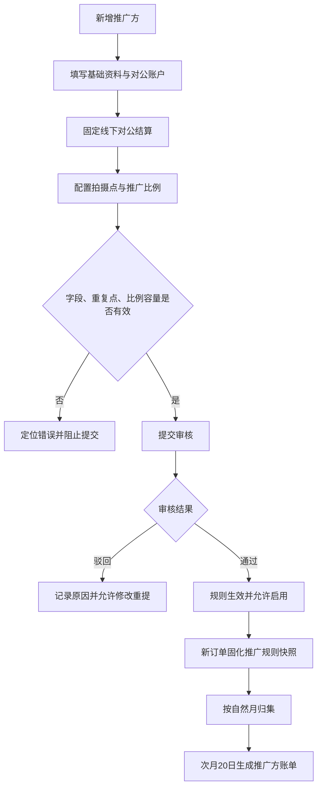

# 推广方新增/编辑——分成配置 PRD

> 文档状态：已确认  
> 对应页面：推广管理－新增推广方/编辑推广方/审核  
> 需求基线：[结算能力改造需求分析](./结算能力改造-需求分析-20260916.md)

## 一、需求背景

推广方的业务模式与景区商家、渠道不同：仅使用线下对公结算，固定按自然月归集并于次月 20 日出账，不需要配置周/月周期，也不参与溢价。若继续复用通用分账表单，会让用户误以为推广方可选线上自动分账或周结。

本需求简化推广方配置，明确固定结算口径，同时保留基础资料、银行账户、拍摄点比例、审核与启停能力。

## 二、需求目标

- 推广方仅支持线下对公结算，禁用线上自动分账。
- 去掉结算周期配置，以只读说明表达固定月结规则。
- 配置对公收款账户、参与拍摄点和推广分成比例。
- 推广方只获得分成金额，不展示基础分成辅助信息或溢价。
- 通过审核状态和启停规则控制新订单是否产生推广分成。

## 三、需求核心业务流程图

## 四、需求功能清单

| 终端 | 模块 | 功能 | 描述 |
|------|------|------|------|
| 自营后台 | 推广方新增/编辑 | 基础资料 | 维护推广方主体、联系人和手机号 |
| 自营后台 | 推广方新增/编辑 | 固定结算方式 | 仅线下对公，线上自动分账禁用 |
| 自营后台 | 推广方新增/编辑 | 固定月结说明 | 去掉周期配置，说明次月 20 日出账 |
| 自营后台 | 推广方新增/编辑 | 对公账户 | 维护开户名、开户行、银行账号等 |
| 自营后台 | 推广方新增/编辑 | 拍摄点分成 | 配置拍摄点与推广比例并校验容量 |
| 自营后台 | 推广方审核 | 审核与驳回 | 审核通过后生效，驳回记录原因 |
| 自营后台 | 推广方管理 | 启用/禁用 | 使用 Switch，受审核状态约束 |
| 后端 | 规则服务 | 固定月结快照 | 按自然月归集且历史账期不重算 |

## 五、需求功能详述

### 5.1 自营后台——推广方新增/编辑——基础与结算资料

**原型描述**：
抽屉展示推广方基础信息、对公账户和结算方式。“线下对公结算”可用，“线上自动分账”置灰；不展示结算周期选择器。

**用户故事**：
> 作为运营人员，我想按推广方真实合作模式维护资料，以免配置无效的线上或周结规则。

**前置条件**：

- 用户具有推广方新增/编辑权限。

**核心逻辑**：

- 基础资料包括推广方名称、联系人、手机号及业务要求的主体证明。
- 分账方式固定为线下对公结算；线上自动分账选项展示为禁用或不允许选择。
- 页面不展示结算周期配置。
- 只读说明：“推广方统一按自然月结算，每月 20 日生成上月账单。”
- 收款账户至少包括开户名、开户行、银行账号；按现有业务要求补充分支行。
- 查询类输入框占位符采用“查询 xxx、xxx”；启用状态使用 Switch。

**边界条件与异常处理**：

- 请求参数传入线上自动分账或周结时，服务端拒绝保存。
- 银行账户必填字段缺失或格式不合法时阻止提交。
- 手机号或主体唯一性冲突时提示具体冲突字段。

**技术难点分析**：

- 前后端同时固化推广方结算方式，避免绕过页面配置。

**验收标准 (Acceptance Criteria)**：

- 🎯 有效基础资料与银行账户可保存草稿。
- ✔️ 线上自动分账不可选择。
- ✔️ 页面无结算周期配置。
- ✔️ 固定月结说明清晰可见。

**测试用例**：

- 保存推广方资料
- 禁用线上分账
- 不显示周期配置
- 银行字段必填
- 服务端拦截周结

### 5.2 自营后台——推广方新增/编辑——拍摄点分成

**原型描述**：
分成配置区域支持添加、删除拍摄点并输入推广比例；不展示溢价或基础分成辅助金额。

**用户故事**：
> 作为运营人员，我想指定推广方参与的拍摄点和比例，以便订单按来源产生推广分成。

**前置条件**：

- 可选拍摄点已建立。

**核心逻辑**：

- 每条规则包括拍摄点和推广分成比例。
- 同一推广方不得重复配置同一拍摄点。
- 比例取值为 0%～100%，并计入该拍摄点所有参与方总容量。
- 单点“收款商户自留 + 景区商家 + 渠道 + 推广方”合计不得超过 100%。
- 推广方只取得推广分成，不享有剩余比例；剩余比例按规则归收款商户作为溢价。
- 页面和详情均不显示“基础分成 ￥x”辅助文案，也不显示溢价。

**边界条件与异常处理**：

- 拍摄点为空、重复、比例非法或总容量超限时在对应行提示并阻止提交。
- 编辑校验需排除当前规则旧版本。
- 多人并发配置同一拍摄点时，审核通过前再次校验容量。

**技术难点分析**：

- 草稿规则不占用有效容量，审核通过时需并发复核。

**验收标准 (Acceptance Criteria)**：

- 🎯 有效拍摄点规则可提交审核。
- ✔️ 推广方仅获得配置比例对应分成。
- ✔️ 页面不展示溢价和基础分成辅助信息。
- ❌ 重复点或容量超限不能提交。

**测试用例**：

- 新增推广拍摄点
- 删除推广拍摄点
- 拦截重复拍摄点
- 拦截比例越界
- 拦截容量超限
- 隐藏溢价信息

### 5.3 自营后台——推广方审核——审核、驳回与启停

**原型描述**：
推广方列表与抽屉展示待审核、已通过、已驳回状态。启用状态使用 Switch；待审核/已驳回不可启用。

**用户故事**：
> 作为审核人员，我想审核推广方资料与分成规则，以便仅让合规规则参与新订单。

**前置条件**：

- 用户具有推广方审核权限。
- 推广方已提交审核。

**核心逻辑**：

- 状态包括待审核、已通过、已驳回。
- 审核通过前重新校验资料、银行账户、重复拍摄点与单点容量。
- 审核通过后规则版本生效，并允许通过 Switch 启用或禁用。
- 审核驳回必须记录原因；推广方可修改后重新提交。
- 待审核、已驳回不可启用；已通过可启停。
- 禁用后不再为新订单生成推广分成，已固化订单及历史账期不变。

**边界条件与异常处理**：

- 审核期间配置被修改时，以最新提交版本重新校验，不允许审核旧版本。
- 容量已被其他规则占用时禁止通过并定位冲突拍摄点。
- 重复审核和启停操作需幂等。

**技术难点分析**：

- 审核版本锁与单点容量并发控制。

**验收标准 (Acceptance Criteria)**：

- 🎯 审核通过后规则只影响新订单。
- ✔️ 驳回原因可查看并支持重新提交。
- ✔️ 非已通过状态不可启用。
- ❌ 容量冲突时不得审核通过。

**测试用例**：

- 审核通过生效
- 驳回必须有原因
- 驳回后重新提交
- 待审核不可启用
- 已通过可启停
- 容量冲突拦截

### 5.4 后端——规则与账期——推广方固定月结

**原型描述**：
无；为推广方配置与结算中心提供后端规则。

**用户故事**：
> 作为财务，我想所有推广方采用统一月结规则，以便统一出账和审批。

**前置条件**：

- 推广方已审核通过且处于启用状态。

**核心逻辑**：

- 周期固定为自然月：当月 1 日 00:00 至次月 1 日 00:00，左闭右开。
- 每月 20 日生成上月推广方线下账单。
- 订单达到可结算状态时固化推广方规则版本并归入唯一月份。
- 推广方账单在结算中心“推广方结算”页签展示；申请后进入结算审批“推广方结算”页签。
- 推广方金额字段在结算中心及详情使用“应分成金额”；审批列表本期统一使用“应结算金额”。
- 历史账期不因比例、启停或资料修改重算。

**边界条件与异常处理**：

- 20 日任务失败需可重跑且按“推广方 + 月份”幂等。
- 对象在出账前被禁用时，已固化的当期订单仍按快照出账。

**技术难点分析**：

- 定时出账任务的幂等与规则快照一致性。

**验收标准 (Acceptance Criteria)**：

- 🎯 每个推广方每月最多生成一笔有效账单。
- ✔️ 账单金额等于当月有效订单推广分成汇总。
- ✔️ 历史账单不随配置修改。
- ❌ 任务重跑不重复出账。

**测试用例**：

- 次月20日出账
- 每月账单唯一
- 修改比例不改历史
- 禁用不改已固化单
- 出账任务重跑

## 六、非功能性需求

### 6.1 性能

- 推广方表单保存 P95 不超过 3 秒。
- 月度出账任务应在当日计划窗口内完成，并支持分片重跑。

### 6.2 可用性

- 审核失败保留提交数据和明确原因。
- 出账任务失败不影响历史账单查询。

### 6.3 安全

- 编辑、审核、启停按角色分别授权。
- 银行账号加密存储、脱敏展示；敏感操作记录审计。

### 6.4 监控

- 监控审核积压、容量冲突、启停失败和月度出账成功率。
- 出账任务未在计划窗口完成或出现重复账单时立即告警。

