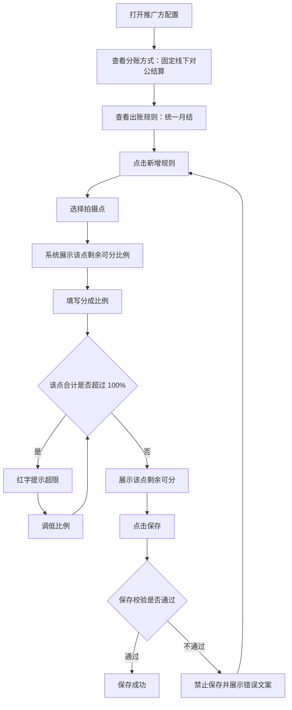

# 推广方配置 PRD（分成配置）

## 一、需求背景

推广方按自有拍摄点资源带来订单，需要按拍摄点逐一约定推广方的分成比例。推广比例属于拍摄点上的外部侧占用，与渠道规则共享同一份可分配空间。

当前存在的问题：推广规则在配置时无法看到该拍摄点剩余的可用空间，容易配置出该点各方合计超过 100% 的规则，导致该拍摄点的订单无法正确分成。同时推广方的出账口径与结算方式需要在配置页明确，避免与渠道、景区商家混淆。

本次需求范围：推广方配置中「分成配置」分区的内容，包括分账方式、出账规则与分成规则。

不在本次范围：推广方的基础信息、资质、银行账户与审核流程；景区商家侧的拍摄点分成见《景区商家配置-分成配置与拍摄点分成-PRD-20260917》，渠道分成规则见《渠道配置-分成配置-PRD-20260917》。

---

## 二、需求目标

* 明确推广方仅支持线下对公结算与统一月结的出账口径。
* 支持按拍摄点为推广方配置分成比例。
* 在同一拍摄点上实时展示剩余可分配的比例。
* 保证同一拍摄点的渠道与推广分成合计不超过该点剩余可分配空间。

---

## 三、核心业务流程

---

## 四、需求功能清单

| ID | 终端 | 模块 | 功能 | 描述 |
| --- | --- | --- | --- | --- |
| F01 | 后台 | 推广方配置 | 分账方式与出账规则 | 固定线下对公结算与统一月结的出账口径 |
| F02 | 后台 | 推广方配置 | 推广分成规则配置 | 按拍摄点新增、修改与删除分成比例 |
| F03 | 后台 | 推广方配置 | 分成比例容量校验 | 校验该点渠道与推广分成合计不超过可分配空间 |

---

# 五、需求功能详述

## 5.1 F01｜分账方式与出账规则

### 5.1.1 功能说明

固定推广方的结算方式与出账口径，避免推广方被配置为线上自动分账或自定义结算周期。

### 5.1.2 用户操作

1. 打开推广方配置的「分成配置」分区。
2. 查看分账方式，确认为线下对公结算。
3. 查看出账规则。

### 5.1.3 页面 / 交互

| 字段 | 组件 | 默认值 | 规则 |
| --- | --- | --- | --- |
| 分账方式 | Radio | 线下对公结算 | 选项为线上自动分账、线下对公结算；「线上自动分账」为禁用状态不可选择；字段下方展示说明「推广方仅支持线下对公结算。」 |
| 出账规则 | 只读文本 | 统一月结，每月 20 日生成上月账单 | 只读展示，不可修改 |

### 5.1.4 核心业务规则

**R01｜分账方式固定**

推广方的分账方式固定为「线下对公结算」。「线上自动分账」选项展示但禁用，不可选择；推广方不参与线上自动分账。

**R02｜出账规则固定**

推广方的出账规则固定为「统一月结，每月 20 日生成上月账单」，只读展示，不提供修改入口。推广方不提供结算周期配置。

### 5.1.5 数据 / 状态变化

无。分账方式与出账规则均不可变更。

### 5.1.6 异常与边界

| 场景 | 触发条件 | 系统处理 | 用户反馈 |
| --- | --- | --- | --- |
| 选择线上自动分账 | 点击禁用的「线上自动分账」选项 | 不响应 | 选项保持禁用态，不改变当前值 |

### 5.1.7 验收标准

**AC01｜线上自动分账不可选**

Given 打开推广方配置的分成配置
When 查看分账方式
Then 当前值为「线下对公结算」，且「线上自动分账」为禁用状态不可选择。

**AC02｜出账规则只读**

Given 打开推广方配置的分成配置
When 查看出账规则
Then 展示「统一月结，每月 20 日生成上月账单」且不可编辑。

---

## 5.2 F02｜推广分成规则配置

### 5.2.1 功能说明

按拍摄点为推广方配置分成比例，支持新增、修改与删除规则行，并在填写过程中实时展示该拍摄点的剩余可分配比例。

### 5.2.2 用户操作

1. 点击「新增规则」。
2. 在新增行中选择拍摄点。
3. 填写该拍摄点的分成比例。
4. 查看该点剩余可分或超限提示。
5. 按需继续新增或删除规则行。

### 5.2.3 页面 / 交互

分区标题为「分成配置」，并带「（非必填）」说明。

| 列 | 组件 | 必填 | 默认值 | 规则 |
| --- | --- | --- | --- | --- |
| 拍摄点 | Select | 是 | 空 | 占位「请选择拍摄点」；已被其他行选中的拍摄点在当前行不可选 |
| 分成比例(%) | InputNumber，整数，0–100 | 是 | 0 | 单位 %，步长 1，不支持小数 |
| 删除 | Link 按钮 | — | — | 从草稿中移除当前行 |

行下方提示按以下优先级展示其一：

| 条件 | 提示 |
| --- | --- |
| 当前行拍摄点与其他行重复 | 红字「同一拍摄点只能配置一条推广规则」 |
| 该点分成合计超过 100% | 红字「该点分成合计 {合计}%，已超 100%（超 {超出值}%）」 |
| 已选拍摄点且未超限 | 灰字「该点剩余可分 {剩余}%」 |

无规则行时展示「暂无分成规则」。表格下方为「新增规则」按钮，样式为虚线通栏。

在查看态（非编辑态）下，拍摄点与分成比例控件为禁用状态，且不展示「新增规则」与「删除」入口。

### 5.2.4 核心业务规则

**R03｜分成配置非必填**

推广方的分成配置整体非必填。不配置任何规则时，该推广方不参与该景区内拍摄点的分成。

**R04｜规则行构成**

每条规则由一个拍摄点与其分成比例构成，两者均必填。

**R05｜拍摄点不可重复**

同一拍摄点只能配置一条推广规则。已被其他行选中的拍摄点在当前行的拍摄点选择器中不可选；若出现重复，该行提示「同一拍摄点只能配置一条推广规则」。

**R06｜该点剩余可分的计算口径**

> 该点剩余可分比例 = 100% − 该点景区商家侧小计 − 该点渠道规则比例合计 − 其他推广方在该点已配置的比例合计 − 本行草稿比例

其中：

* 该点景区商家侧小计 = 该拍摄点所属景区商家的收款商户自留比例 + 分给比例 + 溢价比例（口径见《景区商家配置-分成配置与拍摄点分成-PRD-20260917》）。
* 该点渠道规则比例合计 = 全部渠道对象中匹配该拍摄点的渠道规则比例合计。
* 其他推广方已配置比例合计不含当前正在编辑的推广方自身。
* 参与统计的推广方口径见 R11。

**R07｜单点分成合计上限**

同一拍摄点上，该点景区商家侧小计 + 该点全部渠道规则比例合计 + 该点全部推广规则比例合计不得超过 100%。

**R08｜超限提示**

该点分成合计超过 100% 时，在对应行下方红字提示「该点分成合计 {合计}%，已超 100%（超 {超出值}%）」。

**R09｜新增规则默认值**

点击「新增规则」新增一行，拍摄点为空需用户选择，分成比例默认 0。

**R10｜删除规则**

点击「删除」立即从草稿中移除该行，并释放该行占用的拍摄点。未保存前不产生实际配置变更。

**R11｜参与容量统计的推广方口径**

推广方占用拍摄点容量的前提为「审核通过」且「未禁用」。已禁用或未通过审核的推广方，其已配置的推广规则不占用该拍摄点的可分配空间。

**R12｜比例精度**

分成比例为 0–100 的整数百分比，不支持小数。

### 5.2.5 数据 / 状态变化

本功能只修改推广方配置的规则草稿，保存前不影响任何结算数据。

| 变更项 | 变化内容 | 生效时点 |
| --- | --- | --- |
| 拍摄点变更 | 重新计算该行剩余可分或超限提示 | 立即 |
| 分成比例变更 | 重新计算该行剩余可分或超限提示 | 立即 |
| 其他推广方规则变更 | 重新计算相关拍摄点的剩余可分 | 该配置保存后 |
| 渠道规则变更 | 重新计算相关拍摄点的剩余可分 | 该配置保存后 |
| 景区商家侧比例变更 | 重新计算相关拍摄点的剩余可分 | 该配置保存后 |
| 推广方被禁用 | 其规则不再占用拍摄点容量 | 禁用生效后 |

### 5.2.6 异常与边界

| 场景 | 触发条件 | 系统处理 | 用户反馈 |
| --- | --- | --- | --- |
| 无规则 | 推广方未配置任何规则 | 正常保存 | 展示「暂无分成规则」 |
| 拍摄点未选择 | 规则行未选择拍摄点 | 禁止保存 | 行内提示「请选择拍摄点」 |
| 拍摄点重复 | 两行选择了同一拍摄点 | 禁止保存 | 行内提示「同一拍摄点只能配置一条推广规则」 |
| 剩余可分已为 0 | 该点可分配空间已被占满 | 仍可选择该拍摄点 | 剩余可分展示为 0%，填写任何比例即超限 |
| 无法新增更多规则 | 全部拍摄点均已被占用 | 新增行仍会创建 | 拍摄点选择器无可用选项，需先删除其他行 |

### 5.2.7 验收标准

**AC03｜无规则时展示空态**

Given 推广方未配置任何分成规则
When 查看分成配置
Then 展示「暂无分成规则」，且可正常保存。

**AC04｜新增规则默认值**

Given 分成配置中已有规则行
When 点击「新增规则」
Then 新增行的拍摄点为空，分成比例默认 0。

**AC05｜拍摄点不可重复选择**

Given 某规则行已选中拍摄点 A
When 在其他行的拍摄点选择器中查看
Then 拍摄点 A 为不可选状态。

**AC06｜剩余可分展示**

Given 某拍摄点景区商家侧小计为 40%、渠道占 10%、其他推广方占 5%
When 在该行填写分成比例 20%
Then 行下方展示「该点剩余可分 25%」。

**AC07｜超限红字提示**

Given 某拍摄点景区商家侧小计为 40%、渠道占 10%
When 在该行填写分成比例 60%
Then 行下方红字提示「该点分成合计 110%，已超 100%（超 10%）」。

**AC08｜删除规则**

Given 已配置 2 条分成规则
When 点击其中一条的「删除」
Then 该行从表格移除，原占用的拍摄点在其他行恢复可选。

**AC09｜查看态只读**

Given 以查看态打开推广方配置
When 查看分成配置
Then 拍摄点与分成比例控件为禁用状态，且不展示「新增规则」与「删除」入口。

**AC10｜已禁用推广方不占用容量**

Given 某推广方已配置拍摄点 A 的分成比例但已被禁用
When 在其他推广方配置中查看拍摄点 A 的剩余可分
Then 该禁用推广方的比例不计入已占用空间。

---

## 5.3 F03｜分成比例容量校验

### 5.3.1 功能说明

在保存推广方配置时校验分成规则的完整性与该拍摄点的分成容量，避免配置出各方合计超过 100% 的规则。

### 5.3.2 用户操作

配置完成后点击保存，按提示调整规则后重新保存。

### 5.3.3 页面 / 交互

校验发生在点击保存时。错误文案展示在对应规则行下方，与行内实时提示区分展示。校验不通过时不保存任何改动。

### 5.3.4 核心业务规则

**R13｜保存校验项**

保存时按以下顺序校验，任一不通过则禁止保存：

1. 分账方式必须为「线下对公结算」。
2. 每条规则必须选择拍摄点。
3. 每条规则的分成比例在 0–100 之间。
4. 同一拍摄点不得出现两条推广规则。
5. 每条规则填写的比例不超过该拍摄点不含本行的剩余可分配空间。

**R14｜容量校验的统计范围**

容量校验按 R07 的口径逐拍摄点计算，统计范围为：该拍摄点景区商家侧小计、全部渠道规则、其他有效推广方的规则与本次草稿中除本行外的推广规则。校验本行时不含本行自身。

**R15｜校验失败文案**

| 失败项 | 文案 |
| --- | --- |
| 分账方式非线下对公结算 | 推广方仅支持线下对公结算 |
| 拍摄点未选择 | 当前规则：请选择拍摄点 |
| 比例超出范围 | {拍摄点}：分成比例需大于等于 0 且不超过 100% |
| 拍摄点重复 | 拍摄点「{拍摄点}」已重复配置，请保留一行 |
| 超过剩余可分配 | {拍摄点}：该点仅剩 {剩余}% 可分配（含渠道/推广），当前填写 {填写值}% |

### 5.3.5 数据 / 状态变化

校验不通过时不产生任何数据变化；校验通过后该配置按保存流程生效。

### 5.3.6 异常与边界

| 场景 | 触发条件 | 系统处理 | 用户反馈 |
| --- | --- | --- | --- |
| 比例超出范围 | 输入小于 0 或大于 100 | 禁止保存 | 行内提示「分成比例须大于等于 0 且不超过 100%」 |
| 拍摄点未选择 | 规则行无拍摄点 | 禁止保存 | 行内提示「请选择拍摄点」 |
| 多个拍摄点同时超限 | 多点超过剩余可分配空间 | 阻止保存 | 提示其中一处，修正后继续校验 |
| 无任何规则 | 推广方未配置规则 | 允许保存 | 不触发容量校验 |

### 5.3.7 验收标准

**AC11｜拍摄点未选择阻断保存**

Given 存在一条未选择拍摄点的规则行
When 点击保存
Then 禁止保存并提示「当前规则：请选择拍摄点」。

**AC12｜比例超范围阻断保存**

Given 某规则行分成比例为 120
When 点击保存
Then 禁止保存并提示该拍摄点分成比例需大于等于 0 且不超过 100%。

**AC13｜重复拍摄点阻断保存**

Given 两条规则行选择了同一拍摄点
When 点击保存
Then 禁止保存并提示「拍摄点「{拍摄点}」已重复配置，请保留一行」。

**AC14｜超过剩余可分配阻断保存**

Given 某拍摄点仅剩 10% 可分配
When 在该点填写分成比例 20% 并保存
Then 禁止保存并提示该点仅剩 10% 可分配、当前填写 20%。

**AC15｜无规则可保存**

Given 推广方未配置任何分成规则，且其他必填项已填写
When 点击保存
Then 保存成功。

---

# 六、非功能性需求

> 无新增非功能性要求，沿用现有系统标准。

---

# 七、待确认事项

| ID | 待确认事项 | 影响功能 | 状态 |
| --- | --- | --- | --- |
| Q01 | 推广方被禁用后其已配置的分成规则是保留、清除还是仅暂停生效 | F02 | 待确认 |
| Q02 | 配置保存后景区商家或渠道调整了该拍摄点比例，已保存的推广方配置是否需要重新校验或提示 | F03 | 待确认 |
| Q03 | 推广分成规则为空与配置了比例为 0 的规则，在结算时是否存在差异 | F02 | 待确认 |
| Q04 | 「审核通过」与「未禁用」的判定时点，以及审核中推广方的规则是否占用拍摄点容量 | F02、F03 | 待确认 |
