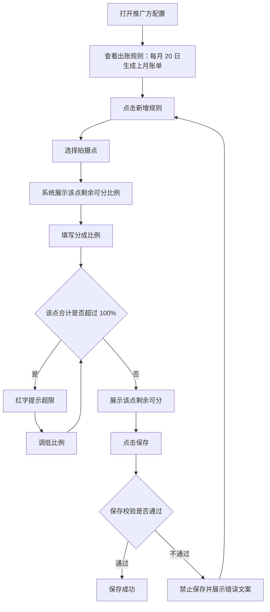
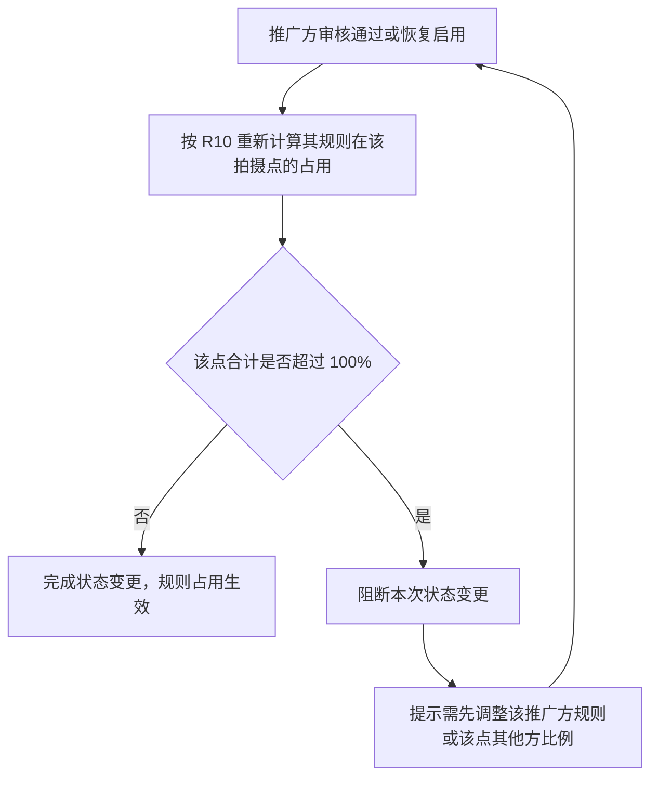

# 推广方配置-分成配置 PRD

> 版本 v1.9　·　日期 2026-09-18

---

## 一、需求背景与目标

**背景**

- 现状：推广方按自有拍摄点资源带来订单，需按拍摄点逐一约定推广方的分成比例。推广比例属于拍摄点上的外部侧占用，与渠道规则共享同一份可分配空间。
- 问题：配置推广规则时看不到该拍摄点剩余的可用空间，容易配置出该点各方合计超过 100% 的规则，导致该拍摄点的订单无法正确分成；同时推广方的出账口径需在配置页明确，避免与渠道、景区商家混淆。
- 范围：本 PRD 覆盖推广方配置中「分成配置」分区，包括出账规则与分成规则。推广方的基础信息、资质、银行账户与审核流程，以及景区商家侧的拍摄点分成、渠道分成规则不在本次范围。

**目标**

- 明确推广方统一每月 20 日生成上月账单，且不提供结算周期配置。
- 支持按拍摄点为推广方配置分成比例。
- 在同一拍摄点上实时展示该点的剩余可分比例。
- 保证同一拍摄点各方分成合计不超过 100%（见 R06）。

---

## 二、核心业务流程

推广方恢复占用容量时的冲突判定：

---

## 三、功能清单

| ID  | 模块 | 功能 | 描述 |
| --- | -- | -- | -- |
| F01 | 后台-推广方配置 | 出账规则 | 只读展示统一月结与出账时点 |
| F02 | 后台-推广方配置 | 推广分成规则配置 | 按拍摄点配置分成比例并校验该点容量 |

---

## 四、功能详述

### F01｜出账规则

**说明**：明确推广方的出账口径，并在配置页以只读方式展示。

**操作路径**：推广方配置 → 分成配置 → 查看出账规则

#### 交互

| 字段 | 组件 | 默认值 | 规则 |
| --- | --- | --- | --- |
| 出账规则 | 只读文本 | 统一月结，每月 20 日生成上月账单 | 只读展示，不可修改 |

#### 规则

**R01｜出账规则固定**　推广方的出账规则固定为「统一月结，每月 20 日生成上月账单」，只读展示，不提供修改入口；推广方不提供结算周期配置。

#### 验收

**AC01｜出账规则只读**　Given 打开推广方配置的分成配置，When 查看出账规则，Then 展示「统一月结，每月 20 日生成上月账单」且不可编辑。

**AC02｜不提供结算周期配置**　Given 打开推广方配置的分成配置，When 查看出账规则区域，Then 仅展示只读的出账规则文本，页面上不存在结算周期配置项。

---

### F02｜推广分成规则配置

**说明**：按拍摄点为推广方配置分成比例，支持新增、修改与删除规则行；填写过程中实时展示该拍摄点的剩余可分，保存时校验规则完整性与该拍摄点的分成容量。

**操作路径**：分成配置 → 新增规则 → 选择拍摄点 → 填写分成比例 → 查看剩余可分或超限提示 → 保存

#### 交互

分区标题为「分成配置」，并带「（非必填）」说明。

| 列 | 组件 | 必填 | 默认值 | 规则 |
| --- | --- | --- | --- | --- |
| 拍摄点 | Select | 是 | 空 | 占位「请选择拍摄点」；已被其他行选中的拍摄点在当前行不可选；无所属景区商家账号的拍摄点在选项中禁用，不可选 |
| 分成比例(%) | InputNumber，整数，0–100 | 是 | 0 | 单位 %，步长 1，不支持小数；输入值不做自动收敛，保存时按 R14 校验，超出 0–100 时禁止保存 |
| 删除 | Link 按钮 | — | — | 从草稿中移除当前行 |

行下方提示按以下优先级展示其一：

| 条件 | 提示 |
| --- | --- |
| 当前行拍摄点与其他行重复 | 红字「同一拍摄点只能配置一条推广规则」 |
| 该点分成合计超过 100% | 红字「该点分成合计 {合计}%，已超 100%（超 {超出值}%）」 |
| 已选拍摄点且未超限 | 「该点剩余可分 {剩余}%」 |

上表的「必填」指已新增规则行内的必填；规则行可全部删除，不新增即为空态（见 R02）。

无规则行时展示「暂无分成规则」。表格下方为「新增规则」按钮，样式为虚线通栏。

在查看态（非编辑态）下，拍摄点与分成比例控件为禁用状态，且不展示「新增规则」与「删除」入口。

保存校验发生在点击保存时。错误文案展示在对应规则行下方，与行内实时提示区分展示。校验不通过时不保存任何改动。

#### 规则

**R02｜分成配置非必填**　推广方的分成配置整体非必填。不配置任何规则时，该推广方不参与该景区内拍摄点的分成。

**R03｜规则行构成**　每条规则由一个拍摄点与其分成比例构成，两者均必填。

**R04｜拍摄点不可重复**　同一拍摄点只能配置一条推广规则。已被其他行选中的拍摄点在当前行的拍摄点选择器中不可选；若出现重复，该行提示「同一拍摄点只能配置一条推广规则」。

**R05｜该点剩余可分的计算口径**　该点剩余可分比例 = 100% − 该点景区商家侧小计 − 该点渠道规则比例合计 − 其他推广方在该点已配置的比例合计 − 本行草稿比例。

- 该点景区商家侧小计 = 该拍摄点所属景区商家的收款商户自留比例 + 分给比例 + 溢价比例。
- 该点渠道规则比例合计 = 全部渠道对象中匹配该拍摄点的渠道规则比例合计。
- 其他推广方已配置比例合计不含当前正在编辑的推广方自身。
- 参与统计的推广方口径见 R10。

**R06｜单点分成合计上限**　同一拍摄点上，该点景区商家侧小计 + 该点全部渠道规则比例合计 + 该点全部推广规则比例合计不得超过 100%。推广规则比例合计的统计口径见 R10。

**R07｜超限提示**　该点分成合计超过 100% 时，在对应行下方红字提示「该点分成合计 {合计}%，已超 100%（超 {超出值}%）」。

**R08｜新增规则默认值**　点击「新增规则」新增一行，拍摄点为空需用户选择，分成比例默认 0。

**R09｜删除规则**　点击「删除」立即从草稿中移除该行，并释放该行占用的拍摄点。未保存前不产生实际配置变更。

**R10｜占用拍摄点容量的推广方口径**　推广方占用拍摄点容量需同时满足「审核通过」与「未禁用」：

- 审核中的推广方不占用该拍摄点的可分配空间。
- 已禁用或审核未通过的推广方，其已配置的推广规则**保留但不占用**该拍摄点的可分配空间，即仅暂停生效，配置内容不被清除。
- 推广方恢复为「审核通过」且「未禁用」后，其规则按原配置恢复占用该拍摄点的可分配空间。

**R11｜比例精度**　分成比例为 0–100 的整数百分比，不支持小数。

**R12｜规则为空与比例为 0 的结算口径**　未配置推广规则与配置了比例为 0 的规则，在结算时结果一致：两种情况下该推广方均不获得分成。

**R13｜启用与停用权限**　推广方的启用与停用操作受 RBAC 权限配置中的「推广方配置编辑权限」控制：角色被勾选该权限即具备启用与停用能力，未勾选则不可执行，因此也无法通过该操作改变其规则对拍摄点容量的占用。本权限沿用系统已有的角色权限配置能力，不新增权限项。

**R14｜保存校验项**　保存时按以下顺序校验，任一不通过则禁止保存：

1. 每条规则必须选择拍摄点。
2. 每条规则的分成比例在 0–100 之间。
3. 同一拍摄点不得出现两条推广规则。
4. 每条规则填写的比例不超过该拍摄点不含本行的剩余可分。

**R15｜容量校验的统计范围**　容量校验按 R06 的口径逐拍摄点计算，统计范围为：该拍摄点景区商家侧小计、全部渠道规则、其他有效推广方的规则与本次草稿中除本行外的推广规则。校验本行时不含本行自身。

**R16｜校验失败文案**

| 失败项 | 文案 |
| --- | --- |
| 拍摄点未选择 | 当前规则：请选择拍摄点 |
| 比例超出范围 | {拍摄点}：分成比例需大于等于 0 且不超过 100% |
| 拍摄点重复 | 拍摄点「{拍摄点}」已重复配置，请保留一行 |
| 超过剩余可分 | {拍摄点}：该点可分配 {可分配}%（不含本行） |

**R17｜恢复占用时的容量冲突**　推广方审核通过或恢复启用时，其规则按 R10 开始占用拍摄点容量：

- 系统在状态变更前按 R06 重新计算该推广方规则涉及的拍摄点；任一点合计将超过 100% 时，**阻断本次审核通过 / 启用**，不改变审核状态与启用状态。
- 阻断时以单句提示该推广方规则将导致拍摄点合计超过 100%、需先调整后再操作；不在提示中展示具体拍摄点、剩余可分与填写值等明细数据。
- 状态变更未被阻断时，其规则按原配置占用拍摄点容量。

**R18｜推广方列表的超限标记**　在推广方列表中，对同时满足以下条件的推广方标记为「容量超限」，便于定位被阻断、需先调整配置的推广方：

- 该推广方存在已配置的分成规则。
- 该推广方当前审核状态非「审核通过」，或审核通过但已禁用，即其规则按 R10 未占用拍摄点容量。
- 将其规则按 R10 计入占用后，任一拍摄点的合计将超过 100%。

标记为按当前配置实时推导的结果，不单独持久化：推广方转为「审核通过且未禁用」后不再满足第二个条件，标记消失；其规则或该点其他方比例调整至不再超限后，标记同样消失。已生效推广方不会出现该标记。标记本身不改变任何配置与结算数据。

**R19｜拍摄点的可配置范围**　仅「已归属某个景区商家账号」的拍摄点可作为推广规则的配置对象，无所属景区商家账号的拍摄点在拍摄点选择器中禁用、不可选。已归属的拍摄点若在景区商家侧尚未配置该点分成规则，视为该点全额归收款商户自留，其剩余可分按 R05 确定。

#### 状态

本功能只修改推广方配置的规则草稿，保存前不影响任何结算数据。

| 变更项 | 变化内容 | 生效时点 |
| --- | --- | --- |
| 拍摄点变更 | 重新计算该行剩余可分或超限提示 | 立即 |
| 分成比例变更 | 重新计算该行剩余可分或超限提示 | 立即 |
| 其他推广方规则变更 | 重新计算相关拍摄点的剩余可分 | 该配置保存后 |
| 渠道规则变更 | 重新计算相关拍摄点的剩余可分 | 该配置保存后 |
| 景区商家侧比例变更 | 重新计算相关拍摄点的剩余可分 | 该配置保存后 |
| 推广方审核中 | 其规则不占用拍摄点容量 | 审核提交后 |
| 推广方被禁用 | 其规则保留但不再占用拍摄点容量，仅暂停生效 | 禁用生效后 |
| 推广方审核通过或恢复启用 | 其规则恢复占用拍摄点容量；将导致该点合计超过 100% 时阻断本次状态变更 | 状态变更时 |

#### 异常

| 场景 | 触发条件 | 系统处理 | 用户反馈 |
| --- | --- | --- | --- |
| 无规则 | 推广方未配置任何规则 | 正常保存 | 展示「暂无分成规则」 |
| 拍摄点未选择 | 规则行未选择拍摄点 | 禁止保存 | 行内提示「请选择拍摄点」 |
| 拍摄点重复 | 两行选择了同一拍摄点 | 禁止保存 | 行内提示「同一拍摄点只能配置一条推广规则」 |
| 比例超出范围 | 输入小于 0 或大于 100 | 禁止保存 | 行内提示「{拍摄点}：分成比例需大于等于 0 且不超过 100%」 |
| 多个拍摄点同时超限 | 多点超过剩余可分 | 禁止保存 | 各行各自提示本行超限，修正后逐行消失 |
| 剩余可分已为 0 | 该点可分配空间已被占满 | 仍可选择该拍摄点 | 剩余可分展示为 0%，填写任何比例即超限 |
| 无法新增更多规则 | 全部拍摄点均已被占用 | 新增行仍会创建 | 拍摄点选择器无可用选项，需先删除其他行 |
| 无启用 / 停用权限 | 当前角色不具备该操作权限 | 不执行状态变更 | 不展示启用 / 停用入口 |
| 恢复占用将导致超限 | 推广方审核通过或恢复启用时，其规则将导致该拍摄点合计超过 100% | 阻断本次状态变更，不改变审核与启用状态 | 提示该推广方规则将导致该点合计超过 100%，需先调整规则或该点其他方比例 |

#### 验收

**AC03｜无规则时展示空态**　Given 推广方未配置任何分成规则，When 查看分成配置，Then 展示「暂无分成规则」，且可正常保存。

**AC04｜新增规则默认值**　Given 分成配置中已有规则行，When 点击「新增规则」，Then 新增行的拍摄点为空，分成比例默认 0。

**AC05｜拍摄点不可重复选择**　Given 某规则行已选中拍摄点 A，When 在其他行的拍摄点选择器中查看，Then 拍摄点 A 为不可选状态。

**AC06｜剩余可分展示**　Given 某拍摄点景区商家侧小计为 40%、渠道占 10%、其他推广方占 5%，When 在该行填写分成比例 20%，Then 行下方展示「该点剩余可分 25%」。

**AC07｜超限红字提示**　Given 某拍摄点景区商家侧小计为 40%、渠道占 10%，When 在该行填写分成比例 60%，Then 行下方红字提示「该点分成合计 110%，已超 100%（超 10%）」。

**AC08｜删除规则**　Given 已配置 2 条分成规则，When 点击其中一条的「删除」，Then 该行从表格移除，原占用的拍摄点在其他行恢复可选。

**AC09｜查看态只读**　Given 以查看态打开推广方配置，When 查看分成配置，Then 拍摄点与分成比例控件为禁用状态，且不展示「新增规则」与「删除」入口。

**AC10｜已禁用推广方不占用容量**　Given 某推广方已配置拍摄点 A 的分成比例但已被禁用，When 在其他推广方配置中查看拍摄点 A 的剩余可分，Then 该禁用推广方的比例不计入已占用空间。

**AC11｜拍摄点未选择阻断保存**　Given 存在一条未选择拍摄点的规则行，When 点击保存，Then 禁止保存并提示「当前规则：请选择拍摄点」。

**AC12｜比例越界阻断保存**　Given 某规则行的分成比例输入框，When 输入 120 后失焦，Then 输入值保持 120、不被自动收敛；When 点击保存，Then 禁止保存并提示「{拍摄点}：分成比例需大于等于 0 且不超过 100%」。

**AC13｜重复拍摄点阻断保存**　Given 两条规则行选择了同一拍摄点，When 点击保存，Then 禁止保存并提示「拍摄点「{拍摄点}」已重复配置，请保留一行」。

**AC14｜超过剩余可分阻断保存**　Given 某拍摄点不含本行的剩余可分为 10%，When 在该点填写分成比例 20% 并保存，Then 禁止保存并提示「{拍摄点}：该点可分配 10%（不含本行）」。

**AC15｜无规则可保存**　Given 推广方未配置任何分成规则且其他必填项已填写，When 点击保存，Then 保存成功。

**AC16｜禁用后规则保留**　Given 某推广方已配置拍摄点 A 的分成比例，When 该推广方被禁用后重新启用且审核状态为「审核通过」，Then 拍摄点 A 的原分成比例仍在配置中，并恢复计入该点已占用空间。

**AC17｜审核中不占用容量**　Given 某推广方已配置拍摄点 A 的分成比例且审核状态为「审核中」，When 在其他推广方配置中查看拍摄点 A 的剩余可分，Then 该审核中推广方的比例不计入已占用空间。

**AC18｜规则为空与比例为 0 结算一致**　Given 推广方 A 未配置任何推广规则，推广方 B 在拍摄点 A 配置了比例为 0 的规则，When 对同一笔拍摄点 A 的订单结算，Then 两者均不获得分成，结算结果一致。

**AC19｜启用停用受权限控制**　Given 当前角色未被勾选「推广方配置编辑权限」，When 查看推广方的状态操作入口，Then 不展示启用 / 停用入口，无法改变该推广方规则的容量占用；When 该角色被勾选该权限后，Then 启用 / 停用入口可见且可操作。

**AC20｜恢复占用冲突阻断生效**　Given 某推广方已配置拍摄点 A 的分成比例且当前为「已禁用」，When 该推广方恢复启用时其规则将导致拍摄点 A 合计超过 100%，Then 本次启用被阻断，该推广方仍为「已禁用」，并提示需先调整该推广方规则或拍摄点 A 的其他方比例。

**AC21｜审核中推广方的列表超限标记**　Given 某推广方处于「审核中」，其已配置的拍摄点 A 比例在计入后将导致拍摄点 A 合计超过 100%，When 查看推广方列表，Then 该推广方被标记为「容量超限」。

**AC22｜标记随状态与配置变化消失**　Given 某推广方因规则会导致拍摄点 A 超限而带有「容量超限」标记，When 调整为该推广方规则或拍摄点 A 其他方比例使该点合计不再超过 100%，Then 该推广方的「容量超限」标记消失；已生效（审核通过且未禁用）的推广方不展示该标记。

**AC23｜无所属商家账号的拍摄点不可选**　Given 某拍摄点未归属任何景区商家账号，When 打开推广规则的拍摄点选择器，Then 该拍摄点在选项列表中为禁用状态；When 尝试选择该拍摄点，Then 无法选中。

