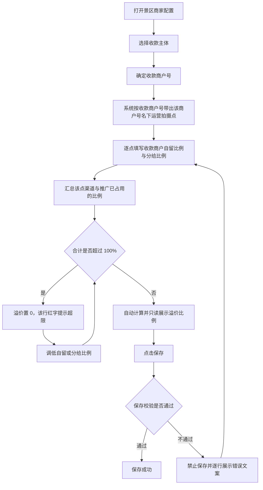

# 景区商家配置 PRD（分成配置与拍摄点分成）

## 一、需求背景

景区商家在参与结算前，需要先确定以谁的名义收款、通过哪个商户号收款、走线上自动分账还是线下对公结算，再按拍摄点逐一约定各方的分成比例。

拍摄点是分成计算的最小单位。同一个拍摄点上会同时存在景区商家侧的比例（收款商户自留、分给景区商家或自营平台）和外部侧的比例（渠道规则、推广规则）。两侧比例分别在不同配置页维护，容易在配置景区商家时把该点比例填到合计超过 100%，导致该拍摄点的订单无法正确分成。

本次需求范围：景区商家配置中「分成配置」分区的内容，包括收款主体、收款商户号、分账方式、结算周期、分账接收方商户与拍摄点分成。

不在本次范围：景区商家的基础信息与银行账户；渠道配置的渠道分成规则见《渠道配置-分成配置-PRD-20260917》，推广方的推广分成规则见《推广方配置-分成配置-PRD-20260917》。

---

## 二、需求目标

* 支持景区商家按收款主体确定收款商户号与分成基数。
* 支持按收款商户号名下的运营拍摄点逐点配置收款商户自留比例与分给比例。
* 自动计算并只读展示每个拍摄点的溢价比例。
* 保证同一拍摄点各方分成比例合计不超过 100%，超限时禁止保存。

---

## 三、核心业务流程

---

## 四、需求功能清单

| ID | 终端 | 模块 | 功能 | 描述 |
| --- | --- | --- | --- | --- |
| F01 | 后台 | 景区商家配置 | 收款与分账方式配置 | 配置收款主体、收款商户号、分账方式与结算周期 |
| F02 | 后台 | 景区商家配置 | 拍摄点分成配置 | 按拍摄点配置自留与分给比例，自动计算溢价 |
| F03 | 后台 | 景区商家配置 | 分成比例容量校验 | 校验单点各方分成合计不超过 100% |

---

# 五、需求功能详述

## 5.1 F01｜收款与分账方式配置

### 5.1.1 功能说明

确定景区商家的收款主体、收款商户号、分账方式与结算周期，为拍摄点分成提供分成基数与出账口径。

### 5.1.2 用户操作

1. 打开景区商家配置的「分成配置」分区。
2. 选择收款主体。
3. 填写或确认收款商户号。
4. 选择分账方式。
5. 选择结算周期。

### 5.1.3 页面 / 交互

| 字段 | 组件 | 必填 | 默认值 | 规则 |
| --- | --- | --- | --- | --- |
| 收款主体 | Radio | 是 | 自营收款 | 选项为自营收款、景区商家收款 |
| 收款商户号 | Input | 是 | 自营收款时为平台汇付商户号 | 自营收款时只读展示平台商户号；景区商家收款时可输入，占位文案「请输入景区商家收款商户号」 |
| 分账方式 | Radio | 是 | 线下对公结算 | 选项为线上自动分账、线下对公结算 |
| 结算周期 | Radio | 是 | 月结 | 选项为周结、月结，各项带说明气泡 |
| 分账接收方商户 | 查询控件 | 是 | — | 仅分账方式为「线上自动分账」时展示；自营收款时只读展示自营分账接收方商户；景区商家收款时占位「查询分账接收方商户」，需查询并同步分账资格 |

结算周期为修改态时，在该字段下方展示「当前{原周期}，{新周期}将在当前账期结束后生效」。

### 5.1.4 核心业务规则

**R01｜收款主体取值**

收款主体取值为「自营收款」或「景区商家收款」，必填。收款主体决定收款商户号的来源，并决定拍摄点分成中「分给」列的名称。

**R02｜收款商户号来源**

收款主体为「自营收款」时，收款商户号固定为平台汇付商户号，只读展示，不可修改。收款主体为「景区商家收款」时，收款商户号由用户填写，必填。

**R03｜分账方式取值**

分账方式取值为「线上自动分账」或「线下对公结算」，必填。

**R04｜分账接收方商户的展示与校验**

分账接收方商户仅在分账方式为「线上自动分账」时展示且必填。填写后需查询汇付商户号并同步分账资格，未查询或未同步时禁止保存。

**R05｜结算周期取值**

结算周期取值为「周结」或「月结」，必填。周期口径与账期口径见《结算中心-账期列表与账期详情-PRD-20260917》，本 PRD 不重复定义。

**R06｜结算周期变更的生效时点**

结算周期首次配置时直接生效。已存在生效周期时修改周期，不立即生效，而是记录为待生效周期，在当前账期结束后生效，并在字段下方展示「当前{原周期}，{新周期}将在当前账期结束后生效」。将待生效周期改回与当前周期相同时，取消待生效状态。

### 5.1.5 数据 / 状态变化

| 变更项 | 变化内容 | 生效时点 |
| --- | --- | --- |
| 收款主体 | 改变收款商户号来源与分给列名 | 立即 |
| 收款商户号 | 触发拍摄点表按新商户号重新对齐 | 立即，见 R09 |
| 分账方式 | 控制分账接收方商户的显隐 | 立即 |
| 结算周期 | 首次直接生效；再次修改记录为待生效周期 | 当前账期结束后 |

### 5.1.6 异常与边界

| 场景 | 触发条件 | 系统处理 | 用户反馈 |
| --- | --- | --- | --- |
| 收款商户号为空 | 收款主体为景区商家收款且未填写 | 禁止保存 | 提示「请输入景区商家收款商户号」 |
| 分账接收方未查询 | 分账方式为线上自动分账且未完成查询 | 禁止保存 | 提示「请输入并查询分账接收方商户」 |
| 结算周期未选择 | 无生效周期与待生效周期 | 禁止保存 | 提示「请选择结算周期」 |
| 周期未变更 | 选择的周期与当前周期相同 | 取消待生效状态 | 不展示待生效提示 |

### 5.1.7 验收标准

**AC01｜收款商户号只读**

Given 收款主体为「自营收款」
When 查看收款商户号字段
Then 展示平台汇付商户号且不可编辑。

**AC02｜收款商户号必填**

Given 收款主体为「景区商家收款」且收款商户号为空
When 点击保存
Then 禁止保存并提示「请输入景区商家收款商户号」。

**AC03｜分账接收方显隐**

Given 分账方式为「线下对公结算」
When 查看分成配置
Then 不展示分账接收方商户字段。

**AC04｜周期变更待生效**

Given 当前生效周期为月结
When 将结算周期改为周结
Then 展示「当前月结，周结将在当前账期结束后生效」。

**AC05｜周期改回取消待生效**

Given 已存在待生效周期为周结，当前生效周期为月结
When 将结算周期改回月结
Then 待生效状态被取消，不再展示待生效提示。

---

## 5.2 F02｜拍摄点分成配置

### 5.2.1 功能说明

按收款商户号名下的运营拍摄点逐点配置收款商户自留比例与分给比例，并自动计算只读的溢价比例。

### 5.2.2 用户操作

1. 确认收款主体与收款商户号。
2. 查看系统自动带出的运营拍摄点列表。
3. 在每一行填写收款商户自留比例与分给比例。
4. 查看该行自动计算出的溢价比例。
5. 点击保存。

### 5.2.3 页面 / 交互

分区标题为「拍摄点分成」，标题下方说明「各方分成比例合计 ≤ 100%，剩余比例自动计为收款商户溢价。」

| 列 | 组件 | 必填 | 默认值 | 规则 |
| --- | --- | --- | --- | --- |
| 拍摄点 | 文本 | — | — | 只读，由收款商户号自动带出，不可新增、选择或删除 |
| 收款商户自留比例 | InputNumber，整数，0–100 | 是 | 100% − 该点已被渠道/推广占用的比例 | 单位 %，步长 1，不支持小数 |
| 分给比例 | InputNumber，整数，0–100 | 是 | 0 | 列名见 R08，单位 %，步长 1，不支持小数 |
| 溢价比例 | InputNumber，只读 | — | 自动计算 | 见 R10，禁用不可编辑 |

空态：

| 场景 | 展示 |
| --- | --- |
| 收款商户号名下无运营拍摄点 | 「该收款商户号名下暂无运营拍摄点，请核对收款主体与收款商户号」 |
| 运营拍摄点已匹配但尚未生成规则 | 「正在按收款商户号自动带出拍摄点…」 |

### 5.2.4 核心业务规则

**R07｜运营拍摄点来源**

拍摄点不由用户新增或选择，由当前收款商户号自动带出该商户号名下的运营拍摄点。收款主体或收款商户号变化时，拍摄点表按新商户号重新对齐。

**R08｜分给比例的列名**

收款主体为「自营收款」时，分给列名为「分给景区商家比例」；收款主体为「景区商家收款」时，分给列名为「分给自营平台比例」。收款商户自留比例的列名固定为「收款商户自留比例」。

**R09｜拍摄点表的对齐规则**

收款主体或收款商户号变化后，按新的运营拍摄点重建表格：

* 新的拍摄点列表中已配置过的拍摄点，保留原有比例配置。
* 新的拍摄点列表中未配置过的拍摄点，补充默认行。
* 原表格中不属于新收款商户号的拍摄点，从表格中移除。

收款商户号未匹配到运营拍摄点时保持当前表格不变，不打断编辑。

**R10｜溢价比例的计算口径**

溢价比例只读，不可编辑，按下式计算：

> 溢价比例 = 100% − 收款商户自留比例 − 分给比例 − 该点渠道占用比例 − 该点推广占用比例

计算结果小于 0 时，溢价比例展示为 0，并按 R12 提示超限。

**R11｜渠道与推广占用口径**

* 该点渠道占用比例 = 全部渠道对象中匹配该拍摄点的渠道规则比例合计。
* 该点推广占用比例 = 全部「审核通过且未禁用」的推广方中该拍摄点规则比例合计。
* 两者均取已保存的配置，不含其他页面尚未保存的草稿改动。

**R12｜单点分成合计上限**

同一拍摄点上，收款商户自留比例 + 分给比例 + 溢价比例 + 该点渠道占用比例 + 该点推广占用比例，合计不得超过 100%。

**R13｜超限提示**

单点合计超过 100% 时，在该行下方红字提示：

> 分成合计 {合计}%，超 100%（超 {超出值}%），请调低收款商户自留或{分给列名}比例

**R14｜自留与分给不可同时为 0**

同一行中收款商户自留比例与分给比例合计为 0 时，该行提示「请填写收款商户自留比例或分成比例」。

**R15｜比例精度**

收款商户自留比例与分给比例均为 0–100 的整数百分比，不支持小数。

### 5.2.5 数据 / 状态变化

本功能只修改景区商家配置中的拍摄点分成规则草稿，保存前不影响任何结算数据。

| 变更项 | 变化内容 | 生效时点 |
| --- | --- | --- |
| 收款商户自留比例 | 重新计算本行溢价比例 | 立即 |
| 分给比例 | 重新计算本行溢价比例 | 立即 |
| 渠道或推广规则变更 | 重新计算相关拍摄点的溢价比例 | 该配置保存后 |

### 5.2.6 异常与边界

| 场景 | 触发条件 | 系统处理 | 用户反馈 |
| --- | --- | --- | --- |
| 无运营拍摄点 | 收款商户号名下无拍摄点 | 不生成表格 | 展示对应空态 |
| 收款商户号未匹配 | 输入中的商户号无法匹配 | 保持当前表格不变 | 不打断编辑 |
| 拍摄点重复 | 同一拍摄点出现两条规则 | 禁止保存 | 提示「拍摄点「{拍摄点}」重复配置，请合并或删除其中一条」 |
| 渠道或推广比例后续调高 | 保存后其他页面提高该点比例 | 本页不自动改写已保存比例 | 下次打开时按新占用重算溢价 |

### 5.2.7 验收标准

**AC06｜拍摄点自动带出**

Given 收款商户号名下有 3 个运营拍摄点
When 打开拍摄点分成
Then 表格自动展示这 3 个拍摄点，且不提供新增、选择或删除拍摄点的入口。

**AC07｜切换收款商户号后对齐**

Given 原收款商户号名下有拍摄点 A、B，已为 A 配置比例
When 将收款商户号切换为名下有拍摄点 A、C 的商户号
Then 表格保留 A 的比例配置、新增 C 的默认行、移除 B。

**AC08｜默认行取值**

Given 某拍摄点已被渠道占用 20%
When 该拍摄点作为新行被带出
Then 收款商户自留比例默认展示为 80%，分给比例默认 0。

**AC09｜分给列名随收款主体变化**

Given 收款主体为「自营收款」
When 查看拍摄点分成表头
Then 第三列为「分给景区商家比例」；将收款主体改为「景区商家收款」后，该列名变为「分给自营平台比例」。

**AC10｜溢价比例自动计算**

Given 某拍摄点收款商户自留 60%、分给 20%，该点渠道占用 10%、推广占用 5%
When 查看该行
Then 溢价比例展示为 5% 且不可编辑。

**AC11｜超限时溢价为 0**

Given 某拍摄点收款商户自留 60%、分给 50%
When 查看该行
Then 溢价比例展示为 0%，并红字提示分成合计 110%、超 100%（超 10%）。

**AC12｜自留与分给同时为 0**

Given 某行收款商户自留比例与分给比例均为 0
When 点击保存
Then 禁止保存并提示「请填写收款商户自留比例或分成比例」。

---

## 5.3 F03｜分成比例容量校验

### 5.3.1 功能说明

在保存景区商家配置时校验每个拍摄点的各方分成比例合计，避免出现合计超过 100% 的配置被保存。

### 5.3.2 用户操作

填写完拍摄点分成后点击保存，按提示调整比例后重新保存。

### 5.3.3 页面 / 交互

校验发生在点击保存时，错误文案展示在对应拍摄点行的下方。校验不通过时不保存任何改动，页面停留在当前编辑状态。

### 5.3.4 核心业务规则

**R16｜保存校验项**

保存时按以下顺序校验，任一不通过则禁止保存：

1. 每条规则必须对应一个拍摄点。
2. 收款商户自留比例、分给比例各自在 0–100 之间。
3. 同一行收款商户自留比例与分给比例合计大于 0。
4. 溢价比例在 0–100 之间。
5. 同一拍摄点不得重复。
6. 单点各方分成合计不超过 100%。

**R17｜超限校验文案**

单点合计超过 100% 时，保存提示为：

> 「{拍摄点}」分成合计 {合计}%，超 100%。已配：收款商户自留比例 {值}%、{分给列名} {值}%、渠道/推广 {值}%。请调低后保存。

**R18｜校验与实时提示的关系**

页面上的行内红字提示为实时反馈，保存校验为最终拦截。两者口径一致，均按 R10 与 R12 计算。

### 5.3.5 数据 / 状态变化

校验不通过时不产生任何数据变化；校验通过后该配置按保存流程生效。

### 5.3.6 异常与边界

| 场景 | 触发条件 | 系统处理 | 用户反馈 |
| --- | --- | --- | --- |
| 比例超出范围 | 输入小于 0 或大于 100 | 禁止保存 | 提示「拍摄点「{拍摄点}」{列名}需在 0-100% 之间」 |
| 拍摄点未选择 | 存在无拍摄点的规则行 | 禁止保存 | 提示「请为每条拍摄点规则选择拍摄点」 |
| 多个拍摄点同时超限 | 多个点合计超过 100% | 阻止保存，不逐条累加展示 | 提示最先校验失败的一处，修正后继续校验 |

### 5.3.7 验收标准

**AC13｜超限阻断保存**

Given 某拍摄点各方分成合计为 110%
When 点击保存
Then 禁止保存，并提示该点合计 110%、已配各项比例与调整指引。

**AC14｜比例超范围阻断保存**

Given 某拍摄点分给比例输入 120
When 点击保存
Then 禁止保存并提示该列比例需在 0-100% 之间。

**AC15｜校验通过后保存**

Given 全部拍摄点的各方分成合计均不超过 100%
When 点击保存
Then 校验通过，配置按保存流程生效。

---

# 六、非功能性需求

> 无新增非功能性要求，沿用现有系统标准。

---

# 七、待确认事项

| ID | 待确认事项 | 影响功能 | 状态 |
| --- | --- | --- | --- |
| Q01 | 收款商户号名下运营拍摄点的数据来源与更新时机 | F02 | 待确认 |
| Q02 | 保存后渠道或推广提高了该拍摄点比例，已保存的景区商家配置是否需要重新校验或提示 | F03 | 待确认 |
| Q03 | 配置保存后是否影响当前已出账或未出账的账期，以及历史数据的处理口径 | F02、F03 | 待确认 |
| Q04 | 待生效的结算周期在生效前是否可以再次修改或撤销 | F01 | 待确认 |
