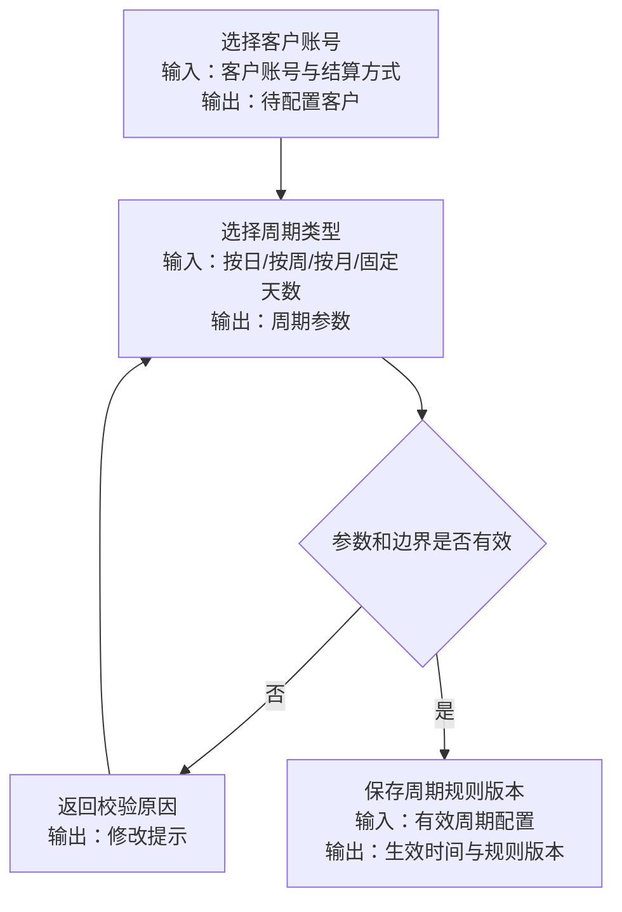
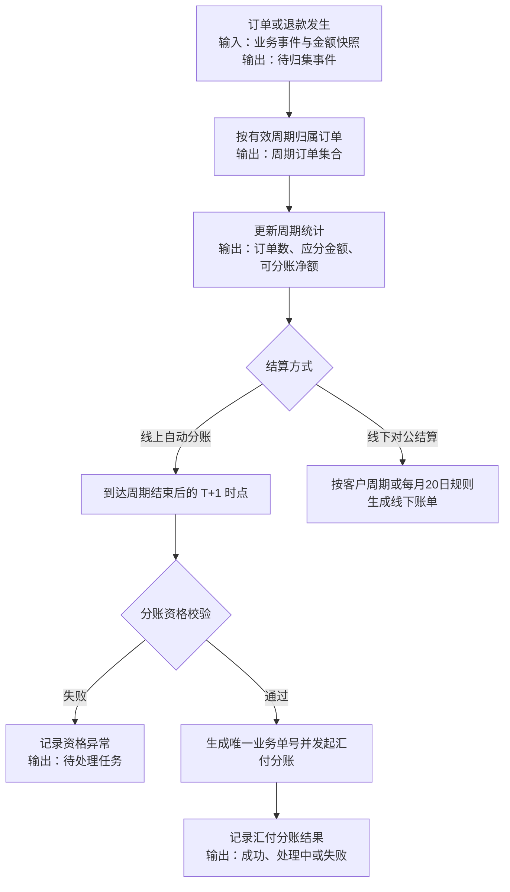

# 汇付周结算与余额分账 PRD

## 一、需求背景

本期目标是建立客户级结算周期与汇付余额分账的最小闭环。线上自动分账按客户配置的周期归集订单，在周期结束后的 T+1 时点完成资格校验并发起分账；系统只记录汇付返回的分账结果，不跟踪备用金账户和银行卡后续到账。

线下对公结算同步增加客户级自定义周期。未配置自定义周期的客户继续按每月 20 日生成账单。线上分账和线下账单共用周期计算能力，但分账结果和账单状态独立管理。

本期只解决：周期配置、订单归属、金额归集、分账资格校验、汇付分账发起、分账结果记录和线下账单生成。对账、打款登记、账单详情、审计留痕、汇付进件审核及后续到账跟踪不在首版展开。

---

## 二、需求目标

- 以客户账号为最小单位，为线上自动分账和线下对公结算配置按日、按周、按月或自定义固定天数周期。
- 为每个订单保存唯一周期归属、周期规则版本和金额快照，避免历史配置变化导致重算。
- 按当前周期实时归集订单、退款和应分金额，输出可分账净额或线下应付账单。
- 分账前校验进件结果、账户状态和分账资格；校验失败时不得调用汇付。
- 使用唯一业务单号发起汇付分账，并只记录汇付返回的成功、处理中或失败结果。
- 线下客户未配置自定义周期时，继续按每月 20 日生成账单；已配置客户按生效周期生成账单。

---

## 三、需求核心业务流程图

### 3.1 周期配置流程

### 3.2 周期结算流程

---

## 四、需求功能清单

| 终端 | 模块 | 功能 | 描述 |
|------|------|------|------|
| 后台 | 汇付账户同步 | 进件与资格同步 | 同步账户标识、进件结果、账户状态和分账资格 |
| 后台 | 客户结算配置 | 自定义结算周期 | 为线上和线下结算配置四类周期并保存规则版本 |
| 后台 | 结算引擎 | 周期归属与金额归集 | 按有效周期归属订单并汇总应分金额和可分账净额 |
| 后台 | 线上分账 | 资格校验与发起 | 校验分账资格后生成唯一业务单号并调用汇付 |
| 后台 | 线上分账 | 分账结果记录 | 保存并更新汇付返回的分账结果和失败原因 |
| 后台 | 线下对公结算 | 自定义周期出账 | 按客户自定义周期或每月 20 日默认规则生成账单 |

**后续范围**：线上对账、线下打款登记、账单详情、权限审计、汇付进件审核、主体关系维护、备用金账户和银行卡后续到账跟踪、真实银行代付及汇付平台内部清算。

---

## 五、需求功能详述

#### 5.1 后台——汇付账户同步——进件与资格同步

**原型描述**：
后台账户资格列表展示客户账号、账户标识、进件结果、账户状态、分账资格和最后同步时间；本期不提供进件审核入口。

**用户故事**：
> 作为平台运营，我想取得客户最新汇付资格，以便分账前判断账户是否可用。

**前置条件**：
- 已取得汇付接口或回调数据。
- 客户账号与汇付主体匹配规则已确认。

**核心逻辑**：
- 输入汇付返回数据，按匹配主键更新客户账号的资格记录。
- 保存账户标识、进件结果、账户状态、分账资格和同步时间。
- 输出最新记录供分账资格校验使用。

**边界条件与异常处理**：
- 无法匹配客户账号时记录异常，不创建可分账关系。
- 字段不完整时资格判为不可用。
- 重复通知按业务主键幂等更新。

**技术难点分析**：
- 外部状态映射。
- 重复和乱序通知的幂等处理。

**验收标准 (Acceptance Criteria)**：
- 🎯 **成功场景**：输入完整结果，更新客户资格记录。
- ✔️ **校验场景**：匹配主键缺失时拒绝更新。
- ❌ **异常场景**：重复通知不产生重复记录。

**测试用例**：
- 成功：同步有效资格
- 校验：拒绝缺失主键
- 异常：重复通知幂等

---

#### 5.2 后台——客户结算配置——自定义结算周期

**原型描述**：
客户结算配置页展示结算方式、周期类型、参数、规则版本和生效时间；线上和线下结算均可配置四类周期。

**用户故事**：
> 作为平台运营，我想按客户配置结算周期，以便按合作约定归集分账或生成账单。

**前置条件**：
- 操作人具备配置权限。
- 客户账号和结算方式已存在。

**核心逻辑**：
- 周期类型支持按日、按周、按月和自定义固定天数。
- 输入客户账号、结算方式、周期参数和生效时间，输出带版本的规则。
- 线下未配置自定义周期时沿用每月 20 日规则。
- 周期仅用于订单归属、金额汇总和任务触发，不代表到账时间。
- 具体截止时间、边界、节假日和生效规则待确认。

**边界条件与异常处理**：
- 参数缺失、超范围或规则重叠时禁止保存。
- 配置变更不得自动重算历史订单和已生成账单。
- 周期内未完成数据的迁移规则待确认。

**技术难点分析**：
- 多周期类型的边界统一计算。
- 规则版本与历史快照绑定。

**验收标准 (Acceptance Criteria)**：
- 🎯 **成功场景**：输入有效配置，生成唯一规则版本。
- ✔️ **校验场景**：参数缺失或规则重叠时禁止保存。
- ❌ **异常场景**：保存失败时旧版本保持有效。

**测试用例**：
- 成功：保存四类周期
- 校验：拦截重叠规则
- 异常：保留旧版规则

---

#### 5.3 后台——结算引擎——周期归属与金额归集

**原型描述**：
无独立复杂页面；周期汇总页展示周期起止时间、订单数、应分金额、可分账净额和数据更新时间。

**用户故事**：
> 作为结算服务，我想为订单分配唯一周期并归集金额，以便生成线上分账任务或线下账单。

**前置条件**：
- 客户账号存在有效周期规则。
- 订单、退款及金额规则快照可用。

**核心逻辑**：
- 输入客户账号、业务事件、金额快照和有效周期版本。
- 将订单归属至唯一周期，保存周期边界、规则版本和金额构成。
- 按周期输出订单数、应分金额和可分账净额。
- 同一事件重复输入不得重复累计。

**边界条件与异常处理**：
- 无有效周期时进入待处理队列，不得发起分账。
- 匹配多个周期时记录配置冲突，不自动选择。
- 退款、撤销和历史调整归属规则待确认。

**技术难点分析**：
- 周期边界与时区处理。
- 事件幂等和历史金额快照不可变。

**验收标准 (Acceptance Criteria)**：
- 🎯 **成功场景**：有效订单归属唯一周期并更新汇总。
- ✔️ **校验场景**：无周期订单不得进入分账任务。
- ❌ **异常场景**：周期冲突进入异常队列。

**测试用例**：
- 成功：归属唯一周期
- 校验：无周期不分账
- 异常：识别周期冲突

---

#### 5.4 后台——线上分账——资格校验与发起

**原型描述**：
线上分账任务页展示客户账号、周期、应分金额、资格校验结果、业务单号和任务状态。

**用户故事**：
> 作为结算服务，我想在 T+1 时点校验资格并发起分账，以便完成线上周期结算。

**前置条件**：
- 周期已结束并形成可分账净额。
- 已取得最新进件结果、账户状态和分账资格。

**核心逻辑**：
- 输入资格记录、周期快照、收款账户和可分账净额。
- 任一资格条件不通过时阻断任务并记录原因。
- 全部条件通过时生成唯一业务单号，调用汇付余额分账接口。
- T+1 起算、金额限制、手续费和重试规则待确认。

**边界条件与异常处理**：
- 资格记录缺失或过期时不得调用汇付。
- 同一周期已有业务单号时不得重复调用。
- 请求超时不得直接生成新业务单号。

**技术难点分析**：
- 外部调用幂等。
- 资格校验与任务发起之间的一致性。

**验收标准 (Acceptance Criteria)**：
- 🎯 **成功场景**：资格通过时生成唯一单号并发起分账。
- ✔️ **校验场景**：资格不通过时汇付调用次数为 0。
- ❌ **异常场景**：超时保留原业务单号并记录异常。

**测试用例**：
- 成功：发起周期分账
- 校验：无资格不调用
- 异常：超时保留单号

---

#### 5.5 后台——线上分账——分账结果记录

**原型描述**：
分账结果页展示业务单号、请求金额、汇付返回结果、失败原因、更新时间和关联周期；不展示后续到账状态。

**用户故事**：
> 作为平台运营，我想查看汇付返回的分账结果，以便处理失败任务和回答业务查询。

**前置条件**：
- 系统已生成分账任务和唯一业务单号。
- 汇付能够返回分账结果。

**核心逻辑**：
- 输入业务单号和汇付返回结果，匹配分账任务。
- 保存成功、处理中或失败结果及失败原因。
- 后续结果按业务单号更新，不查询备用金账户和银行卡到账。

**边界条件与异常处理**：
- 未匹配业务单号时记录异常，不创建新任务。
- 重复结果幂等处理。
- 最终状态不得被处理中结果回退。

**技术难点分析**：
- 外部状态映射。
- 重复、乱序和延迟结果处理。

**验收标准 (Acceptance Criteria)**：
- 🎯 **成功场景**：匹配结果后更新分账记录。
- ✔️ **校验场景**：重复结果只保留一条有效状态。
- ❌ **异常场景**：未匹配结果进入异常记录。

**测试用例**：
- 成功：记录分账结果
- 校验：结果幂等更新
- 异常：隔离未匹配结果

---

#### 5.6 后台——线下对公结算——自定义周期出账

**原型描述**：
线下账单页展示客户周期类型、周期边界、应付金额和账单状态；未配置自定义周期的客户展示每月 20 日默认规则。申请和审核沿用现有能力。

**用户故事**：
> 作为平台财务，我想按客户自定义周期生成账单，以便继续完成线下申请和审核。

**前置条件**：
- 客户存在有效线下周期规则或每月 20 日默认规则。
- 订单归集已输出线下应付明细。

**核心逻辑**：
- 输入客户线下周期规则和应付明细，输出唯一线下账单。
- 已配置客户按按日、按周、按月或固定天数生成账单。
- 未配置客户按每月 20 日生成账单。
- 本期仅调整账单生成时点，申请、审核和打款沿用既有能力。

**边界条件与异常处理**：
- 线上周期配置不得覆盖线下规则。
- 周期变化不得重算已生成账单。
- 冻结、调整和部分打款规则待确认。

**技术难点分析**：
- 线上和线下共用周期计算但隔离结算状态。
- 历史账单与新周期版本兼容。

**验收标准 (Acceptance Criteria)**：
- 🎯 **成功场景**：有效线下周期生成唯一账单。
- ✔️ **校验场景**：未配置周期时使用每月 20 日规则。
- ❌ **异常场景**：生成失败时不产生空账单。

**测试用例**：
- 成功：生成自定义账单
- 校验：使用每月20日
- 异常：不生成空账单

---

## 六、非功能性需求

### 6.1 性能

- **核心接口响应**：周期配置、周期汇总和分账任务查询的 P95/P99 阈值待确认；上线前必须完成压测。
- **幂等性**：重复业务事件重复累计次数为 0；同一周期重复汇付调用次数为 0。
- **数据一致性**：订单周期归属、周期汇总和分账结果关联完整率为 100%。

### 6.2 可用性

- **降级**：汇付不可用时停止新分账调用，保留原业务单号和待处理任务。
- **历史保护**：周期配置变化导致的已结算订单自动重算次数为 0。
- **恢复指标**：SLA、RTO 和 RPO 待确认，确认前不得上线生产。

### 6.3 安全

- **权限**：周期配置、分账发起和人工处理执行 RBAC 校验；无权限业务执行次数为 0。
- **敏感字段**：账户标识、凭证和接口结果按确认规则脱敏；未授权明文返回次数为 0。
- **输入防护**：SQL 注入、XSS、CSRF 和越权测试通过率为 100%。

### 6.4 监控

- **核心指标**：周期归集失败、资格阻断、分账发起、分账成功、分账失败、处理中和接口错误率均可查询。
- **链路追踪**：汇付请求、返回结果、业务单号和状态更新可按业务单号追溯，覆盖率为 100%。
- **告警**：核心异常每项至少完成 1 次告警演练，阈值和通知渠道待确认。

---

## 七、上线计划

### 7.1 灰度策略

- **上线前置条件**：周期规则、T+1 口径、金额口径、汇付接口字段、资格判断和异常重试规则完成确认；`npm run check` 与 `npm run build` 通过。
- **灰度范围**：选择已完成汇付进件且分账资格可用的客户；客户名单和批次比例待确认。
- **放行标准**：Must 用例通过率 100%；重复分账 0 笔；错误周期归属 0 笔；分账结果可追溯率 100%。
- **暂停条件**：出现重复分账、无资格分账、错误周期归属或结果不可追溯，立即暂停扩大范围。

### 7.2 回滚方案

- **触发条件**：命中任一暂停条件，或出现无法通过停止任务隔离的异常。
- **回滚步骤**：停止新分账任务；关闭新增周期配置；冻结自动重试；恢复原有效周期规则；导出受影响任务清单并人工核对。
- **回滚验证**：新分账任务新增数为 0，原周期规则恢复率为 100%，受影响记录可追溯率为 100%。
- **回滚时效**：停止新任务和恢复规则的时限待确认，上线前完成 1 次回滚演练。
