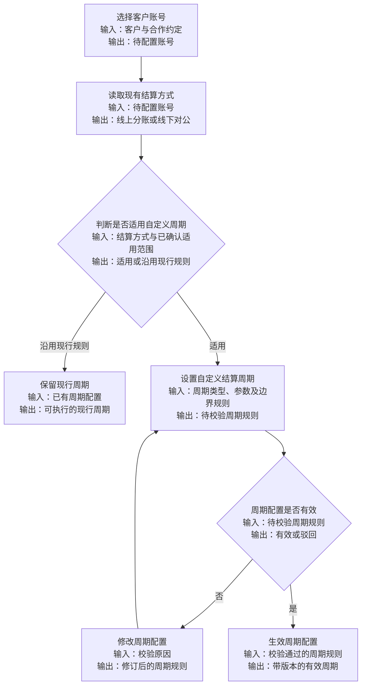
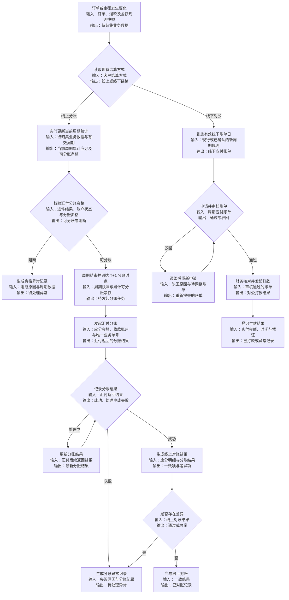

# 需求分析模板

## 一、需求背景分析

当前结算中心已区分线上自动分账与线下对公结算，但现有描述容易将两条链路误解为共用同一结算周期和统一结算状态。实际业务中，每月固定 20 日生成账单是线下对公结算的现行规则；线上自动分账则随订单实时更新业务统计，并按延时分账规则发起分账。系统仅记录汇付返回的分账结果，不跟踪汇付备用金账户及银行卡的后续到账过程。自定义结算周期已确认用于线上自动分账，并支持按日、按周、按月和自定义固定天数；是否同时扩展至线下对公结算，以及是否替换线下每月 20 日规则，仍待确认。

**分析要点**：
- 当前业务痛点是什么？
  - 线下对公结算的“月结、每月固定 20 日生成账单”不能直接作为线上自动分账的统一周期和结算状态口径。
  - 线上业务统计实时更新，分账执行结果与线下账单状态属于不同业务口径，不能合并为单一“结算状态”。
  - 自定义结算周期的适用对象、类型参数、周期边界和配置变更规则尚未完整定义，直接实施存在重复分账、漏分账和历史账单重算风险。
  - 客户主体与汇付主体的关系主要在汇付平台完成，但本系统仍缺少进件结果、账户标识和分账资格的同步及分账前校验闭环。
- 受影响的用户/角色有哪些？
  - 平台运营：为适用的客户账号维护自定义结算周期，查看实时统计、分账结果和异常处理进度。
  - 平台财务：核对线上应分金额、分账结果和对账结果；线下仍根据有效账单完成申请、审核与对公打款。
  - 商户：在汇付平台完成进件、主体关系建立和银行卡绑定，并在客户侧查看进件结果及当前分账资格是否可用。
  - 平台后端/结算服务：实时归集线上数据，计算周期边界，校验分账资格，发起分账并记录汇付返回的分账结果；按有效线下规则生成账单。
  - 汇付平台：承接商户进件、主体关系维护、分账指令及后续资金处理，并向本系统返回分账结果。
- 不做这个需求会有什么影响？
  - 线上分账仍会被误判为等待每月 20 日统一结算，实时统计和分账结果无法准确展示。
  - 自定义周期缺少明确边界和生效规则时，将产生订单跨周期归属错误、重复发起或漏发分账风险。
  - 分账前未校验进件结果和分账资格时，将产生向不可用账户发起分账及额外异常处理的风险。

---

## 二、需求目标确认

基于需求背景，确认本次需求的核心目标和期望成果。

**目标特征**：
- 在现有客户结算方式配置基础上，以客户账号为最小单位新增自定义结算周期配置，周期支持按日、按周、按月和自定义固定天数；各类型的配置参数、边界和生效规则待确认。
- 结算周期仅用于确定订单归属范围、金额汇总边界和任务触发批次，不等同于资金到账时间，也不作为线上、线下共用的统一结算状态。
- 线上业务统计随订单及金额变化实时更新；自定义周期结束后，系统按已确认的 T+1 延时规则对当前周期累计可分账净额发起分账。
- 每笔线上分账仅记录汇付返回的分账结果，并关联客户账号、周期快照、订单明细和应分金额；不跟踪汇付备用金账户及银行卡的后续到账状态。
- 分账发起前必须校验客户汇付进件结果、账户有效性和当前分账资格；不满足条件时不得发起分账，并形成可追踪的异常记录。
- 线下对公结算当前保留每月 20 日生成账单的现行口径；自定义周期是否替换或补充该口径待确认。若纳入本期改造，仅调整账单生成时点，现有账单申请与审核能力继续复用。
- 历史订单和已生成账单不因周期配置变更自动重算；配置迁移、生效时间及周期内未完成数据的处理规则待确认。

---

## 三、业务流程分析

使用 Mermaid 语法绘制当新需求方案的核心业务流程图。

### 3.1 流程1

**自定义结算周期配置**

### 3.2 流程2

**结算执行与对账/打款**

---

## 四、功能拆解清单

按结构化表格表达：

| 终端 | 模块 | 功能 | 功能描述 | 优先级 |
|------|------|------|----------|----------|
| 客户小程序 | 汇付账户 | 进件与账户状态 | 查看汇付进件结果，以及当前分账资格是否可用 | Must |
| 后台 | 汇付账户同步 | 进件与资格同步 | 从汇付平台同步客户主体关系、账户标识、进件结果、账户状态和分账资格；同步方式、字段和刷新时效待确认 | Must |
| 后台 | 客户结算配置 | 自定义结算周期 | 线上自动分账支持按日、按周、按月和自定义固定天数配置结算周期；各类型参数、周期边界和节假日规则待确认，是否扩展至线下对公待确认 | Must |
| 后台 | 线上分账统计 | 当前周期实时归集 | 随订单、退款及金额变化实时更新线上当前周期订单数、应分金额和累计可分账净额；刷新时效与金额口径待确认 | Must |
| 后台 | 结算引擎 | 周期计算与订单归属 | 按生效周期划分订单并保存周期起止时间、规则版本、订单快照和金额构成，避免重单、漏单及历史数据自动重算 | Must |
| 后台 | 线上分账 | 分账资格校验 | 发起分账前校验汇付进件结果、账户有效性和分账资格，不满足条件时阻断任务并生成异常记录 | Must |
| 后台 | 线上分账 | 按周期发起分账 | 自定义周期结束后按 T+1 延时规则发起分账，以当前周期累计可分账净额生成唯一业务单号、请求金额和分账指令 | Must |
| 后台 | 线上分账 | 分账结果记录 | 记录汇付返回的分账结果及失败原因，不跟踪汇付备用金账户和银行卡的后续到账状态；结果获取与更新规则待确认 | Must |
| 后台 | 对账管理 | 线上分账对账 | 按周期关联应分明细和分账结果，识别金额及明细差异 | Must |
| 后台 | 线下对公结算 | 账单周期改造 | 线下当前沿用每月 20 日出账；自定义周期是否适用于线下待确认。若纳入本期，仅改造账单生成时点，并复用现有申请与审核能力 | Must |
| 后台 | 线下对公结算 | 打款登记 | 支持财务根据审核通过的账单登记实际打款金额、时间、凭证和处理结果，并保留操作记录 | Must |
| 后台 | 账单详情 | 周期与结算结果追溯 | 展示客户账号、结算方式、周期边界、规则版本、订单明细、应分金额，以及线上分账结果或线下打款记录 | Should |
| 后台 | 权限与审计 | 周期及资金操作留痕 | 对周期配置、分账发起、异常重试、人工处理和打款登记执行权限校验并记录操作人、时间、对象、前后值与结果 | Must |

**Won't 范围**：第一期不在本系统建设汇付进件审核和主体关系维护能力，不包含真实银行代付、汇付平台内部清算、汇付备用金账户及银行卡到账跟踪、银行卡 T+1 出款规则配置，也不以线上对账数据替代财务线下对公打款依据。

---

## 五、待确认事项

列出需求中尚未确认、需要与干系人进一步沟通的内容。

| 序号 | 待确认事项 | 状态 | 负责人 | 截止日期 |
|------|------------|------|--------|----------|
| 1 | 自定义结算周期支持按日、按周、按月和自定义固定天数 | 已确认 | 业务/财务/产品 | - |
| 2 | 自定义结算周期已确认用于线上自动分账；是否同时扩展至线下对公结算，以及线下每月 20 日规则是保留为默认值、被替换还是仅对部分客户生效 | 部分确认（线下范围待确认） | 业务/财务/产品 | - |
| 3 | 按日的截止时间、按周的结算日、按月的结算日期，以及自定义固定天数的天数范围和起算锚点 | 待确认 | 业务/财务/产品 | - |
| 4 | 周期起止边界是否包含临界时刻，以及时区、跨月/跨年、首个不完整周期和节假日顺延或提前规则 | 待确认 | 业务/财务/技术 | - |
| 5 | 周期配置新增、修改或停用后的生效时间，现有客户默认值、迁移方式，以及已生成账单和周期内订单的处理规则 | 待确认 | 业务/财务/技术 | - |
| 6 | 线上实时统计的数据刷新时效、统计字段、数据源，以及订单取消、退款或调整后的更新方式 | 待确认 | 业务/财务/技术 | - |
| 7 | T+1 分账时点从周期结束、订单完成或其他事件起算，按自然日还是工作日执行，以及具体执行时间和节假日处理 | 待确认 | 业务/技术/汇付对接人 | - |
| 8 | 系统仅记录汇付返回的分账结果，不跟踪汇付备用金账户和银行卡的后续到账状态 | 已确认 | 业务/产品 | - |
| 9 | 线上分账范围包括当前周期累计金额；累计可分账净额是否扣除退款、冲正、冻结、手续费、已分账金额和其他调整项 | 部分确认（净额口径待确认） | 业务/财务/技术 | - |
| 10 | 周期结束后的退款、撤销和历史调整计入原周期还是后续调整周期，以及重试或补发时整单重发还是仅发差额 | 待确认 | 业务/财务/技术 | - |
| 11 | 客户主体与汇付主体的关系主要在汇付平台完成；本系统同步方式、匹配主键、账户标识、进件状态、异常结果及分账资格判断条件 | 部分确认（同步与资格规则待确认） | 业务/技术/汇付对接人 | - |
| 12 | 汇付余额分账接口、调用前置条件、金额精度与限制、手续费承担方，以及请求和结果字段 | 待确认 | 技术/财务/汇付对接人 | - |
| 13 | 汇付分账结果和线上对账各自的状态枚举、结果获取方式、更新条件及展示口径 | 待确认 | 业务/财务/技术 | - |
| 14 | 分账资格异常、请求失败、分账结果异常或对账差异时的自动重试次数、间隔、幂等方案和人工处理权限 | 待确认 | 技术/财务 | - |
| 15 | 线上对账的匹配主键、差异阈值，以及部分成功、重复通知和重复结果的处理规则 | 待确认 | 财务/技术 | - |
| 16 | 线下应付账单需要申请与审核并复用现有能力；冻结、调整、驳回、部分打款和重复打款防护规则 | 部分确认（其余规则待确认） | 财务/业务 | - |
| 17 | 线下打款由谁执行和复核，打款凭证必填字段、文件限制，以及实付与应付不一致时的处理方式 | 待确认 | 财务/产品 | - |
| 18 | 周期配置、分账重试、人工处理和打款登记的角色权限、审计日志保存期限、敏感字段脱敏及导出范围 | 待确认 | 合规/财务/技术 | - |
| 19 | 汇付沙箱环境、测试账户、接口文档、联调负责人，以及实时统计、周期边界、分账结果记录和线下账单的验收用例 | 待确认 | 技术/汇付对接人 | - |

**确认原则**：
- 所有 Must 级别功能必须在 PRD 撰写前完成确认
- 未确认事项不得在 PRD 中编造，必须标注“待确认”
