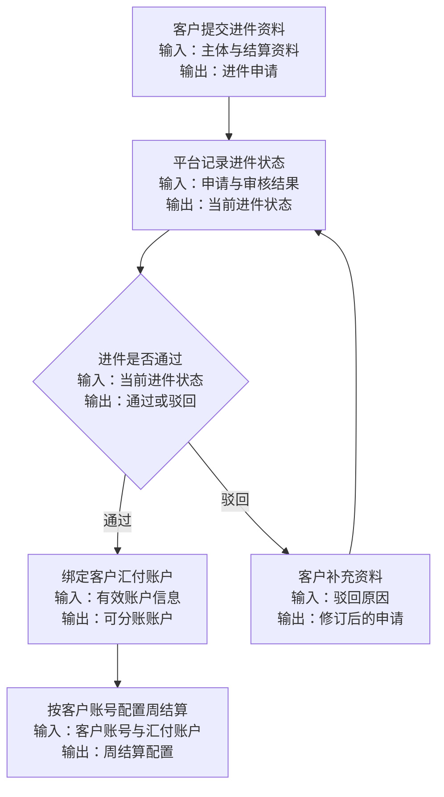
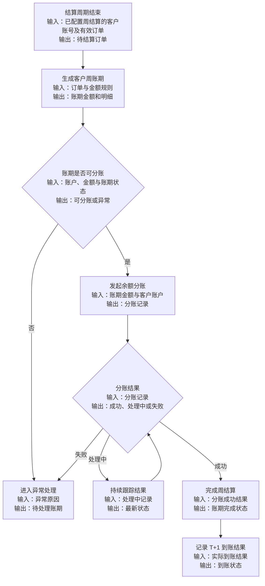

# 需求分析模板

## 一、需求背景分析

客户提出按周结算的合作要求：客户需要完成汇付平台进件，由平台作为交易收款方，使用汇付的余额分账能力，将每周应结算金额分账至客户的汇付账户；客户汇付账户再由汇付按 T+1 规则自动结算。当前已有溢价配置与结算中心，需补充按客户账号配置周结算、汇付账户进件、周账期生成、余额分账和分账结果跟踪能力。

**分析要点**：
- 当前业务痛点是什么？
  - 现有结算中心包含线下对公结算、线上自动分账和推广方结算等账期概念，但尚未明确支持“客户汇付进件 + 平台收款 + 按周余额分账”的完整链路。
  - 客户无法通过汇付账户承接周度结算金额，也无法形成从账期金额、分账指令到汇付结果的闭环记录。
  - 周结算与汇付 T+1 自动结算存在两个时间层级：平台按周发起分账，汇付账户按 T+1 向客户结算，需明确账期和状态口径。
- 受影响的用户/角色有哪些？
  - 客户：提交汇付进件资料、维护汇付账户，并接收周度分账金额。
  - 平台运营/财务：按客户账号配置周结算，审核或跟进入件状态，查看周账期金额和余额分账结果。
  - 平台后端/结算服务：汇总周账期，调用汇付进件、余额分账及结果查询能力，处理回调和异常。
  - 汇付平台：承接客户进件、余额分账指令及客户账户 T+1 自动结算。
- 不做这个需求会有什么影响？
  - 无法按客户要求形成周结算能力，仍需依赖线下打款或现有非目标结算方式。
  - 平台无法统一核对客户汇付账户、周账期金额、分账状态和失败原因。
  - 财务无法区分“平台完成余额分账”和“汇付账户完成 T+1 自动结算”两个环节，增加对账和客诉处理成本。

---

## 二、需求目标确认

基于需求背景，确认本次需求的核心目标和期望成果。

**目标特征**：
- 支持客户完成汇付平台进件，并保存客户汇付账户与进件状态；具体进件资料、审核模式和账户标识待确认。
- 第一期以客户账号为最小单位配置是否采用周结算，不设置周账期人工审核；已配置周结算且符合分账条件的账期直接进入分账流程。
- 支持按周生成客户结算账期，明确账期包含的订单范围、应分账金额、基础金额与溢价等金额构成；周起止日和生成时点待确认。
- 平台作为交易收款方，按周将已完成进件、账号已配置周结算且满足分账条件的账期金额，通过汇付余额分账至客户的汇付账户。
- 支持记录余额分账请求、受理、成功、失败、部分成功（如汇付能力支持）及回调结果；最终状态枚举和重试规则待确认。
- 客户汇付账户使用汇付 T+1 自动结算，平台能够展示或同步该结算状态；汇付账户实际出款日、节假日顺延和可查询字段待确认。
- 建立账期、分账指令、汇付账户和订单金额之间的可追溯关系，支持运营、财务进行对账和异常处理。

---

## 三、业务流程分析

使用 Mermaid 语法绘制当新需求方案的核心业务流程图。

### 3.1 流程1

**客户汇付账户准备**

### 3.2 流程2

**周账期结算**

---

## 四、功能拆解清单

按结构化表格表达：

| 终端 | 模块 | 功能 | 功能描述 | 优先级 |
|------|------|------|----------|----------|
| 客户小程序 | 汇付账户 | 进件与账户状态 | 支持客户提交进件所需信息，并查看进件结果、账户绑定状态和分账资格；具体资料与展示字段待确认 | Must |
| 后台 | 客户结算配置 | 客户账号周结算配置 | 以客户账号为最小单位配置是否采用周结算，并维护对应汇付账户；第一期不设置周账期人工审核 | Must |
| 后台 | 结算中心 | 周账期生成 | 按周汇总客户订单、退款、基础金额、溢价和应结算金额，生成账期编号和订单明细 | Must |
| 后台 | 结算中心 | 余额分账 | 对满足条件的周账期执行分账，记录分账金额和处理结果，并避免同一账期重复分账 | Must |
| 后台 | 结算中心 | 结果跟踪与异常处理 | 展示分账进度与失败原因，对账户异常、余额不足和分账失败等情况进行阻断、重试或人工处理；具体规则待确认 | Must |
| 后台 | 账单详情 | 账期与分账关联 | 关联展示订单明细、周账期、分账金额和分账结果，支持业务追溯 | Should |
| 后台 | 对账管理 | 结算结果对账 | 对比周账期、分账结果和 T+1 到账结果，展示差异并区分平台分账完成与客户实际到账 | Should |

**Won't 范围**：第一期不包含周账期人工审核、客户汇付账户内部的 T+1 出款规则配置、汇付平台内部清算实现和银行侧实际出款能力建设；平台仅记录和展示业务所需结果，具体以汇付可提供的数据和双方确认范围为准。

---

## 五、待确认事项

列出需求中尚未确认、需要与干系人进一步沟通的内容。

| 序号 | 待确认事项 | 状态 | 负责人 | 截止日期 |
|------|------------|------|--------|----------|
| 1 | “周结算”的账期起止日、时区、生成时点和发起分账时点 | 待确认 | 业务/财务 | - |
| 2 | 客户主体与汇付账户的关系：一个客户一个账户，还是支持多个账户/子账户 | 待确认 | 业务/财务/汇付对接人 | - |
| 3 | 汇付进件所需资料、进件入口、审核责任方、驳回补件流程和审核时效 | 待确认 | 业务/汇付对接人 | - |
| 4 | 汇付账户标识、账户状态、分账接收方标识及可用于展示的字段 | 待确认 | 技术/汇付对接人 | - |
| 5 | 平台作为收款方时，余额分账的具体接口、产品名称、调用前置条件和适用账户类型 | 待确认 | 技术/汇付对接人 | - |
| 6 | 周账期金额口径：退款、取消、部分退款、手续费、溢价、历史调整单如何计入 | 待确认 | 财务/业务 | - |
| 7 | 分账金额的最小金额、精度、币种、手续费承担方及是否允许 0 元账期 | 待确认 | 财务/汇付对接人 | - |
| 8 | 分账失败、超时、重复通知、余额不足、客户账户失效时的重试次数、间隔和人工处理规则 | 待确认 | 技术/财务 | - |
| 9 | 分账成功后，平台是否需要获取客户汇付账户 T+1 实际到账结果；若需要，汇付提供何种查询或回调 | 待确认 | 技术/汇付对接人 | - |
| 10 | T+1 的计算基准、节假日顺延、到账时间和客户可见状态 | 待确认 | 财务/汇付对接人 | - |
| 11 | 客户是否可在客户侧查看账期、分账流水、失败原因和 T+1 到账状态 | 待确认 | 产品/业务 | - |
| 12 | 进件资料、账户信息、分账流水和接口日志的敏感字段脱敏、保存期限及权限范围 | 待确认 | 合规/技术 | - |
| 13 | 汇付沙箱环境、测试账户、接口文档、联调负责人和验收用例 | 待确认 | 技术/汇付对接人 | - |

**确认原则**：
- 所有 Must 级别功能必须在 PRD 撰写前完成确认
- 未确认事项不得在 PRD 中编造，必须标注“待确认”
