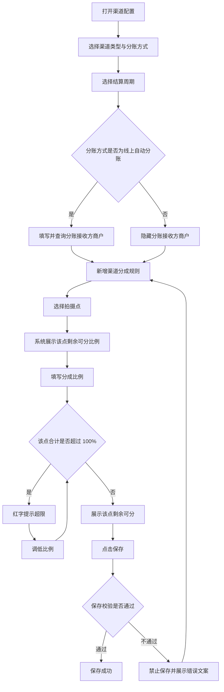

# 渠道配置 PRD（分成配置）

## 一、需求背景

渠道方按自有拍摄点资源带来订单，需要按拍摄点逐一约定渠道的分成比例。渠道比例属于拍摄点上的外部侧占用，与推广方规则共享同一份可分配空间。

当前存在的问题：渠道规则在配置时无法看到该拍摄点剩余的可用空间，容易配置出该点各方合计超过 100% 的规则，导致该拍摄点的订单无法正确分成。

本次需求范围：渠道配置中「分成配置」分区的内容，包括渠道类型、分账方式、结算周期、分账接收方商户与渠道分成规则。

不在本次范围：渠道的基础信息与银行账户；景区商家侧的拍摄点分成见《景区商家配置-分成配置与拍摄点分成-PRD-20260917》，推广方的推广分成规则见《推广方配置-分成配置-PRD-20260917》。

---

## 二、需求目标

* 支持按拍摄点为渠道配置分成比例。
* 在同一拍摄点上实时展示剩余可分配的比例。
* 保证同一拍摄点的渠道与推广分成合计不超过该点剩余可分配空间。
* 支持同一渠道配置多个拍摄点的分成规则。

---

## 三、核心业务流程

---

## 四、需求功能清单

| ID | 终端 | 模块 | 功能 | 描述 |
| --- | --- | --- | --- | --- |
| F01 | 后台 | 渠道配置 | 渠道信息与分账方式配置 | 配置渠道类型、分账方式与结算周期 |
| F02 | 后台 | 渠道配置 | 渠道分成规则配置 | 按拍摄点新增、修改与删除分成比例 |
| F03 | 后台 | 渠道配置 | 分成比例容量校验 | 校验该点渠道与推广分成合计不超过可分配空间 |

---

# 五、需求功能详述

## 5.1 F01｜渠道信息与分账方式配置

### 5.1.1 功能说明

确定渠道的类型、分账方式与结算周期，为渠道分成规则提供出账口径。

### 5.1.2 用户操作

1. 打开渠道配置的「分成配置」分区。
2. 选择渠道类型。
3. 渠道类型为「自定义合作方」时，填写具体渠道类型。
4. 选择分账方式。
5. 选择结算周期。

### 5.1.3 页面 / 交互

| 字段 | 组件 | 必填 | 默认值 | 规则 |
| --- | --- | --- | --- | --- |
| 渠道类型 | Select | 是 | 空 | 选项为摄影师、渠道方、招商方、投资方、自定义合作方 |
| 具体渠道类型 | Input | 是 | 空 | 仅渠道类型为「自定义合作方」时展示，占位文案「请输入具体渠道类型」 |
| 分账方式 | Radio | 是 | 线下对公结算 | 选项为线上自动分账、线下对公结算 |
| 结算周期 | Radio | 是 | 月结 | 选项为周结、月结，各项带说明气泡 |
| 分账接收方商户 | 查询控件 | 是 | — | 仅分账方式为「线上自动分账」时展示，占位「查询分账接收方商户」，需查询并同步分账资格 |

结算周期为修改态时，在该字段下方展示「当前{原周期}，{新周期}将在当前账期结束后生效」。

### 5.1.4 核心业务规则

**R01｜渠道类型取值**

渠道类型取值为「摄影师」「渠道方」「招商方」「投资方」「自定义合作方」之一，必填。渠道类型不参与分成比例的计算。

**R02｜具体渠道类型**

渠道类型为「自定义合作方」时，具体渠道类型展示且必填。其他类型下不展示该字段，已填写的内容不参与保存校验。

**R03｜分账方式取值**

分账方式取值为「线上自动分账」或「线下对公结算」，必填。

**R04｜分账接收方商户的展示与校验**

分账接收方商户仅在分账方式为「线上自动分账」时展示且必填。填写后需查询汇付商户号并同步分账资格，未查询或未同步时禁止保存。

**R05｜结算周期取值**

结算周期取值为「周结」或「月结」，必填。周期口径与账期口径见《结算中心-账期列表与账期详情-PRD-20260917》，本 PRD 不重复定义。

**R06｜结算周期变更的生效时点**

结算周期首次配置时直接生效。已存在生效周期时修改周期，不立即生效，而是记录为待生效周期，在当前账期结束后生效，并在字段下方展示「当前{原周期}，{新周期}将在当前账期结束后生效」。将待生效周期改回与当前周期相同时，取消待生效状态。

### 5.1.5 数据 / 状态变化

| 变更项 | 变化内容 | 生效时点 |
| --- | --- | --- |
| 渠道类型 | 控制具体渠道类型的显隐 | 立即 |
| 分账方式 | 控制分账接收方商户的显隐，并改变分成比例列名 | 立即，见 R07 |
| 结算周期 | 首次直接生效；再次修改记录为待生效周期 | 当前账期结束后 |

### 5.1.6 异常与边界

| 场景 | 触发条件 | 系统处理 | 用户反馈 |
| --- | --- | --- | --- |
| 渠道类型未选择 | 渠道类型为空 | 禁止保存 | 提示请选择渠道类型 |
| 具体渠道类型为空 | 渠道类型为自定义合作方且未填写 | 禁止保存 | 提示「请输入具体渠道类型」 |
| 分账接收方未查询 | 分账方式为线上自动分账且未完成查询 | 禁止保存 | 提示「请查询汇付商户号并同步分账资格」 |
| 结算周期未选择 | 无生效周期与待生效周期 | 禁止保存 | 提示「请选择结算周期」 |

### 5.1.7 验收标准

**AC01｜具体渠道类型显隐**

Given 渠道类型不为「自定义合作方」
When 查看渠道配置
Then 不展示具体渠道类型字段。

**AC02｜自定义渠道类型必填**

Given 渠道类型为「自定义合作方」且具体渠道类型为空
When 点击保存
Then 禁止保存并提示「请输入具体渠道类型」。

**AC03｜分账接收方显隐**

Given 分账方式为「线下对公结算」
When 查看分成配置
Then 不展示分账接收方商户字段。

**AC04｜结算周期待生效提示**

Given 当前生效周期为月结
When 将结算周期改为周结
Then 展示「当前月结，周结将在当前账期结束后生效」。

---

## 5.2 F02｜渠道分成规则配置

### 5.2.1 功能说明

按拍摄点为渠道配置分成比例，支持新增、修改与删除规则行，并在填写过程中实时展示该拍摄点的剩余可分配比例。

### 5.2.2 用户操作

1. 点击「新增规则」。
2. 在新增行中选择拍摄点。
3. 填写该拍摄点的分成比例。
4. 查看该点剩余可分或超限提示。
5. 按需继续新增或删除规则行。

### 5.2.3 页面 / 交互

分区标题为「渠道分成规则（非必填）」。

| 列 | 组件 | 必填 | 默认值 | 规则 |
| --- | --- | --- | --- | --- |
| 拍摄点 | Select | 是 | 新增行默认为第一个未被占用的拍摄点 | 占位「请选择拍摄点」；已被其他行选中的拍摄点在当前行不可选 |
| 分成比例 | InputNumber，整数，0–100 | 是 | 新增行默认为上一行的比例，无上一行时为 0 | 列名见 R07，单位 %，步长 1，不支持小数 |
| 删除 | Link 按钮 | — | — | 从草稿中移除当前行 |

行下方提示按以下优先级展示其一：

| 条件 | 提示 |
| --- | --- |
| 当前行拍摄点与其他行重复 | 红字「同一拍摄点只能配置一条渠道规则」 |
| 该点分成合计超过 100% | 红字「该点分成合计 {合计}%，已超 100%（超 {超出值}%）」 |
| 已选拍摄点且未超限 | 灰字「该点剩余可分 {剩余}%」 |

无规则行时展示「暂无分成规则」。表格下方为「新增规则」按钮，样式为虚线通栏。

### 5.2.4 核心业务规则

**R07｜分成比例的列名**

分账方式为「线下对公结算」时，比例列名为「分成比例(%)」；分账方式为「线上自动分账」时，列名为「分账比例(%)」。

**R08｜规则非必填**

渠道分成规则整体非必填。不配置任何规则时，该渠道不参与该景区内拍摄点的分成。

**R09｜规则行构成**

每条规则由一个拍摄点与其分成比例构成，两者均必填。

**R10｜拍摄点不可重复**

同一拍摄点只能配置一条渠道规则。已被其他行选中的拍摄点在当前行的拍摄点选择器中不可选；若出现重复，该行提示「同一拍摄点只能配置一条渠道规则」。

**R11｜该点剩余可分的计算口径**

> 该点剩余可分比例 = 100% − 该点景区商家侧小计 − 其他渠道在该点已配置的比例合计 − 该点推广方已配置的比例合计 − 本行草稿比例

其中：

* 该点景区商家侧小计 = 该拍摄点所属景区商家的收款商户自留比例 + 分给比例 + 溢价比例（口径见《景区商家配置-分成配置与拍摄点分成-PRD-20260917》）。
* 该点推广方已配置比例合计 = 全部「审核通过且未禁用」的推广方中该拍摄点规则比例合计。
* 其他渠道已配置比例合计不含当前正在编辑的渠道自身的已保存规则。

**R12｜单点分成合计上限**

同一拍摄点上，该点景区商家侧小计 + 该点全部渠道规则比例合计 + 该点全部推广规则比例合计不得超过 100%。

**R13｜超限提示**

该点分成合计超过 100% 时，在对应行下方红字提示「该点分成合计 {合计}%，已超 100%（超 {超出值}%）」。

**R14｜新增规则默认值**

点击「新增规则」新增一行，拍摄点默认选中第一个未被其他行占用的拍摄点，分成比例默认取当前最后一行已填写的比例；无其他规则行时比例默认为 0。

**R15｜删除规则**

点击「删除」立即从草稿中移除该行，并释放该行占用的拍摄点。未保存前不产生实际配置变更。

**R16｜比例精度**

分成比例为 0–100 的整数百分比，不支持小数。

### 5.2.5 数据 / 状态变化

本功能只修改渠道配置的规则草稿，保存前不影响任何结算数据。

| 变更项 | 变化内容 | 生效时点 |
| --- | --- | --- |
| 拍摄点变更 | 重新计算该行剩余可分或超限提示 | 立即 |
| 分成比例变更 | 重新计算该行剩余可分或超限提示 | 立即 |
| 其他渠道或推广规则变更 | 重新计算相关拍摄点的剩余可分 | 该配置保存后 |
| 景区商家侧比例变更 | 重新计算相关拍摄点的剩余可分 | 该配置保存后 |

### 5.2.6 异常与边界

| 场景 | 触发条件 | 系统处理 | 用户反馈 |
| --- | --- | --- | --- |
| 无规则 | 渠道未配置任何规则 | 正常保存 | 展示「暂无分成规则」 |
| 拍摄点未选择 | 规则行未选择拍摄点 | 禁止保存 | 行内提示「请选择拍摄点」 |
| 拍摄点重复 | 两行选择了同一拍摄点 | 禁止保存 | 行内提示「同一拍摄点只能配置一条渠道规则」 |
| 剩余可分已为 0 | 该点可分配空间已被占满 | 仍可选择该拍摄点 | 剩余可分展示为 0%，填写任何比例即超限 |
| 无法新增更多规则 | 全部拍摄点均已被占用 | 新增行仍会创建 | 拍摄点选择器无可用选项，需先删除其他行 |

### 5.2.7 验收标准

**AC05｜无规则时展示空态**

Given 渠道未配置任何分成规则
When 查看渠道分成规则分区
Then 展示「暂无分成规则」，且可正常保存。

**AC06｜新增规则默认值**

Given 已有一条拍摄点为 A、比例为 15% 的规则
When 点击「新增规则」
Then 新增行的拍摄点默认为第一个未被占用的拍摄点，比例默认 15%。

**AC07｜拍摄点不可重复选择**

Given 某规则行已选中拍摄点 A
When 在其他行的拍摄点选择器中查看
Then 拍摄点 A 为不可选状态。

**AC08｜剩余可分展示**

Given 某拍摄点景区商家侧小计为 40%、其他渠道占 10%、推广占 5%
When 在该行填写分成比例 20%
Then 行下方展示「该点剩余可分 25%」。

**AC09｜超限红字提示**

Given 某拍摄点景区商家侧小计为 40%、推广占 5%
When 在该行填写分成比例 60%
Then 行下方红字提示「该点分成合计 105%，已超 100%（超 5%）」。

**AC10｜删除规则**

Given 已配置 2 条分成规则
When 点击其中一条的「删除」
Then 该行从表格移除，原占用的拍摄点在其他行恢复可选。

**AC11｜列名随分账方式变化**

Given 分账方式为「线下对公结算」
When 查看分成规则的比例列名
Then 列名为「分成比例(%)」；将分账方式改为「线上自动分账」后，列名变为「分账比例(%)」。

---

## 5.3 F03｜分成比例容量校验

### 5.3.1 功能说明

在保存渠道配置时校验渠道规则的完整性与该拍摄点的分成容量，避免配置出各方合计超过 100% 的规则。

### 5.3.2 用户操作

配置完成后点击保存，按提示调整规则后重新保存。

### 5.3.3 页面 / 交互

校验发生在点击保存时。涉及具体规则行的错误展示在该行下方；涉及整体容量的错误展示在配置区域。校验不通过时不保存任何改动。

### 5.3.4 核心业务规则

**R17｜保存校验项**

保存时按以下顺序校验，任一不通过则禁止保存：

1. 渠道类型为「自定义合作方」时，具体渠道类型必填。
2. 分账方式为「线上自动分账」时，分账接收方商户必填且已完成查询与分账资格同步。
3. 每条规则必须选择拍摄点。
4. 每条规则的分成比例在 0–100 之间。
5. 同一拍摄点不得出现两条渠道规则。
6. 全部拍摄点的渠道与推广分成合计不超过该点可分配空间。

**R18｜容量校验的统计范围**

容量校验按 R12 的口径逐拍摄点计算，统计范围包含本次草稿中的渠道规则、其他渠道已保存的规则与已生效推广方的规则。

**R19｜校验失败文案**

| 失败项 | 文案 |
| --- | --- |
| 拍摄点或比例不合法 | 请补充分成规则：拍摄点必选，分成比例需大于等于 0 且不超过 100% |
| 拍摄点重复 | 同一拍摄点只能配置一条分成规则 |
| 容量超限 | 「{拍摄点}」渠道/推广分成合计 {合计}%，已超过剩余可分配 {上限}%。请调低渠道/推广分成比例。 |

### 5.3.5 数据 / 状态变化

校验不通过时不产生任何数据变化；校验通过后该配置按保存流程生效。

### 5.3.6 异常与边界

| 场景 | 触发条件 | 系统处理 | 用户反馈 |
| --- | --- | --- | --- |
| 比例超出范围 | 输入小于 0 或大于 100 | 禁止保存 | 行内提示「请输入 0-100% 的分成比例」 |
| 拍摄点未选择 | 规则行无拍摄点 | 禁止保存 | 行内提示「请选择拍摄点」 |
| 多个拍摄点同时超限 | 多点合计超过可分配空间 | 阻止保存 | 提示其中一处，修正后继续校验 |
| 无任何规则 | 渠道未配置规则 | 允许保存 | 不触发容量校验 |

### 5.3.7 验收标准

**AC12｜拍摄点未选择阻断保存**

Given 存在一条未选择拍摄点的规则行
When 点击保存
Then 禁止保存并提示「请选择拍摄点」。

**AC13｜比例超范围阻断保存**

Given 某规则行分成比例为 120
When 点击保存
Then 禁止保存并提示分成比例需在 0-100% 之间。

**AC14｜重复拍摄点阻断保存**

Given 两条规则行选择了同一拍摄点
When 点击保存
Then 禁止保存并提示「同一拍摄点只能配置一条分成规则」。

**AC15｜容量超限阻断保存**

Given 某拍摄点渠道与推广分成合计超过该点可分配空间
When 点击保存
Then 禁止保存并提示该点合计值、可分配上限与调整指引。

**AC16｜无规则可保存**

Given 渠道未配置任何分成规则，且其他必填项已填写
When 点击保存
Then 保存成功。

---

# 六、非功能性需求

> 无新增非功能性要求，沿用现有系统标准。

---

# 七、待确认事项

| ID | 待确认事项 | 影响功能 | 状态 |
| --- | --- | --- | --- |
| Q01 | 配置保存后景区商家或推广方调整了该拍摄点比例，已保存的渠道配置是否需要重新校验或提示 | F03 | 待确认 |
| Q02 | 同一渠道是否需要支持按景区区分拍摄点，当前拍摄点为全局可选 | F02 | 待确认 |
| Q03 | 渠道分成规则为空与配置了比例为 0 的规则，在结算时是否存在差异 | F02 | 待确认 |
| Q04 | 待生效的结算周期在生效前是否可以再次修改或撤销 | F01 | 待确认 |
