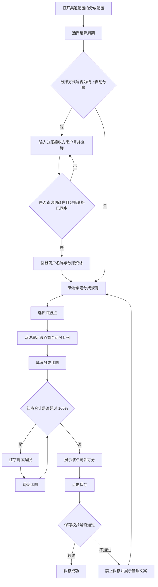

# 渠道配置-分成配置 PRD

> 版本 v1.2　·　日期 2026-09-18

---

## 一、需求背景与目标

**背景**

- 现状：渠道方按自有拍摄点资源带来订单，需要按拍摄点逐一约定渠道的分成比例。渠道比例属于拍摄点上的外部侧占用，与推广方规则共享同一份可分配空间。
- 问题：渠道规则在配置时无法看到该拍摄点剩余的可用空间，容易配置出该点各方合计超过 100% 的规则，导致该拍摄点的订单无法正确分成；同时渠道的结算周期与款项出账路径未在配置页明确，线上自动分账与线下对公结算对应的收款方与后续流程不同，配置时也无法确认分账接收方商户是否具备分账资格。
- 口径：渠道类型与分账方式为系统现有配置能力，本 PRD 只说明其对本分区的联动影响，不重复定义其取值与规则。景区商家侧的拍摄点分成见《景区商家配置-分成配置与拍摄点分成-PRD-20260918》，推广方的推广分成规则见《推广方配置-分成配置-PRD-20260918》。

**目标**

- 明确渠道的结算周期口径，以及结算周期变更的生效时点。
- 明确线上自动分账与线下对公结算在出账路径与后续流程上的差异。
- 支持按商户号查询并回显分账接收方商户的分账资格，配置前即可确认是否具备分账资格。
- 支持按拍摄点为渠道配置分成比例，并在同一拍摄点上实时展示剩余可分配的比例。
- 保证同一拍摄点各方分成合计不超过 100%。

---

## 二、核心业务流程

---

## 三、功能清单

| ID  | 模块 | 功能 | 描述 |
| --- | -- | -- | -- |
| F01 | 后台-渠道配置 | 结算周期与分账接收方配置 | 配置结算周期并查询分账接收方商户与分账资格 |
| F02 | 后台-渠道配置 | 渠道分成规则配置 | 按拍摄点新增、修改与删除分成比例 |
| F03 | 后台-渠道配置 | 分成比例容量校验 | 校验单点各方分成合计不超过 100% |

---

## 四、功能详述

### F01｜结算周期与分账接收方配置

**说明**：确定渠道的结算周期与款项出账路径，并按分账方式查询分账接收方商户的分账资格，为渠道分成规则提供出账口径。

**操作路径**：渠道配置 → 分成配置 → 选择结算周期 →（线上自动分账时）输入并查询分账接收方商户 → 保存

#### 交互

| 字段 / 控件 | 组件 | 必填 | 默认值 | 规则 / 交互 |
| --- | --- | --- | --- | --- |
| 结算周期 | Radio | 是 | 月结 | 选项为周结、月结；各选项后展示悬浮提示图标，周期说明收在图标内，页面不常驻展示，见 R01、R04 |
| 分账接收方商户 | 输入框 + 查询按钮 | 是 | 空 | 仅分账方式为「线上自动分账」时展示；占位文案「查询分账接收方商户」；支持在输入框中回车或点击查询按钮发起查询，见 R06、R07 |
| 商户名称与分账资格 | 只读回显 | — | 空 | 查询成功后按商户号回显商户名称与分账资格；分账资格取值为可分账、不可分账、未同步，见 R07 |

渠道类型与分账方式沿用系统现有配置，本分区不重复定义其取值与既有校验；分账方式对本分区的联动见 R02、R05。

结算周期为修改态时，在该字段下方展示「当前{原周期}，{新周期}将在当前账期结束后生效」。

#### 规则

**R01｜结算周期取值与口径**　渠道的结算周期取值为「周结」或「月结」，必填，新增渠道时默认「月结」。周结按自然周（周一至周日）生成账期；月结按自然月（每月 1 日至月末）统计，次月 20 日出账单。账期口径见《结算中心-账期列表与账期详情-PRD-20260918》，本 PRD 不重复定义。

**R02｜结算周期与分账方式的组合**　结算周期与分账方式相互独立，周结与月结均可搭配线上自动分账或线下对公结算。结算周期决定该渠道账期的生成节奏，分账方式决定分成款项的出账路径（见 R05）。

**R03｜结算周期变更的生效时点**　结算周期首次配置时直接生效。已存在生效周期时修改周期，不立即生效，而是记录为待生效周期，在当前账期结束后生效，并在字段下方展示「当前{原周期}，{新周期}将在当前账期结束后生效」。将待生效周期改回与当前周期相同时，取消待生效状态。

**R04｜周期说明的展示方式**　周结与月结选项后的悬浮提示图标分别展示该周期的说明（周结按自然周、月结按自然月），页面不常驻展示周期说明文字。

**R05｜分账方式对出账路径的影响**　分账方式决定该渠道分成款项的出账路径：

| 分账方式 | 出账路径 | 分账接收方商户 | 分成比例列名 |
| --- | --- | --- | --- |
| 线上自动分账 | 订单支付后由汇付按分账接收方商户自动分账；账期用于对账与查询，不进入结算审批，无线下打款与发票环节 | 必填，需完成查询与分账资格同步 | 分账比例(%) |
| 线下对公结算 | 按结算周期生成账期后进入结算审批，审批通过后线下对公打款，需提供收款账户信息与发票 | 不展示该字段 | 分成比例(%) |

结算审批口径见《结算审批-账期与账期明细-PRD-20260918》。

**R06｜分账接收方商户的展示与校验**　分账接收方商户仅在分账方式为「线上自动分账」时展示且必填。填写后需查询商户并同步分账资格，未查询、未查询到或分账资格未同步时禁止保存。

**R07｜分账接收方商户的查询方式与回显**　分账接收方商户采用「输入框 + 查询按钮」的输入方式，支持在输入框中回车或点击查询按钮发起查询。查询成功后按商户号回显该商户的商户名称与分账资格，分账资格展示为「可分账」「不可分账」「未同步」之一；查询未匹配到商户时，商户名称展示「未查询到」，视为未完成查询。

**R08｜商户号修改后清空查询结果**　修改分账接收方商户的商户号后，立即清空已回显的商户名称与分账资格，该字段回到未查询状态；未重新查询成功前，不沿用上一次的查询结果。

#### 状态

| 变更项 | 变化内容 | 生效时点 |
| --- | --- | --- |
| 分账方式 | 控制分账接收方商户的显隐，并改变分成比例的列名 | 立即，见 R05 |
| 分账接收方商户 | 修改商户号后清空商户名称与分账资格回显，回到未查询状态 | 立即，见 R08 |
| 结算周期 | 首次直接生效；再次修改记录为待生效周期 | 当前账期结束后，见 R03 |

#### 异常

| 场景 | 触发条件 | 系统处理 | 用户反馈 |
| --- | --- | --- | --- |
| 分账接收方未查询 | 分账方式为线上自动分账且未完成查询 | 禁止保存 | 提示「请输入并查询分账接收方商户」 |
| 商户号未查询到 | 输入商户号后查询未匹配到商户 | 清空该字段的商户名称与分账资格展示，不沿用上一次的查询结果 | 视为未完成查询，保存时拦截 |
| 修改商户号后未重新查询 | 查询成功后修改了商户号 | 清空原商户名称与分账资格回显，视为未查询 | 再次保存时提示「请输入并查询分账接收方商户」 |
| 结算周期未选择 | 无生效周期与待生效周期 | 禁止保存 | 提示「请选择结算周期」 |
| 周期未变更 | 选择的周期与当前周期相同 | 取消待生效状态 | 不展示待生效提示 |

#### 验收

**AC01｜分账接收方显隐**　Given 分账方式为「线下对公结算」，When 查看分成配置，Then 不展示分账接收方商户字段。

**AC02｜分账接收方商户查询回显**　Given 分账方式为「线上自动分账」，When 在分账接收方商户输入框输入商户号后按回车或点击查询按钮，Then 按该商户号回显商户名称与分账资格。

**AC03｜修改商户号后清空查询结果**　Given 某商户号已查询出商户名称与分账资格，When 修改该字段的商户号，Then 商户名称与分账资格被清空，且再次保存时禁止保存并提示「请输入并查询分账接收方商户」。

**AC04｜未查询阻断保存**　Given 分账方式为「线上自动分账」且未完成分账接收方商户查询，When 点击保存，Then 禁止保存并提示「请输入并查询分账接收方商户」。

**AC05｜结算周期默认值**　Given 新增渠道，When 查看结算周期字段，Then 默认选中「月结」。

**AC06｜周期变更待生效**　Given 当前生效周期为月结，When 将结算周期改为周结，Then 展示「当前月结，周结将在当前账期结束后生效」。

**AC07｜周期改回取消待生效**　Given 已存在待生效周期为周结、当前生效周期为月结，When 将结算周期改回月结，Then 待生效状态被取消，不再展示待生效提示。

**AC08｜周期说明收敛在提示图标内**　Given 查看结算周期字段，When 将鼠标悬浮在「周结」或「月结」选项后的提示图标上，Then 展示该周期的说明，页面不常驻展示周期说明文字。

**AC09｜出账路径随分账方式变化**　Given 某渠道分账方式为「线下对公结算」，When 查看其账期，Then 该账期进入结算审批；将分账方式改为「线上自动分账」并完成分账接收方商户查询后，When 查看同一渠道的账期，Then 该渠道的分成由汇付按分账接收方商户自动分账，账期不进入结算审批。

---

### F02｜渠道分成规则配置

**说明**：按拍摄点为渠道配置分成比例，支持新增、修改与删除规则行；填写过程中实时展示该拍摄点的剩余可分，保存时校验规则完整性与该拍摄点的分成容量。

**操作路径**：渠道配置 → 分成配置 → 渠道分成规则 → 新增规则 → 选择拍摄点 → 填写分成比例 → 查看剩余可分或超限提示 → 保存

#### 交互

分区标题为「渠道分成规则（非必填）」。

| 列 | 组件 | 必填 | 默认值 | 规则 / 交互 |
| --- | --- | --- | --- | --- |
| 拍摄点 | Select | 是 | 新增行默认为第一个未被占用的拍摄点 | 占位「请选择拍摄点」；已被其他行选中的拍摄点在当前行不可选 |
| 分成比例 | InputNumber，整数，0–100 | 是 | 新增行默认为上一行的比例，无上一行时为 0 | 列名见 R11，单位 %，步长 1，不支持小数 |
| 删除 | Link 按钮 | — | — | 从草稿中移除当前行 |

行下方提示按以下优先级展示其一：

| 条件 | 提示 |
| --- | --- |
| 当前行拍摄点与其他行重复 | 红字「同一拍摄点只能配置一条渠道规则」 |
| 该点分成合计超过 100% | 红字「该点分成合计 {合计}%，已超 100%（超 {超出值}%）」 |
| 已选拍摄点且未超限 | 「该点剩余可分 {剩余}%」 |

上表的「必填」指已新增规则行内的必填；规则行可全部删除，不新增即为空态（见 R09）。无规则行时展示「暂无分成规则」，表格下方为「新增规则」按钮，样式为虚线通栏。

#### 规则

**R09｜分成配置非必填**　渠道分成规则整体非必填。不配置任何规则时，该渠道不参与该景区内拍摄点的分成。

**R10｜规则行构成**　每条规则由一个拍摄点与其分成比例构成，两者均必填。

**R11｜分成比例的列名**　分账方式为「线下对公结算」时，比例列名为「分成比例(%)」；分账方式为「线上自动分账」时，列名为「分账比例(%)」。

**R12｜拍摄点不可重复**　同一拍摄点只能配置一条渠道规则。已被其他行选中的拍摄点在当前行的拍摄点选择器中不可选；若出现重复，该行提示「同一拍摄点只能配置一条渠道规则」。

**R13｜该点剩余可分的计算口径**

> 该点剩余可分比例 = 100% − 该点景区商家侧小计 − 其他渠道在该点已配置的比例合计 − 该点推广方已配置的比例合计 − 本行草稿比例

其中：

* 该点景区商家侧小计 = 该拍摄点所属景区商家的收款商户自留比例 + 分给比例 + 溢价比例（口径见《景区商家配置-分成配置与拍摄点分成-PRD-20260918》）。
* 该点推广方已配置比例合计 = 全部「审核通过且未禁用」的推广方中该拍摄点规则比例合计（口径见《推广方配置-分成配置-PRD-20260918》）。
* 其他渠道已配置比例合计 = 全部渠道对象中匹配该拍摄点的渠道规则比例合计，不含当前正在编辑的渠道自身已保存的规则。

**R14｜单点分成合计上限**　同一拍摄点上，该点景区商家侧小计 + 该点全部渠道规则比例合计 + 该点全部推广规则比例合计不得超过 100%。

**R15｜超限提示**　该点分成合计超过 100% 时，在对应行下方红字提示「该点分成合计 {合计}%，已超 100%（超 {超出值}%）」。

**R16｜新增规则默认值**　点击「新增规则」新增一行，拍摄点默认选中第一个未被其他行占用的拍摄点，分成比例默认取当前最后一行已填写的比例；无其他规则行时比例默认为 0。

**R17｜删除规则**　点击「删除」立即从草稿中移除该行，并释放该行占用的拍摄点。未保存前不产生实际配置变更。

**R18｜比例精度**　分成比例为 0–100 的整数百分比，不支持小数。

**R19｜规则为空与比例为 0 的结算口径**　未配置渠道规则与配置了比例为 0 的规则，在结算时结果一致：两种情况下该渠道在该拍摄点均不获得分成。

#### 状态

本功能只修改渠道配置的规则草稿，保存前不影响任何结算数据。

| 变更项 | 变化内容 | 生效时点 |
| --- | --- | --- |
| 拍摄点变更 | 重新计算该行剩余可分或超限提示 | 立即 |
| 分成比例变更 | 重新计算该行剩余可分或超限提示 | 立即 |
| 分账方式变更 | 改变分成比例的列名，并控制分账接收方商户的显隐 | 立即，见 R05、R11 |
| 其他渠道或推广规则变更 | 重新计算相关拍摄点的剩余可分 | 该配置保存后 |
| 景区商家侧比例变更 | 重新计算相关拍摄点的剩余可分 | 该配置保存后 |

#### 异常

| 场景 | 触发条件 | 系统处理 | 用户反馈 |
| --- | --- | --- | --- |
| 无规则 | 渠道未配置任何规则 | 正常保存 | 展示「暂无分成规则」 |
| 拍摄点未选择 | 规则行未选择拍摄点 | 禁止保存 | 行内提示「请选择拍摄点」 |
| 拍摄点重复 | 两行选择了同一拍摄点 | 禁止保存 | 行内提示「同一拍摄点只能配置一条渠道规则」 |
| 剩余可分已为 0 | 该点可分配空间已被占满 | 仍可选择该拍摄点 | 剩余可分展示为 0%，填写任何比例即超限 |
| 无法新增更多规则 | 全部拍摄点均已被占用 | 新增行仍会创建 | 拍摄点选择器无可用选项，需先删除其他行 |

#### 验收

**AC10｜无规则时展示空态**　Given 渠道未配置任何分成规则，When 查看渠道分成规则分区，Then 展示「暂无分成规则」，且可正常保存。

**AC11｜新增规则默认值**　Given 已有一条拍摄点为 A、比例为 15% 的规则，When 点击「新增规则」，Then 新增行的拍摄点为第一个未被占用的拍摄点，分成比例默认 15%。

**AC12｜拍摄点不可重复选择**　Given 某规则行已选中拍摄点 A，When 在其他行的拍摄点选择器中查看，Then 拍摄点 A 为不可选状态。

**AC13｜剩余可分展示**　Given 某拍摄点景区商家侧小计为 40%、其他渠道占 10%、推广占 5%，When 在该行填写分成比例 20%，Then 行下方展示「该点剩余可分 25%」。

**AC14｜超限红字提示**　Given 某拍摄点景区商家侧小计为 40%、推广占 5%，When 在该行填写分成比例 60%，Then 行下方红字提示「该点分成合计 105%，已超 100%（超 5%）」。

**AC15｜删除规则**　Given 已配置 2 条分成规则，When 点击其中一条的「删除」，Then 该行从表格移除，原占用的拍摄点在其他行恢复可选。

**AC16｜列名随分账方式变化**　Given 分账方式为「线下对公结算」，When 查看分成规则的比例列名，Then 列名为「分成比例(%)」；将分账方式改为「线上自动分账」后，列名变为「分账比例(%)」。

**AC17｜规则为空与比例为 0 结算一致**　Given 渠道 A 未配置任何渠道规则，渠道 B 在拍摄点 A 配置了比例为 0 的规则，When 对同一笔拍摄点 A 的订单结算，Then 两者在该拍摄点均不获得分成，结算结果一致。

---

### F03｜分成比例容量校验

**说明**：在保存渠道配置时校验渠道规则的完整性与该拍摄点的分成容量，避免配置出各方合计超过 100% 的规则。

**操作路径**：渠道配置 → 分成配置 → 完成填写 → 点击保存 → 按提示调整规则后重新保存

#### 交互

校验发生在点击保存时。涉及具体规则行的错误展示在该行下方；涉及整体容量的错误展示在配置区域。校验不通过时不保存任何改动，页面停留在当前编辑状态。

#### 规则

**R20｜保存校验项**　保存时按以下顺序校验，任一不通过则禁止保存：

1. 分账方式为「线上自动分账」时，分账接收方商户必填且已完成查询与分账资格同步（见 R06、R08）。
2. 每条规则必须选择拍摄点。
3. 每条规则的分成比例在 0–100 之间。
4. 同一拍摄点不得出现两条渠道规则。
5. 全部拍摄点的渠道与推广分成合计不超过该点可分配空间。

渠道类型与分账方式的既有必填校验沿用系统现有配置，不在此重复定义。

**R21｜容量校验的统计范围**　容量校验按 R14 的口径逐拍摄点计算，统计范围包含本次草稿中的渠道规则、其他渠道已保存的规则与已生效推广方的规则。

**R22｜校验与实时提示的关系**　页面上的行内红字提示为实时反馈，保存校验为最终拦截。两者口径一致，均按 R13 与 R14 计算。

**R23｜校验失败文案**

| 失败项 | 文案 |
| --- | --- |
| 拍摄点或比例不合法 | 请补充分成规则：拍摄点必选，分成比例需大于等于 0 且不超过 100% |
| 拍摄点重复 | 同一拍摄点只能配置一条分成规则 |
| 容量超限 | 「{拍摄点}」渠道/推广分成合计 {合计}%，已超过剩余可分配 {上限}%。请调低渠道/推广分成比例。 |

#### 状态

校验不通过时不产生任何数据变化；校验通过后该配置按保存流程生效。

#### 异常

| 场景 | 触发条件 | 系统处理 | 用户反馈 |
| --- | --- | --- | --- |
| 比例超出范围 | 输入小于 0 或大于 100 | 禁止保存 | 行内提示「请输入 0-100% 的分成比例」 |
| 拍摄点未选择 | 规则行无拍摄点 | 禁止保存 | 行内提示「请选择拍摄点」 |
| 多个拍摄点同时超限 | 多点合计超过可分配空间 | 阻止保存，不逐条累加展示 | 提示最先校验失败的一处，修正后继续校验 |
| 无任何规则 | 渠道未配置规则 | 允许保存 | 不触发容量校验 |

#### 验收

**AC18｜拍摄点未选择阻断保存**　Given 存在一条未选择拍摄点的规则行，When 点击保存，Then 禁止保存并提示「请选择拍摄点」。

**AC19｜比例超范围阻断保存**　Given 某规则行分成比例为 120，When 点击保存，Then 禁止保存并提示分成比例需在 0-100% 之间。

**AC20｜重复拍摄点阻断保存**　Given 两条规则行选择了同一拍摄点，When 点击保存，Then 禁止保存并提示「同一拍摄点只能配置一条分成规则」。

**AC21｜容量超限阻断保存**　Given 某拍摄点渠道与推广分成合计超过该点可分配空间，When 点击保存，Then 禁止保存并提示该点合计值、可分配上限与调整指引。

**AC22｜无规则可保存**　Given 渠道未配置任何分成规则，且其他必填项已填写，When 点击保存，Then 保存成功。

---

## 五、待确认事项

| ID | 待确认事项 | 影响功能 | 状态 |
| --- | --- | --- | --- |
| Q01 | 分账方式变更后是否影响已生成的账期及其出账路径，历史账期的处理口径 | F01 | 待确认 |
| Q02 | 分账资格为「不可分账」时的处理方式与提示文案，是否与「未查询」统一文案 | F01 | 待确认 |
| Q03 | 渠道规则的拍摄点是否与推广方口径一致，仅允许选择已归属景区商家账号的拍摄点（当前渠道侧拍摄点选择器未按归属限制） | F02 | 待确认 |
| Q04 | 渠道分成配置是否与推广方一致提供查看态（只读、不可编辑），当前渠道配置无查看态 | F02 | 待确认 |
| Q05 | 同一渠道是否需要支持按景区区分拍摄点，当前拍摄点为全局可选 | F02 | 待确认 |
| Q06 | 配置保存后景区商家或推广方调整了该拍摄点比例，已保存的渠道配置是否需要重新校验或提示 | F03 | 待确认 |
| Q07 | 待生效的结算周期在生效前是否可以再次修改或撤销 | F01 | 待确认 |
