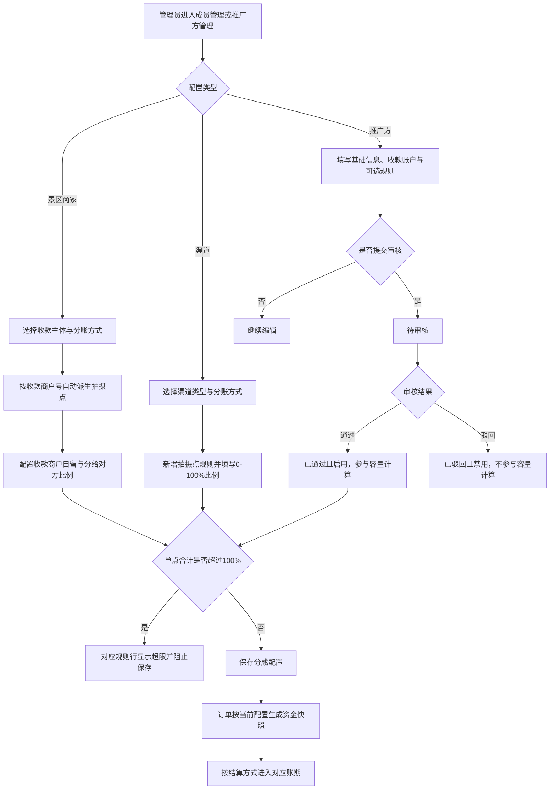
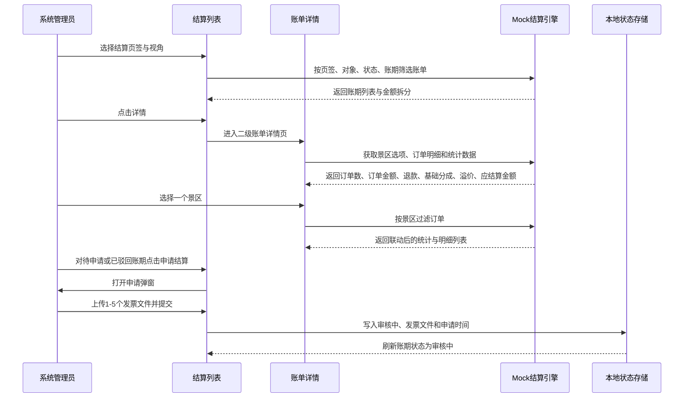

# 溢价配置与结算中心 PRD

> 产品范围：形影随拍后台 Demo 的成员管理、推广方管理、结算中心及账单详情。
> 文档版本：V1.1
> 文档基线：以 `docs/分成配置-PRD.md` 为输入，结合当前 React + Ant Design Mock Demo 的已实现页面和数据口径补充。
> 本期原则：文档中的页面结构、交互和字段以当前可交互 Demo 为验收基线；真实后端、真实文件解析和订单管理页面不在本期 Demo 范围内。

## 一、需求背景

平台存在平台收款、景区商家收款、渠道参与、推广方参与等多种结算关系。原有分成配置缺少统一的单点容量口径，商家侧比例、渠道比例和推广比例容易产生重复占用；结算中心又缺少基础金额与溢价金额的拆分，财务无法在账期、订单和结算对象之间核对金额来源。

本次需求基于分成配置 PRD 继续完善以下能力：

1. 统一收款主体、分成对象、渠道/推广方和溢价的计算口径。
2. 让景区商家拍摄点根据收款商户号自动派生，减少拍摄点配置错误。
3. 让渠道与推广方分成比例支持 0–100%，并在规则行下即时展示剩余可分和超限原因。
4. 在结算中心提供线下对公结算、线上自动分账、推广方结算三类账期列表。
5. 在账单详情中展示范围筛选、订单统计、基础金额、溢价、应结算金额和订单级结算拆分。
6. 通过发票上传、审核中、打款中、已打款、已驳回等状态，形成线下结算申请闭环。

## 二、需求目标

### 2.1 业务目标

- 每个拍摄点的收款商户自留、分给对方、渠道分成、推广分成合计不超过 100%。
- 订单生成时固化结算参与方、比例、金额、结算方式和规则版本，账期统计不依赖当前配置重新计算历史订单。
- 收款商户吸收的余额统一命名为“溢价”，并在结算列表、账单统计和订单明细中同时体现。
- 结算人员可以从账期列表进入二级账单详情，通过景区单选筛选联动统计数据与订单明细。

### 2.2 产品目标

- 表单字段错误均显示在对应字段或规则行下方；跨字段容量冲突、保存冲突等特殊错误使用顶部 toast。
- 审核推广方时表单控件全部禁用，保留“审核通过”“驳回”“取消”三个流程操作。
- 所有状态标签、状态列和订单状态统一居中，正文不使用加粗样式；金额列统一右对齐。
- 订单号统一由下单时间生成，格式为 `YYYYMMDDHHMMSS`。

### 2.3 Demo 范围

- 包含：成员管理、推广方管理、结算中心、账单详情、Mock 订单派生和本地状态改写。
- 不包含：订单管理页面、真实后端接口、真实拉卡拉调用、真实发票文件存储、发票金额 OCR/解析。

## 三、需求核心业务流程图

### 3.1 分成配置、订单快照与账期生成

### 3.2 结算中心、账单详情与发票申请

## 四、需求功能清单

| 终端 | 模块 | 功能 | 描述 |
|------|------|------|------|
| 后台 | 成员管理 | 景区商家收款配置 | 配置收款主体、收款商户号、分账方式、接收方及拍摄点比例 |
| 后台 | 成员管理 | 渠道分成配置 | 配置渠道类型、分账方式、接收方及拍摄点比例 |
| 后台 | 推广方管理 | 推广方新增编辑 | 管理基础信息、营业执照、收款账户和可选分成规则 |
| 后台 | 推广方管理 | 推广方审核 | 只读查看推广方资料，审核通过或驳回 |
| 后台 | 分成引擎 | 单点容量计算 | 计算商家侧、渠道、推广方、溢价和剩余可分 |
| 后台 | 分成引擎 | 订单结算快照 | 根据下单时配置生成订单号、参与方和金额快照 |
| 后台 | 结算中心 | 结算页签 | 展示线下对公、线上自动分账、推广方结算账期 |
| 后台 | 结算中心 | 视角与列表筛选 | 支持后台、渠道、景区商家、推广方视角及账期、对象、状态筛选 |
| 后台 | 结算中心 | 账期金额拆分 | 展示应结算金额及基础金额+溢价拆分 |
| 后台 | 结算中心 | 申请结算 | 上传发票并将待申请/已驳回账期改为审核中 |
| 后台 | 账单详情 | 统计栏 | 展示景区范围、订单数、订单金额、退款、基础分成、溢价和应结算金额 |
| 后台 | 账单详情 | 订单明细 | 展示订单号、主题、拍摄点、状态、时间、金额、结算规则和应结算金额 |
| 后台 | 账单详情 | 景区范围筛选 | 下拉单选景区，联动统计栏和订单列表 |

## 五、需求功能详述

#### 5.1 后台——成员管理——景区商家收款与溢价配置

**原型描述**：
成员新增/编辑抽屉中展示“成员信息”和“分成配置”区块。收款主体、收款商户号、分账方式和分账接收方按条件显示；拍摄点规则以紧凑表格展示拍摄点、自留比例、分给对方比例和只读溢价比例。

**用户故事**：
> 作为系统管理员，我想按收款主体配置每个拍摄点的分成比例，以便系统在订单和账期中准确计算收款商户金额与溢价。

**前置条件**：

- 用户具备成员管理和成员编辑权限。
- 当前成员角色为“景区商家”。
- 收款商户号与拍摄点映射由 Mock 常量提供。

**核心逻辑**：

- 收款主体包含“自营收款”和“景区商家收款”。
- 自营收款展示平台收款商户号；景区商家收款的商户号允许输入。
- 拍摄点由收款商户号自动派生，不提供手动选择、新增和删除。
- 每点比例范围为 0–100%，步进 1%。
- 溢价比例 = `max(0, 100% - 收款商户自留比例 - 分给对方比例 - 渠道/推广已占用比例)`。
- 溢价归收款商户；单点合计超过 100% 时溢价为 0，行下显示超出比例并阻止保存。
- 线上自动分账时，根据收款主体显示对应的分账接收方商户号。

**边界条件与异常处理**：

- 商户号未匹配拍摄点时显示空态，不允许新增虚拟拍摄点。
- 比例为 0 时合法；收款商户自留与分给对方均为 0 时，提示必须至少填写一项分配比例。
- 收款商户号为空时，在字段下方提示“请输入景区商家收款商户号”。
- 单点超限提示格式为“分成合计 X%，超 100%（超 Y%），请调低收款商户自留或分给对象比例”。

**技术难点分析**：

- 收款商户号变化后，拍摄点规则需保留可匹配旧值并补齐新商户号缺失点。
- 渠道和已生效推广方占用比例需实时参与商户侧溢价计算。
- 保存前需同时执行字段校验、比例范围校验和跨参与方容量校验。

**验收标准 (Acceptance Criteria)**：

- 🎯 **成功场景**：切换收款主体后拍摄点自动更新，比例为 0 可保存。
- ✔️ **校验场景**：单点合计 103% 时显示超 3% 并阻止保存。
- ❌ **异常场景**：商户号无映射时显示空态且不产生错误规则行。

**测试用例**：

- 切换收款主体
- 自动带出拍摄点
- 保存0%比例
- 校验单点超限
- 校验商户号空值
- 验证溢价自动计算

#### 5.2 后台——成员管理——渠道分成配置

**原型描述**：
渠道成员抽屉展示渠道类型、具体渠道类型、分账方式、分账接收方和渠道分成规则。规则区默认显示“暂无分成规则”，点击“新增规则”后增加规则行；规则行采用拍摄点下拉、0–100%比例输入和删除链接。

**用户故事**：
> 作为系统管理员，我想按拍摄点配置渠道比例，以便渠道金额自动进入对应订单和账期。

**前置条件**：

- 用户具备成员管理权限。
- 当前成员角色为“渠道”。

**核心逻辑**：

- 渠道类型和分账方式为必填；自定义合作方需要填写具体渠道类型。
- 分成规则允许 0 条；点击新增后才产生规则行。
- 比例范围为 0–100%，步进 1%。
- 同一渠道内同一拍摄点只能配置一条规则。
- 行下显示该点剩余可分；超过 100% 时显示合计和超出比例。
- 线上自动分账时列标题使用“分账比例(%)”，线下对公结算时使用“分成比例(%)”。

**边界条件与异常处理**：

- 新增空规则行后直接保存，拍摄点字段下方提示“请选择拍摄点”。
- 比例为 0 合法；比例超过 100% 时字段下方提示“请输入 0-100% 的分成比例”。
- 重复拍摄点显示规则行下方错误，不在操作栏上方生成汇总错误。
- 跨渠道、推广方及商家侧合计超限时使用顶部 toast 阻止保存。

**技术难点分析**：

- 计算剩余可分时需排除当前编辑渠道的已保存规则，加入当前草稿规则。
- 规则增删、选点和比例变更均需刷新容量提示。

**验收标准 (Acceptance Criteria)**：

- 🎯 **成功场景**：无规则时点击新增生成一行，比例填写 0 后可保存。
- ✔️ **校验场景**：重复选点或比例超过 100% 时在规则行下提示。
- ❌ **异常场景**：分成容量不足时保存被阻止并提示已占用信息。

**测试用例**：

- 默认无分成规则
- 新增渠道规则
- 保存0%比例
- 校验重复拍摄点
- 校验比例上限
- 刷新剩余可分

#### 5.3 后台——推广方管理——新增编辑与规则配置

**原型描述**：
推广方使用抽屉表单，依次展示基础信息、收款账户和分成配置。分成配置标注“非必填”，默认显示“暂无分成规则”，新增规则后显示拍摄点、分成比例和删除操作。

**用户故事**：
> 作为系统管理员，我想维护推广方资质、收款信息和拍摄点比例，以便审核通过后自动参与结算。

**前置条件**：

- 用户具备推广方管理权限。
- 新增或编辑态可修改表单；已通过推广方可启用/禁用。

**核心逻辑**：

- 推广方名称、联系人、手机号、营业执照、开户名、银行名称、银行账号、开户行地址为必填。
- 营业执照支持 jpg、jpeg、png、pdf，单个文件不超过 2MB。
- 分账方式和分成规则非必填；规则比例范围为 0–100%，允许 0 条规则。
- 规则错误显示在对应拍摄点、比例或规则行下方；不在操作栏上方显示整段错误。
- 生命周期为待审核、已通过/启用、已驳回/禁用；只有已通过且启用的推广方计入容量。

**边界条件与异常处理**：

- 新增空规则行后保存，拍摄点字段下方提示“请选择拍摄点”。
- 比例为 0 合法；比例超过 100% 时提示“分成比例须大于等于 0 且不超过 100%”。
- 规则超出拍摄点容量时，提示“拍摄点名称：该点仅剩 X% 可分配（含渠道/推广），当前填写 Y%”。
- 驳回必须填写驳回原因；原因为空时在文本域下方提示。

**技术难点分析**：

- 推广方自身草稿规则需参与当前行容量计算，但不能重复计算当前行。
- 审核状态、启用状态和容量参与状态需保持一致。
- 表单错误需根据规则行和拍摄点映射至对应控件。

**验收标准 (Acceptance Criteria)**：

- 🎯 **成功场景**：基础资料完整、无超限规则时保存成功并进入待审核或更新成功。
- ✔️ **校验场景**：必填项、文件格式、文件大小和 0–100% 比例校验均定位到字段下方。
- ❌ **异常场景**：驳回不填写原因时无法提交，推广方状态保持原状态。

**测试用例**：

- 保存完整推广方
- 校验营业执照格式
- 校验文件大小
- 保存0%规则
- 校验空规则行
- 驳回原因必填

#### 5.4 后台——推广方管理——审核只读流程

**原型描述**：
审核推广方页面沿用新增编辑抽屉布局，但基础信息、收款账户、分账方式、拍摄点下拉、比例输入和营业执照上传全部为禁用状态；页面不显示顶部说明栏，不显示新增规则和删除规则操作。底部仅保留取消、驳回、审核通过。

**用户故事**：
> 作为审核人员，我想只读核对推广方提交的信息，以便避免审核过程中意外修改数据。

**前置条件**：

- 推广方处于待审核状态。
- 用户具备推广方审核权限。

**核心逻辑**：

- 所有表单控件显式禁用，审核页不执行编辑保存。
- 点击审核通过：状态改为已通过，启用状态改为启用，接入状态改为已接入。
- 点击驳回：打开驳回原因弹窗，原因必填，提交后状态改为已驳回并禁用。
- 已驳回推广方修改保存后回到待审核且禁用，等待再次审核。

**边界条件与异常处理**：

- 审核页面不显示编辑态错误提示。
- 驳回原因为空时保留弹窗并在文本域下方提示。
- 审核通过后不可通过审核页再次编辑规则。

**技术难点分析**：

- Ant Design 输入框、选择器、单选、数字输入和上传组件需要统一进入禁用态。
- 审核动作与编辑保存动作必须使用不同状态流转。

**验收标准 (Acceptance Criteria)**：

- 🎯 **成功场景**：审核页所有控件不可操作，点击审核通过完成状态流转。
- ✔️ **校验场景**：驳回原因为空时提交被拦截并定位提示。
- ❌ **异常场景**：审核完成后重新打开，页面展示最新状态和只读数据。

**测试用例**：

- 验证控件禁用
- 隐藏顶部提示栏
- 隐藏规则操作
- 审核通过
- 驳回原因校验
- 审核状态回显

#### 5.5 后台——分成引擎——溢价与订单结算快照

**原型描述**：
该功能无独立页面；由成员、推广方配置驱动订单和结算数据。账单金额区域以“应结算金额”主金额展示，下面拆分为“基础金额”和“溢价”。

**用户故事**：
> 作为财务人员，我想看到基础金额与溢价的拆分，以便核对收款商户吸收的剩余金额。

**前置条件**：

- 订单具有收款主体、拍摄点、支付金额和订单时间。
- 分成规则已经保存或由 Mock 默认配置生成。

**核心逻辑**：

- 订单号由订单创建时间生成，格式为 `YYYYMMDDHHMMSS`。
- 结算基数按订单金额和当前 Demo 的手续费计算逻辑生成。
- 商户收款时，收款商户金额包含基础分成金额和溢价金额。
- 结算行字段包含收入总额、应结算金额、基础金额、溢价、结算状态、发票信息和订单集合。
- 订单级结算规则显示“按比例 · X%”；金额显示“基础 ￥X + 溢价 ￥Y”。
- 历史账期通过明细因子展示对应订单子集，筛选后重新计算当前统计。

**边界条件与异常处理**：

- 溢价为 0 时仍显示“溢价 ￥0.00”，不隐藏拆分字段。
- 退款订单保留订单明细，并按订单快照计算退款和可结算金额。
- 未找到账单时展示返回结算中心入口。

**技术难点分析**：

- 订单快照与当前配置解耦，防止修改规则影响历史账期。
- 账期金额、订单金额、溢价金额需要在聚合与筛选后保持分项合计一致。

**验收标准 (Acceptance Criteria)**：

- 🎯 **成功场景**：订单生成后订单号为 14 位时间格式，账单显示基础金额和溢价。
- ✔️ **校验场景**：收款商户金额等于基础金额加溢价金额。
- ❌ **异常场景**：账单不存在时显示空态和返回入口。

**测试用例**：

- 校验订单号格式
- 校验基础金额
- 校验溢价金额
- 核对金额合计
- 查看退款订单
- 访问无效账单

#### 5.6 后台——结算中心——账期列表与视角筛选

**原型描述**：
结算中心为白色内容卡片，顶部使用三个页签：线下对公结算、线上自动分账、推广方结算；支持视角下拉、账期、对象类型、对象和状态筛选。列表状态列居中，金额右对齐，操作项统一使用链接按钮。

**用户故事**：
> 作为财务或业务管理员，我想按结算方式和对象筛选账期，以便快速找到待处理账单。

**前置条件**：

- 用户已登录后台并具备结算中心查看权限。
- Mock 订单已派生出结算对象和账期数据。

**核心逻辑**：

- 线下页签状态包括出账中、待申请、审核中、打款中、已打款、已驳回。
- 线上页签状态包括待分账、已分账、分账失败、待回退、已回退、回退失败。
- 推广方结算列表展示账期、推广方名称、手机号、应结算金额、账单状态、发票和操作。
- 自营后台视角显示对象类型和对象筛选；渠道、景区商家、推广方视角仅展示对应对象。
- 金额单元格主行展示应结算金额，副行展示“基础 ￥X + 溢价 ￥Y”。
- 待申请或已驳回账期显示“申请结算/重新申请”链接；其他账期仅显示“详情”。

**边界条件与异常处理**：

- 筛选无结果时按页签显示对应空状态文案。
- 切换页签时清空状态筛选，避免使用不属于当前页签的状态。
- 切换视角时清空对象类型和对象筛选。
- 状态、对象类型标签和操作列内容不使用加粗正文样式。

**技术难点分析**：

- 一个订单可产生商家、渠道和推广方多个结算对象，需要按对象和结算方式拆行。
- 账单本地状态改写后，列表、发票信息和详情入口需要同步刷新。

**验收标准 (Acceptance Criteria)**：

- 🎯 **成功场景**：切换三个页签后展示对应字段、状态和账期数据。
- ✔️ **校验场景**：输入账期或选择状态后只展示符合条件的账单。
- ❌ **异常场景**：无匹配账单时展示空状态且分页总数正确。

**测试用例**：

- 切换结算页签
- 切换结算视角
- 筛选账期
- 筛选账单状态
- 核对状态居中
- 核对操作链接

#### 5.7 后台——结算中心——发票上传与申请结算

**原型描述**：
点击账期列表中的“申请结算”链接打开居中弹窗，顶部展示应结算金额和账期；下方提供发票上传、文件列表和提交申请按钮。上传错误显示在上传控件下方。

**用户故事**：
> 作为财务人员，我想上传账期发票并提交结算申请，以便账单进入财务审核流程。

**前置条件**：

- 账期状态为待申请或已驳回。
- 用户可以访问对应账期。

**核心逻辑**：

- 支持 pdf、jpg、jpeg、png；单个文件不超过 5MB；最多上传 5 个文件。
- 未上传发票时点击提交，在上传控件下方提示“请上传发票文件后再提交申请”。
- 上传成功后展示文件名和文件大小，并允许移除文件。
- 提交成功后账单状态改为审核中，保存发票文件、文件数量和申请时间。
- 发票列显示“下载发票（N张）”；点击后打开发票列表弹窗。

**边界条件与异常处理**：

- 文件格式或大小不符合要求时拒绝加入列表，并在上传控件下显示标准错误文案。
- 超过 5 个文件时拒绝继续上传，并提示数量限制。
- 本 Demo 不解析发票金额，金额一致性由提示文案表达；真实金额校验属于生产接入范围。

**技术难点分析**：

- 上传控件需要阻止真实上传，仅将文件元数据写入本地 Mock 状态。
- 申请后列表行状态、发票列和详情页必须读取同一份本地覆盖状态。

**验收标准 (Acceptance Criteria)**：

- 🎯 **成功场景**：上传合法文件后提交，账期状态变为审核中。
- ✔️ **校验场景**：空文件、超大文件、超数量文件均无法提交。
- ❌ **异常场景**：移除全部文件后再次提交，重新显示必填提示。

**测试用例**：

- 上传合法发票
- 校验文件格式
- 校验文件大小
- 校验文件数量
- 移除发票文件
- 提交结算申请

#### 5.8 后台——账单详情——范围筛选、统计和订单明细

**原型描述**：
账单详情采用二级页面，不使用右抽屉。页面顶部为返回、详情标题、账期和结算对象；下方蓝色统计栏左侧为范围筛选，右侧横向自适应展示订单笔数、订单金额合计、退款金额合计、基础分成金额、溢价、应结算金额，线上分账额外展示已分账净额。统计栏下方直接展示订单明细列表，不额外显示“订单明细”标题。

**用户故事**：
> 作为财务人员，我想按景区查看账期订单及金额拆分，以便快速核对账单。

**前置条件**：

- 账单 ID 和结算视图参数有效。
- 账单至少包含一个可结算订单或展示空态。

**核心逻辑**：

- 范围筛选为单选下拉，选项包含“全部景区”和账单涉及的景区。
- 选择景区后，同时更新订单笔数、订单金额、退款金额、基础分成、溢价、应结算金额和已分账净额。
- 订单明细字段顺序为：订单号、订单信息、拍摄点、订单状态、下单时间、完成时间、订单金额、结算规则、应结算金额。
- 订单号格式为 `YYYYMMDDHHMMSS`；状态标签居中；金额右对齐；列表正文不加粗。
- 结算规则显示按比例规则及“基础 ￥X + 溢价 ￥Y”。线上自动分账视图额外展示已分账净额和分账状态。
- 账单详情通过 `/settlement/bill/:view/:billId` 二级路由访问，返回按钮回到结算中心。

**边界条件与异常处理**：

- 当前景区不在账单选项中时，筛选自动回退为全部景区。
- 筛选结果为空时，订单表展示“暂无订单明细”。
- 订单完成时间为空时按空值展示，不伪造完成时间。
- 账单不存在时不渲染统计栏，展示返回结算中心入口。

**技术难点分析**：

- 筛选后的统计不能直接复用未筛选账单汇总，必须根据订单子集重新聚合。
- 溢价、基础金额和应结算金额需要在账单行、统计栏和订单行保持一致。
- 不同结算视图的订单状态字段需要统一为可读标签。

**验收标准 (Acceptance Criteria)**：

- 🎯 **成功场景**：选择一个景区后统计栏和订单列表同步减少到该景区数据。
- ✔️ **校验场景**：订单金额拆分满足应结算金额等于基础金额加溢价。
- ❌ **异常场景**：无效账单 ID 显示空态并可返回结算中心。

**测试用例**：

- 进入账单详情
- 选择指定景区
- 核对统计联动
- 核对订单字段顺序
- 核对金额拆分
- 查看空账单

## 六、非功能性需求

以下指标用于当前 Demo 的验收和后续真实服务接入基线。

### 6.1 性能

- **页面首屏**：本地构建产物在 Chrome 120+、4 核 CPU、8GB 内存环境下首屏可交互时间 ≤ 2 秒。
- **页面切换**：结算列表进入账单详情的路由切换完成时间 ≤ 300ms。
- **筛选响应**：账期、状态、视角和景区筛选触发后，列表和统计更新 ≤ 100ms。
- **计算容量**：单账期 10,000 条订单、100 个结算对象时，账单聚合完成时间 ≤ 1 秒。
- **上传限制**：单次申请最多 5 个文件，单文件最大 5MB，前端在加入列表前完成校验。

### 6.2 可用性

- **路由可达性**：刷新 `/settlement` 和 `/settlement/bill/:view/:billId` 后均能恢复页面，不出现空白页。
- **状态闭环**：申请结算成功后 1 秒内列表展示审核中，刷新页面后本地 Demo 状态保持一致。
- **错误定位**：字段错误必须位于对应控件下方 1 个视觉层级内；跨字段错误通过 1 条顶部 toast 展示。
- **响应式阈值**：桌面视口宽度 ≥ 1280px 时，结算表格、统计栏和表单不发生横向溢出。
- **可读性**：状态列全部居中，金额列全部右对齐，正文文本字重为 400，标题字重不超过 600。

### 6.3 安全

- **权限**：成员编辑、推广方审核、结算申请分别校验对应 RBAC 权限；无权限用户不能显示对应操作按钮。
- **敏感字段**：手机号、商户号和银行账号在列表及日志中按脱敏规则展示；完整值仅在授权表单内展示。
- **文件安全**：上传仅允许白名单扩展名和 MIME 类型，单文件不得超过 5MB；文件名需转义后渲染。
- **输入防护**：名称、联系人、银行字段和驳回原因均按纯文本渲染，禁止 HTML 解释。
- **金额安全**：金额统一使用 number 存储并保留两位小数，前端展示不参与金额最终裁决。

### 6.4 监控

- **配置指标**：记录分成规则保存次数、校验失败次数、单点超限次数和推广方审核结果。
- **结算指标**：记录账期详情访问次数、景区筛选次数、发票上传失败次数和申请提交成功率。
- **错误阈值**：前端运行时错误率 > 1% 或结算申请失败率 > 2% 时触发 P1 告警。
- **性能阈值**：账单聚合 P95 > 1 秒或详情筛选 P95 > 300ms 时触发 P2 告警。
- **日志留存**：生产操作日志留存不少于 180 天；每次配置保存、审核、申请需包含用户、时间、对象和结果。

## 七、上线计划

### 7.1 灰度策略

- **批次与节奏**：先在本地 Demo 完成全量验收；真实服务接入后按 10%、30%、100% 三批发布，每批观察 24 小时。
- **灰度规则**：第一批使用内部财务账号，第二批增加一个景区租户，第三批开放全部具备结算权限的租户。
- **放行标准**：每批次均需满足 `npm run check` 通过、`npm run build` 通过；关键流程成功率 ≥ 99%；结算申请失败率 ≤ 2%；P95 页面响应 ≤ 2 秒；金额抽样核对 100% 通过。
- **暂停条件**：出现任意一笔金额拆分错误、账期状态错误、权限越权，或关键流程失败率 > 2%，立即暂停扩大灰度。
- **数据校验**：每批次抽取不少于 30 个账单，逐单核对收入、退款、基础分成、溢价、应结算金额和订单明细合计。

### 7.2 回滚方案

- **触发条件**：出现金额计算错误 1 笔、权限越权 1 笔、申请状态写错 1 笔，或前端运行时错误率连续 5 分钟 > 1%。
- **回滚步骤**：
  1. 发布负责人暂停灰度并关闭新入口开关。
  2. 保留当前账单和操作日志，禁止删除已产生的申请记录。
  3. 回退前端版本和分成引擎版本到上一已验证版本。
  4. 对已写入的本地/服务端状态执行人工对账，必要时按账单 ID 修正状态。
  5. 通知财务暂停使用受影响账期，完成核对后恢复入口。
- **回滚验证**：验证成员配置保存、推广方审核、结算列表、账单详情景区筛选、发票申请和状态回显各 1 次；抽取 30 个账单核对金额拆分。
- **回滚时效**：从确认回滚到入口关闭 ≤ 10 分钟，从入口关闭到旧版本恢复 ≤ 30 分钟，从恢复到完成核心场景验证 ≤ 60 分钟。
