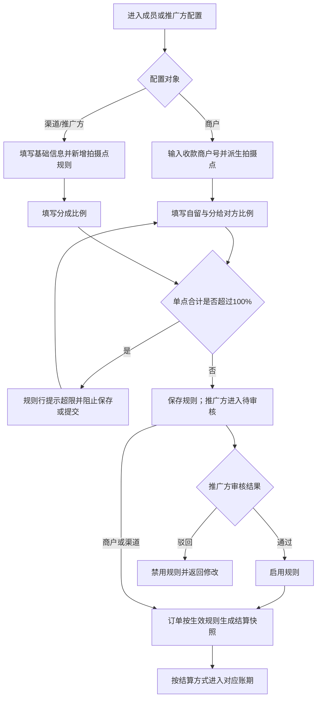
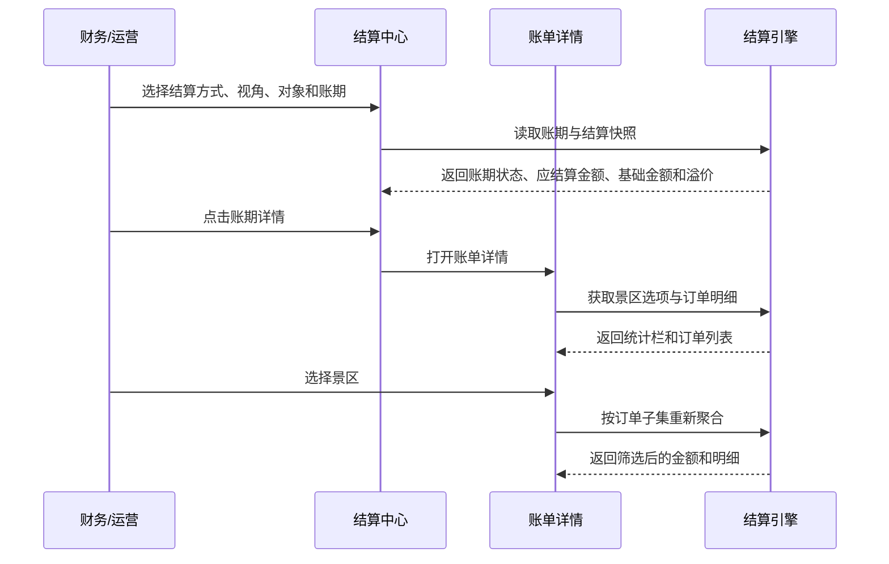

# 溢价配置与结算中心 PRD

> 本期定位：围绕“分成配置 → 订单结算快照 → 账期展示与金额核对”的最小闭环。
> 依赖关系：线上自动分账的周期触发、资格校验、汇付调用和分账结果由《汇付周结算与余额分账 PRD》负责，本 PRD 只消费并展示分账结果。
> Demo 边界：页面和 Mock 数据可交互；真实后端、真实支付接口、真实文件存储和订单管理页面不在本期范围。

## 一、需求背景

平台存在平台收款、景区商家收款、渠道参与和推广方参与等结算关系。现有分成配置缺少统一的单点容量口径，商家自留、渠道分成、推广分成容易重复占用；结算中心又缺少基础金额与溢价拆分，财务无法从账期追溯到订单金额来源。

本期只建立四个核心能力：

1. 统一配置收款主体、渠道和推广方的分成规则，并在填写时校验单点合计不超过 100%。
2. 订单生成时固化结算参与方、比例、金额、结算方式和规则版本。
3. 在结算中心查看账期、对象、状态和基础金额/溢价拆分。
4. 在账单详情按景区查看订单和金额明细。
线上分账执行、线下实际打款、权限审计、订单管理及复杂对账均不在本期展开。

---

## 二、需求目标

### 2.1 业务目标

- 每个拍摄点的收款商户自留、分给对方、渠道分成和推广分成合计不超过 100%。
- 订单生成时固化参与方、比例、金额、结算方式和规则版本，历史账期不依赖当前配置重算。
- 收款商户吸收的剩余金额统一命名为“溢价”，并与基础金额一起展示。
- 财务可从结算列表进入账单详情，按景区核对订单和金额拆分。

### 2.2 产品目标

- 商户、渠道和推广方规则在对应表单中完成字段、比例和单点容量校验。
- 推广方基础信息填写时即可新增拍摄点规则并校验超限；审核页只读复核并完成状态流转。
- 结算中心只展示账期和结果；线上分账任务及汇付结果由汇付 PRD 提供。

### 2.3 首版范围

- 包含：成员收款与溢价配置、渠道/推广方分成配置、订单结算快照、结算列表和账单详情。
- 后续范围：线上分账发起与结果查询、线下打款登记、复杂对账、权限审计、真实后端和真实文件服务。

## 三、需求核心业务流程图

### 3.1 分成配置与订单结算快照

### 3.2 结算中心与账单详情

## 四、需求功能清单

| 终端 | 模块 | 功能 | 描述 |
|------|------|------|------|
| 后台 | 成员配置 | 景区商家配置 | 配置景区商家的收款关系、拍摄点规则及自留与分给对方比例 |
| 后台 | 成员配置 | 渠道配置 | 配置渠道参与的拍摄点规则及对应分成比例 |
| 后台 | 推广方配置 | 推广方配置 | 配置推广方参与的拍摄点规则及对应分成比例 |
| 后台 | 分成引擎 | 订单结算快照 | 按下单时生效规则计算基础金额、溢价和应结算金额 |
| 后台 | 结算中心 | 账期列表金额拆分 | 账期列表显示基础金额 + 溢价 |
| 后台 | 账期详情 | 账期详情金额拆分 | 账期详情显示基础金额 + 溢价 |

**后续范围**：线上分账发起和结果查询、线下实际打款、复杂对账、权限审计、真实后端、OCR、订单管理页面。

## 五、需求功能详述

#### 5.1 后台——成员与推广方配置——分成规则配置

**原型描述**：
成员或推广方抽屉展示基础信息、收款信息和分成配置。规则区按拍摄点展示比例输入、剩余可分和超限提示；推广方审核页沿用只读布局。

**用户故事**：
> 作为系统管理员，我想配置各参与方的拍摄点比例，以便订单按合作规则计算金额。

**前置条件**：
- 用户具备对应配置或审核权限。
- 商户收款商户号、渠道类型或推广方基础资料可用。

**核心逻辑**：
- 商户收款商户号自动派生拍摄点；渠道和推广方可新增规则。
- 比例范围为 0–100%，允许 0 条可选规则。
- 推广方填写基础信息时实时校验当前草稿与已生效规则的单点合计；超过 100% 时阻止保存或提交审核。
- 审核通过前再次使用最新规则复核；通过后才计入全局容量。
- 溢价比例 = `max(0, 100% - 收款商户自留 - 分给对方 - 渠道/推广方已占用比例)`。

**边界条件与异常处理**：
- 收款商户号未匹配拍摄点时展示空态，不创建虚拟拍摄点。
- 重复拍摄点、空拍摄点或比例越界时在对应规则行提示。
- 单点合计超过 100% 时阻止保存、提交审核或审核通过。
- 推广方驳回必须填写原因；驳回后规则不参与容量。

**技术难点分析**：
- 草稿规则、已生效规则和当前规则的容量计算不能重复计入。
- 收款商户号变化后需保持历史规则可追溯。

**验收标准 (Acceptance Criteria)**：
- 🎯 **成功场景**：有效规则保存成功，推广方按状态进入待审核或启用。
- ✔️ **校验场景**：单点合计超过 100% 时立即定位规则行并阻止提交。
- ❌ **异常场景**：收款商户号无映射时不生成错误规则行。

**测试用例**：
- 保存商户规则
- 保存渠道规则
- 填写推广方规则
- 填写时校验超限
- 审核前复核容量
- 驳回原因必填

---

#### 5.2 后台——分成引擎——订单结算快照

**原型描述**：
无独立操作页；账期和账单详情展示订单快照中的参与方、规则比例、基础金额、溢价和应结算金额。

**用户故事**：
> 作为结算服务，我想在订单生成时固化金额和规则，以便历史账期不受配置修改影响。

**前置条件**：
- 订单具有客户、拍摄点、金额和下单时间。
- 对应分成规则已生效。

**核心逻辑**：
- 订单号由下单时间生成，格式为 `YYYYMMDDHHMMSS`。
- 结算基数按当前 Demo 金额规则计算。
- 保存参与方、比例、基础金额、溢价、应结算金额、结算方式和规则版本。
- 退款订单保留原快照并按快照计算可结算金额。

**边界条件与异常处理**：
- 溢价为 0 时仍展示“溢价 ￥0.00”。
- 无生效规则时订单进入待处理状态，不生成错误金额。
- 历史配置变更不得修改已有快照。

**技术难点分析**：
- 订单快照与当前配置解耦。
- 基础金额、溢价和应结算金额在聚合后保持恒等关系。

**验收标准 (Acceptance Criteria)**：
- 🎯 **成功场景**：订单生成后保存完整快照并进入对应账期。
- ✔️ **校验场景**：应结算金额等于基础金额加溢价。
- ❌ **异常场景**：无规则订单不产生错误结算金额。

**测试用例**：
- 校验订单号格式
- 核对基础金额
- 核对溢价金额
- 核对金额合计
- 查看退款订单

---

#### 5.3 后台——结算中心——账期列表与金额拆分

**原型描述**：
结算中心按结算方式展示账期列表，支持视角、对象、账期和状态筛选；金额主行展示应结算金额，副行展示“基础金额 + 溢价”。线上状态为只读结果，分账执行由汇付 PRD 负责。

**用户故事**：
> 作为财务人员，我想按结算方式和对象查看账期，以便快速核对金额和定位账期。

**前置条件**：
- 结算快照已生成并归入账期。
- 视角、对象和状态字段已标准化。

**核心逻辑**：
- 结算方式包括线下对公、线上自动分账和推广方结算。
- 支持后台、渠道、景区商家和推广方视角。
- 列表展示账期、对象、状态、应结算金额、基础金额和溢价。
- 线上自动分账只展示汇付结果，不在本功能发起分账。

**边界条件与异常处理**：
- 视角切换后仅返回当前视角有权查看的对象。
- 无匹配账期时展示空态。
- 线上分账结果缺失时展示处理中或待同步，不伪造成功状态。

**技术难点分析**：
- 一个订单对应多个结算对象时按对象拆分账期行。
- 列表金额与订单快照聚合结果保持一致。

**验收标准 (Acceptance Criteria)**：
- 🎯 **成功场景**：按视角和状态筛选后返回对应账期及金额拆分。
- ✔️ **校验场景**：无权限对象不出现在列表。
- ❌ **异常场景**：无账期时展示空态并保留筛选条件。

**测试用例**：
- 切换结算方式
- 筛选账期状态
- 筛选结算对象
- 核对金额拆分
- 查看空列表

---

#### 5.4 后台——账单详情——景区范围与订单明细

**原型描述**：
二级账单详情页顶部展示账期、结算对象和返回入口；统计栏展示景区、订单数、订单金额、退款、基础金额、溢价和应结算金额；下方展示订单明细。

**用户故事**：
> 作为财务人员，我想按景区查看账期订单和金额，以便核对金额来源。

**前置条件**：
- 账期存在且具备订单快照。
- 用户具备对应账期查看权限。

**核心逻辑**：
- 景区筛选为单选，包含“全部景区”和账单涉及景区。
- 选择景区后重新聚合统计栏和订单列表。
- 订单字段包含订单号、信息、拍摄点、状态、时间、金额、结算规则和应结算金额。
- 结算规则展示“基础 ￥X + 溢价 ￥Y”。

**边界条件与异常处理**：
- 筛选结果为空时展示“暂无订单明细”。
- 订单完成时间为空时展示空值。
- 无效账单 ID 展示空态并提供返回入口。

**技术难点分析**：
- 筛选后必须基于订单子集重新聚合。
- 账期、统计栏和订单行的金额拆分保持一致。

**验收标准 (Acceptance Criteria)**：
- 🎯 **成功场景**：选择景区后统计和明细同步更新。
- ✔️ **校验场景**：应结算金额等于基础金额加溢价。
- ❌ **异常场景**：无效账单 ID 可返回结算中心。

**测试用例**：
- 进入账单详情
- 选择指定景区
- 核对统计联动
- 核对金额拆分
- 查看空账单

## 六、非功能性需求

### 6.1 性能

- **页面首屏**：Chrome 120+、4 核 CPU、8GB 内存环境下首屏可交互时间 ≤ 2 秒。
- **页面交互**：账期筛选和景区筛选完成更新 ≤ 100ms；账单详情路由切换 ≤ 300ms。
- **计算容量**：单账期 10,000 条订单、100 个结算对象时聚合完成 ≤ 1 秒。

### 6.2 可用性

- **状态闭环**：配置保存成功后 1 秒内列表反映最新配置，刷新后 Mock 状态保持一致。
- **错误定位**：字段错误位于对应控件下方；跨字段错误使用 1 条顶部提示。
- **响应式**：桌面视口宽度 ≥ 1280px 时主要表格和表单无横向溢出。

### 6.3 安全

- **权限**：成员配置、推广方审核和账期查看校验 RBAC；无权限用户不显示对应操作。
- **敏感字段**：手机号、商户号和银行账号按脱敏规则展示；完整值仅在授权表单展示。
- **输入防护**：名称、银行字段和说明按纯文本渲染；禁止 HTML 解释。

### 6.4 监控

- **配置指标**：记录规则保存次数、校验失败次数、单点超限次数和推广方审核结果。
- **结算指标**：记录账期访问、景区筛选和金额核对结果。
- **阈值**：前端运行时错误率 > 1% 或账期数据加载失败率 > 2% 时触发告警。
