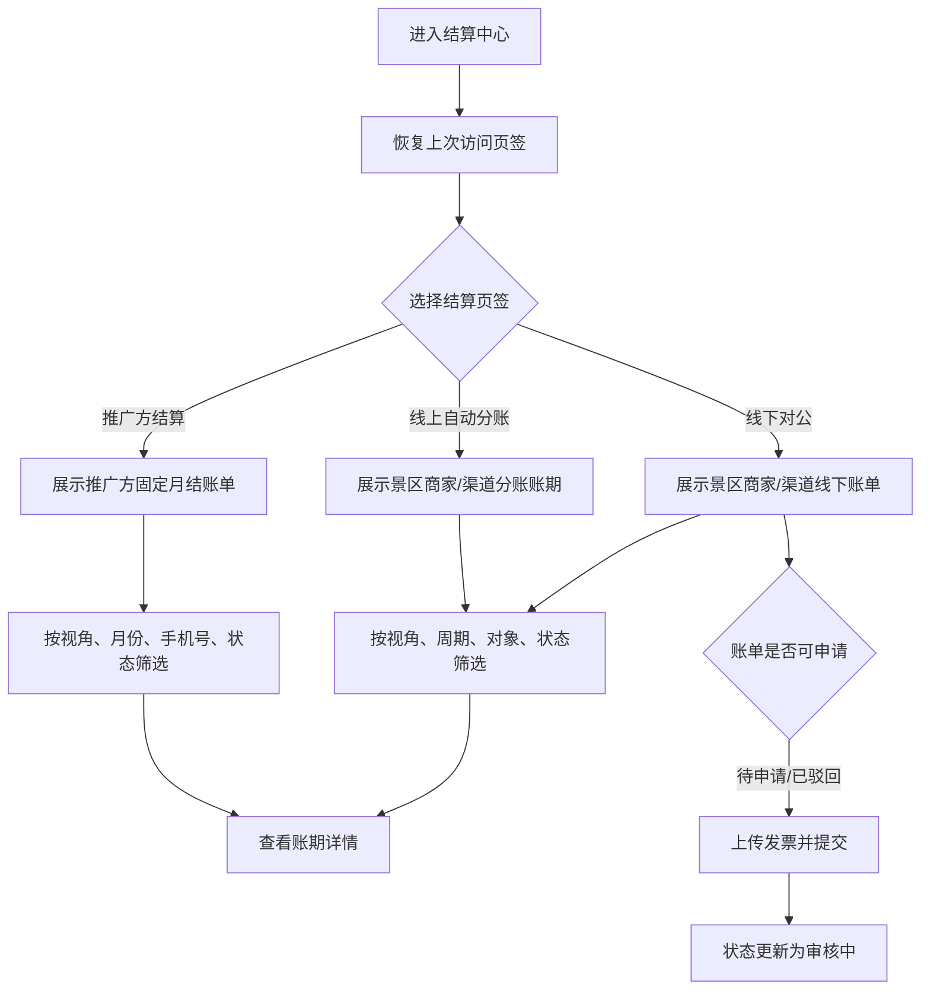

# 结算中心页面 PRD

> 文档状态：已确认  
> 对应页面：结算中心  
> 需求基线：[结算能力改造需求分析](./结算能力改造-需求分析-20260916.md)

## 一、需求背景

结算中心需要同时承载景区商家、渠道、推广方的账期，且包含线下对公结算、线上自动分账、推广方固定月结三类视图。支持周结后，原单一月份筛选和将周期、范围、状态挤在一个账期单元格中的方式难以阅读；同时，不同对象的金额结构和字段可见性也存在差异。

本需求重构结算中心的信息架构、筛选方式、列表字段、角色视角和线下申请流程。

## 二、需求目标

- 通过三个页签区分结算方式和业务对象。
- 使用“周期类型 + 周/月选择器”降低账期筛选理解成本。
- 将账期、周期类型、对象、对象类型拆列，降低信息噪音。
- 严格区分景区商家的基础分成/溢价与渠道、推广方的分成金额。
- 支持自营与合作方视角的数据隔离，并保留页签记忆。

## 三、需求核心业务流程图

## 四、需求功能清单

| 终端 | 模块 | 功能 | 描述 |
|------|------|------|------|
| 多角色后台 | 结算中心 | 三结算页签 | 线下对公、线上自动分账、推广方结算 |
| 多角色后台 | 结算中心 | 视角切换 | 自营、渠道、景区商家、推广方视角 |
| 多角色后台 | 结算中心 | 账期筛选 | 周期类型联动周/月选择器 |
| 自营后台 | 结算中心 | 对象筛选 | 对象类型与可搜索结算对象分开 |
| 多角色后台 | 结算中心 | 账期列表 | 分列展示账期、周期、对象、金额和状态 |
| 合作方后台 | 结算中心 | 申请结算 | 上传发票并发起或重新发起线下申请 |
| 多角色后台 | 结算中心 | 详情跳转 | 进入相应账期详情 |
| 多角色后台 | 结算中心 | 页签记忆 | 返回后恢复进入前页签 |

## 五、需求功能详述

### 5.1 多角色后台——结算中心——页签与视角

**原型描述**：
页面顶部展示视角切换与三个页签：“线下对公结算”“线上自动分账”“推广方结算”。

**用户故事**：
> 作为不同结算参与方，我想查看与自己相关的账期，以便核对结算进度和金额。

**前置条件**：

- 用户已登录并具备结算查看权限。

**核心逻辑**：

- 线下对公结算仅包含景区商家、渠道，不包含推广方。
- 线上自动分账包含采用线上方式的景区商家、渠道，不进入线下审批。
- 推广方结算仅包含推广方，固定线下对公、固定月结。
- 自营视角可查看权限范围内全部对象；合作方视角只查看本对象数据。
- 三个页签均支持视角切换；推广方视角下隐藏推广方名称、手机号字段及手机号筛选。
- 当前页签写入 sessionStorage，进入详情再返回后恢复；视角仅作为演示切换，真实系统由登录身份与权限决定。

**边界条件与异常处理**：

- 页签与角色不匹配时显示空态，不得回退展示其他对象数据。
- 切换视角时清理不适用于新视角的对象、手机号等筛选条件。

**技术难点分析**：

- 同一账期数据在多角色下的字段裁剪和对象级隔离。

**验收标准 (Acceptance Criteria)**：

- 🎯 三页签数据边界正确。
- ✔️ 合作方只能查看本人账期。
- ✔️ 返回列表恢复原页签。
- ❌ 线下页签不出现推广方。

**测试用例**：

- 线下排除推广方
- 线上排除线下账单
- 推广方仅月结
- 合作方只看本人
- 返回恢复页签

### 5.2 多角色后台——结算中心——筛选区

**原型描述**：
筛选控件横向排列，统一中文组件与直接字段占位符，末尾使用蓝色链接“重置”。

**用户故事**：
> 作为账单核对人员，我想用简单的周期和对象筛选找到目标账期。

**前置条件**：

- 当前页签已加载可见账期。

**核心逻辑**：

- 线下/线上页签：先选“周期”（周结、月结），再启用相应的“选择周/选择月份”控件。
- 周结按所选自然周的周一起始日筛选；月结按 YYYY-MM 筛选。
- 自营视角显示“对象类型”和“结算对象”两个筛选项；结算对象下拉支持搜索，格式“账号（姓名）”，并受对象类型联动。
- 合作方视角不展示对象类型和对象筛选。
- 推广方页签不展示周期类型，直接使用月份筛选；自营视角保留“查询推广方手机号”和账单状态。
- 推广方视角隐藏手机号查询。
- 查询输入框占位符遵循“查询 xxx、xxx”；其他占位符直接写“周期”“结算对象”“账单状态”，不加“全部”。
- 重置按钮为蓝色链接并清空本页全部筛选。

**边界条件与异常处理**：

- 改变周期类型必须清空原账期值。
- 对象类型改变后，若已选对象不属于新类型，自动清空对象。
- 周/月组件本地化为中文。

**技术难点分析**：

- 周选择器与账期左闭右开边界的准确映射。

**验收标准 (Acceptance Criteria)**：

- 🎯 周/月筛选结果与自然周期一致。
- ✔️ 未选周期时账期控件禁用。
- ✔️ 对象类型与对象选项联动。
- ✔️ 推广方不展示周期类型筛选。

**测试用例**：

- 周期联动周选择
- 周期联动月选择
- 对象类型联动
- 搜索账号姓名
- 推广方按月筛选
- 重置清空条件

### 5.3 多角色后台——结算中心——账期列表

**原型描述**：
表格将“账期”和“周期类型”分为两列；自营视角将“结算对象”和“对象类型”分为两列。金额使用主数字和必要辅助拆分。

**用户故事**：
> 作为用户，我想一眼识别账期、对象、金额与状态，以便快速完成核对。

**前置条件**：

- 账期已生成并有可见权限。

**核心逻辑**：

- 月结账期显示“YYYY年MM月”；周结显示“YYYY-MM-DD～YYYY-MM-DD”。
- 列表不显示完整 00:00 边界；完整起止时间可通过悬浮或详情查看。
- 周期类型独立展示“周结/ 月结”标签，不显示“预估”标签。
- 自营视角：结算对象与对象类型拆为两列；结算对象以账号为主、姓名为辅。
- 景区商家的金额辅助信息显示“基础 ￥x + 溢价 ￥y”。
- 渠道与推广方不展示溢价，也不展示“基础分成 ￥x”辅助行。
- 推广方主金额字段命名为“应分成金额”；其他线下账单为“应结算金额”；线上为“应分账金额”和“已分账净额”。
- 状态：
  - 线上：待分账、已分账、分账失败、待回退、已回退、回退失败。
  - 线下/推广方：出账中、待申请、审核中、打款中、已打款、已驳回。
- 所有列表提供“详情”；待申请或已驳回的线下账单提供“申请结算/重新申请”。

**边界条件与异常处理**：

- 对象名称过长时省略，悬浮显示“账号（姓名）”。
- 金额缺失时显示“-”，不得默认为 0 参与汇总。
- 渠道和推广方底层溢价固定为 0，接口返回非 0 时记录数据异常且前端不展示为有效金额。

**技术难点分析**：

- 角色、页签与对象类型共同决定列模型。

**验收标准 (Acceptance Criteria)**：

- 🎯 用户可从独立列识别账期与周期类型。
- ✔️ 仅景区商家显示基础与溢价拆分。
- ✔️ 推广方使用“应分成金额”。
- ✔️ 列表不出现“预估”标签。

**测试用例**：

- 月结名称正确
- 周结范围正确
- 商家展示溢价
- 渠道隐藏溢价
- 推广方应分成金额
- 不显示预估标签

### 5.4 合作方后台——结算中心——申请结算

**原型描述**：
点击“申请结算/重新申请”弹出申请窗口，展示金额、账期、发票上传区和提交按钮。

**用户故事**：
> 作为线下结算合作方，我想上传发票并提交申请，以便进入审核与打款流程。

**前置条件**：

- 账单资金方式为线下对公。
- 状态为待申请或已驳回。

**核心逻辑**：

- 弹窗展示应结算金额、结算账期及必填发票。
- 支持 PDF、JPG、JPEG、PNG；单文件最大 5MB；最多 5 个文件。
- 文件上传成功且格式、大小、数量校验通过后可提交。
- 提交后冻结申请时账期金额、收款账户和发票快照，状态更新为审核中。
- 已驳回可替换发票后重新申请，保留历史驳回原因及操作记录。

**边界条件与异常处理**：

- 无发票、超规格或上传失败时不可提交。
- 状态已变化时拒绝重复申请并刷新列表。
- 发票总金额的验真与误差规则属于真实接口待确认项。

**技术难点分析**：

- 文件上传、账单状态更新和申请快照的一致性。

**验收标准 (Acceptance Criteria)**：

- 🎯 有效文件提交后账单进入审核中。
- ✔️ 已驳回账单可重新申请。
- ✔️ 不合规文件被明确拦截。
- ❌ 重复提交只生成一笔有效申请。

**测试用例**：

- 上传有效发票
- 拦截错误格式
- 拦截超大文件
- 拦截超过五个
- 驳回后重新申请
- 重复提交幂等

## 六、非功能性需求

### 6.1 性能

- 列表筛选与翻页 P95 不超过 2 秒。
- 单页默认 10 条，支持服务端分页。

### 6.2 可用性

- 筛选请求失败保留当前条件并提供重试。
- 页签记忆仅在当前会话有效，不跨账号复用。

### 6.3 安全

- 查询接口按租户、角色、对象校验数据范围。
- 发票上传执行扩展名、MIME、大小和病毒扫描校验。

### 6.4 监控

- 监控各页签查询错误率、申请提交失败率和文件上传失败率。
- 账期金额异常、渠道/推广方溢价非 0 时触发数据质量告警。

