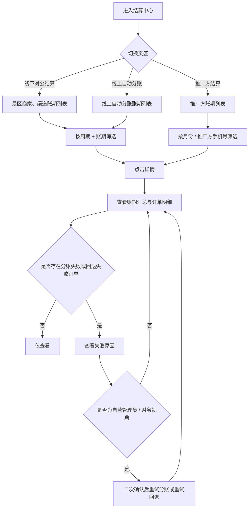
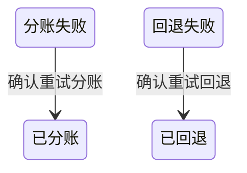

# 结算中心-账期列表与账期详情 PRD

> 版本 v1.1　·　日期 2026-09-18

---

## 一、需求背景与目标

**背景**

- 现状：线下对公结算、线上自动分账与推广方结算的资金结果分散在不同页面，缺少统一的账期查询入口；结算对象需要按自己的结算周期查看已出账的账期金额，并下钻到订单级明细核对每一笔订单的分成与分账结果。
- 问题：三类结算对象的结算周期与金额构成不同，无法在同一处按统一维度查询账期。
- 问题：线上自动分账逐单实时完成，分账失败与回退失败的结果缺少可核对的账期级视图。
- 问题：账期金额与订单明细之间缺少可校验的对应关系。
- 边界：账期详情的账单状态流转、发票上传与下载、申请结算提交流程由现有系统提供，本 PRD 不重复定义。
- 边界：结算审批的审核与打款流程见《结算审批-账期与账期明细》PRD，本 PRD 不重复定义。

**目标**

- 支持在同一页面按线下对公结算、线上自动分账、推广方结算三类查看账期。
- 支持按结算周期、账期、结算对象、推广方手机号筛选账期。
- 支持查看任一账期的汇总指标与订单级明细。
- 支持识别分账失败与回退失败订单，并在账期详情内二次确认后重新发起。

---

## 二、核心业务流程

---

## 三、功能清单

| ID  | 模块 | 功能 | 描述 |
| --- | -- | -- | -- |
| F01 | 结算中心（后台） | 分类账期列表 | 三页签账期列表，展示周期类型与金额 |
| F02 | 结算中心（后台） | 账期筛选 | 按周期、账期、对象与月份筛选账期 |
| F03 | 结算中心（后台） | 账期详情查看 | 查看账期汇总指标与订单明细 |
| F04 | 结算中心（后台） | 分账失败重试 | 分账或回退失败订单二次确认重试 |

---

## 四、功能详述

### F01｜分类账期列表

**说明**：在结算中心内按线下对公结算、线上自动分账、推广方结算三个页签分别查看账期，每个账期一行，展示周期类型与应结算金额，作为账期详情的入口。

**操作路径**：结算中心 → 切换页签与视角 → 查看账期列表 → 点击「详情」

#### 交互

**页签**

| 控件 | 组件 | 默认值 | 规则 |
| --- | --- | --- | --- |
| 线下对公结算 | Tab | — | 仅展示景区商家与渠道的线下对公结算账期，不包含推广方账期（R19） |
| 线上自动分账 | Tab | 默认选中 | 展示线上自动分账账期 |
| 推广方结算 | Tab | — | 展示推广方账期，固定月结（R03） |

页签在会话内记忆最后一次选择：进入二级账期详情后返回、或会话内重新进入结算中心时，恢复进入前的页签。

**视角**

| 控件 | 组件 | 默认值 | 规则 |
| --- | --- | --- | --- |
| 视角 | Select | 自营后台视角 | 选项为自营后台视角、景区商家视角、渠道视角、推广方视角；三个页签均支持切换视角；视角不写入会话记忆；数据范围见 R21，切换后的筛选清理见 R22 |

**列表列**

列可见性随「视角」变化。本 PRD 以自营后台视角为基准描述全部列；其余视角仅收敛可见列与数据范围，不改变列的含义与计算口径。

线下对公结算页签：

| 列 | 内容 | 规则 |
| --- | --- | --- |
| 账期 | 账期主文案 | 见 R01；悬浮展示该账期的完整起止时间 |
| 周期类型 | 周结 / 月结标签 | 周结为蓝色标签，月结为灰色标签；本页签同时存在周结与月结账期 |
| 结算对象 | 账号 + 名称两行 | 仅自营后台视角展示，悬浮展示「账号（姓名）」 |
| 对象类型 | 景区商家 / 渠道标签 | 仅自营后台视角展示 |
| 应结算金额 | 金额 | 见 R04、R20 |
| 账单状态 | 状态标签 | 现有系统能力，本 PRD 不定义 |
| 发票 | 发票入口 | 现有系统能力，本 PRD 不定义 |
| 操作 | 详情 | 进入账期详情 |

线上自动分账页签：

| 列 | 内容 | 规则 |
| --- | --- | --- |
| 账期 | 账期主文案 | 见 R01；悬浮展示该账期的完整起止时间 |
| 周期类型 | 周结 / 月结标签 | 周结为蓝色标签，月结为灰色标签；本页签同时存在周结与月结账期 |
| 结算对象 | 账号 + 名称两行 | 仅自营后台视角展示，悬浮展示「账号（姓名）」 |
| 对象类型 | 景区商家 / 渠道 / 推广方标签 | 仅自营后台视角展示 |
| 应分账金额 | 金额 | 见 R04、R20 |
| 已分账净额 | 金额 | 见 R05 |
| 分账状态 | 状态标签 | 见 R06 |
| 操作 | 详情 | 进入账期详情 |

线上自动分账页签不提供申请结算入口。

推广方结算页签：

| 列 | 内容 | 规则 |
| --- | --- | --- |
| 账期 | 账期主文案 | 见 R01；悬浮展示该账期的完整起止时间 |
| 周期类型 | 月结标签 | 推广方固定月结（R03） |
| 推广方名称 | 名称 | 仅自营后台视角展示；推广方视角下不展示 |
| 手机号 | 手机号 | 仅自营后台视角展示；推广方视角下不展示 |
| 应分成金额 | 金额 | 见 R04、R20 |
| 账单状态 | 状态标签 | 现有系统能力，本 PRD 不定义 |
| 发票 | 发票入口 | 现有系统能力，本 PRD 不定义 |
| 操作 | 详情 | 进入账期详情 |

推广方结算页签不展示「结算对象」与「对象类型」列。

**金额单元格**

- 仅景区商家账期在主行下方展示「基础 ￥X + 溢价 ￥Y」辅助行，两者之和等于主行金额。
- 渠道、推广方账期仅展示主金额，不展示辅助行。
- 金额统一保留 2 位小数并加「￥」前缀。

**分页与空态**

| 项 | 规则 |
| --- | --- |
| 分页 | 每页 10 条，不提供每页条数切换，展示「共 N 条」 |
| 空态 · 推广方结算 | 暂无推广方结算数据 |
| 空态 · 线上自动分账 | 暂无线上自动分账数据 |
| 空态 · 线下对公结算 | 暂无线下对公结算数据 |

列表不提供排序。

#### 规则

**R01｜账期口径**　账期只有周结与月结两种，时间基准为 UTC+8。

* 周结：自然周，账期区间为周一 00:00:00 至下周一 00:00:00（左闭右开），账期主文案展示为 `YYYY-MM-DD～YYYY-MM-DD`，结束日期为周日。
* 月结：自然月，账期区间为当月 1 日 00:00:00 至次月 1 日 00:00:00（左闭右开），账期主文案展示为 `YYYY年MM月`。
* 账期主文案不展示「预估」标识。
* 完整起止时间不在列表主文案中展开，通过列表账期列的悬浮提示与账期详情摘要栏查看。

**R02｜订单归属账期**　订单按「支付时间」归属账期，落在 `[账期开始, 账期结束)` 区间内的订单计入该账期。未支付成功、已取消的订单不计入任何账期。

**R03｜结算周期来源**　账期的周期类型取自结算对象自身配置的结算周期；推广方固定为月结，不读取周期配置。

**R04｜应结算金额口径**　「应结算金额」（线上自动分账页签展示为「应分账金额」、推广方结算页签展示为「应分成金额」）为该账期内归属于该结算对象的订单结算金额合计。景区商家账期的应结算金额拆分为「基础分成金额」与「溢价」两部分，两者之和恒等于应结算金额；非景区商家账期的拆分与溢价口径见 R20。

**R05｜已分账净额**　仅线上自动分账页签展示。已分账净额 = max(0, 已分账金额合计 − 已回退金额合计)，按账期内订单汇总，结果不为负数。

**R06｜分账状态**　账期的分账状态由账期内订单的分账 / 回退状态按以下优先级汇总，命中即返回：

1. 存在「回退失败」→ 回退失败
2. 存在「分账失败」→ 分账失败
3. 存在「待回退」→ 待回退
4. 存在「待分账」→ 待分账
5. 全部为「已回退」→ 已回退
6. 全部为「已分账」或「已回退」→ 已分账
7. 其余 → 待分账

**R19｜页签结算范围**　线下对公结算页签仅包含景区商家与渠道的账期，不包含推广方账期；推广方账期统一在推广方结算页签展示。线下对公结算与线上自动分账两个页签均同时包含周结与月结账期，同一结算对象按其自身配置的周期生成对应账期。

**R20｜溢价与拆分展示**　溢价仅归属景区商家账期。

* 基础分成金额与溢价之和恒等于景区商家账期的应结算金额。
* 渠道与推广方账期的溢价金额固定为 0，列表金额列不展示「基础 ￥X + 溢价 ￥Y」辅助行。
* 渠道与推广方账期的订单明细「结算规则」列不展示基础分成辅助行。
* 渠道与推广方账期的详情统计栏不单列「基础分成金额」与「溢价」指标。

**R21｜视角数据范围**　自营后台视角可查看全部结算对象的账期与订单明细；景区商家、渠道、推广方视角仅展示归属于本人的账期与订单明细，不展示其他结算对象的任何数据。

#### 状态

本功能不修改任何账期或订单数据。

* 页签切换时写入会话记忆，并在下次进入页面时恢复。
* 切换到推广方结算页签时，同时清空周期、账期、对象类型、结算对象筛选。
* 切换到其他页签时，仅清空状态筛选。
* 视角切换产生的筛选清理见 R22，不改变账期数据本身。

#### 异常

| 场景 | 触发条件 | 系统处理 | 用户反馈 |
| --- | --- | --- | --- |
| 账期无匹配数据 | 当前页签下无账期 | 展示空表 | 按页签展示对应空态文案 |
| 结算对象无订单 | 账期内无可结算订单 | 不生成账期行 | 不展示该账期 |
| 会话记忆值非法 | 记忆值不属于三个页签 | 回退默认页签 | 展示线上自动分账 |
| 本人视角下无账期 | 景区商家、渠道或推广方视角下本人无账期 | 展示空表 | 按页签展示对应空态文案 |

#### 验收

**AC01｜页签切换**　Given 当前在结算中心，When 切换到「线下对公结算」页签，Then 列表仅展示线下对公结算账期，且不含线上自动分账账期。

**AC02｜页签记忆**　Given 当前选中「推广方结算」页签，When 进入某账期详情后点击返回，Then 结算中心仍停留在「推广方结算」页签。

**AC03｜分账状态汇总优先级**　Given 某线上自动分账账期内同时存在「分账失败」与「回退失败」订单，When 查看该账期行，Then 分账状态展示为「回退失败」。

**AC04｜已分账净额非负**　Given 某线上自动分账账期的已回退金额合计大于已分账金额合计，When 查看该账期行，Then 已分账净额展示为 ￥0.00。

**AC05｜金额拆分**　Given 账期属于景区商家，When 查看应结算金额列，Then 主行展示应结算金额，副行展示「基础 ￥X + 溢价 ￥Y」且两者之和等于主行金额。

**AC06｜非景区商家不展示拆分**　Given 账期属于渠道对象，When 查看应结算金额列，Then 仅展示主金额，不展示「基础 + 溢价」副行。

**AC07｜空态文案**　Given 推广方结算页签下无任何账期，When 查看列表，Then 展示「暂无推广方结算数据」。

**AC26｜账期不展示预估标识**　Given 任一页签下的账期行，When 查看账期列文案，Then 文案中不出现「预估」标识。

**AC27｜线下对公结算不含推广方**　Given 线下对公结算页签下存在账期，When 查看该页签列表，Then 不出现对象类型为「推广方」的账期行，同一推广方账期仅在推广方结算页签展示。

**AC28｜线上与线下均提供周结账期**　Given 某周结结算对象在线上自动分账与线下对公结算下均有账期，When 分别查看两个页签的列表，Then 两个页签均展示该对象的周结账期行，且账期主文案为周日期范围。

**AC29｜账期完整起止时间可查**　Given 列表中存在月结账期（主文案为「YYYY年MM月」），When 悬浮该账期文案，Then 展示该账期的完整起止时间。

---

### F02｜账期筛选

**说明**：在账期列表上方按结算周期、账期、结算对象、推广方手机号筛选账期，缩小查询范围。

**操作路径**：结算中心 → 选择周期 → 选择账期 → 按需选择对象类型 / 结算对象或输入推广方手机号 → 点击「重置」清空

#### 交互

筛选项随页签变化。以下为自营后台视角下的筛选项。

线下对公结算、线上自动分账页签：

| 筛选项 | 组件 | 默认值 | 规则 |
| --- | --- | --- | --- |
| 周期 | Select，可清空 | 空 | 选项为周结、月结；清空表示全部周期；占位文案「周期」 |
| 账期 | DatePicker，可清空 | 空 | 未选择周期时禁用，占位文案「先选择周期」；选周结时按自然周选择，占位文案「选择周」；选月结时按月份选择，占位文案「选择月份」 |
| 对象类型 | Select，可清空 | 空 | 选项为景区商家、渠道、推广方；仅自营后台视角展示 |
| 结算对象 | Select，可清空、可搜索 | 空 | 选项为当前页签下出现过的结算对象，展示为「账号（姓名）」；仅自营后台视角展示 |
| 状态 | Select，可清空 | 空 | 线上自动分账页签的选项为该页签的分账状态取值；线下对公结算页签的选项为账单状态取值。该筛选项属现有系统能力，本 PRD 不定义其口径 |
| 重置 | Link 按钮（蓝色链接） | — | 清空上表全部筛选项 |

推广方结算页签：

| 筛选项 | 组件 | 默认值 | 规则 |
| --- | --- | --- | --- |
| 推广方手机号 | Input，可清空 | 空 | 占位文案「查询推广方手机号」；仅自营后台视角展示与生效，推广方视角下不展示（R10、R22） |
| 月份 | DatePicker（月份），可清空 | 空 | 占位文案「选择月份」；按月份匹配（R09） |
| 状态 | Select，可清空 | 空 | 同线下对公结算 |
| 重置 | Link 按钮（蓝色链接） | — | 清空上表全部筛选项 |

推广方结算页签不展示周期、账期、对象类型、结算对象筛选项。

筛选控件占位符直接使用字段名称，不加「全部」前缀；查询输入框占位符统一为「查询 xxx」格式。筛选为即时生效，不需点击查询按钮。所有筛选项不写入会话记忆，离开页面后重置。

#### 规则

**R07｜周期与账期联动**　周期筛选项默认为空，空值表示全部周期；未选择周期时账期选择器禁用；账期选择器随所选周期切换选择粒度，周结选择自然周、月结选择月份；切换周期时清空已选账期。

**R08｜对象类型与结算对象联动**　已选对象类型时，结算对象候选仅包含该类型下的结算对象；清空或切换对象类型时清空已选结算对象。

**R09｜账期匹配**　账期选择器使用中文展示。

* 月结：按所选月份归属的自然月匹配，即账期主文案等于所选月份的 `YYYY年MM月`。
* 周结：按所选日期归属的自然周的周一匹配，即账期开始时间等于该周的周一 00:00:00。
* 推广方结算页签：仅按月份匹配，不区分周期。

**R10｜推广方手机号匹配**　按手机号做模糊包含匹配，忽略首尾空格。该筛选项仅在推广方结算页签、且非推广方视角下展示与生效。

**R11｜筛选叠加与重置**　多个筛选项同时生效时取交集；无匹配结果时展示 F01 定义的空态。「重置」清空全部筛选项并恢复默认展示，不改变当前页签与视角。

**R22｜视角切换与筛选清理**　切换视角时清空已选结算对象；切换为推广方视角时，同时清空推广方手机号筛选条件。

#### 状态

筛选不修改任何数据，仅改变列表展示范围。切换周期时清空已选账期；切换对象类型时清空已选结算对象；页签切换与视角切换时按 F01 状态与 R22 清空。

#### 异常

| 场景 | 触发条件 | 系统处理 | 用户反馈 |
| --- | --- | --- | --- |
| 未选周期即选账期 | 账期选择器未选周期时被点击 | 禁止展开选择 | 选择器为禁用态 |
| 周期与已选账期冲突 | 切换周期 | 清空已选账期 | 账期选择器恢复为空 |
| 对象类型无候选 | 所选对象类型下无结算对象 | 结算对象候选为空 | 可正常清空 |
| 手机号无匹配 | 输入不存在的手机号 | 展示空表 | 展示对应空态文案 |

#### 验收

**AC08｜周期账期联动**　Given 未选择周期，When 查看账期选择器，Then 选择器为禁用态且占位文案为「先选择周期」。

**AC09｜周期切换清空账期**　Given 已选择「月结」并选择了 2026年5月，When 将周期切换为「周结」，Then 已选账期被清空，且占位文案变为「选择周」。

**AC10｜周结账期匹配**　Given 选择周结并选择 2026-05-20 所在周，When 查看列表，Then 仅展示账期开始时间为 2026-05-18 的账期。

**AC11｜月结账期匹配**　Given 选择月结并选择 2026年5月，When 查看列表，Then 仅展示账期主文案为 2026年5月 的账期。

**AC12｜对象类型与结算对象联动**　Given 已选择结算对象，When 将对象类型切换为「渠道」，Then 已选结算对象被清空，且结算对象候选仅包含渠道类型的结算对象。

**AC13｜筛选叠加**　Given 同时选择周期「月结」、账期 2026年5月 与结算对象 A，When 查看列表，Then 列表仅展示同时满足三个条件的账期。

**AC14｜重置**　Given 已设置周期、账期、对象类型、结算对象与状态，When 点击「重置」，Then 全部筛选项被清空，页面仍停留在当前页签。

**AC15｜推广方视角隐藏列与筛选**　Given 当前为推广方视角且位于推广方结算页签，When 查看列表与筛选区，Then 不展示推广方名称列、手机号列与「推广方手机号」输入框。

**AC30｜推广方页签筛选项**　Given 位于推广方结算页签，When 查看筛选区，Then 仅展示推广方手机号、月份与状态三项筛选项及重置按钮，不展示周期与账期筛选。

**AC31｜切换视角清理手机号筛选**　Given 当前为自营后台视角、位于推广方结算页签且已输入推广方手机号，When 将视角切换为推广方视角，Then 已输入的推广方手机号筛选条件被清空。

**AC32｜重置按钮样式**　Given 位于任一经筛选区的页签，When 查看重置控件，Then 重置展示为蓝色链接按钮。

---

### F03｜账期详情查看

**说明**：查看单个账期的汇总指标与构成该账期的订单级明细，用于核对应结算金额与订单的对应关系。

**操作路径**：账期列表 → 点击「详情」→ 查看摘要栏与汇总指标 → 按景区筛选统计范围 → 查看订单明细 → 点击「返回」

#### 交互

**页头**

| 区域 | 展示内容 | 规则 |
| --- | --- | --- |
| 返回 | 返回按钮 | 返回结算中心账期列表 |
| 页面标题 | 按页签取值 | 线上自动分账详情 / 推广方结算详情 / 线下对公结算详情 |
| 结算对象 | 「账号（姓名）」 | 展示当前账期归属的结算对象 |

**摘要栏**

| 层级 | 展示内容 | 规则 |
| --- | --- | --- |
| 第一层 | 周期 Tag + 账期主标题 | 周期与账期在同一行展示；周结为蓝色标签、月结为灰色标签；账期主标题口径同 R01；同行右侧展示账单状态标签 |
| 第二层 | 账期范围 `{账期开始} — {账期结束}` | 标签为「统计范围」，展示账期的完整起止时间；该行使用高对比度浅色文本，不沿用灰色辅助文案 |
| 第三层 | 范围筛选与汇总指标 | 同一区域内展示，范围筛选为景区下拉，选项为「全部景区」加当前账期涉及的全部景区，默认「全部景区」 |

**汇总指标**

| 指标 | 规则 |
| --- | --- |
| 订单笔数 | 范围内订单数量，展示为「N 笔」 |
| 订单金额合计 | 范围内订单实付金额合计 |
| 退款金额合计 | 范围内订单退款金额合计 |
| 基础分成金额 | 仅景区商家账期展示（R20） |
| 溢价 | 仅景区商家账期展示（R20） |
| 应结算金额 | 推广方结算页签展示为「应分成金额」 |
| 已分账净额 | 仅线上自动分账展示，口径同 R05 |

**订单明细列**

| 列 | 内容 | 规则 |
| --- | --- | --- |
| 订单号 | 订单号链接 | 点击进入「订单管理」模块的订单详情 |
| 订单信息 | 主题 | 超长时截断并支持悬停查看 |
| 拍摄点 | 拍摄点名称 | — |
| 订单状态 | 状态标签 | — |
| 下单时间 | 时间 | — |
| 完成时间 | 时间 | — |
| 订单金额 | 金额 | — |
| 结算规则 | 结算规则文案 | 展示为「按比例 · N%」；仅景区商家账期额外展示「基础 ￥X + 溢价 ￥Y」副行（R20） |
| 已分账净额 | 金额 | 仅线上自动分账展示 |
| 分账状态 | 状态标签、失败原因与重试入口 | 仅线上自动分账展示，见 R15 |
| 应结算金额 | 金额 | 推广方结算页签展示为「应分成金额」 |

分页每页 10 条，不提供每页条数切换，展示「共 N 条」。明细不提供排序。

#### 规则

**R12｜汇总指标口径**　汇总指标基于当前范围筛选命中的订单重新计算，各指标口径如下：

* 订单笔数 = 范围内订单数量。
* 订单金额合计 = 范围内订单实付金额合计。
* 退款金额合计 = 范围内订单退款金额合计。
* 基础分成金额 + 溢价 = 范围内订单归属于该结算对象的应结算金额合计，仅景区商家账期拆分展示；渠道与推广方账期不单列基础分成金额与溢价（R20）。
* 应结算金额 = 范围内订单归属于该结算对象的结算金额合计。
* 已分账净额 = max(0, 范围内订单已分账金额合计 − 已回退金额合计)。

**R13｜范围筛选联动**　切换景区范围后，汇总指标与订单明细同步重算，不保留上一次范围的结果。

**R14｜明细与汇总一致性**　同一范围下，订单明细各行的应结算金额之和等于汇总区的应结算金额，退款金额之和等于退款金额合计。

**R15｜分账状态展示与重试权属**　仅线上自动分账账期的订单明细展示分账状态。

* 订单分账 / 回退状态非失败时，仅展示状态标签。
* 订单分账或回退状态为「分账失败」「回退失败」时，额外展示失败原因；失败原因缺失时展示「未返回失败原因」。
* 仅自营后台视角下的自营管理员与财务可发起重试，且发起前须经二次确认（F04）；景区商家、渠道、推广方视角仅展示状态与失败原因，不展示重试入口。

#### 状态

本功能不修改数据，重试产生的状态变化见 F04。进入账期详情时，范围筛选默认重置为「全部景区」。

#### 异常

| 场景 | 触发条件 | 系统处理 | 用户反馈 |
| --- | --- | --- | --- |
| 账期不存在 | 通过链接访问到不存在的账期 | 展示空态 | 「未找到该账单，返回结算中心」并支持返回 |
| 账期无订单 | 账期内无订单明细 | 展示空表 | 「暂无订单明细」 |
| 账期仅一个景区 | 账期只涉及一个景区 | 范围筛选仍展示 | 选项为「全部景区」与该景区 |
| 失败原因缺失 | 订单未返回失败原因 | 允许重试 | 展示「未返回失败原因」 |

#### 验收

**AC16｜进入账期详情**　Given 账期列表中某一账期存在，When 点击该行「详情」，Then 进入账期详情，页头展示当前账期与结算对象，汇总区展示该账期的指标。

**AC17｜页面标题按页签区分**　Given 从推广方结算页签进入账期详情，When 查看页头标题，Then 标题为「推广方结算详情」。

**AC18｜范围筛选重算**　Given 账期涉及景区 A 与景区 B，When 将范围筛选切换为景区 A，Then 汇总指标仅统计景区 A 的订单，明细仅展示景区 A 的订单。

**AC19｜明细与汇总一致**　Given 某范围的订单明细已加载，When 汇总各行应结算金额，Then 合计等于汇总区展示的应结算金额。

**AC20｜账期不存在**　Given 访问一个不存在的账期链接，When 页面加载，Then 展示「未找到该账单，返回结算中心」，点击返回回到账期列表。

**AC21｜非自营管理员 / 财务视角无重试入口**　Given 账期内存在分账失败订单，且当前为景区商家、渠道或推广方视角，When 查看该订单的分账状态列，Then 展示失败原因但不展示重试入口。

**AC33｜渠道与推广方不展示分成拆分**　Given 账期属于渠道或推广方，When 查看账期列表金额列与账期详情，Then 列表不展示「基础 + 溢价」辅助行，明细「结算规则」列不展示基础分成辅助行，汇总统计栏不展示「基础分成金额」与「溢价」指标。

**AC34｜视角仅展示本人数据**　Given 当前为渠道视角，When 查看账期列表并进入任一账期详情，Then 仅展示归属于该渠道本人的账期与订单明细。

**AC35｜摘要栏分层与账期范围可读性**　Given 进入任一账期详情，When 查看摘要栏，Then 第一行展示周期标签与账期主标题，账期范围在下一行以「统计范围 + 完整起止时间」展示，且该行文本为高对比度浅色文本。

---

### F04｜分账失败重试

**说明**：对账期内分账失败或回退失败的订单重新发起资金处理，避免因单笔失败导致账期长期停留失败状态。

**操作路径**：账期详情 → 定位分账 / 回退失败订单 → 点击「重试分账」或「重试回退」→ 二次确认框核对信息 → 确认重试或取消

#### 交互

| 控件 | 规则 |
| --- | --- |
| 重试入口 | 仅分账失败行展示「重试分账」，回退失败行展示「重试回退」；仅自营后台视角下的自营管理员与财务可见（R15） |
| 确认框标题 | 分账失败为「确认重试分账？」；回退失败为「确认重试回退？」 |
| 确认框内容 | 订单号、分账金额或回退金额、收款方「账号（姓名）」、失败原因 |
| 按钮 | 「确认重试」、「取消」 |

取消后不发起重试，订单状态不变。

#### 规则

**R16｜重试条件**　仅当订单当前分账 / 回退状态为「分账失败」或「回退失败」时可发起重试。其他状态不展示重试入口。

**R17｜重试类型**　回退状态为「回退失败」时发起回退重试；否则发起分账重试。

**R18｜重试金额与结果**　确认框展示的金额为该订单归属于当前账期的应分账金额。

* 回退重试：成功后订单状态变为「已回退」，提示「订单 {订单号} 回退成功，退款已完成」。
* 分账重试：提交后提示「订单 {订单号} 已提交重试分账」，处理完成后订单状态变为「已分账」并提示「订单 {订单号} 分账成功」。

重试完成后，账期的已分账净额与分账状态按 R05、R06 重新汇总。

#### 状态

重试完成后同时清空该订单的失败原因，并更新账期行与账期详情的分账状态与已分账净额。

#### 异常

| 场景 | 触发条件 | 系统处理 | 用户反馈 |
| --- | --- | --- | --- |
| 非失败状态触发 | 订单状态非失败 | 不展示重试入口 | — |
| 当前视角无权限 | 非自营管理员 / 财务视角 | 不执行重试 | 不展示重试入口 |
| 重复提交 | 确认框确认后再次点击 | 不重复发起 | 按 R18 展示一次结果 |
| 失败原因缺失 | 订单未返回失败原因 | 允许重试 | 展示「未返回失败原因」 |

#### 验收

**AC22｜分账重试**　Given 某订单分账状态为「分账失败」，When 在账期详情点击「重试分账」并确认，Then 订单状态变为「已分账」，失败原因清空，账期的分账状态与已分账净额同步更新。

**AC23｜回退重试**　Given 某订单回退状态为「回退失败」，When 在账期详情点击「重试回退」并确认，Then 订单状态变为「已回退」，并提示退款已完成。

**AC24｜取消重试**　Given 已打开重试确认框，When 点击「取消」，Then 订单状态与账期金额均不变更。

**AC25｜重复提交**　Given 已确认重试，When 再次点击重试入口，Then 不重复发起重试。

---

## 五、待确认事项

| ID | 待确认事项 | 影响功能 | 状态 |
| --- | --- | --- | --- |
| Q01 | 账期列表的默认排序规则（当前实现为不排序） | F01 | 待确认 |
| Q02 | 账期列表是否需支持导出 | F01 | 待确认 |
| Q03 | 已出账账期的金额是否随跨期退款、回退而变化，以及变化后的展示口径 | F01、F03 | 待确认 |
| Q04 | 订单号跳转订单详情的落地形态与是否需要携带返回参数 | F03 | 待确认 |
| Q05 | 账期详情的订单明细是否需支持导出 | F03 | 待确认 |
| Q06 | 「范围筛选」的景区选项是否需按当前用户的景区权限收敛 | F03 | 待确认 |
| Q07 | 分账重试是否需记录操作人、操作时间与重试次数 | F04 | 待确认 |
| Q08 | 账期详情的重试与「订单详情」模块的重试是否共用同一套权限与状态 | F04 | 待确认 |
| Q09 | 「自营管理员 / 财务」与视角的对应关系：视角下拉仅包含自营后台、景区商家、渠道、推广方四项，管理员与财务如何在该视角下判定 | F03、F04 | 待确认 |
| Q10 | 切换视角时除推广方手机号与已选结算对象外，是否需同步清空周期、账期与状态筛选 | F02 | 待确认 |
| Q11 | 线下对公结算页签不再包含推广方后，历史已生成的推广方线下结算账期在哪个页签展示 | F01 | 待确认 |
| Q12 | 渠道与推广方账期溢价固定为 0 后，历史含溢价数据的账期是否需按 0 回溯展示 | F01、F03 | 待确认 |
