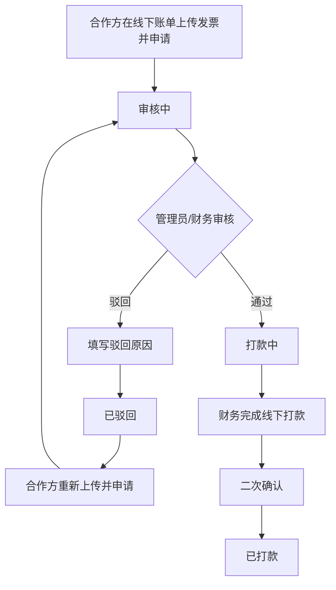

# 结算审批页面 PRD

> 文档状态：已确认  
> 对应页面：结算审批主页、结算审批二级详情  
> 需求基线：[结算能力改造需求分析](./结算能力改造-需求分析-20260916.md)

## 一、需求背景

现有审批页面以单一结算申请为模型，无法支撑景区商家、渠道、推广方三类对象，以及周结、月结并存的账期。与此同时，线上自动分账由系统执行，不应混入线下人工审核与打款。

本期新建统一“结算审批”导航，按对象类型拆分三页签，只承接线下对公结算申请，并提供筛选、查看明细、审核通过、审核驳回及线下打款操作。

## 二、需求目标

- 按景区商家、渠道、推广方清晰承接线下结算申请。
- 统一账期、周期、结算对象、金额、收款账户、发票与状态字段。
- 将审批状态限定为审核中、打款中、已打款、已驳回。
- 仅有权限的自营管理员/财务可查看和操作。
- 详情属于结算审批二级页面，返回后保留原页签。

## 三、需求核心业务流程图

## 四、需求功能清单

| 终端 | 模块 | 功能 | 描述 |
|------|------|------|------|
| 自营后台 | 导航权限 | 结算审批入口 | 仅授权管理员/财务展示并允许访问 |
| 自营后台 | 结算审批 | 三对象页签 | 景区商家结算、渠道结算、推广方结算 |
| 自营后台 | 结算审批 | 条件筛选 | 周期、账期、结算对象、账单状态筛选 |
| 自营后台 | 结算审批 | 审批列表 | 展示申请账期、周期、对象、金额、账户、发票与操作 |
| 自营后台 | 结算审批 | 查看明细 | 打开审批二级详情并正确返回 |
| 自营后台 | 结算审批 | 审核通过 | 审核中转为打款中 |
| 自营后台 | 结算审批 | 审核驳回 | 必填驳回原因并转为已驳回 |
| 自营后台 | 结算审批 | 线下打款 | 打款中账单确认后转为已打款 |
| 后端 | 审批服务 | 幂等与审计 | 校验状态、权限并记录操作轨迹 |

## 五、需求功能详述

### 5.1 自营后台——结算审批——页面权限与页签

**原型描述**：
侧边导航新增“结算审批”。页面顶部横向展示“景区商家结算”“渠道结算”“推广方结算”三个页签。

**用户故事**：
> 作为自营管理员或财务，我想按结算对象类型处理申请，以便快速定位待审批账单。

**前置条件**：

- 用户已登录自营后台。
- 用户具有结算审批查看权限。

**核心逻辑**：

- 三页签分别展示对应对象发起的线下对公结算申请。
- 线上自动分账账期不进入审批页面。
- 页面仅展示审核中、打款中、已打款、已驳回。
- 当前页签写入 sessionStorage；进入详情再返回时恢复原页签。

**边界条件与异常处理**：

- 无权限角色不展示导航；直接访问路由时返回无权限页，接口不返回审批数据。
- 角色权限变化后应在下一次请求立即生效。

**技术难点分析**：

- 前后端双重鉴权和多租户数据隔离。

**验收标准 (Acceptance Criteria)**：

- 🎯 授权用户可查看三个页签。
- ✔️ 线上自动分账不出现在任一页签。
- ✔️ 返回详情前页签保持不变。
- ❌ 无权限访问不泄露列表数据。

**测试用例**：

- 管理员可访问
- 财务可访问
- 合作方无权限
- 排除线上分账
- 返回恢复页签

### 5.2 自营后台——结算审批——筛选区

**原型描述**：
页签下方横向排列筛选控件。景区商家和渠道先选“周期”，再选择周或月份；推广方只显示月份。三页签均支持可搜索结算对象和账单状态，末尾为蓝色链接“重置”。

**用户故事**：
> 作为审批人员，我想按账期、对象和状态缩小范围，以便找到目标申请。

**前置条件**：

- 当前页签存在可查询账单。

**核心逻辑**：

- 景区商家/渠道：周期选项为周结、月结；未选周期时账期控件禁用。
- 周结使用中文周选择器，按自然周筛选；月结使用中文月份选择器。
- 推广方固定月结，仅展示“账单月份”，不展示周期筛选。
- 结算对象为可搜索下拉，选项格式“账号（姓名）”。
- 状态选项仅为审核中、打款中、已打款、已驳回。
- 切换页签清空当前筛选；重置清空本页全部筛选。

**边界条件与异常处理**：

- 切换周期类型时清空已选账期，避免周/月值混用。
- 无匹配结果时展示“暂无待审批账期”。

**技术难点分析**：

- 周选择器值转换为自然周起始日。

**验收标准 (Acceptance Criteria)**：

- 🎯 各筛选组合返回正确交集。
- ✔️ 月结命名与结算中心一致，格式为“YYYY年MM月”。
- ✔️ 占位符不带“全部”。
- ❌ 无结果时不保留上一次列表。

**测试用例**：

- 周结按周筛选
- 月结按月筛选
- 搜索账号姓名
- 状态组合筛选
- 重置全部条件

### 5.3 自营后台——结算审批——审批列表与详情

**原型描述**：
表格字段依次为申请结算账期、周期类型、结算对象、应结算金额、账单状态、收款账户信息、备注、发票、操作。

**用户故事**：
> 作为审批人员，我想在一行内完成账期、对象、金额、账户和材料核对，以便决定后续动作。

**前置条件**：

- 账单为线下对公结算且状态属于审批范围。

**核心逻辑**：

1. 申请结算账期：月结显示“YYYY年MM月”，周结显示起止日期。
2. 周期类型：使用“周结/ 月结”标签。
3. 结算对象：账号为主信息、姓名为辅助信息。
4. 应结算金额：统一显示人民币两位小数。推广方审批列表本期沿用“应结算金额”字段名。
5. 收款账户：展示开户名、开户行、脱敏银行账号，取申请时账户快照。
6. 备注：展示申请备注或驳回提示。
7. 发票：存在文件时提供查看/下载。
8. 查看明细进入 `/settlement/approval/bill/:view/:billId`，页面标题为“结算审批详情”，返回结算审批。

**边界条件与异常处理**：

- 收款账户或发票快照缺失时以“-”展示，并禁止审核通过。
- 详情不存在或无权限时返回审批入口并提示。
- 银行账号仅展示必要尾号。

**技术难点分析**：

- 申请时快照与后续对象资料变更的隔离。

**验收标准 (Acceptance Criteria)**：

- 🎯 字段顺序、命名和内容与需求一致。
- ✔️ 详情不切换到结算中心导航。
- ✔️ 账户资料修改不影响已提交申请快照。
- ❌ 缺少必要资料时不得审核通过。

**测试用例**：

- 月结名称格式
- 周结名称格式
- 账户信息脱敏
- 发票可下载
- 详情返回审批

### 5.4 自营后台——结算审批——审核与打款

**原型描述**：
审核中显示“审核通过”“审核驳回”；打款中显示“线下打款”。确认弹窗圆角 8px，按钮圆角 4px。驳回确认按钮为红色。

**用户故事**：
> 作为审批人员，我想安全地完成审核和打款确认，以便推动账单按状态流转。

**前置条件**：

- 审核通过/驳回：账单当前为审核中。
- 线下打款：账单当前为打款中。

**核心逻辑**：

- 审核通过：弹窗标题“审核通过？”，说明“确定发票无误，同意打款？”，确认后进入打款中。
- 审核驳回：弹窗标题“审核驳回？”，驳回原因必填，确认后进入已驳回并保存原因。
- 线下打款：弹窗标题“已完成线下打款？”，说明“确认您已完成该笔线下打款，请谨慎操作。”，确认后进入已打款。
- 已打款和已驳回不展示可重复执行的审批动作。
- 服务端记录操作人、角色、时间、原状态、新状态、账单金额和原因。

**边界条件与异常处理**：

- 驳回原因去除首尾空格后为空时不得提交。
- 页面状态过期时拒绝操作并刷新最新结果。
- 重复点击使用账单号和动作生成幂等键。
- 真实系统是否强制打款流水号/回单，见需求分析待确认项。

**技术难点分析**：

- 多人并发审批的状态锁和幂等控制。

**验收标准 (Acceptance Criteria)**：

- 🎯 三类动作均按规定状态流转。
- ✔️ 驳回原因必填且可追溯。
- ✔️ 弹窗与按钮圆角符合规范。
- ❌ 重复或越级操作不改变状态。

**测试用例**：

- 审核通过到账中
- 驳回原因必填
- 驳回记录原因
- 确认完成打款
- 取消不改状态
- 并发只成功一次

## 六、非功能性需求

### 6.1 性能

- 筛选和翻页 P95 响应不超过 2 秒。
- 审批动作 P95 响应不超过 3 秒。

### 6.2 可用性

- 列表默认按申请时间倒序；分页失败时保留当前筛选。
- 状态变更失败不得提前更新为成功态。

### 6.3 安全

- 页面、查询接口和操作接口均执行 RBAC 与数据域校验。
- 银行账号脱敏展示，发票下载地址短时有效并校验权限。

### 6.4 监控

- 审批与打款审计日志至少保留 3 年。
- 重复操作、越权、状态冲突和下载失败均记录安全日志并可告警。

