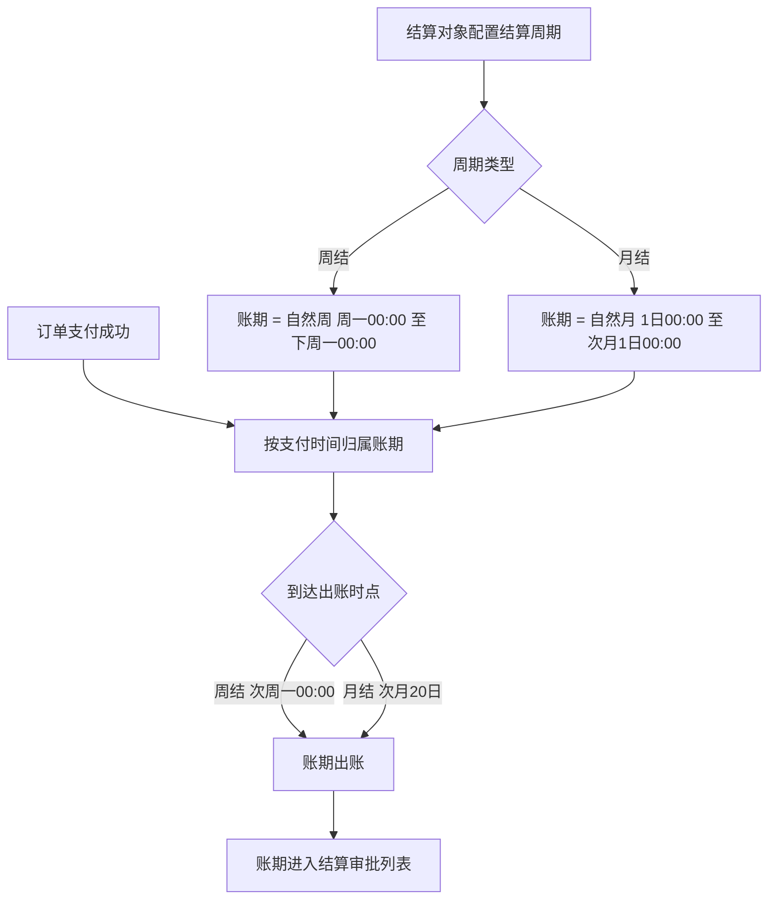
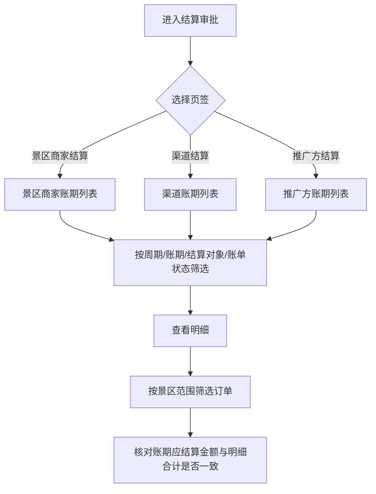

# 结算审批 PRD

## 一、需求背景

* 线下对公结算的景区商家、渠道和推广方各自配置结算周期，按周期产生账期；账期经审批与线下打款后完成结算。
* 财务需要一个统一入口，按结算对象分类查看到账的结算账期，并从账期下钻核对构成该账期的订单。
* 当前存在两个未成文的缺口：
  * **账期口径未成文**——周结、月结两种周期的账期起止时间、出账时点没有明确规则。
  * **归期口径未成文**——一笔订单依据哪个时间点归属到哪个账期没有明确规则，同一笔订单在账期列表与账期明细之间无法核对是否一致。
* 上述缺口导致财务无法判断某个账期的明细是否完整、金额是否可核对，只能依赖线下沟通。
* 本次需求解决范围：结算审批模块的景区商家结算列表、渠道结算列表、推广方结算列表及其筛选项、账期明细查看操作，并明确周结、月结对应的账期口径与账期明细口径。
* 线下打款、账单状态流转、审核、发票下载为现有系统已完备能力，不在本次范围，相关入口仅做保留说明。

---

## 二、需求目标

* 明确周结、月结两种结算周期对应的账期起止时间。
* 明确周结、月结账期的出账时点。
* 明确一笔订单归属账期的判断口径。
* 支持分景区商家、渠道、推广方三类查看已进入结算流程的账期。
* 支持按周期、账期、结算对象和账单状态筛选账期。
* 支持从任一账期下钻查看该账期内构成应结算金额的订单明细。

---

## 三、核心业务流程

### 3.1 账期生成

### 3.2 账期核对

---

## 四、需求功能清单

| ID | 终端 | 模块 | 功能 | 描述 |
| --- | --- | --- | --- | --- |
| F01 | 后台 | 结算审批 | 分类列表查看 | 按景区商家、渠道、推广方三类查看已出账并进入结算流程的账期 |
| F02 | 后台 | 结算审批 | 账期筛选 | 按周期、账期、结算对象和账单状态筛选账期 |
| F03 | 后台 | 结算周期 | 账期生成口径 | 明确周结、月结账期的起止时间、出账时点与订单归属口径 |
| F04 | 后台 | 结算审批 | 账期明细查看 | 从账期下钻查看构成该账期的订单明细与金额构成 |

---

# 五、需求功能详述

## 5.1 F01｜分类列表查看

### 5.1.1 功能说明

在一个页面内以三个页签分别查看景区商家、渠道和推广方的结算账期。列表只呈现已出账并进入结算流程的账期，供财务按结算对象分批处理。

### 5.1.2 用户操作

1. 进入「结算审批」。
2. 在景区商家结算、渠道结算、推广方结算之间切换页签。
3. 查看当前页签的账期列表。
4. 点击某一行「查看明细」，进入该账期的账期明细（见 F04）。

### 5.1.3 页面 / 交互

| 区域 / 控件 | 规则 |
| --- | --- |
| 页签 | 景区商家结算、渠道结算、推广方结算；默认选中「景区商家结算」 |
| 页签记忆 | 在会话内记住最后选中的页签；从账期明细返回时恢复到进入前的页签 |
| 权限 | 仅自营管理员与财务角色可访问；其他角色整页展示「暂无结算审批权限，请联系系统管理员」，不加载列表 |
| 列表 | 分页展示，默认每页 6 条；展示总条数；空列表展示「暂无待审批账期」 |

列表字段：

| 列 | 展示内容 | 规则 |
| --- | --- | --- |
| 申请结算账期 | 账期主文案 | 周结展示为 `YYYY-MM-DD～YYYY-MM-DD`（起始周一至结束周日）；月结展示为 `YYYY年MM月`；悬浮展示完整起止时间 |
| 周期类型 | 周结 / 月结 | 周结与月结使用不同颜色的标签区分 |
| 结算对象 | 账号 + 姓名 | 账号为主文本，姓名为辅助文本；展示为「账号（姓名）」 |
| 应结算金额 | ￥ + 千分位两位小数 | 三个页签统一使用「应结算金额」文案 |
| 账单状态 | 当前账单状态 | 仅展示已进入结算流程的状态；状态含义与流转属现有功能 |
| 收款账户信息 | 开户名、开户行、银行账号 | 取该结算对象配置的银行账户；银行账号脱敏展示 |
| 备注 | 驳回相关提示 | 无备注时展示「-」 |
| 发票 | 发票下载入口 | 现有功能 |
| 操作 | 查看明细 | 所有行均可查看明细；审核与打款入口为现有功能 |

### 5.1.4 核心业务规则

**R01｜准入权限**

仅自营管理员与财务角色可访问结算审批；其他角色访问时展示无权限提示页，不返回任何账期数据。

**R02｜结算方式范围**

结算审批只处理线下对公结算账期；线上自动分账账期不进入本模块的任何页签。

**R03｜页签归属**

账期按其结算对象类型归属唯一页签：景区商家归入「景区商家结算」，渠道归入「渠道结算」，推广方归入「推广方结算」；同一账期不会出现在多个页签。

**R04｜状态范围**

列表仅展示已出账并进入结算流程的账期；尚未出账的账期不进入结算审批。

**R05｜结算对象停用**

结算对象在后台停用后，其历史账期仍保留在列表中可查询、可查看明细；其身份标识沿用停用前的账号与姓名。

### 5.1.5 数据 / 状态变化

无数据写入。切换页签时清空该页签下已选的筛选项（见 R13）。

### 5.1.6 异常与边界

| 场景 | 触发条件 | 系统处理 | 用户反馈 |
| --- | --- | --- | --- |
| 无权限 | 当前用户非自营管理员或财务 | 不加载列表数据 | 展示「暂无结算审批权限，请联系系统管理员」 |
| 无已出账账期 | 当前页签无符合范围的数据 | 展示空列表 | 展示「暂无待审批账期」 |
| 结算对象已停用 | 账期所属对象被停用 | 账期仍正常展示 | 列表与明细均可正常查看 |

### 5.1.7 验收标准

**AC01｜权限拦截**

Given 当前登录用户不具备自营管理员或财务角色
When 访问结算审批
Then 页面不展示任何账期数据，仅展示「暂无结算审批权限，请联系系统管理员」。

**AC02｜页签数据隔离**

Given 三个页签下均存在账期
When 切换到「渠道结算」
Then 列表只展示结算对象类型为渠道的账期，不出现景区商家或推广方账期。

**AC03｜线上分账不进入**

Given 某结算对象同时存在线上自动分账账期与线下对公结算账期
When 查看该对象所在的页签
Then 列表只展示线下对公结算账期。

**AC04｜页签记忆**

Given 当前停留在「推广方结算」页签
When 进入某账期的明细并返回
Then 页面恢复到「推广方结算」页签。

---

## 5.2 F02｜账期筛选

### 5.2.1 功能说明

在三个页签内按周期、账期、结算对象和账单状态缩小账期范围，便于财务定位特定结算对象或特定账期的账期。

### 5.2.2 用户操作

1. 在「景区商家结算」或「渠道结算」页签先选择周期，再选择账期。
2. 在「推广方结算」页签直接选择账单月份。
3. 按需选择结算对象与账单状态。
4. 点击「重置」清空全部筛选条件。

### 5.2.3 页面 / 交互

| 筛选项 | 适用页签 | 组件 | 可选值 | 规则 |
| --- | --- | --- | --- | --- |
| 周期 | 景区商家结算、渠道结算 | 下拉 | 周结、月结 | 可清空；变更或清空时清空已选账期 |
| 账期 | 景区商家结算、渠道结算 | 周选择器 / 月选择器 | — | 未选周期时禁用并提示「先选择周期」；选择周结时按周选择，选择月结时按月选择；可清空 |
| 账单月份 | 推广方结算 | 月选择器 | — | 推广方固定月结，不提供周期筛选 |
| 结算对象 | 三个页签 | 可搜索下拉 | 当前页签已有账期的结算对象 | 展示为「账号（姓名）」；可清空 |
| 账单状态 | 三个页签 | 下拉 | 审核中、打款中、已打款、已驳回 | 可清空 |
| 重置 | 三个页签 | 链接按钮 | — | 清空当前页签的全部筛选项 |

### 5.2.4 核心业务规则

**R06｜周期与账期联动**

账期选择器的选择粒度由周期决定：选择「周结」时按周选择，选择「月结」时按月选择。未选择周期时账期选择器禁用，不允许单独选择账期。

**R07｜周期变更清空账期**

周期被变更或清空时，已选账期一并清空，避免出现「周期为周结、账期按月选择」的组合。

**R08｜周结账期匹配**

选择周结并选定某一日期时，按该日期所在自然周的周一与账期的起始日期匹配，返回起始日相同的账期。

**R09｜月结账期匹配**

选择月结并选定某一月份时，按所选月份与账期所属自然月匹配。

**R10｜推广方账期匹配**

「推广方结算」页签固定按月匹配账期，不提供周期筛选；账期口径与月结一致（见 R16）。

**R11｜结算对象选项范围**

结算对象下拉的选项仅包含当前页签数据范围内已存在账期的结算对象，不展示从未产生账期的对象。

**R12｜多条件组合**

各筛选项之间为「且」关系；所有条件均满足的账期才进入列表。

**R13｜切换页签清空筛选**

切换页签时清空周期、账期、结算对象和账单状态。「重置」清空当前页签的全部筛选项。

### 5.2.5 数据 / 状态变化

无。

### 5.2.6 异常与边界

| 场景 | 触发条件 | 系统处理 | 用户反馈 |
| --- | --- | --- | --- |
| 未选周期即选账期 | 账期选择器处于禁用态 | 不可操作 | 占位文案展示「先选择周期」 |
| 筛选后无匹配账期 | 组合条件无结果 | 展示空列表 | 展示「暂无待审批账期」 |
| 已选结算对象在切换页签后消失 | 页签切换清空筛选 | 清空结算对象与其余筛选项 | 列表恢复为当前页签全部账期 |

### 5.2.7 验收标准

**AC05｜账期联动禁用**

Given 当前页签为「景区商家结算」且未选择周期
When 查看账期选择器
Then 账期选择器不可操作，占位文案为「先选择周期」。

**AC06｜切换周期清空账期**

Given 已选择「月结」并选定某个月份
When 将周期改为「周结」
Then 已选账期被清空，账期选择器切换为按周选择。

**AC07｜周结账期匹配**

Given 某景区商家存在周结账期，其账期起始日为 2026-05-18（周一）
When 在周结下选定 2026-05-18 至 2026-05-24 之间的任意日期
Then 该账期出现在列表中。

**AC08｜推广方无周期筛选**

Given 当前页签为「推广方结算」
When 查看筛选区
Then 不展示周期与账期筛选项，仅展示账单月份筛选项。

**AC09｜重置**

Given 已设置周期、账期、结算对象和账单状态
When 点击「重置」
Then 全部筛选项被清空，列表恢复为当前页签的全部账期。

---

## 5.3 F03｜账期生成口径

### 5.3.1 功能说明

定义周结与月结账期的起止时间、出账时点，以及订单归属账期的判断口径，使账期金额与账期明细在列表、明细和财务核对时使用同一套口径。

### 5.3.2 用户操作

无。结算周期由结算对象在成员管理与推广方管理中配置，本模块只按已配置的周期消费账期。

### 5.3.3 页面 / 交互

无。

### 5.3.4 核心业务规则

**R14｜时区口径**

账期的起止时间与订单归属判断，统一以中国标准时间（UTC+8）为准。

**R15｜周结账期定义**

周结账期为一个自然周：起始于周一 00:00:00，结束于下周一 00:00:00，区间为左闭右开。账期名称展示为 `YYYY-MM-DD～YYYY-MM-DD`，其中结束日为周日。

**R16｜月结账期定义**

月结账期为一个自然月：起始于当月 1 日 00:00:00，结束于次月 1 日 00:00:00，区间为左闭右开。账期名称展示为 `YYYY年MM月`。

**R17｜订单归属口径**

订单按其**支付时间**归属账期：支付时间落在账期区间 `[账期开始时间, 账期结束时间)` 内的订单，计入该账期。

**R18｜不计入账期的订单**

未支付成功（实付金额不大于 0）的订单、以及状态为「已取消」的订单，不计入任何账期。

**R19｜周结出账时点**

周结账期在其自然周结束后自动出账，出账时点为该自然周的次周一 00:00:00。

**R20｜月结出账时点**

月结账期在次月 20 日生成上月账单。

**R21｜推广方周期**

推广方固定使用月结，不提供结算周期配置；其账期口径与 R16、R20 一致。

**R22｜账期唯一性**

同一结算对象在同一个周期内只生成一个账期；一个账期只归属一个结算对象。

### 5.3.5 数据 / 状态变化

账期在其出账时点由统计中转为已出账，并进入结算审批列表（见 R04）。出账时点之后该账期不再新增订单。

### 5.3.6 异常与边界

| 场景 | 触发条件 | 系统处理 | 用户反馈 |
| --- | --- | --- | --- |
| 账期内无符合归属口径的订单 | 该周期内无支付成功的订单 | 不生成该账期 | 列表不出现该账期 |
| 订单支付时间恰为账期开始时间 | 支付时间等于账期开始时间 | 计入该账期 | — |
| 订单支付时间恰为账期结束时间 | 支付时间等于账期结束时间 | 计入下一个账期 | — |
| 订单在出账后发生退款 | 退款时间晚于原账期出账时点 | 见待确认事项 Q01、Q02 | — |

### 5.3.7 验收标准

**AC10｜周结账期边界**

Given 某景区商家的结算周期为周结
When 生成 2026-05-18 所属自然周的账期
Then 账期区间为 2026-05-18 00:00:00 至 2026-05-25 00:00:00，账期名称展示为 `2026-05-18～2026-05-24`。

**AC11｜月结账期边界**

Given 某渠道的结算周期为月结
When 生成 2026 年 5 月的账期
Then 账期区间为 2026-05-01 00:00:00 至 2026-06-01 00:00:00，账期名称展示为 `2026年05月`。

**AC12｜归属边界**

Given 某周结账期区间为 2026-05-18 00:00:00 至 2026-05-25 00:00:00
When 一张订单的支付时间为 2026-05-25 00:00:00
Then 该订单不计入该账期，计入下一个周结账期。

**AC13｜已取消订单不计入**

Given 某订单支付成功后被取消
When 生成其支付时间所属账期
Then 该订单不出现在该账期的明细中。

**AC14｜周结出账时点**

Given 某景区商家的结算周期为周结
When 到达该自然周的次周一 00:00:00
Then 该账期出账并进入结算审批列表。

**AC15｜月结出账时点**

Given 某渠道的结算周期为月结
When 到达次月 20 日
Then 上月账期出账并进入结算审批列表。

---

## 5.4 F04｜账期明细查看

### 5.4.1 功能说明

从账期列表任一账期下钻，查看构成该账期的订单明细与金额构成，用于核对账期应结算金额是否与明细一致。

### 5.4.2 用户操作

1. 在账期列表点击某账期的「查看明细」。
2. 在账期明细页查看账期摘要与金额构成。
3. 按需按景区范围筛选订单。
4. 点击「返回」回到结算审批列表。

### 5.4.3 页面 / 交互

页面入口：从账期列表的「查看明细」进入；返回时回到结算审批列表，并恢复进入前的页签（见 R13、AC04）。

账期摘要区：

| 区域 | 展示内容 | 规则 |
| --- | --- | --- |
| 返回 | 返回入口 | 返回结算审批列表；页面归属结算审批，不跳转结算中心 |
| 页面标题 | 线下对公结算详情 / 推广方结算详情 | 按账期所属页签确定 |
| 结算对象 | 账号（姓名） | 与列表一致 |
| 周期类型 | 周结 / 月结 | 与列表一致 |
| 账期 | 账期名称 | 与列表一致 |
| 账单状态 | 当前账单状态 | 与列表一致；状态含义与流转属现有功能 |
| 统计范围 | 账期起始时间 — 账期结束时间 | 展示完整起止时间 |
| 范围筛选 | 景区下拉 | 选项为「全部景区」加该账期内涉及的景区；默认「全部景区」 |
| 指标 | 订单笔数、订单金额合计、退款金额合计、应结算金额 | 景区商家账期额外展示「基础分成金额」与「溢价」 |

账期明细表字段：

| 列 | 展示内容 |
| --- | --- |
| 订单号 | 订单编号 |
| 订单信息 | 订单主题 |
| 拍摄点 | 订单拍摄点 |
| 订单状态 | 当前订单状态 |
| 下单时间 | 订单创建时间 |
| 完成时间 | 订单完成时间；未完成展示「-」 |
| 订单金额 | ￥ + 千分位两位小数 |
| 结算规则 | 该订单的计算规则文本 |
| 应结算金额 | 该订单计入本账期的金额；推广方账期的列名为「应分成金额」 |

分页：默认每页 10 条，展示总条数；空列表展示「暂无订单明细」。

### 5.4.4 核心业务规则

**R23｜明细范围**

账期明细只展示按 R17、R18 归属到该账期的订单；不属于该账期的订单不出现。

**R24｜金额一致性**

在「全部景区」范围下，账期明细中「应结算金额」列的合计等于该账期在列表中的「应结算金额」。

**R25｜景区范围筛选**

切换景区范围后，指标区与明细表同步按所选景区重新统计；范围筛选只影响展示，不改变账期数据。

**R26｜金额构成**

应结算金额 = 基础分成金额 + 溢价金额。溢价金额仅在景区商家账期的明细中展示。

**R27｜结算规则展示**

每笔订单展示其计算规则文本，用于判断该订单计入本账期的金额来源。

**R28｜只读**

账期明细为只读页面，不提供对账期金额或订单的任何修改。

### 5.4.5 数据 / 状态变化

无。

### 5.4.6 异常与边界

| 场景 | 触发条件 | 系统处理 | 用户反馈 |
| --- | --- | --- | --- |
| 账期不存在 | 账期已被移除或标识无效 | 不展示摘要与明细 | 展示「未找到该账单」并提供返回入口 |
| 账期内无订单 | 账期无符合归属口径的订单 | 摘要区金额为 0，明细为空 | 展示「暂无订单明细」 |
| 筛选景区后无订单 | 该景区在本账期内无订单 | 指标区按 0 统计 | 展示「暂无订单明细」 |
| 订单完成时间为空 | 订单未完成 | 展示「-」 | — |

### 5.4.7 验收标准

**AC16｜金额一致**

Given 某账期在列表中的应结算金额为 ￥1,234.56
When 在明细页查看「全部景区」范围下的应结算金额合计
Then 合计等于 ￥1,234.56。

**AC17｜景区范围联动**

Given 某账期包含景区 A 与景区 B 的订单
When 将范围筛选切换为景区 A
Then 指标区与明细表只统计并展示景区 A 的订单。

**AC18｜金额构成（景区商家）**

Given 某景区商家账期
When 查看明细页指标区
Then 展示订单笔数、订单金额合计、退款金额合计、基础分成金额、溢价与应结算金额，且基础分成金额与溢价之和等于应结算金额。

**AC19｜金额构成（渠道与推广方）**

Given 某渠道账期或推广方账期
When 查看明细页指标区
Then 不展示基础分成金额与溢价。

**AC20｜账期不存在**

Given 访问一个不存在或已失效的账期明细
When 页面加载
Then 展示「未找到该账单」，并可返回结算审批列表。

---

# 六、非功能性需求

> 无新增非功能性要求，沿用现有系统标准。

---

# 七、待确认事项

| ID | 待确认事项 | 影响功能 | 状态 |
| --- | --- | --- | --- |
| Q01 | 账期出账后发生退款，退款金额是冲减原账期，还是计入退款发生时间所在账期 | F03、F04 | 待确认 |
| Q02 | 账期出账后，应结算金额与账期明细是否锁定，不因订单后续状态变化重新计算 | F03、F04 | 待确认 |
| Q03 | 结算对象变更结算周期（如周结改为月结）的生效时点，以及在途账期的处理方式 | F03 | 待确认 |
| Q04 | 账期明细中订单列表的默认排序规则 | F04 | 待确认 |
| Q05 | 账期在结算审批列表中的默认排序规则 | F01 | 待确认 |
| Q06 | 收款账户信息是否取结算对象配置的银行账户，以及银行账号的脱敏规则 | F01 | 待确认 |
| Q07 | 账期出账后若所属结算对象被停用，账期是否继续进入审批流程 | F01、F03 | 待确认 |
