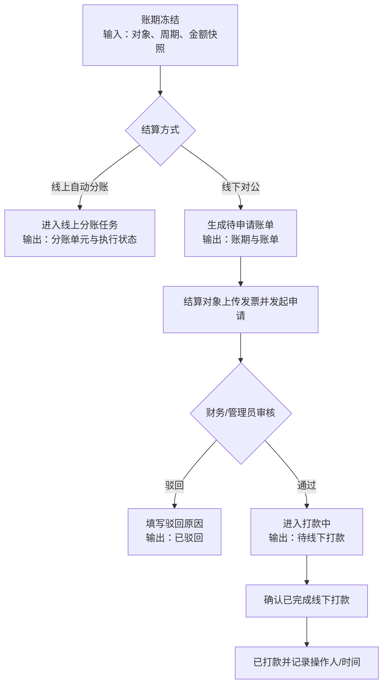
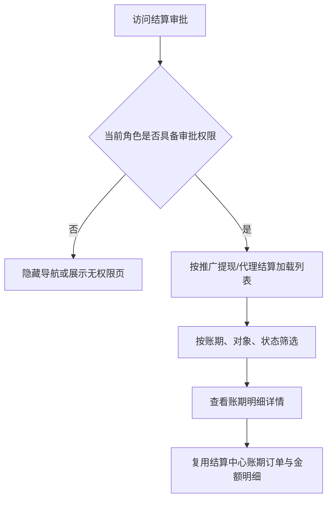

# 需求分析模板

## 一、需求背景分析

当前结算中心已经支持景区商家、渠道、推广方三类结算对象，并区分线上自动分账、线下对公结算和推广方固定月结。但现有结算审批主要围绕单一线下账单设计，无法覆盖不同角色发起结算时的金额口径、审批状态、发票要求、打款动作和权限边界。

受影响角色包括：

- 景区商家：可能产生线下对公账单，也可能参与线上自动分账。
- 渠道：可按周结/月结生成线上或线下结算账期。
- 推广方：固定线下对公、每月 20 日出账，仅在推广方结算页签查看。
- 自营管理员/财务：查看全部账期并执行审批、打款和异常处理。

不改造会导致审批列表无法区分结算对象，线上账期被错误纳入人工审批，推广方和渠道的结算金额口径不一致，且存在无权限查看或重复打款风险。

---

## 二、需求目标确认

1. 建立统一的结算审批入口，按“推广提现”和“代理结算”组织线下审批数据。
2. 让景区商家、渠道、推广方发起的结算均能追溯到具体账期、结算对象、结算方式和金额明细。
3. 明确线上自动分账与线下对公结算的处理边界：线上自动分账不进入人工打款审批，线下账单进入发票审核和打款流程。
4. 仅自营管理员和财务具备审批、驳回、打款和查看全部对象的权限；其他角色不可查看审批页。
5. 审批动作具备二次确认、状态流转和操作记录，避免重复审批、重复打款和金额争议。

---

## 三、业务流程分析

### 3.1 线下结算审批流程

### 3.2 权限与明细查看流程

---

## 四、功能拆解清单

| 终端 | 模块 | 功能 | 功能描述 | 优先级 |
|------|------|------|----------|----------|
| 门店后端 | 导航 | 结算审批入口 | 在结算中心下新增结算审批导航；仅自营管理员/财务显示入口 | Must |
| 门店后端 | 结算审批 | 权限校验 | 页面访问、接口查询和操作接口均校验审批权限，其他角色不得返回审批数据 | Must |
| 门店后端 | 结算审批 | 推广提现页签 | 展示推广方固定月结的线下账期，支持月份、账单状态筛选 | Must |
| 门店后端 | 结算审批 | 代理结算页签 | 展示景区商家、渠道的线下对公账期，区分周结/月结和结算对象 | Must |
| 门店后端 | 结算审批 | 列表字段 | 展示账期、账号、收入总额、分成比例、应结算金额、账单状态、收款账户、备注、发票和操作 | Must |
| 门店后端 | 结算审批 | 对象与金额口径 | 景区商家展示基础分成与溢价；渠道、推广方仅展示分成金额，不展示溢价 | Must |
| 门店后端 | 结算审批 | 发票审核 | 审核前校验发票文件、发票金额与应结算金额；支持查看/下载发票 | Must |
| 门店后端 | 结算审批 | 审核通过 | 弹出“审核通过？”二次确认，确认后状态进入打款中 | Must |
| 门店后端 | 结算审批 | 审核驳回 | 弹出驳回原因输入框，二次确认后状态变为已驳回并记录原因 | Must |
| 门店后端 | 结算审批 | 线下打款 | 对打款中账单弹出“已完成线下打款？”二次确认，确认后变为已打款 | Must |
| 门店后端 | 结算审批 | 明细跳转 | 查看明细复用当前账期详情，展示订单、周期边界、金额拆分和结算规则 | Must |
| 门店后端 | 结算审批 | 状态筛选 | 支持待申请、审核中、打款中、已打款、已驳回等线下账单状态 | Should |
| 供应链中台后端 | 结算服务 | 账期来源 | 从结算中心读取冻结后的周期快照、对象、结算方式、金额和发票状态 | Must |
| 供应链中台后端 | 结算服务 | 状态幂等 | 审核通过、驳回、打款操作校验当前状态，防止重复提交和重复打款 | Must |
| 供应链中台后端 | 审计 | 操作记录 | 记录操作人、角色、时间、原状态、新状态、金额和驳回原因 | Should |
| 供应链中台后端 | 线上分账 | 审批边界 | 线上自动分账账期不进入线下人工审批，沿用分账任务和失败重试流程 | Must |

---

## 五、待确认事项

| 序号 | 待确认事项 | 状态 | 负责人 | 截止日期 |
|------|------------|------|--------|----------|
| 1 | “推广提现”与“代理结算”页签的对象映射是否固定为推广方/景区商家+渠道 | 待确认 | 产品、财务 | - |
| 2 | 景区商家、渠道的线下账单是否允许由合作方主动申请，还是统一由自营后台代申请 | 待确认 | 业务、财务 | - |
| 3 | 发票金额允许的分币误差范围及多张发票合计规则 | 待确认 | 财务 | - |
| 4 | 审核驳回后是否允许重新上传发票并重新申请，是否保留原驳回记录 | 待确认 | 产品、财务 | - |
| 5 | 线下打款完成后是否需要上传银行回单或填写流水号 | 待确认 | 财务 | - |
| 6 | 线上自动分账部分失败或处理中账期是否需要在审批页提供只读汇总入口 | 待确认 | 产品、技术 | - |
| 7 | 审批权限是否仅由角色决定，还是还需叠加租户、景区或金额范围权限 | 待确认 | 产品、权限负责人 | - |
| 8 | 审批列表默认排序、分页数量和账期跨月筛选口径 | 待确认 | 产品、财务 | - |

