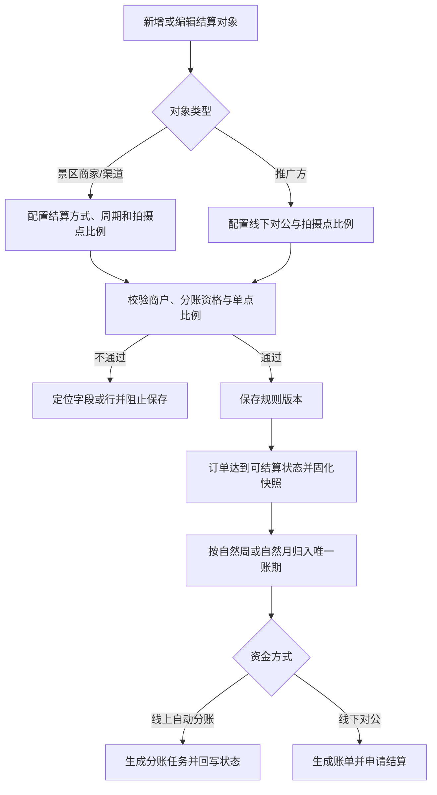
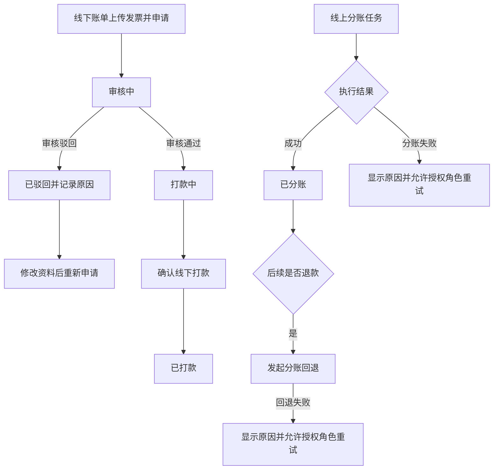

# 结算能力改造需求分析

> 文档状态：已确认进入 PRD  
> 需求基线：2026-09-16  
> 覆盖页面：订单详情、结算审批、结算中心、结算账期详情、成员新增/编辑、推广方新增/编辑

## 一、需求背景分析

当前系统已支持景区商家、渠道、推广方三类合作对象，以及线上自动分账、线下对公结算两类资金处理方式，但原有页面围绕单一月结和单一审批对象设计，无法完整承接本期新增的周结、推广方固定月结、分账异常重试及三类对象审批需求。

主要问题如下：

1. 分账失败、回退失败只展示结果，缺少失败原因、重试入口和权限控制，异常订单无法形成闭环。
2. 线下结算审批未按景区商家、渠道、推广方拆分，字段、筛选、状态和详情返回路径不统一。
3. 结算中心同时承载多角色、多周期、多结算方式，原账期字段与筛选方式信息密度过高，周结账期难以识别。
4. 景区商家、渠道与推广方的结算配置能力不同，缺少明确的周期、收款商户、分账资格和比例容量约束。
5. 景区商家享有溢价，渠道和推广方不享有溢价，原列表与详情未完全区分金额展示口径。

受影响角色包括自营管理员、财务、景区商家、渠道、推广方。若不改造，将出现异常资金任务不可追踪、审批对象混淆、比例超配、历史账期受新配置影响及越权操作风险。

---

## 二、需求目标确认

1. 建立“配置规则—订单快照—账期归集—线上分账/线下申请—审批打款—异常重试”的完整闭环。
2. 按页面统一结算对象、周期、金额、状态和权限口径，使用户可快速识别账期与待办动作。
3. 对分账失败和回退失败展示明确原因，并仅允许有权限的自营角色幂等重试。
4. 线下审批按三类对象分页签承接，线上自动分账不进入人工审批。
5. 通过规则版本与账期快照保证配置修改不重算历史账期。

---

## 三、业务流程分析

### 3.1 配置到结算

### 3.2 线下审批与线上异常

---

## 四、功能拆解清单

| 终端 | 模块 | 功能 | 功能描述 | 优先级 |
|------|------|------|----------|--------|
| 自营后台 | 订单详情 | 分账异常展示 | 展示分账失败/回退失败状态、失败原因及异常兜底文案 | Must |
| 自营后台 | 订单详情 | 分账异常重试 | 授权角色二次确认后重试分账或回退 | Must |
| 自营后台 | 结算审批 | 三类结算页签 | 按景区商家、渠道、推广方展示线下结算申请 | Must |
| 自营后台 | 结算审批 | 审核与打款 | 审核通过、审核驳回、线下打款及状态流转 | Must |
| 自营后台 | 结算审批 | 审批详情 | 进入审批二级详情并返回原页签 | Must |
| 多角色后台 | 结算中心 | 三类结算视图 | 展示线下对公、线上自动分账、推广方结算 | Must |
| 多角色后台 | 结算中心 | 周/月账期筛选 | 先选周期类型，再选择自然周或月份 | Must |
| 多角色后台 | 结算中心 | 对象与金额展示 | 按角色拆列对象；仅景区商家展示溢价 | Must |
| 多角色后台 | 结算详情 | 账期摘要与明细 | 分层展示周期、账期、统计范围、指标和订单 | Must |
| 多角色后台 | 结算详情 | 明细异常处理 | 展示失败原因并按权限提供重试 | Must |
| 自营后台 | 成员新增/编辑 | 景区商家结算配置 | 配置收款主体、商户号、分账方式、周期及比例 | Must |
| 自营后台 | 成员新增/编辑 | 渠道结算配置 | 配置分账方式、周期、接收方、银行账户及比例 | Must |
| 自营后台 | 推广方新增/编辑 | 推广方分成配置 | 仅线下对公、固定月结、配置银行账户与拍摄点比例 | Must |
| 结算服务 | 规则与账期 | 版本快照 | 固化规则版本、周期边界与金额，历史账期不重算 | Must |
| 结算服务 | 安全审计 | 权限与幂等 | 服务端鉴权、状态前置校验、防重复审批和重试 | Must |

---

## 五、待确认事项

以下事项不影响本期 Demo 页面 PRD 落稿，但真实系统开发前需确认：

| 序号 | 待确认事项 | 状态 | 负责人 | 截止日期 |
|------|------------|------|--------|----------|
| 1 | 周结账单的精确生成时刻与节假日策略 | 待确认 | 产品、财务 | 开发前 |
| 2 | 发票金额验真方式及允许误差范围 | 待确认 | 财务、税务 | 联调前 |
| 3 | 线下打款是否强制填写流水号或上传回单 | 待确认 | 财务 | 开发前 |
| 4 | 汇付商户查询、分账、回退接口字段及超时重试策略 | 待确认 | 技术、支付方 | 联调前 |
| 5 | 审批权限是否叠加景区、租户和金额范围 | 待确认 | 权限负责人 | 开发前 |
| 6 | 历史存量对象初始化周期和规则版本的迁移批次 | 待确认 | 产品、技术 | 上线前 |

