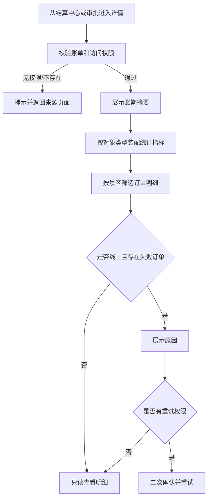

# 结算账期详情页面 PRD

> 文档状态：已确认  
> 对应页面：结算中心账期详情、结算审批账期详情  
> 需求基线：[结算能力改造需求分析](./结算能力改造-需求分析-20260916.md)

## 一、需求背景

原详情摘要将“月结 · 2026-05 · 2026-05-01 00:00 至 2026-06-01 00:00”等信息挤在同一行，周期、账期和统计边界主次不清；灰色辅助文字位于蓝色背景时也存在对比度不足。渠道与推广方详情继续展示基础分成、溢价或重复的分成统计，会增加无效信息。

本需求重新组织摘要区、统计指标、订单明细和返回路径，并统一订单级分账异常处理。

## 二、需求目标

- 明确“周期类型—账期名称—账单状态—统计范围”的视觉层次。
- 保证蓝色摘要区文本对比度和可读性。
- 按对象类型展示必要金额，移除渠道/推广方无关的溢价与基础分成辅助信息。
- 区分从结算中心与结算审批进入时的页面标题、返回路径和页签记忆。
- 在线上账期明细中闭环处理分账/回退失败。

## 三、需求核心业务流程图

## 四、需求功能清单

| 终端 | 模块 | 功能 | 描述 |
|------|------|------|------|
| 多角色后台 | 账期详情 | 来源与返回 | 根据来源设置标题、返回路径和页签恢复 |
| 多角色后台 | 账期详情 | 摘要区 | 分层展示周期、账期、状态、统计范围 |
| 多角色后台 | 账期详情 | 统计指标 | 按对象与结算方式展示不同金额 |
| 多角色后台 | 账期详情 | 范围筛选 | 按景区筛选当前账期订单 |
| 多角色后台 | 账期详情 | 订单明细 | 展示订单、规则、金额和资金状态 |
| 自营后台 | 账期详情 | 失败重试 | 授权角色重试分账或回退 |

## 五、需求功能详述

### 5.1 多角色后台——账期详情——来源、标题与返回

**原型描述**：
顶部面包屑只展示返回、详情标题和结算对象，不重复展示月结及账期名称。

**用户故事**：
> 作为用户，我想返回进入详情前的业务页面和页签，以便继续处理同类账单。

**前置条件**：

- 用户从结算中心或结算审批进入详情。

**核心逻辑**：

- 结算中心详情路由：`/settlement/bill/:view/:billId`，返回结算中心。
- 审批详情路由：`/settlement/approval/bill/:view/:billId`，标题为“结算审批详情”，返回结算审批。
- 面包屑不重复展示“月结 · 2026-05”等摘要信息。
- 返回后由来源页恢复进入前的页签。

**边界条件与异常处理**：

- 账单不存在或无权访问时提示原因，并只提供返回来源页面。
- 不允许通过修改 URL 跨对象访问账单。

**技术难点分析**：

- 来源识别与详情路由权限的一致性。

**验收标准 (Acceptance Criteria)**：

- 🎯 两个来源返回正确页面。
- ✔️ 审批详情不切换到结算中心导航。
- ✔️ 面包屑不重复账期信息。
- ❌ 越权账单不展示内容。

**测试用例**：

- 中心详情返回中心
- 审批详情返回审批
- 返回恢复页签
- 无账单提示
- 越权访问拦截

### 5.2 多角色后台——账期详情——摘要区与统计范围

**原型描述**：
蓝色摘要卡顶部左侧为小型“周结/ 月结”标签和大号账期名称，右侧为状态标签；下方使用半透明胶囊在一行展示“统计范围 起始时间 — 结束时间”；再下方展示范围筛选和统计指标。

**用户故事**：
> 作为账单核对人员，我想先识别这是哪个账期、覆盖哪段时间、处于什么状态，再阅读金额。

**前置条件**：

- 账单已生成周期快照。

**核心逻辑**：

- 月结主标题显示“YYYY年MM月”；周结主标题显示“YYYY-MM-DD～YYYY-MM-DD”。
- 周期类型使用次级 Tag，不与主标题拼成一段文案。
- 账单状态独立位于右侧。
- 统计范围单行展示完整边界，例如“2026-05-11 00:00 — 2026-05-18 00:00”。
- 统计边界为左闭右开区间；列表只显示自然日期，详情保留完整时间。
- 摘要区文字使用白色或高对比浅色，不使用低对比灰色。

**边界条件与异常处理**：

- 小屏宽度不足时统计范围整体换行，标签与日期不可拆成无关联片段。
- 周期边界缺失时展示“-”并记录数据异常。

**技术难点分析**：

- 在信息密度和多分辨率下保持主次层级。

**验收标准 (Acceptance Criteria)**：

- 🎯 用户能分别识别周期、账期、状态和统计范围。
- ✔️ 统计范围与账期快照完全一致。
- ✔️ 蓝色背景文字对比度达到 WCAG AA。
- ❌ 不出现重复账期标题。

**测试用例**：

- 月结摘要分层
- 周结摘要分层
- 完整统计范围
- 窄屏整体换行
- 边界缺失兜底

### 5.3 多角色后台——账期详情——指标与金额口径

**原型描述**：
摘要卡底部横向展示订单笔数、订单金额、退款金额及对象相关金额，主金额使用强调色。

**用户故事**：
> 作为财务或合作方，我想看到与自己相关的账期指标，以便核对最终金额。

**前置条件**：

- 系统已按账期订单计算统计结果。

**核心逻辑**：

- 通用指标：订单笔数、订单金额合计、退款金额合计。
- 景区商家：展示基础分成金额、溢价、应结算金额。
- 渠道：不单列“分成金额”或溢价，只展示最终应结算金额。
- 推广方：不展示基础分成或溢价，最终金额命名为“应分成金额”。
- 线上自动分账额外展示“已分账净额”。
- 范围筛选支持“全部景区”及账期内景区；指标与订单列表同步重算。

**边界条件与异常处理**：

- 空范围显示 0 笔和金额 0.00，不沿用全量指标。
- 金额以分计算，页面以元展示两位小数。
- 渠道/推广方若返回溢价非 0，记录异常且不作为有效应结算金额展示。

**技术难点分析**：

- 筛选后指标与列表的同源计算及舍入一致性。

**验收标准 (Acceptance Criteria)**：

- 🎯 指标随景区筛选同步变化。
- ✔️ 仅景区商家展示溢价。
- ✔️ 推广方使用“应分成金额”。
- ✔️ 线上账期显示已分账净额。

**测试用例**：

- 商家指标含溢价
- 渠道隐藏分成项
- 推广方应分成金额
- 线上显示分账净额
- 筛选同步重算

### 5.4 多角色后台——账期详情——订单明细与异常处理

**原型描述**：
明细表展示订单号、订单信息、拍摄点、订单状态、时间、订单金额、结算规则、最终金额；线上账期增加已分账净额和分账状态。

**用户故事**：
> 作为财务或合作方，我想逐单核对计算规则和资金状态，以便解释账期差异。

**前置条件**：

- 订单已按快照归入当前账期。

**核心逻辑**：

- 结算规则读取订单固化快照，不读取当前最新配置。
- 景区商家规则下显示“基础 + 溢价”辅助拆分。
- 渠道和推广方规则下不显示基础分成辅助信息。
- 分账失败、回退失败展示失败原因；无原因显示“未返回失败原因”。
- 自营管理员/财务可重试；渠道、景区商家、推广方只读。
- 重试确认与状态规则复用《订单详情——分账异常处理 PRD》。

**边界条件与异常处理**：

- 订单快照缺失时标记异常，不使用当前规则补算。
- 订单号跳转需校验订单查看权限。
- 分页、筛选不改变账期总快照。

**技术难点分析**：

- 历史规则快照和实时资金状态的组合展示。

**验收标准 (Acceptance Criteria)**：

- 🎯 每笔订单可追溯到结算规则与资金状态。
- ✔️ 对象金额辅助信息按规则展示。
- ✔️ 合作方看得到原因但看不到重试。
- ❌ 快照缺失时不静默补算。

**测试用例**：

- 读取历史规则快照
- 商家显示金额拆分
- 渠道隐藏辅助行
- 展示失败原因
- 合作方隐藏重试
- 快照缺失标异常

## 六、非功能性需求

### 6.1 性能

- 详情摘要 P95 加载不超过 2 秒。
- 明细分页 P95 不超过 2 秒，默认每页 10 条。

### 6.2 可用性

- 摘要与明细请求必须基于同一账期版本，避免金额暂时不一致。
- 页面刷新后仍可由 URL 恢复同一账单。

### 6.3 安全

- 详情、订单明细及失败原因均按角色和对象归属鉴权。
- 敏感账户、流水和手机号按权限脱敏。

### 6.4 监控

- 监控摘要金额与明细汇总不一致、快照缺失、越权访问和重试失败。
- 数据不一致事件需包含账单号、规则版本和订单范围。

