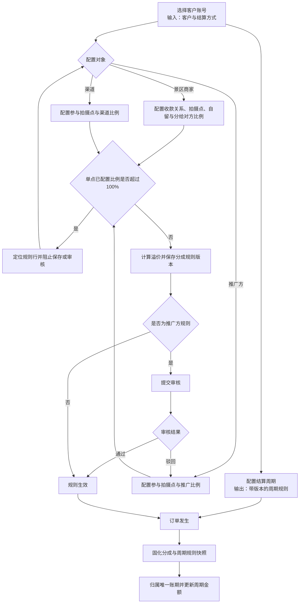
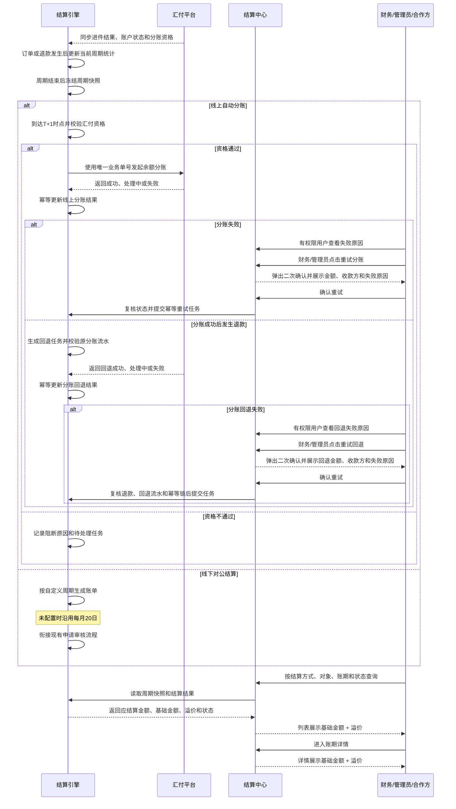

# 自定义周期结算与溢价配置 PRD

> 本文合并《汇付周结算与余额分账 PRD》与《溢价配置与结算中心 PRD》，以“配置规则 → 固化订单快照 → 归属自定义账期 → 执行线上分账或生成线下账单 → 展示基础金额与溢价”为统一闭环。
>
> 本期改造集中在成员配置、推广方配置、结算中心和账期展示。景区范围筛选、订单明细、线下账单申请审核与实际打款沿用现有能力，不作为本期新增功能。

## 一、需求背景

平台同时存在景区商家收款、渠道参与、推广方参与、线上自动分账和线下对公结算。现有能力分别描述分成比例、溢价、汇付分账与账期，存在以下问题：

1. 景区商家、渠道和推广方的拍摄点比例缺少统一容量校验，存在重复占用同一拍摄点分成比例的风险。
2. 线上自动分账和线下对公结算缺少客户级自定义周期，订单归属、任务触发和账单生成无法按合作约定执行。
3. 周期配置、分成配置与订单金额未形成统一版本快照，配置变化存在影响历史账期的风险。
4. 结算中心仅展示应结算金额时，财务无法区分基础金额与由收款商户吸收的溢价。
5. 线上分账资格、任务执行结果与线下账单状态属于不同业务口径，需要在统一账期框架下分别管理。

本期将两份 PRD 的重叠能力合并：分成规则与周期规则统一在客户配置侧维护；订单同时固化金额规则和周期规则；结算中心统一承接当前周期统计、历史账期和结算结果展示。

---

## 二、需求目标

### 2.1 业务目标

- 支持客户按合作约定执行线上或线下周期结算，不再受单一月结周期限制。
- 保证拍摄点分成比例不超配、溢价归属明确，避免参与方金额重复计算。
- 保证订单、账期和结算结果可追溯，财务能够核对基础金额、溢价与应结算金额。

### 2.2 产品目标

- 建立统一配置入口，承载参与方比例、客户结算周期和汇付资格，并在保存或审核前完成规则校验。
- 建立统一结算快照，以生效规则完成订单归期、周期金额归集，以及线上分账或线下出账。
- 建立统一账期视图，区分线上分账结果与线下账单状态，并展示基础金额和溢价。

### 2.3 本期范围

| 范围类型 | 边界 |
|----------|------|
| 本期改造 | 成员配置、推广方配置、结算引擎、结算中心和账期详情中，与参与方比例、自定义周期、汇付分账及金额拆分直接相关的字段、规则和状态 |
| 复用不改 | 账期详情的景区筛选与订单明细；线下账单申请、审核与实际打款；订单管理页面 |
| 本期不做 | 汇付进件审核与主体关系维护；备用金账户及银行卡到账跟踪；真实银行代付；复杂对账；差额补发；权限审计后台；历史数据批量重算 |

### 2.4 上线前确认项

以下内容在两份来源文档中尚无最终口径，确认前不得进入生产发布：

| 序号 | 待确认项 | 责任方 |
|------|----------|--------|
| 1 | 按日截止时间、按周结算日、按月结算日、固定天数范围与起算锚点 | 业务、财务、产品 |
| 2 | 周期边界、时区、首个不完整周期、跨月跨年及节假日规则 | 业务、财务、技术 |
| 3 | T+1 起算事件、自然日或工作日、具体执行时间 | 业务、技术、汇付对接人 |
| 4 | 退款、撤销、冲正、冻结、手续费及历史调整的净额口径和周期归属 | 业务、财务、技术 |
| 5 | 汇付同步主键、资格判断条件、接口字段、金额限制和结果更新方式 | 技术、汇付对接人 |
| 6 | 请求超时、失败任务的自动重试次数与间隔 | 技术、财务 |

---

## 三、需求核心业务流程图

### 3.1 配置、快照与周期归属

### 3.2 自定义周期结算与账期展示

---

## 四、需求功能清单

| 终端 | 模块 | 功能 | 描述 |
|------|------|------|------|
| 后台 | 成员配置 | 景区商家配置 | 配置收款关系、拍摄点规则及自留与分给对方比例，自动计算溢价 |
| 后台 | 成员配置 | 渠道配置 | 配置渠道参与的拍摄点规则及对应分成比例 |
| 后台 | 推广方配置 | 推广方配置 | 配置推广方参与的拍摄点规则及对应分成比例，审核通过后生效 |
| 后台 | 成员配置 | 自定义结算周期 | 按客户账号和结算方式配置周期，并保存周期规则版本 |
| 后台 | 成员配置 | 汇付资格同步与展示 | 同步并展示汇付进件结果、账户状态和分账资格 |
| 后台 | 结算引擎 | 订单快照与周期归集 | 固化分成和周期规则，将订单归入唯一账期并实时汇总金额 |
| 后台 | 结算中心 | 线上周期分账 | 周期结束后校验资格、发起汇付分账并记录结果；失败时展示原因并支持授权重试 |
| 后台 | 结算中心 | 线下周期出账 | 按自定义周期生成线下账单，未配置时沿用每月 20 日规则 |
| 后台 | 结算中心 | 账期列表金额拆分 | 展示当前及历史账期，并显示应结算金额及基础金额 + 溢价 |
| 后台 | 账期详情 | 账期详情金额拆分 | 在既有账期详情中显示基础金额 + 溢价 |

---

## 五、需求功能详述

#### 5.1 后台——成员配置——景区商家配置

**原型描述**：
成员配置抽屉展示景区商家收款信息和拍摄点规则。每个拍摄点展示自留比例、分给对方比例、溢价比例和超限提示；溢价为只读值。

**用户故事**：
> 作为平台运营，我想配置景区商家的收款关系和拍摄点比例，以便系统计算基础金额与溢价。

**前置条件**：
- 用户具备景区商家配置权限。
- 景区商家账号已存在，系统可读取创建拍摄点时建立的景区商家账号关联关系。

**核心逻辑**：
- 根据创建拍摄点时关联的景区商家账号，系统自动匹配并展示该景区商家名下的全部拍摄点，不支持通过配置页面手工选择或新增拍摄点。
- 默认配置时，每个拍摄点的收款方自留比例为 100%，分给对方比例为 0%。
- 每个拍摄点逐行展示收款方自留比例、分给对方比例、溢价比例和超限提示；自留比例、分给对方比例可配置，溢价比例为系统计算的只读值。
- 按拍摄点校验自留、分给对方、渠道和推广方比例合计不超过 100%；超过 100% 时，在对应拍摄点展示超限提示并阻止保存。
- 剩余比例计为溢价并归收款商户，保存时生成规则版本；溢价比例不作为可编辑配置项。

**边界条件与异常处理**：
- 景区商家账号未匹配到拍摄点时，展示无拍摄点提示且不生成规则。
- 拍摄点关联关系缺失或数据异常时，标记对应拍摄点匹配异常并阻止保存，不使用未确认的拍摄点生成规则。
- 同一拍摄点重复返回时合并为一条并提示数据异常；不得重复计入比例容量。
- 自留比例或分给对方比例为空、非数字、超出 0%～100% 或单点合计超限时，阻止保存并定位对应拍摄点；超限提示不得仅通过页面总提示呈现。
- 溢价比例为只读字段，前端或请求参数尝试修改时拒绝保存，并按当前有效比例重新计算溢价。

**技术难点分析**：
- 多参与方规则的实时容量计算与版本隔离。

**验收标准 (Acceptance Criteria)**：
- 🎯 **成功场景**：有效规则保存后生成新版本及正确溢价。
- ✔️ **校验场景**：单点合计超过 100% 时保存请求为 0 次。
- ❌ **异常场景**：商户号无映射时不生成错误规则。

**测试用例**：
- 成功：保存商家规则
- 校验：拦截比例超限
- 异常：商户无拍摄点

---

#### 5.2 后台——成员配置——渠道配置

**原型描述**：
成员配置抽屉的渠道区域支持新增拍摄点规则，每行展示拍摄点、渠道比例、剩余可分比例及校验结果。

**用户故事**：
> 作为平台运营，我想配置渠道参与的拍摄点和比例，以便订单按渠道合作规则分配基础金额。

**前置条件**：
- 用户具备渠道配置权限。
- 渠道和可选拍摄点已存在。

**核心逻辑**：
- 配置渠道参与的拍摄点和分成比例，并计入单点比例合计。
- 校验通过后保存规则版本；渠道只取得基础金额。

**边界条件与异常处理**：
- 同一渠道不得重复配置同一拍摄点。
- 拍摄点为空、比例越界或合计超限时阻止保存。

**技术难点分析**：
- 编辑时排除当前旧版本，并准确定位批量规则中的失败行。

**验收标准 (Acceptance Criteria)**：
- 🎯 **成功场景**：有效渠道规则保存并参与新订单计算。
- ✔️ **校验场景**：重复拍摄点或超限规则无法保存。
- ❌ **异常场景**：保存失败时原有效版本保持不变。

**测试用例**：
- 成功：保存渠道规则
- 校验：拦截重复拍摄点
- 异常：保留原规则

---

#### 5.3 后台——推广方配置——推广方配置

**原型描述**：
推广方新增或编辑抽屉展示基础信息、拍摄点规则和比例。提交前实时显示剩余可分比例；审核页只读展示规则和容量复核结果。

**用户故事**：
> 作为平台运营，我想配置并审核推广方的拍摄点比例，以便审核通过后的订单参与推广分成。

**前置条件**：
- 用户具备推广方编辑或审核权限。
- 推广方基础资料和可选拍摄点可用。

**核心逻辑**：
- 在推广方基础信息中配置拍摄点和推广比例。
- 提交及审核通过前均按最新生效规则校验单点比例合计。
- 审核通过后规则生效并占用容量；推广方只取得基础金额。

**边界条件与异常处理**：
- 拍摄点重复、为空或比例越界时阻止提交。
- 审核时容量不足则禁止通过；驳回必须填写原因。

**技术难点分析**：
- 草稿、审核中和生效规则的容量隔离与并发复核。

**验收标准 (Acceptance Criteria)**：
- 🎯 **成功场景**：审核通过后规则生效并参与新订单计算。
- ✔️ **校验场景**：审核前发现超限时无法通过。
- ❌ **异常场景**：驳回规则不占用拍摄点容量。

**测试用例**：
- 成功：审核推广规则
- 校验：复核单点容量
- 异常：驳回释放容量

---

#### 5.4 后台——成员配置——自定义结算周期

**原型描述**：
成员配置抽屉的结算设置区展示结算方式、周期类型、周期参数、生效时间和规则版本；周期类型切换后显示对应参数控件。

**用户故事**：
> 作为平台运营，我想按客户配置结算周期，以便按合作约定生成线上分账或线下账单。

**前置条件**：
- 用户具备周期配置权限。
- 客户账号和结算方式已存在。

**核心逻辑**：
- 以客户账号和结算方式为配置维度，支持按日、按周、按月和固定天数。
- 保存周期参数、生效时间和规则版本；线上、线下规则分别维护。
- 线下未配置时使用每月 20 日默认规则。
- 周期变更只影响生效后的新订单，不重算历史账期。

**边界条件与异常处理**：
- 参数缺失、越界或生效时间重叠时禁止保存。
- 保存失败时保留原有效版本。

**技术难点分析**：
- 四类周期边界的统一计算与版本管理。

**验收标准 (Acceptance Criteria)**：
- 🎯 **成功场景**：有效配置生成唯一周期版本。
- ✔️ **校验场景**：参数无效或规则重叠时禁止保存。
- ❌ **异常场景**：保存失败时原版本保持有效。

**测试用例**：
- 成功：保存四类周期
- 校验：拦截重叠周期
- 异常：保留原周期

---

#### 5.5 后台——成员配置——汇付资格同步与展示

**原型描述**：
成员配置抽屉只读展示汇付账户标识、进件结果、账户状态、分账资格和最后同步时间。

**用户故事**：
> 作为平台运营，我想查看客户的汇付资格，以便判断线上账期是否具备分账条件。

**前置条件**：
- 客户账号已存在。
- 系统能够接收汇付接口或回调数据。

**核心逻辑**：
- 按匹配主键幂等更新账户标识、进件结果、账户状态、分账资格和同步时间。
- 同步结果供线上周期分账校验使用，不在本系统处理汇付进件审核。

**边界条件与异常处理**：
- 无法匹配客户时记录异常，不建立可分账关系。
- 字段缺失或资格过期时判定为不可分账。
- 重复或乱序通知不得回退最终状态。

**技术难点分析**：
- 外部资格状态映射与乱序通知幂等处理。

**验收标准 (Acceptance Criteria)**：
- 🎯 **成功场景**：有效结果更新客户资格及同步时间。
- ✔️ **校验场景**：匹配主键缺失时拒绝更新。
- ❌ **异常场景**：重复通知不产生重复记录。

**测试用例**：
- 成功：同步汇付资格
- 校验：拒绝缺失主键
- 异常：乱序状态不回退

---

#### 5.6 后台——结算引擎——订单快照与周期归集

**原型描述**：
无独立页面；输出周期起止时间、订单数、基础金额、溢价、应结算金额、退款金额和可分账净额供结算中心展示。

**用户故事**：
> 作为结算服务，我想固化订单金额规则并归入唯一账期，以便周期汇总和结算不受后续配置变化影响。

**前置条件**：
- 订单包含客户账号、拍摄点、金额和发生时间。
- 生效的分成规则和周期规则可读取。

**核心逻辑**：
- 订单生成时保存参与方、比例、基础金额、溢价、应结算金额、结算方式、分成规则版本和周期规则版本。
- 按订单发生时的周期版本归入唯一账期，并幂等汇总订单与退款。
- 周期结束后冻结快照；应结算金额等于基础金额加溢价。

**边界条件与异常处理**：
- 无有效分成或周期规则时进入待处理队列，不生成错误金额或结算任务。
- 同时匹配多个周期时记录配置冲突，不自动选择。
- 退款及跨周期调整按 2.4 的最终确认口径处理。

**技术难点分析**：
- 金额规则与周期规则双版本快照的一致性。
- 跨时区周期边界和业务事件幂等聚合。

**验收标准 (Acceptance Criteria)**：
- 🎯 **成功场景**：有效订单生成完整快照并归入唯一账期。
- ✔️ **校验场景**：聚合后金额恒等式成立率为 100%。
- ❌ **异常场景**：规则冲突订单不进入结算任务。

**测试用例**：
- 成功：归属唯一账期
- 校验：核对金额恒等式
- 异常：隔离规则冲突

---

#### 5.7 后台——结算中心——线上周期分账

**原型描述**：
线上自动分账账期行展示客户账号、周期边界、可分账净额、资格校验结果、业务单号、分账状态和更新时间；异常原因与对应重试入口在“分账状态”字段内副显示，不单独占用字段。

**用户故事**：
> 作为平台财务，我想查看线上账期的资格校验和汇付分账结果，以便定位未完成的周期任务。

**前置条件**：
- 线上账期已结束并冻结周期快照。
- 已取得最新汇付进件结果、账户状态和分账资格。

**核心逻辑**：
- 周期结束并到达 T+1 时点后校验汇付资格；不通过时阻断调用并记录原因。
- 资格通过时生成唯一业务单号，按可分账净额发起汇付分账。
- 以业务单号幂等记录成功、处理中或失败结果；不跟踪银行卡到账。
- 分账与回退使用独立状态链路：分账状态为“待分账→分账中→已分账/分账失败”；已分账订单发生退款后，回退状态为“待回退→回退中→已回退/回退失败”。“分账失败”不改变订单履约状态，订单完成且支付成功时仍可为“已完成”；“回退失败”不改变已成功退款的订单状态，退款成功时仍为“已退款”。
- 分账失败和分账回退失败均展示汇付返回的具体失败原因；对应展示“重试分账”或“重试回退”入口。仅财务角色和租户管理员可操作重试，景区商家、渠道和推广方可查看本人范围内的账期、明细、失败原因，但不展示重试入口。
- 点击“重试分账”或“重试回退”后必须二次确认，确认内容包括订单号、金额、收款方和失败原因；确认前不得创建重试任务。弹窗不展示额外的状态提醒文案。
- 确认重试时重新校验订单当前状态、分账流水和幂等锁；仅原状态为“分账失败”或“回退失败”且未处于处理中、已分账或已回退的订单允许提交对应重试。
- 重试分账沿用原业务单号或生成可关联的重试序号，保留原分账失败记录，并将分账状态更新为“待分账”；重试回退保留原回退失败记录，并将回退状态更新为“待回退”。两类重试结果均按原业务单号与重试序号幂等更新。
- 订单详情中的“分账状态”使用状态标签；当状态为“分账失败”或“回退失败”时，在标签下方副显示失败原因和对应的“重试分账”或“重试回退”入口，不单独展示失败原因、操作字段。

**权限与数据范围**：

| 角色 | 账期/明细范围 | 失败原因 | 重试操作 |
|------|---------------|----------|----------|
| 租户管理员 | 全部账期和明细 | 全部 | 允许，作为紧急兜底 |
| 财务 | 全部账期和明细 | 全部 | 允许 |
| 景区商家 | 本人关联景区、拍摄点和订单 | 本人范围内 | 不允许 |
| 渠道 | 本人参与分成的账期和订单 | 本人范围内 | 不允许 |
| 推广方 | 本人参与分成的账期和订单 | 本人范围内 | 不允许 |

**边界条件与异常处理**：
- 资格缺失或过期时不得调用汇付。
- 请求超时保留原业务单号；未匹配结果进入异常记录。
- 最终状态不得被迟到的处理中结果回退。
- 非财务和非租户管理员不展示重试入口；越权请求返回无权限错误且不创建任务。
- 分账重试仅适用于“分账失败”，回退重试仅适用于“回退失败”；订单已处于分账中、回退中、已分账或已回退时，禁止重复重试并提示当前状态。
- 二次确认取消时不改变状态；重复点击确认只创建 1 个重试任务。
- 重试提交失败时保留原“分账失败”或“回退失败”状态和失败原因，展示本次提交失败提示；重试提交成功后进入对应的“待分账”或“待回退”，清除当前展示的失败原因但保留历史失败记录。
- 退款未成功时仅更新订单退款状态为“退款中”或“退款失败”，不得创建回退重试任务；只有退款成功且原分账已成功时，才进入回退状态链路。

**技术难点分析**：
- 资格校验与外部调用之间的一致性。
- 请求超时、重复通知和乱序结果的幂等处理。

**验收标准 (Acceptance Criteria)**：
- 🎯 **成功场景**：资格通过后使用唯一单号发起分账并记录结果。
- ✔️ **校验场景**：资格不通过时汇付调用次数为 0。
- ❌ **异常场景**：超时或重复通知不产生重复分账；分账或回退失败订单重试前必须二次确认，订单履约/退款状态与结算状态不互相覆盖。

**测试用例**：
- 成功：发起周期分账
- 校验：无资格不调用
- 校验：分账失败、回退失败重试均需确认
- 校验：订单状态与结算状态独立
- 异常：分账结果幂等
- 异常：回退结果幂等
- 异常：合作方无重试权限

---

#### 5.8 后台——结算中心——线下周期出账

**原型描述**：
线下对公账期行展示客户账号、周期类型、周期边界、应结算金额、账单状态和生成时间；默认周期客户展示“每月 20 日”。

**用户故事**：
> 作为平台财务，我想按客户约定的周期生成线下账单，以便继续使用现有申请审核流程。

**前置条件**：
- 客户存在有效线下周期规则，或适用每月 20 日默认规则。
- 账期已完成订单归集并冻结金额快照。

**核心逻辑**：
- 已配置客户按生效周期生成唯一账单，未配置客户按每月 20 日生成。
- 账单生成后衔接现有申请、审核及打款流程。

**边界条件与异常处理**：
- 线上周期不得覆盖同一客户的线下周期。
- 同一客户、结算方式和周期不得重复生成账单。
- 生成失败时记录原因，不产生空账单。

**技术难点分析**：
- 线上和线下共用周期算法但隔离状态机。
- 默认月结规则与自定义周期版本兼容。

**验收标准 (Acceptance Criteria)**：
- 🎯 **成功场景**：周期结束后生成唯一线下账单。
- ✔️ **校验场景**：未配置客户使用每月 20 日规则。
- ❌ **异常场景**：重复触发不生成重复账单。

**测试用例**：
- 成功：生成周期账单
- 校验：使用默认月结
- 异常：阻止重复出账

---

#### 5.9 后台——结算中心——账期列表金额拆分

**原型描述**：
结算中心顶部提供结算方式、视角、对象、账期和状态筛选；账期表格金额主行展示应结算金额，副行固定展示“基础金额 ￥X + 溢价 ￥Y”。线上与线下使用各自状态标签。

**用户故事**：
> 作为平台财务或合作方，我想在结算中心查看有权限范围内的账期和基础金额、溢价，以便核对结算金额。

**前置条件**：
- 订单快照已归入账期并完成金额聚合。
- 用户具备对应结算对象的查看权限。

**核心逻辑**：
- 当前账期读取实时聚合，已结束账期读取冻结快照。
- 同一订单涉及多个结算对象时，按对象分别聚合账期金额。
- 线上展示汇付结果，线下展示账单状态。
- 租户管理员和财务可查看全部结算对象；景区商家、渠道和推广方仅返回本人关联的账期和明细，不展示其他对象的账号、金额或订单。

**边界条件与异常处理**：
- 无权限对象不进入列表；无匹配账期时展示空态。
- 线上结果缺失时展示待同步；溢价为 0 时展示 ￥0.00。
- 合作方访问其他对象账期或篡改对象参数时返回无权限结果，不返回账期数据。

**技术难点分析**：
- 多视角聚合，以及当前账期与历史快照的数据切换。

**验收标准 (Acceptance Criteria)**：
- 🎯 **成功场景**：筛选后返回正确账期及金额拆分。
- ✔️ **校验场景**：应结算金额与拆分金额一致率为 100%。
- ❌ **异常场景**：结果缺失时显示待同步状态。

**测试用例**：
- 成功：筛选账期列表
- 校验：核对金额拆分
- 异常：展示待同步

---

#### 5.10 后台——账期详情——账期详情金额拆分

**原型描述**：
在既有账期详情的统计区域和结算规则列中新增基础金额与溢价：统计区域展示两项汇总，结算规则展示“基础 ￥X + 溢价 ￥Y”。景区筛选和订单明细布局保持不变。

**用户故事**：
> 作为平台财务或合作方，我想在有权限的账期详情查看基础金额和溢价，以便核对列表与详情的金额口径。

**前置条件**：
- 账期存在并具备冻结的订单结算快照。
- 用户具备对应账期查看权限。

**核心逻辑**：
- 详情与列表读取同一账期数据源。
- 统计区和既有订单行分别展示基础金额、溢价及应结算金额。
- 应结算金额等于基础金额加溢价。
- 详情按当前用户权限过滤数据：景区商家、渠道和推广方仅可查看本人关联订单；财务和租户管理员可查看全部订单。
- 分账失败和分账回退失败订单均在“分账状态”标签下副显示具体失败原因；财务和租户管理员分别展示“重试分账”或“重试回退”入口，点击后先进行二次确认，景区商家、渠道和推广方仅查看本人账期及明细，不展示重试入口。

**边界条件与异常处理**：
- 溢价为 0 时仍展示 0.00。
- 无效账期 ID 使用既有空态和返回入口。
- 金额数据缺失时展示异常状态，不以 0 替代缺失值。
- 合作方无权访问的账期详情返回无权限空态；越权订单不出现在明细列表。
- 失败原因缺失时展示“未返回失败原因”；重试状态已变化时阻止提交并提示最新状态；分账回退失败沿用同一原因展示和幂等校验规则。

**技术难点分析**：
- 保证列表、汇总和订单行使用同一冻结快照。

**验收标准 (Acceptance Criteria)**：
- 🎯 **成功场景**：账期详情正确展示基础金额和溢价。
- ✔️ **校验场景**：列表与详情金额一致率为 100%。
- ❌ **异常场景**：金额缺失时展示异常状态。

**测试用例**：
- 成功：查看金额拆分
- 校验：核对列表详情
- 异常：提示金额缺失

---

## 六、非功能性需求

### 6.1 性能

- **页面首屏**：Chrome 120+、4 核 CPU、8GB 内存环境下首屏可交互时间 ≤ 2 秒。
- **页面交互**：成员配置校验与账期筛选更新耗时 ≤ 100ms；账期详情路由切换 ≤ 300ms。
- **计算容量**：单账期 10,000 条订单、100 个结算对象时，周期归属和金额聚合耗时 ≤ 1 秒。
- **查询性能**：账期列表和账期详情接口 P95 ≤ 500ms、P99 ≤ 1 秒。

### 6.2 可用性

- **幂等性**：重复业务事件重复累计次数为 0；同一账期重复分账和重复出账次数为 0。
- **历史保护**：配置变更导致的历史订单或已生成账期自动重算次数为 0。
- **降级策略**：汇付不可用时停止新分账调用，保留原业务单号和待处理任务；线下出账不受影响。
- **错误反馈**：字段错误定位到对应控件；跨字段错误仅显示 1 条顶部摘要并标记全部错误行。

### 6.3 安全

- **权限控制**：成员配置、推广方审核、周期配置和账期查看均执行 RBAC 校验，无权限操作执行次数为 0。
- **敏感字段**：手机号、商户号、账户标识和银行账号按既有规则脱敏，未授权明文返回次数为 0。
- **输入防护**：SQL 注入、XSS、CSRF 和越权测试通过率为 100%。
- **外部调用**：汇付请求必须使用唯一业务单号和签名校验，重复有效请求数为 0。

### 6.4 监控

- **配置指标**：规则保存、校验失败、单点超限、周期冲突和推广方审核结果均可查询。
- **结算指标**：周期归集失败、资格阻断、分账发起、成功、处理中、失败及线下出账结果均可查询。
- **链路追踪**：订单、规则版本、账期、业务单号和分账结果的关联追溯覆盖率为 100%。
- **告警阈值**：前端运行时错误率 > 1%、账期加载失败率 > 2%，或出现任意重复分账时立即告警。

---

## 七、上线计划

### 7.1 上线前置

- 完成 2.4 全部口径确认，并将结果回填本 PRD 后方可进入生产发布。
- `npm run check`、`npm run build` 通过；Must 测试用例通过率为 100%。
- 抽取不少于 30 个账期核对订单归属、基础金额、溢价和应结算金额，准确率为 100%。
- 使用汇付沙箱完成资格通过、资格阻断、处理中、失败、超时和重复通知场景，重复分账为 0 笔。
- 完成一次停止任务、恢复原周期规则和账期数据核对的回滚演练。

### 7.2 灰度策略

- 第一阶段仅开放内部财务和运营账号，验证成员配置、周期计算与金额展示。
- 第二阶段选择已完成汇付进件且资格可用的客户，验证线上周期分账；同步选择线下客户验证自定义周期出账。
- 每阶段至少观察 24 小时，错误周期归属、重复分账、重复出账和金额拆分错误均为 0 后进入下一阶段。
- 出现任意无资格分账、重复分账、错误周期归属或金额不一致时，立即暂停扩大灰度。

### 7.3 回滚方案

- **触发条件**：命中任一灰度暂停条件，或结算任务无法通过停止调度完成隔离。
- **回滚步骤**：停止新分账与出账任务；关闭新增周期配置；冻结自动重试；恢复原有效周期规则；保留订单和账期快照；导出受影响清单并人工核对。
- **回滚验证**：新任务新增数为 0，原周期规则恢复率为 100%，受影响订单与账期可追溯率为 100%。
- **回滚时效**：10 分钟内停止新任务，30 分钟内恢复原规则，60 分钟内完成核心链路验证。
