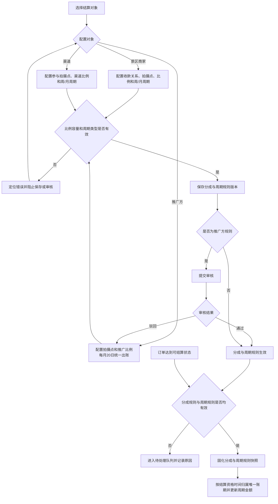
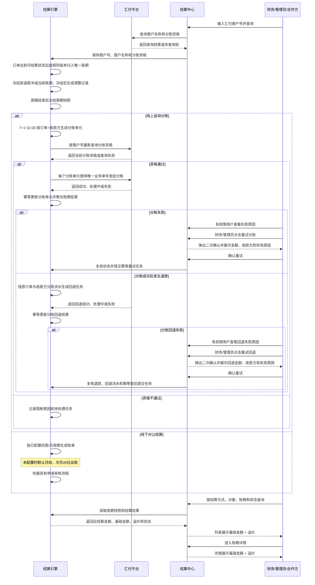

# 周/月周期结算与溢价配置 PRD

> 本文合并《汇付周结算与余额分账 PRD》与《溢价配置与结算中心 PRD》，以“配置规则 → 固化订单快照 → 归属周/月账期 → 执行线上分账或生成线下账单 → 展示基础金额与溢价”为统一闭环。
>
> 本期改造集中在成员配置、推广方配置、结算中心和账期展示。景区范围筛选、订单明细、线下账单申请审核与实际打款沿用现有能力，不作为本期新增功能。

## 一、需求背景

平台同时存在景区商家收款、渠道参与、推广方参与、线上自动分账和线下对公结算。现有能力分别描述分成比例、溢价、汇付分账与账期，存在以下问题：

1. 景区商家、渠道和推广方的拍摄点比例缺少统一容量校验，存在重复占用同一拍摄点分成比例的风险。
2. 景区商家和渠道缺少可配置的周结能力；推广方则使用统一月度出账规则，不提供周期配置。
3. 周期配置、分成配置与订单金额未形成统一版本快照，配置变化存在影响历史账期的风险。
4. 结算中心仅展示应结算金额时，财务无法区分基础金额与由收款商户吸收的溢价。
5. 线上分账资格、任务执行结果与线下账单状态属于不同业务口径，需要在统一账期框架下分别管理。

本期将两份 PRD 的重叠能力合并：分成规则与周期规则统一在客户配置侧维护；订单同时固化金额规则和周期规则；结算中心统一承接当前周期统计、历史账期和结算结果展示。

---

## 二、需求目标

### 2.1 业务目标

- 支持客户按合作约定执行线上或线下周期结算，不再受单一月结周期限制。
- 保证拍摄点分成比例不超配、溢价归属明确，避免参与方金额重复计算。
- 保证订单、账期和结算结果可追溯，财务能够核对基础金额、溢价与应结算金额。

### 2.2 产品目标

- 景区商家和渠道可在成员配置中选择周结或月结；推广方统一每月 20 日生成上月账单。
- 建立统一结算快照，以生效规则完成订单归期、周期金额归集，以及线上分账或线下出账。
- 建立统一账期视图，区分线上分账结果与线下账单状态，并展示基础金额和溢价。

### 2.3 本期范围

| 范围类型 | 边界 |
|----------|------|
| 本期改造 | 成员配置、推广方配置、结算引擎、结算中心和账期详情中，与周/月周期、参与方比例、汇付分账及金额拆分直接相关的字段、规则和状态 |
| 复用不改 | 账期详情的景区筛选与订单明细；线下账单申请、审核与实际打款；订单管理页面 |
| 本期不做 | 日结；将实时分账作为账期类型；固定 N 天或任意起止日期周期；汇付进件审核与主体关系维护；备用金账户及银行卡到账跟踪；真实银行代付；复杂对账；差额补发；权限审计后台；历史数据批量重算 |

### 2.4 统一业务口径与上线前确认项

本期统一使用以下业务口径：

- 所有周期边界使用北京时间（Asia/Shanghai）和左闭右开区间 `[周期开始时间, 周期结束时间)`。
- 周结按自然周，为每周一 00:00 至下周一 00:00；月结按自然月，为每月 1 日 00:00 至次月 1 日 00:00，并于次月 20 日生成线下账单。周期边界不因节假日顺延。
- 线上周期在周期结束后的次一自然日 02:00 生成分账任务；线下账单在周期结束后生成，人工审核与打款继续沿用既有工作日流程。
- 订单以“结算资格时间”归期；结算资格时间指订单已支付且达到业务可结算状态的时间，不使用创建时间或账单生成时间归期。
- 周期切换不允许出现时间空档或重叠：旧规则归集至当前周期结束，新规则从结束时点立即生效；首个新周期允许为过渡周期，并在下一个周一或月结边界后恢复完整周期。
- 所有金额均以分为最小计算单位，页面以元展示；分成金额按比例计算后四舍五入到分，尾差归收款商户；账期及订单金额均满足“可分配净额 = 各参与方基础分成合计 + 收款商户溢价”。本系统不从可分配净额中另行扣减汇付通道手续费。

以下外部接口参数在联调完成前不得进入生产发布：

| 序号 | 待确认项 | 责任方 |
|------|----------|--------|
| 1 | 汇付商户号查询接口、商户名称与分账资格返回字段、金额限制和结果更新方式 | 技术、汇付对接人 |
| 2 | 汇付请求超时后的结果查询接口、自动重试次数与间隔 | 技术、财务、汇付对接人 |

---

## 三、需求核心业务流程图

### 3.1 配置、快照与周期归属

### 3.2 周/月周期结算与账期展示

---

## 四、需求功能清单

| 终端 | 模块 | 功能 | 描述 |
|------|------|------|------|
| 后台 | 成员配置 | 景区商家配置 | 配置收款关系、拍摄点规则、自留与分给对方比例及周结/月结周期，自动计算溢价 |
| 后台 | 成员配置 | 渠道配置 | 配置渠道参与的拍摄点规则、对应分成比例及周结/月结周期 |
| 后台 | 推广方配置 | 推广方配置 | 配置推广方参与的拍摄点规则和分成比例，固定使用线下对公结算，每月 20 日生成上月账单 |
| 后台 | 成员配置 | 结算周期配置 | 景区商家和渠道可选择周结或月结，新增时默认月结；选项通过提示图标解释周期边界 |
| 后台 | 成员配置 | 汇付商户号查询与分账资格同步 | 景区商家或渠道选择线上自动分账时，手动输入汇付商户号并查询回显商户名称与分账资格 |
| 后台 | 结算引擎 | 订单快照与周期归集 | 固化分成和周期规则，将订单归入唯一账期并实时汇总金额 |
| 后台 | 结算中心 | 线上周期分账 | 周期结束后校验资格、发起汇付分账并记录结果；分账失败或分账回退失败时展示失败原因，并支持授权用户重试 |
| 后台 | 结算中心 | 线下周期出账 | 按已配置的周/月周期生成线下账单，未配置时默认按自然月统计并于次月 20 日出账 |
| 后台/小程序 | 结算中心 | 周/月账期列表 | 保留三个原页签，不显示预估标识；自营视角将结算对象与对象类型拆列，渠道/推广方不展示溢价 |
| 后台 | 订单详情 | 分账异常处理 | 分账失败或分账回退失败时，在分账状态下展示失败原因；按权限可二次确认后重试 |
| 后台 | 账单明细详情 | 账单明细金额与分账异常 | 分账失败或分账回退失败时，在分账状态下展示失败原因；按权限可二次确认后重试 |

---

## 五、需求功能详述

#### 5.1 后台——成员配置——景区商家配置

**原型描述**：
成员配置抽屉展示景区商家收款信息、结算周期和拍摄点规则。结算周期仅可选择“周结”或“月结”；每个拍摄点展示自留比例、分给对方比例、溢价比例和超限提示，溢价为只读值。

**用户故事**：
> 作为平台运营，我想配置景区商家的收款关系、拍摄点比例和结算周期，以便系统按合作约定计算金额并生成周账期或月账期。

**前置条件**：
- 用户具备景区商家配置权限。
- 景区商家账号已存在，系统可读取创建拍摄点时建立的景区商家账号关联关系。

**核心逻辑**：
- 根据创建拍摄点时关联的景区商家账号，系统自动匹配并展示该景区商家名下的全部拍摄点，不支持通过配置页面手工选择或新增拍摄点。
- 景区商家必须选择“周结”或“月结”；不配置周期参数，结算方式继续读取系统既有资料。
- 默认配置时，每个拍摄点的收款方自留比例为 100%，分给对方比例为 0%。
- 每个拍摄点逐行展示收款方自留比例、分给对方比例、溢价比例和超限提示；自留比例、分给对方比例可配置，溢价比例为系统计算的只读值。
- 按拍摄点校验自留、分给对方、渠道和推广方比例合计不超过 100%；超过 100% 时，在对应拍摄点展示超限提示并阻止保存。
- 剩余比例计为溢价并归收款商户；比例与周期校验均通过后一次保存，分别生成分成规则版本和周期规则版本，周期编辑及生效逻辑统一遵循 5.4。

**边界条件与异常处理**：
- 景区商家账号未匹配到拍摄点时，展示无拍摄点提示且不生成规则。
- 拍摄点关联关系缺失或数据异常时，标记对应拍摄点匹配异常并阻止保存，不使用未确认的拍摄点生成规则。
- 同一拍摄点重复返回时合并为一条并提示数据异常；不得重复计入比例容量。
- 自留比例或分给对方比例为空、非数字、超出 0%～100% 或单点合计超限时，阻止保存并定位对应拍摄点；超限提示不得仅通过页面总提示呈现。
- 周期未选择或不属于“周结”“月结”时阻止整单保存并定位周期字段，原生效规则保持不变。
- 溢价比例为只读字段，前端或请求参数尝试修改时拒绝保存，并按当前有效比例重新计算溢价。

**技术难点分析**：
- 多参与方规则的实时容量计算与版本隔离。

**验收标准 (Acceptance Criteria)**：
- 🎯 **成功场景**：有效比例和周结/月结周期保存后生成对应新版本及正确溢价。
- ✔️ **校验场景**：单点合计超过 100% 时保存请求为 0 次。
- ✔️ **校验场景**：未选择周期时无法保存景区商家配置。
- ❌ **异常场景**：商户号无映射时不生成错误规则。

**测试用例**：
- 成功：商家保存周结
- 成功：商家保存月结
- 校验：拦截比例超限
- 校验：周期必选
- 异常：商户无拍摄点

---

#### 5.2 后台——成员配置——渠道配置

**原型描述**：
成员配置抽屉的渠道区域支持选择“周结”或“月结”并新增拍摄点规则；每行展示拍摄点、渠道比例、剩余可分比例及校验结果。

**用户故事**：
> 作为平台运营，我想配置渠道参与的拍摄点、比例和结算周期，以便订单按渠道合作规则分配基础金额并归入周账期或月账期。

**前置条件**：
- 用户具备渠道配置权限。
- 渠道和可选拍摄点已存在。

**核心逻辑**：
- 配置渠道参与的拍摄点和分成比例，并计入单点比例合计。
- 渠道必须选择“周结”或“月结”；不配置周期参数，结算方式继续读取系统既有资料。
- 比例与周期校验均通过后一次保存，分别生成分成规则版本和周期规则版本；渠道只取得基础金额，周期编辑及生效逻辑统一遵循 5.4。

**边界条件与异常处理**：
- 同一渠道不得重复配置同一拍摄点。
- 拍摄点为空、比例越界或合计超限时阻止保存。
- 周期未选择或不属于“周结”“月结”时阻止整单保存，原生效规则保持不变。

**技术难点分析**：
- 编辑时排除当前旧版本，并准确定位批量规则中的失败行。

**验收标准 (Acceptance Criteria)**：
- 🎯 **成功场景**：有效渠道规则和周结/月结周期保存后参与新订单计算与归期。
- ✔️ **校验场景**：重复拍摄点或超限规则无法保存。
- ✔️ **校验场景**：未选择周期时无法保存渠道配置。
- ❌ **异常场景**：保存失败时原有效版本保持不变。

**测试用例**：
- 成功：渠道保存周结
- 成功：渠道保存月结
- 校验：拦截重复拍摄点
- 校验：周期必选
- 异常：保留原规则

---

#### 5.3 后台——推广方配置——推广方配置

**原型描述**：
推广方新增或编辑抽屉展示基础信息、拍摄点规则和比例。推广方仅支持线下对公结算，“线上自动分账”选项禁用；不展示结算周期配置，只读说明“统一月结，每月 20 日生成上月账单”。

**用户故事**：
> 作为平台运营，我想配置并审核推广方的拍摄点比例，以便审核通过后的订单参与推广分成并按统一月度规则出账。

**前置条件**：
- 用户具备推广方编辑或审核权限。
- 推广方基础资料和可选拍摄点可用。

**核心逻辑**：
- 在推广方基础信息中配置拍摄点和推广比例。
- 推广方不提供周期配置，系统固定按月度归集，并在每月 20 日生成上月账单。
- 提交及审核通过前均按最新生效规则校验单点比例合计。
- 审核通过后分成规则生效并占用容量；推广方只取得分成金额，不计算或展示溢价。

**边界条件与异常处理**：
- 拍摄点重复、为空或比例越界时阻止提交。
- 审核时容量不足则禁止通过；驳回必须填写原因。
- 审核驳回或推广方停用后不得生成新账期；已冻结账期及历史账单保持不变。

**技术难点分析**：
- 草稿、审核中和生效规则的容量隔离与并发复核。

**验收标准 (Acceptance Criteria)**：
- 🎯 **成功场景**：审核通过后分成规则生效，新订单按统一月度出账规则归集。
- ✔️ **校验场景**：审核前发现超限时无法通过。
- ❌ **异常场景**：驳回规则不占用拍摄点容量且不生成新账期。

**测试用例**：
- 成功：审核推广规则
- 校验：推广方无周期配置
- 成功：推广方每月 20 日出上月账单
- 校验：复核单点容量
- 异常：驳回释放容量
- 异常：停用不生成新账期

---

#### 5.4 后台——成员配置——结算周期配置

**原型描述**：
景区商家和渠道在成员配置抽屉中选择周结或月结，新增时默认月结。两个选项各自带提示图标，悬浮后分别说明自然周与自然月边界。推广方不在本配置范围内。

**用户故事**：
> 作为平台运营，我想按客户配置结算周期，以便按合作约定生成线上分账或线下账单。

**前置条件**：
- 用户具备周期配置权限。
- 景区商家和渠道账号已存在。
- 系统可读取结算对象既有结算方式。

**核心逻辑**：
- 以“结算对象账号 + 结算方式”为唯一配置维度，运营仅可选择“周结”或“月结”；同一结算对象的线上、线下规则相互独立。

| 配置对象 | 配置入口 | 可选周期 | 新增时默认值 |
|----------|----------|----------|--------------|
| 景区商家 | 后台－成员配置－景区商家配置 | 周结、月结 | 月结 |
| 渠道 | 后台－成员配置－渠道配置 | 周结、月结 | 月结 |

- 本期不支持日结、实时结算周期、固定 N 天或任意起止日期周期。
- 周结、月结使用 2.4 的统一边界，不允许按结算对象配置具体周期参数。
- 景区商家和渠道新增时默认使用月结，运营可根据合作约定改为周结。
- 历史存量结算对象迁移时统一生成月结初始版本，迁移前已生成账期不重算。
- 新增或编辑配置均不直接覆盖当前生效规则：系统创建待生效版本。原规则持续归集至当前账期结束，新规则从旧账期结束时点立即生效；首个新账期可以是过渡账期，并在下一个周一或月结边界后恢复完整周期。
- 周结切月结、月结切周结时，任一时间点必须且只能命中一个规则版本，订单覆盖率为 100%，账期重叠数为 0。
- 同一结算对象及结算方式存在待生效版本时再次编辑，以最新保存内容替换待生效版本，不影响当前生效规则和已冻结账期。
- 系统自动生成内部规则版本，用于订单快照、历史追溯和回滚，不在成员配置页面展示或允许编辑。
- 线下未配置时使用默认月结：按自然月归集，次月 20 日出账。
- 周结与月结互相切换时，只影响新生效版本覆盖的订单，不重算历史账期。

**边界条件与异常处理**：
- 景区商家和渠道新增时由系统自动填入月结，用户可改为周结；周期缺失或非法时仍禁止保存。
- 周期类型不属于“周结”或“月结”时拒绝保存；不接受通过请求参数传入周期参数、生效时间或规则版本。
- 编辑确认前展示当前周期类型、待生效周期类型、生效时点和首个新账期范围；取消确认时不创建待生效版本。
- 结算对象已停用或推广方规则未审核通过时，周期规则不得生效或生成新账期。
- 保存失败时保留原有效版本。

**技术难点分析**：
- 周结与月结切换时的账期边界衔接，以及内部规则版本的历史追溯。

**验收标准 (Acceptance Criteria)**：
- 🎯 **成功场景**：景区商家和渠道均可保存周结或月结，新增时默认月结。
- ✔️ **校验场景**：对应配置页面仅展示周期类型，不展示结算方式、周期参数或规则版本。
- ✔️ **校验场景**：切换前后订单归期无空档、无重叠，已归集订单继续按原规则处理。
- ❌ **异常场景**：周期类型非法或保存失败时，原版本保持有效。

**测试用例**：
- 成功：商家配置周/月结
- 成功：渠道配置周/月结
- 成功：存量迁移为月结
- 校验：编辑延后生效
- 校验：切换无断档重叠
- 校验：隐藏周期参数
- 异常：拦截非法类型
- 异常：保留原周期

---

#### 5.5 后台——成员/推广方配置——汇付商户号查询与分账资格同步

**原型描述**：
景区商家或渠道选择线上自动分账时，在对应成员配置抽屉中展示“汇付商户号”输入框和“查询”按钮；推广方仅支持线下对公结算，不展示该区域。查询成功后回显只读的商户名称和分账资格；未查到商户时，在商户名称位置展示“未查询到”，分账资格展示“未同步”。不展示进件结果、账户状态和最后同步时间。

**用户故事**：
> 作为平台运营，我想录入汇付商户号并查询商户名称和分账资格，以便判断线上账期是否具备分账条件。

**前置条件**：
- 结算对象账号已存在且结算方式为线上自动分账。
- 用户具备对应成员配置权限。
- 系统可按汇付商户号查询商户信息和分账资格。

**核心逻辑**：
- 用户手动输入汇付商户号并点击“查询”；商户号作为查询条件，不再依赖汇付进件结果、账户状态或回调同步。
- 查询成功时回显接口返回的商户名称，并同步该商户号对应的分账资格；用户保存成员配置后，商户号和商户名称作为绑定数据，分账资格作为最近一次查询结果展示。
- 配置页查询结果不作为实际分账的最终依据；首次分账、失败重试和回退重试均须在提交汇付前按已绑定商户号重新查询分账资格。
- 查询未命中时，商户名称展示“未查询到”，分账资格展示“未同步”；不得沿用此前商户号的名称或资格。
- 已查询成功后修改汇付商户号时，立即清空商户名称和分账资格，用户须重新查询后方可保存。
- 本期不处理汇付进件审核、账户状态展示、主动回调接收或同步时间展示。

**边界条件与异常处理**：
- 汇付商户号为空时不得发起查询，并定位输入框。
- 查询接口返回无商户时展示“未查询到”；查询接口异常时展示查询失败，不覆盖当前已保存的有效数据。
- 查询成功但未返回分账资格时，展示“未同步”，线上分账按资格不通过处理。
- 未重新查询、查询未命中或资格未同步时，不得保存为可分账状态；线上分账调用次数为 0。
- 分账执行前资格复核接口超时、未命中或返回不可分账时，当前分账单元保持“待分账”并记录阻断原因，不调用汇付分账接口。

**技术难点分析**：
- 汇付商户号变更后，查询结果、商户名称和分账资格的原子替换。

**验收标准 (Acceptance Criteria)**：
- 🎯 **成功场景**：输入有效汇付商户号后，回显商户名称并同步分账资格。
- ✔️ **校验场景**：修改商户号后，旧名称和资格立即清空并要求重新查询。
- ✔️ **校验场景**：正式分账及重试前均重新查询当前资格。
- ❌ **异常场景**：商户未查询到时展示“未查询到”，且不进入可分账状态。

**测试用例**：
- 成功：查询商户并同步资格
- 校验：修改后重新查询
- 校验：执行前复核资格
- 异常：展示未查询到
- 异常：拦截查询失败

---

#### 5.6 后台——结算引擎——订单快照与周期归集

**原型描述**：
无独立页面；输出周期起止时间、订单数、基础金额、溢价、应结算金额、退款金额和可分账净额供结算中心展示。

**用户故事**：
> 作为结算服务，我想固化订单金额规则并归入唯一账期，以便周期汇总和结算不受后续配置变化影响。

**前置条件**：
- 订单包含结算对象、拍摄点、实付金额和结算资格时间。
- 生效的分成规则和周期规则可读取。

**核心逻辑**：
- 订单已支付且达到业务可结算状态时生成结算资格时间；系统按该时间命中的周期规则版本归入唯一账期，不使用订单创建时间或账单生成时间归期。
- 订单归期时保存参与方、比例、实付金额、退款金额、基础金额、溢价、应结算金额、结算方式、分成规则版本和周期规则版本。
- 账期列表沿用现有线上分账状态和线下账单状态，不新增“归集中、已冻结、已关闭”等独立账期状态机；周期是否结束仅用于判断金额是否为预估值及是否可进入结算执行。
- 账期冻结前发生成功退款时，按退款金额同比冲减订单可分配净额、各参与方基础分成和收款商户溢价，并幂等更新当前账期。
- 周期结束后冻结订单集合、金额及规则版本；冻结后不得直接修改快照。冻结后发生的退款、撤销或冲正生成关联原订单和原账期的调整记录。
- 金额口径为“可分配净额 = 实付金额 - 已成功退款金额”“各参与方基础分成合计 + 收款商户溢价 = 可分配净额”“结算对象应结算金额 = 对象基础金额 + 对象溢价”；渠道和推广方的对象溢价固定为 0。
- 比例金额四舍五入到分，所有参与方舍入后的尾差由收款商户承担；同一订单舍入后各对象金额合计必须与可分配净额完全一致。
- 单账期应结算金额为 0 时不生成外部分账请求或线下账单；调整后为负数时不生成负向付款，负数作为调整余额结转至该对象下一账期。

**边界条件与异常处理**：
- 无有效分成或周期规则时进入待处理队列，不生成错误金额或结算任务。
- 同时匹配多个周期时记录配置冲突，不自动选择。
- 待处理订单仅能在找到“结算资格时间当时有效”的规则版本后自动重放；当时不存在有效规则时进入人工异常队列，不得套用后续新建规则回算。
- 同一订单重复发送可结算、退款、撤销或冲正事件时只处理 1 次；累计成功退款不得超过实付金额。
- 周期切换边界上的订单按左闭右开区间归期，等于新规则生效时点的订单归入新账期。
- 调整余额结转时保留原订单、原账期和目标账期关联，不修改历史账期快照。

**技术难点分析**：
- 金额规则与周期规则双版本快照的一致性。
- 跨时区周期边界和业务事件幂等聚合。

**验收标准 (Acceptance Criteria)**：
- 🎯 **成功场景**：有效订单生成完整快照并归入唯一账期。
- ✔️ **校验场景**：聚合后金额恒等式成立率为 100%。
- ✔️ **校验场景**：冻结前退款冲减当前账期，冻结后退款生成调整记录。
- ❌ **异常场景**：规则冲突、重复事件或负金额均不产生错误结算任务。

**测试用例**：
- 成功：归属唯一账期
- 成功：冻结前退款冲减
- 成功：冻结后生成调整
- 校验：核对金额恒等式
- 校验：切换边界归期
- 校验：零金额无需结算
- 异常：隔离规则冲突
- 异常：拦截重复事件
- 异常：负金额结转
- 异常：后建规则不回算

---

#### 5.7 后台——结算中心——线上周期分账

**原型描述**：
线上自动分账账期行展示结算对象、周期类型、周期边界、可分账净额、成功/处理中/失败单元数、聚合分账状态和更新时间。业务单号在订单明细中按“订单 × 收款方”展示；异常原因与对应重试入口在“分账状态”字段内副显示，不单独占用字段。

**用户故事**：
> 作为平台财务，我想查看线上账期的资格校验和汇付分账结果，以便定位未完成的周期任务。

**前置条件**：
- 线上账期已结束并冻结周期快照。
- 结算对象已绑定查询成功的汇付商户号。

**核心逻辑**：
- 周期结束后的次一自然日 02:00，以账期为批次、以“订单 × 收款方”为实际分账单元生成任务；每个分账单元生成唯一业务单号并关联账期、订单、收款方和规则版本。
- 每个分账单元在首次提交及失败重试前均按已绑定商户号重新查询分账资格；资格查询失败、未命中或不可分账时阻断该单元并记录原因，不调用汇付分账接口。
- 资格通过后按该分账单元金额发起汇付分账；以业务单号幂等记录成功、处理中或失败结果，不跟踪银行卡到账。
- 账期聚合分账状态按分账与回退单元计算，优先级为“回退失败＞回退中＞部分失败＞处理中＞待分账＞已分账”；全部原分账金额均成功回退时显示“已回退”，仅部分金额成功回退时保持“已分账”并展示累计回退金额；成功、处理中、失败、资格阻断和回退数量同时展示。
- 分账与回退使用独立状态链路：分账状态为“待分账→分账中→已分账/分账失败”；已分账订单发生退款后，回退状态为“待回退→回退中→已回退/回退失败”。“分账失败”不改变订单履约状态，订单完成且支付成功时仍可为“已完成”；“回退失败”不改变已成功退款的订单状态，退款成功时仍为“已退款”。
- 冻结后、分账提交前发生退款时，不修改冻结快照；系统生成调整记录并从待提交分账单元扣减，扣减后为 0 的单元标记“无需分账”。
- 分账成功后发生退款时，按原订单、原收款方和原分账流水生成回退单元；部分退款按原分配比例回退，多次退款累计回退金额不得超过原分账金额。
- 分账失败和分账回退失败均展示汇付返回的具体失败原因；对应展示“重试分账”或“重试回退”入口。仅财务角色和租户管理员可操作重试，景区商家、渠道和推广方可查看本人范围内的账期、明细、失败原因，但不展示重试入口。
- 点击“重试分账”或“重试回退”后必须二次确认，确认内容包括订单号、金额、收款方和失败原因；确认前不得创建重试任务。弹窗不展示额外的状态提醒文案。
- 确认重试时重新校验订单当前状态、分账流水和幂等锁；仅原状态为“分账失败”或“回退失败”且未处于处理中、已分账或已回退的订单允许提交对应重试。
- 重试分账沿用原业务单号并增加可关联的重试序号，保留原分账失败记录，并将分账状态更新为“待分账”；重试回退保留原回退失败记录，并将回退状态更新为“待回退”。两类重试结果均按原业务单号与重试序号幂等更新。
- 订单详情中的“分账状态”使用状态标签；当状态为“分账失败”或“回退失败”时，在标签下方副显示失败原因和对应的“重试分账”或“重试回退”入口，不单独展示失败原因、操作字段；账单明细详情复用同一状态、失败原因、权限和重试口径。

**权限与数据范围**：

| 角色 | 账期/明细范围 | 失败原因 | 重试操作 |
|------|---------------|----------|----------|
| 租户管理员 | 全部账期和明细 | 全部 | 允许，作为紧急兜底 |
| 财务 | 全部账期和明细 | 全部 | 允许 |
| 景区商家 | 本人关联景区、拍摄点和订单 | 本人范围内 | 不允许 |
| 渠道 | 本人参与分成的账期和订单 | 本人范围内 | 不允许 |
| 推广方 | 本人参与分成的账期和订单 | 本人范围内 | 不允许 |

**边界条件与异常处理**：
- 资格缺失、查询失败或不可分账时不得调用汇付，账期聚合状态显示“部分失败”并计入阻断数量。
- 请求超时保留原业务单号；未匹配结果进入异常记录。
- 最终状态不得被迟到的处理中结果回退。
- 非财务和非租户管理员不展示重试入口；越权请求返回无权限错误且不创建任务。
- 分账重试仅适用于“分账失败”，回退重试仅适用于“回退失败”；订单已处于分账中、回退中、已分账或已回退时，禁止重复重试并提示当前状态。
- 二次确认取消时不改变状态；重复点击确认只创建 1 个重试任务。
- 重试提交失败时保留原“分账失败”或“回退失败”状态和失败原因，展示本次提交失败提示；重试提交成功后进入对应的“待分账”或“待回退”，清除当前展示的失败原因但保留历史失败记录。
- 退款未成功时仅更新订单退款状态为“退款中”或“退款失败”，不得创建回退重试任务；只有退款成功且原分账已成功时，才进入回退状态链路。
- 汇付返回金额超过原分账单元金额、累计回退超过原分账金额或回退流水无法关联原分账流水时，阻断状态更新并进入人工异常队列。

**技术难点分析**：
- 资格校验与外部调用之间的一致性。
- 请求超时、重复通知和乱序结果的幂等处理。

**验收标准 (Acceptance Criteria)**：
- 🎯 **成功场景**：账期批次按订单与收款方生成唯一分账单元并正确聚合状态。
- ✔️ **校验场景**：资格不通过时汇付调用次数为 0。
- ✔️ **校验场景**：部分退款及多次退款累计回退金额不超过原分账金额。
- ❌ **异常场景**：超时或重复通知不产生重复分账；分账或回退失败订单重试前必须二次确认，订单履约/退款状态与结算状态不互相覆盖。

**测试用例**：
- 成功：发起周期分账
- 成功：聚合混合状态
- 成功：部分退款回退
- 校验：无资格不调用
- 校验：重试前复核资格
- 校验：累计回退不超额
- 校验：回退状态聚合
- 校验：失败重试均需确认
- 校验：订单结算状态独立
- 异常：分账结果幂等
- 异常：回退结果幂等
- 异常：合作方无重试权限

---

#### 5.8 后台——结算中心——线下周期出账

**原型描述**：
线下对公账期行展示客户账号、周期类型、周期边界、应结算金额、账单状态和生成时间；默认周期客户展示“月结，次月 20 日出账”。

**用户故事**：
> 作为平台财务，我想按客户约定的周期生成线下账单，以便继续使用现有申请审核流程。

**前置条件**：
- 客户存在有效线下周期规则，或适用“自然月、次月 20 日出账”的默认月结规则。
- 账期已完成订单归集并冻结金额快照。

**核心逻辑**：
- 已配置客户按生效周期生成唯一账单，未配置客户按自然月归集并于次月 20 日生成。
- 账单生成后衔接现有申请、审核及打款流程。
- 账单申请前发生冻结后退款时，生成调整记录并重算本次应申请金额，保留冻结快照与调整轨迹。
- 账单已申请或审核中发生退款时，将账单标记为“金额变更待重新申请”，终止当前审核，原发票保留为历史附件，用户按调整后金额重新提交。
- 账单已打款后发生退款时，不修改已打款账单；退款调整金额结转至该结算对象下一账期并展示来源账期与订单。

**边界条件与异常处理**：
- 线上周期不得覆盖同一客户的线下周期。
- 同一客户、结算方式和周期不得重复生成账单。
- 应结算金额为 0 时不生成账单，结算状态标记“无需结算”；调整后为负数时不生成负向账单，负数作为调整余额结转下一账期。
- 生成失败时记录原因，不产生空账单；账单金额变更后，旧审核任务不得继续通过。

**技术难点分析**：
- 线上和线下共用周期算法但隔离状态机。
- 默认月结规则与周结周期版本兼容。

**验收标准 (Acceptance Criteria)**：
- 🎯 **成功场景**：周期结束后生成唯一线下账单。
- ✔️ **校验场景**：未配置客户使用默认月结，自然月的账单于次月 20 日生成。
- ✔️ **校验场景**：审核中退款终止原审核，打款后退款结转下一账期。
- ❌ **异常场景**：重复触发、零金额或负金额均不生成错误账单。

**测试用例**：
- 成功：生成周期账单
- 成功：打款后退款结转
- 校验：使用默认月结
- 校验：退款后重新申请
- 校验：零金额不出账
- 异常：阻止重复出账
- 异常：负金额不出账

---

#### 5.9 后台——结算中心——周/月账期列表

**原型描述**：
结算中心保留现有三个页签，顶部增加周期类型筛选，账期表格展示周期类型和起止时间，不再显示“预估”标识。自营后台视角下，线下对公结算和线上自动分账的“结算对象”与“对象类型”拆成两列；线下对公列表仅展示景区商家和渠道，推广方仅在独立“推广方结算”页签展示。景区商家展示基础分成与溢价；渠道和推广方只展示分成金额。

**用户故事**：
> 作为平台财务或合作方，我想在结算中心查看有权限范围内的账期、结算对象类型和应结算金额，以便核对。

**前置条件**：
- 订单快照已归入账期并完成金额聚合。
- 用户具备对应结算对象的查看权限。

**核心逻辑**：
- 当前账期与已结束账期均不展示预估标识；已结束账期读取周期快照。
- 状态字段沿用原有页面口径：线上自动分账继续展示待分账、已分账、分账失败、待回退、已回退、回退失败；线下对公和推广方结算继续展示原账单状态。本期不新增独立账期状态列。
- 同一订单涉及多个结算对象时，按对象分别聚合账期金额。
- 周结主标题展示起止日期，月结主标题展示截止月份，副行均展示完整的左闭右开起止时间；默认按周期结束时间倒序排列。
- 线上展示成功、处理中、失败和资格阻断的分账单元数量；线下展示账单状态。
- 线上自动分账和线下对公结算均提供多条周结 Mock 账期，用于验证周期筛选、列表展示与详情跳转。
- 租户管理员和财务可查看全部结算对象；景区商家、渠道和推广方仅返回本人关联的账期和明细，不展示其他对象的账号、金额或订单。

**边界条件与异常处理**：
- 无权限对象不进入列表；无匹配账期时展示空态。
- 线上分账单元尚未生成时展示“待分账”，不得展示“待同步”；渠道和推广方的溢价字段固定为 0 且页面不展示。
- 合作方访问其他对象账期或篡改对象参数时返回无权限结果，不返回账期数据。
- 账期调整余额必须计入对应账期金额并提供来源链接；列表金额与详情汇总差额必须为 0。

**技术难点分析**：
- 多视角聚合，以及当前账期与历史快照的数据切换。

**验收标准 (Acceptance Criteria)**：
- 🎯 **成功场景**：筛选后返回正确周期类型、边界、原有状态及金额拆分。
- ✔️ **校验场景**：应结算金额与拆分金额一致率为 100%。
- ✔️ **校验场景**：任意账期均不显示“预估”标识。
- ❌ **异常场景**：分账单元未生成时显示“待分账”，不显示错误成功状态。

**测试用例**：
- 成功：筛选账期列表
- 成功：查看周月边界
- 校验：核对金额拆分
- 校验：沿用原状态口径
- 校验：不显示预估标识
- 校验：自营视角对象与类型拆列
- 校验：渠道/推广方无溢价
- 异常：缺少任务显示待分账

---

#### 5.10 后台——账单明细详情——账单明细金额拆分与分账异常处理

**原型描述**：
账单明细详情与列表使用相同金额口径：景区商家展示“基础 ￥X + 溢价 ￥Y”，渠道和推广方只展示分成金额。订单明细的“分账状态”标签下展示失败原因及重试入口。

**用户故事**：
> 作为平台财务或合作方，我想在有权限的账单明细详情查看基础金额、溢价和分账异常信息，以便核对列表与详情的金额口径，并处理失败的结算任务。

**前置条件**：
- 账期存在；当前账期具备实时聚合数据，已结束账期具备冻结快照。
- 用户具备对应账期查看权限。

**核心逻辑**：
- 详情与列表读取同一账期数据源。
- 详情头部展示周期类型、周期起止时间和原有结算状态，不显示预估文案。
- 统计区和订单行仅在景区商家账期中展示溢价；渠道和推广方展示分成金额与应结算金额。
- 应结算金额等于基础金额加溢价。
- 详情按当前用户权限过滤数据：景区商家、渠道和推广方仅可查看本人关联订单；财务和租户管理员可查看全部订单。
- 分账失败和分账回退失败订单均在“分账状态”标签下副显示具体失败原因；财务和租户管理员分别展示“重试分账”或“重试回退”入口，点击后先进行二次确认，景区商家、渠道和推广方仅查看本人账期及明细，不展示重试入口。
- 账单明细详情的失败原因、重试入口、二次确认内容、状态复核和幂等规则与订单详情完全一致；用户从任一入口重试后，另一个入口同步显示最新分账或回退状态。

**边界条件与异常处理**：
- 渠道和推广方的溢价底层值固定为 0，界面不显示该概念。
- 无效账期 ID 使用既有空态和返回入口。
- 金额数据缺失时展示异常状态，不以 0 替代缺失值。
- 当前账期允许查看和筛选明细，但不得申请结算或发起分账；账期冻结后才允许进入结算执行链路。
- 合作方无权访问的账期详情返回无权限空态；越权订单不出现在明细列表。
- 失败原因缺失时展示“未返回失败原因”；重试状态已变化时阻止提交并提示最新状态；分账回退失败沿用同一原因展示和幂等校验规则。

**技术难点分析**：
- 保证当前账期的实时聚合与冻结后的正式快照切换一致，并确保列表、汇总和订单行使用同一数据版本。

**验收标准 (Acceptance Criteria)**：
- 🎯 **成功场景**：账期详情正确展示基础金额和溢价。
- ✔️ **校验场景**：列表与详情金额一致率为 100%。
- ✔️ **校验场景**：详情页不显示预估标识，渠道和推广方不显示溢价。
- ✔️ **校验场景**：分账失败和回退失败均展示失败原因；仅财务和租户管理员可发起对应重试。
- ❌ **异常场景**：金额缺失时展示异常状态；重试状态已变化时不得创建重复任务。

**测试用例**：
- 成功：查看金额拆分
- 校验：详情不显示预估
- 校验：核对列表详情
- 校验：当前账期无结算操作
- 成功：详情重试分账
- 成功：详情重试回退
- 校验：合作方仅看失败原因
- 异常：提示金额缺失
- 异常：拦截重复重试

---

## 六、非功能性需求

### 6.1 性能

- **页面首屏**：Chrome 120+、4 核 CPU、8GB 内存环境下首屏可交互时间 ≤ 2 秒。
- **页面交互**：成员配置校验与账期筛选更新耗时 ≤ 100ms；账期详情路由切换 ≤ 300ms。
- **计算容量**：单账期 10,000 条订单、100 个结算对象时，周期归属和金额聚合耗时 ≤ 1 秒。
- **查询性能**：账期列表和账期详情接口 P95 ≤ 500ms、P99 ≤ 1 秒。

### 6.2 可用性

- **幂等性**：重复业务事件重复累计次数为 0；同一“订单 × 收款方”分账单元重复有效分账次数为 0；同一账期重复出账次数为 0。
- **历史保护**：配置变更导致的历史订单或已生成账期自动重算次数为 0。
- **周期连续性**：周结/月结切换后的时间空档数为 0、重叠账期数为 0、订单唯一归期率为 100%。
- **金额一致性**：订单、账期、列表和详情的金额恒等式成立率为 100%；累计回退超过原分账金额的记录数为 0。
- **降级策略**：汇付不可用时停止新分账调用，保留原业务单号和待处理任务；线下出账不受影响。
- **错误反馈**：字段错误定位到对应控件；跨字段错误仅显示 1 条顶部摘要并标记全部错误行。

### 6.3 安全

- **权限控制**：成员配置、推广方审核、周期配置和账期查看均执行 RBAC 校验，无权限操作执行次数为 0。
- **敏感字段**：手机号、商户号、账户标识和银行账号按既有规则脱敏，未授权明文返回次数为 0。
- **输入防护**：SQL 注入、XSS、CSRF 和越权测试通过率为 100%。
- **外部调用**：汇付请求必须使用唯一业务单号和签名校验，重复有效请求数为 0。

### 6.4 监控

- **配置指标**：规则保存、待生效版本替换、生效任务、校验失败、单点超限、周期冲突和推广方审核结果均可查询。
- **结算指标**：周期归集失败、冻结失败、资格复核阻断、分账单元成功/处理中/失败、回退结果、调整余额和线下出账结果均可查询。
- **链路追踪**：订单、退款/调整记录、规则版本、账期、分账单元、业务单号和结果的关联追溯覆盖率为 100%。
- **告警阈值**：前端运行时错误率 > 1%、账期加载失败率 > 2%，或出现任意账期断档、账期重叠、重复分账、超额回退时立即告警。

---

## 七、上线计划

### 7.1 上线前置

- 完成 2.4 全部口径确认，并将结果回填本 PRD 后方可进入生产发布。
- `npm run check`、`npm run build` 通过；Must 测试用例通过率为 100%。
- 至少覆盖完整周、完整月结周期、跨月、跨年、周切月、月切周和首个过渡账期各 1 组用例，订单归期空档数和重叠数均为 0。
- 景区商家和渠道各至少选择 1 个周结对象、1 个月结对象；推广方验证固定每月 20 日出上月账单。
- 抽取不少于 30 个账期核对订单归属、基础金额、溢价、退款调整和应结算金额，准确率为 100%。
- 使用汇付沙箱完成资格通过、资格阻断、处理中、失败、超时和重复通知场景，重复分账为 0 笔。
- 完成冻结前退款、冻结后分账前退款、部分退款、多次退款、分账后回退、线下审核中退款和打款后退款场景，金额恒等式成立率为 100%。
- 完成全成功、部分失败、处理中与资格阻断混合账期验证，账期聚合状态准确率为 100%。
- 完成一次停止任务、恢复原周期规则和账期数据核对的回滚演练。

### 7.2 灰度策略

- 第一阶段仅开放内部财务和运营账号，验证成员配置、周期计算与金额展示。
- 第二阶段选择已完成汇付进件且资格可用的客户，验证线上周/月周期分账；同步选择线下客户验证周/月周期出账。
- 每阶段至少观察 24 小时，错误周期归属、重复分账、重复出账和金额拆分错误均为 0 后进入下一阶段。
- 出现任意无资格分账、重复分账、错误周期归属或金额不一致时，立即暂停扩大灰度。

### 7.3 回滚方案

- **触发条件**：命中任一灰度暂停条件，或结算任务无法通过停止调度完成隔离。
- **回滚步骤**：停止新分账与出账任务；关闭新增周期配置；冻结自动重试；在回滚时点结束故障规则的当前过渡账期，将原周期规则以新版本从该时点起恢复，仅处理回滚时点后的新结算资格订单；保留此前已归期订单、调整记录和账期快照；导出受影响清单并人工核对。
- **回滚验证**：新任务新增数为 0，已归期订单迁移数为 0，原周期规则从回滚时点恢复率为 100%，回滚前后订单空档数与重复归期数均为 0，受影响订单与账期可追溯率为 100%。
- **回滚时效**：10 分钟内停止新任务，30 分钟内恢复原规则，60 分钟内完成核心链路验证。
