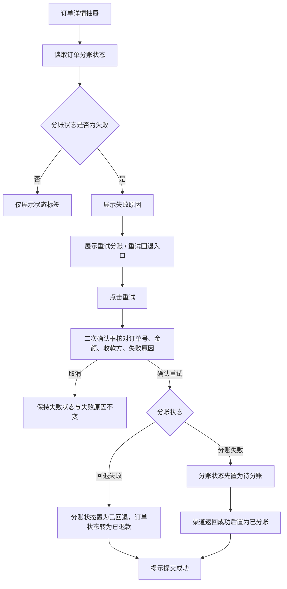
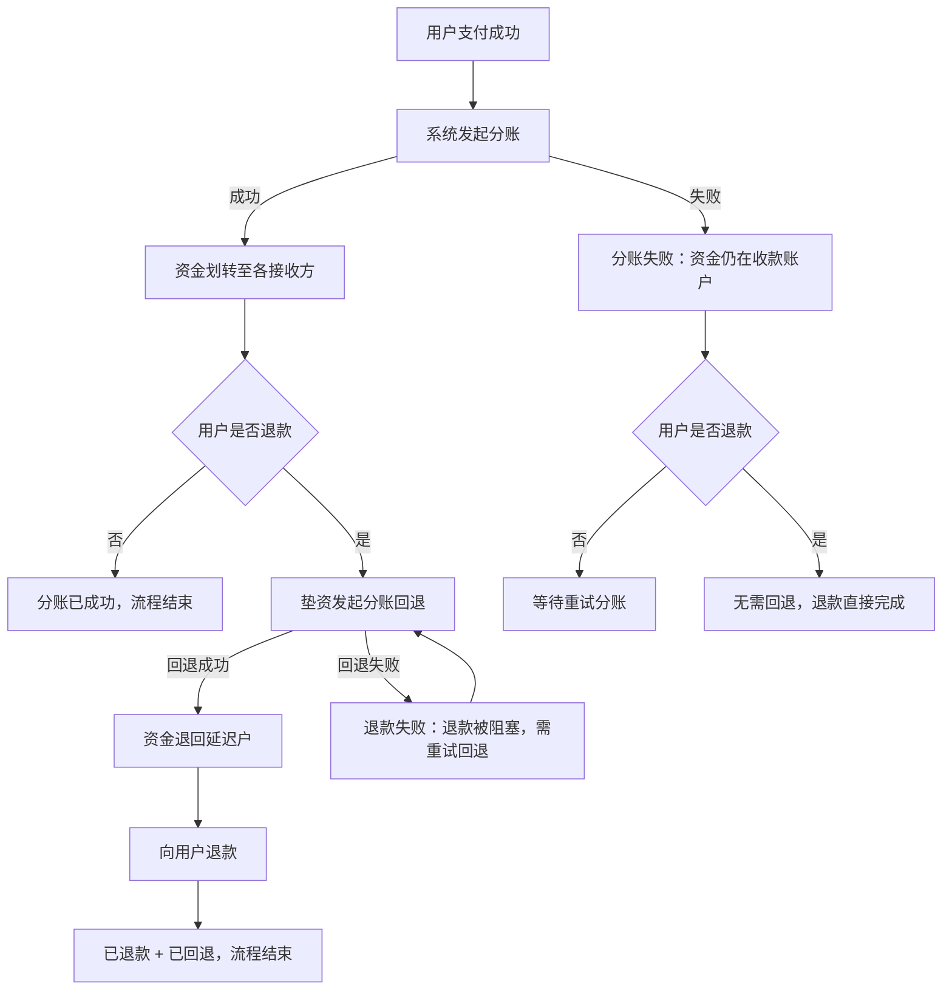
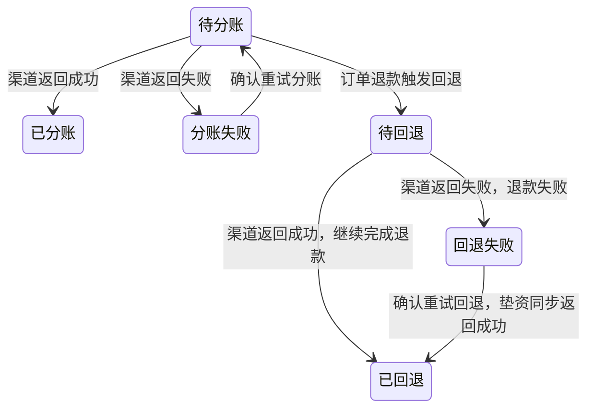

# 订单详情-分账与回退失败原因与重试 PRD

> 版本 v1.1　·　日期 2026-09-18

---

## 一、需求背景与目标

**背景**

- 现状：线上自动分账订单在支付后由系统自动发起分账；订单退款时由系统自动发起分账回退。分账与回退均通过汇付斗拱渠道完成。
- 现状：分账成功后资金已划转至各接收方。按渠道的处理顺序，用户退款前必须先将已分账资金回退（交易确认退款），回退成功后才能将资金退还给用户；回退过程可动用垫资完成，且回退结果为同步返回。
- 问题：订单详情仅展示「分账失败」「回退失败」状态，不展示失败原因，运营无法判断失败原因，也无法在后台重新发起，被阻塞的退款无法继续完成。

**范围**

- 本次需求解决范围：订单管理 → 订单详情中，分账状态为「分账失败」「回退失败」时展示异常原因，并支持人工重试分账或回退；以及分账失败与回退失败场景的独立演示页。

**目标**

- 支持在订单详情中查看分账失败或回退失败的异常原因。
- 支持在订单详情中对失败订单重新发起分账或回退，使被阻塞的退款可以继续完成。
- 支持以独立整页分享分账失败与回退失败场景，用于对外演示。

---

## 二、核心业务流程

退款与分账的资金关系，决定订单详情中出现失败状态的原因。回退先于退款，回退失败会阻塞退款：

---

## 三、功能清单

| ID  | 模块 | 功能 | 描述 |
| --- | -- | -- | -- |
| F01 | 订单管理 | 失败原因展示 | 订单详情展示分账或回退失败原因 |
| F02 | 订单管理 | 资金失败重试 | 二次确认后重新发起分账或回退 |
| F03 | 订单管理 | 失败场景独立演示页 | 分享用的失败场景独立整页演示 |

---

## 四、功能详述

### F01｜失败原因展示

**说明**：在订单详情抽屉的「收款信息」分区内，随分账状态展示分账或回退的失败原因，使运营在不下钻渠道系统的前提下定位失败原因。

**操作路径**：订单管理 → 订单详情 → 收款信息 → 查看「分账状态」及失败原因

#### 交互

展示位置：订单详情抽屉 →「收款信息」→「分账状态」字段。

| 元素 | 内容 | 展示规则 |
| --- | --- | --- |
| 状态标签 | 订单分账状态 | 始终展示；订单非线上自动分账时展示「-」 |
| 失败原因 | `原因：{失败原因}` | 仅分账状态为「分账失败」或「回退失败」时展示 |
| 重试入口 | 「重试分账」或「重试回退」链接按钮 | 仅分账状态为「分账失败」或「回退失败」时展示，规则见 F02 |

- 状态标签、失败原因、重试入口在同一单元格内纵向排列，自左对齐。
- 失败原因使用错误色（红色）文本，字号小于正文，与状态标签同列展示。
- 失败原因文本过长时按单元格宽度换行展示，不截断、不折叠。
- 抽屉关闭后重新打开同一订单，展示依据订单当前分账状态重新计算，不保留上次打开的展示状态。

#### 规则

**R01｜分账状态口径**　订单分账状态为**单一字段**，不为分账与回退分别维护状态；该字段的取值覆盖分账与回退两个阶段，同一订单同一时刻只有一个分账状态。

| 阶段 | 取值 |
| --- | --- |
| 分账阶段 | 待分账、已分账、分账失败 |
| 回退阶段 | 待回退、已回退、回退失败 |

分账与回退是同一笔订单资金在时间上的先后阶段，两者互斥、不会并存：进入回退阶段后不再回到分账阶段取值。

**R02｜非线上自动分账订单**　订单资金归属方式不是线上自动分账时，「分账状态」展示「-」，不展示失败原因，也不展示重试入口。

**R03｜失败原因取值**　失败原因取订单记录的分账失败原因字段；该字段为空时展示「未返回失败原因」。

**R04｜失败原因与重试入口的展示条件**　仅当订单分账状态为「分账失败」或「回退失败」时展示失败原因；其余状态（含待分账、待回退、已分账、已回退、-）不展示失败原因。

满足上述状态条件后，重试入口还需同时满足 R06 的订单状态条件与 R12 的权限条件；不满足时仅展示状态与失败原因，不展示重试入口。

**R05｜订单状态与分账状态的约束**　回退先于退款，因此订单退款结果与分账状态存在固定约束：

| 订单状态 | 分账状态 | 处理口径 |
| --- | --- | --- |
| 待付款 / 已取消 | 无 | 允许；未支付订单不分账 |
| 待使用 / 已使用 / 已完成 | 待分账、已分账、分账失败 | 允许；尚未进入退款流程 |
| 待使用 / 已使用 / 已完成 | 待回退、已回退、回退失败 | 不允许；未发起退款不应产生回退 |
| 退款中 | 待回退 | 允许；回退处理中 |
| 退款中 | 回退失败 | 允许；回退失败待重试 |
| 退款失败 | 回退失败 | 允许；回退失败阻塞退款，需重试回退 |
| 已退款 | 已回退 | 允许；回退成功后完成退款 |
| 已退款 | 待分账、分账失败、无 | 允许；分账未成功或退款发生在分账前，无需回退 |
| 已退款 | 已分账、回退失败 | 不允许；退款已完成即说明回退已成功 |

两组不允许组合说明：

- 未退款订单出现回退阶段状态（待回退、已回退、回退失败）属于状态异常。
- 已退款订单停留在回退阶段之外的状态（已分账、回退失败）属于状态异常，两种情况的处理方式见 Q01。

#### 异常

| 场景 | 触发条件 | 系统处理 | 用户反馈 |
| --- | --- | --- | --- |
| 失败原因为空 | 订单记录无失败原因字段或为空字符串 | 使用兜底文案 | 展示「原因：未返回失败原因」 |
| 非线上自动分账订单 | 订单资金归属方式不是线上自动分账 | 不展示原因与重试入口 | 分账状态展示「-」 |
| 分账状态无值 | 订单无分账状态 | 按待分账展示 | 展示「待分账」标签，不展示原因与重试 |
| 状态已流转 | 该订单已被重试或已分账成功 | 按最新状态展示 | 不再展示失败原因与重试入口 |
| 已退款但未进入回退阶段 | 订单已退款，分账状态仍为「已分账」或「回退失败」 | 按状态异常处理 | 展示当前状态，具体处理见 Q01 |
| 退款时未分账成功 | 订单已退款，分账状态为「分账失败」或「待分账」 | 展示失败原因 | 展示失败原因，不展示重试入口 |

#### 验收

以下涉及重试入口的验收场景，均以「当前登录角色具备重试权限」为前提；权限相关的验收见 AC21、AC22。

**AC01｜分账失败原因展示**　Given 存在一笔订单状态不是「已退款」、分账状态为「分账失败」且有失败原因的订单，When 打开该订单详情，Then「分账状态」展示「分账失败」标签，并在其下方展示「原因：{失败原因}」与「重试分账」入口。

**AC02｜回退失败原因展示**　Given 存在一笔分账状态为「回退失败」且有失败原因的订单，When 打开该订单详情，Then「分账状态」展示「回退失败」标签，并在其下方展示「原因：{失败原因}」与「重试回退」入口。

**AC03｜失败原因缺失兜底**　Given 存在一笔分账状态为「分账失败」但无失败原因的订单，When 打开该订单详情，Then 原因区展示「原因：未返回失败原因」。

**AC04｜非失败状态不展示**　Given 存在一笔分账状态为「待分账」的订单，When 打开该订单详情，Then 仅展示「待分账」标签，不展示失败原因与重试入口。

**AC05｜非线上自动分账订单**　Given 存在一笔资金归属方式为线下对公结算的订单，When 打开该订单详情，Then「分账状态」展示「-」，不展示失败原因与重试入口。

**AC06｜分账状态为单一状态**　Given 一笔订单分账成功后用户发起退款且回退失败，When 打开该订单详情，Then「分账状态」仅展示「回退失败」一个状态，不同时展示「已分账」。

**AC14｜回退失败阻塞退款**　Given 存在一笔订单状态为「退款失败」、分账状态为「回退失败」的订单，When 打开该订单详情，Then「分账状态」展示「回退失败」并展示失败原因，且展示「重试回退」入口。

**AC15｜退款完成后展示已回退**　Given 存在一笔订单状态为「已退款」、分账状态为「已回退」的订单，When 打开该订单详情，Then「分账状态」展示「已回退」，不展示失败原因与重试入口。

**AC16｜退款时未分账成功**　Given 存在一笔订单状态为「已退款」、分账状态为「分账失败」的订单，When 打开该订单详情，Then「分账状态」展示「分账失败」并展示失败原因，但不展示重试入口。

**AC17｜退款发生在分账前**　Given 存在一笔订单状态为「已退款」且无分账状态的订单，When 打开该订单详情，Then「分账状态」展示「待分账」，不展示失败原因与重试入口。

---

### F02｜资金失败重试

**说明**：对分账失败或回退失败的订单提供人工重试能力，重新向渠道发起分账或回退，使失败订单可在订单管理内闭环处理。

**操作路径**：订单管理 → 订单详情 → 收款信息 → 点击「重试分账」/「重试回退」 → 二次确认框核对信息 → 确认重试

#### 交互

| 元素 | 内容 | 规则 |
| --- | --- | --- |
| 重试入口 | 「重试分账」或「重试回退」链接按钮 | 展示条件按 R06 判定，文案按 R07 判定 |
| 确认框标题 | 「确认重试分账？」或「确认重试回退？」 | 与重试类型一致 |
| 确认框内容-订单号 | 当前订单订单号 | 只读 |
| 确认框内容-金额 | `分账金额：￥{金额}` 或 `回退金额：￥{金额}` | 标签随重试类型切换，金额按 R08 计算 |
| 确认框内容-收款方 | 分账接收方商户号 | 按 R09 取值 |
| 确认框内容-失败原因 | `失败原因：{失败原因}` | 与 F01 展示的原因一致，缺失时展示「未返回失败原因」 |
| 确认框按钮 | 「确认重试」「取消」 | 取消后不提交，抽屉保持打开并停留在当前失败状态 |

- 确认框为模态弹窗，弹出后遮挡抽屉，取消或提交后回到抽屉，抽屉不关闭。
- 金额统一保留 2 位小数并使用千分位展示，前缀「￥」。
- 提交成功后展示成功提示，文案为「订单 {订单号} 已提交重试分账」或「订单 {订单号} 已提交重试回退」。
- 无重试权限的角色不展示重试入口，无法进入确认框，权限口径见 R12。

#### 规则

**R06｜重试允许条件**　重试入口的展示与提交需同时满足分账状态条件与订单状态条件：

| 重试类型 | 分账状态条件 | 订单状态条件 |
| --- | --- | --- |
| 重试分账 | 分账状态为「分账失败」 | 订单状态不是「已退款」 |
| 重试回退 | 分账状态为「回退失败」 | 无 |

- 已退款订单不展示「重试分账」入口，也不允许提交分账重试，避免向已退款订单的分账接收方划付资金。
- 表中两个条件需同时满足才展示对应重试入口；任一条件不满足时不展示入口，也不允许提交。

**R07｜重试类型判定**　分账状态为「回退失败」时提交回退重试，入口与确认框使用「重试回退」文案；分账状态为「分账失败」时提交分账重试，使用「重试分账」文案。

**R08｜重试金额口径**　重试金额为订单各结算参与方金额合计；不存在参与方金额或合计为 0 时，取订单金额。金额保留 2 位小数。

**R09｜收款方口径**　确认框「收款方」展示分账接收方商户号，即该订单分账时实际划付的目标商户号；无分账接收方商户号时展示「-」。

**R10｜重试后状态与失败原因**

- 回退重试：回退通过垫资完成、渠道结果同步返回。用户确认重试后，分账状态由「回退失败」直接置为「已回退」，订单状态同步由「退款失败」转为「已退款」，并提示提交成功；分账状态不在「待回退」停留。
- 分账重试：用户确认重试后，分账状态由「分账失败」置为「待分账」；渠道返回成功后置为「已分账」。
- 两种重试确认后均清空该订单的失败原因。
- 重试后渠道再次返回失败时，分账状态回到对应的失败状态，并用渠道最新返回的失败原因**覆盖**原有失败原因，不保留历史失败原因。
- 订单详情不记录重试操作日志，不展示重试次数、操作人与操作时间。

**R11｜重试次数**　重试次数不设上限，失败订单可重复发起重试，每次重试按 R10 更新状态与失败原因。

**R12｜重试操作权限**

- 重试分账与重试回退仅对超级管理员、财务及拥有重试权限的其他角色开放。
- 无重试权限的角色可查看失败状态与失败原因，但不展示重试入口。

**R13｜状态更新生效范围**　重试结果对同一订单生效；再次打开该订单详情时按更新后的分账状态展示，仍处于失败状态时展示最新一次失败原因。

#### 状态

| 分账状态 | 含义 | 进入条件 | 可执行操作 |
| --- | --- | --- | --- |
| 待分账 | 等待系统发起分账 | 支付成功，或分账重试确认后 | 查看 |
| 已分账 | 分账成功，资金已划转至各接收方 | 分账结果返回成功 | 查看 |
| 分账失败 | 系统发起分账后渠道返回失败 | 分账结果返回失败 | 查看原因；订单未退款时可重试分账 |
| 待回退 | 等待系统发起回退 | 订单退款触发回退 | 查看 |
| 已回退 | 回退成功，资金已退回 | 回退结果返回成功，或回退重试确认后同步返回成功 | 查看 |
| 回退失败 | 系统发起回退后渠道返回失败 | 回退结果返回失败 | 查看原因、重试回退 |

失败原因的覆盖更新：同一订单多次重试失败时，订单详情只展示最近一次渠道返回的失败原因，不保留历史失败原因，也不展示重试次数。

进入回退阶段后不再回到分账阶段取值：订单一旦退款，分账状态只会在待回退、已回退、回退失败三个取值之间流转。

#### 异常

| 场景 | 触发条件 | 系统处理 | 用户反馈 |
| --- | --- | --- | --- |
| 非失败状态触发 | 订单分账状态不是「分账失败」或「回退失败」 | 不执行重试 | 不展示重试入口 |
| 失败原因缺失 | 订单无失败原因 | 允许重试 | 确认框展示「失败原因：未返回失败原因」 |
| 无参与方金额 | 订单无结算参与方或金额合计为 0 | 使用订单金额作为重试金额 | 确认框展示订单金额 |
| 取消确认框 | 点击「取消」 | 不提交重试，不修改订单状态 | 关闭确认框，抽屉保留原失败状态与原因 |
| 已退款订单分账失败 | 订单已退款且分账状态为「分账失败」 | 不允许分账重试 | 展示失败原因，不展示重试入口 |
| 回退成功但退款未完成 | 分账状态为「已回退」、订单状态为「退款失败」 | 不在回退重试范围 | 展示「已回退」，不展示重试入口 |
| 无重试权限 | 当前角色无重试权限 | 不允许提交重试 | 不展示重试入口 |
| 重试后再次失败 | 重试后渠道再次返回失败 | 回到对应失败状态并覆盖失败原因 | 展示最新失败原因，重试入口保持可用 |
| 重试超过一定次数 | 同一订单多次重试 | 不做次数限制，按重试后结果处理 | 每次重试均按 R10 更新状态与失败原因 |
| 重复点击重试 | 提交过程中再次点击入口 | 不重复提交 | 待确认，见 Q06 |

#### 验收

除 AC21 外，以下场景均以「当前登录角色具备重试权限」为前提。

**AC07｜分账重试成功**　Given 订单状态不是「已退款」、分账状态为「分账失败」且有失败原因，When 点击「重试分账」并在确认框点击「确认重试」，Then 分账状态先变为「待分账」，失败原因被清空，且展示「订单 {订单号} 已提交重试分账」提示。

**AC08｜回退重试成功**　Given 订单分账状态为「回退失败」，When 点击「重试回退」并在确认框点击「确认重试」，Then 分账状态直接变为「已回退」，失败原因被清空，且展示「订单 {订单号} 已提交重试回退」提示。

**AC09｜确认框信息一致**　Given 订单分账状态为「分账失败」，When 点击「重试分账」，Then 确认框标题为「确认重试分账？」，内容包含该订单订单号、分账金额、分账接收方商户号和与 F01 一致的失败原因。

**AC10｜取消不生效**　Given 已打开重试确认框，When 点击「取消」，Then 订单分账状态与失败原因保持原值，重试入口仍展示。

**AC11｜重试金额口径**　Given 一笔订单存在结算参与方且金额合计为 ￥120.00，When 打开重试确认框，Then 展示「分账金额：￥120.00」。

**AC12｜无参与方金额兜底**　Given 一笔订单不存在结算参与方金额、订单金额为 ￥299.00，When 打开重试确认框，Then 展示「分账金额：￥299.00」。

**AC13｜状态更新生效**　Given 一笔订单已从「分账失败」重试分账且渠道已返回成功，When 关闭抽屉后重新打开该订单详情，Then 分账状态展示为「已分账」，不再展示失败原因与重试入口。

**AC18｜收款方展示分账接收方商户号**　Given 一笔订单存在分账接收方商户号 `MCH0001`，When 打开重试确认框，Then「收款方」展示 `MCH0001`。

**AC19｜重试后再次失败覆盖原因**　Given 订单分账失败原因为「原因 A」，When 重试后渠道返回「原因 B」，Then 订单分账状态展示「分账失败」，失败原因展示「原因 B」，不再展示「原因 A」。

**AC20｜重试次数不设上限**　Given 同一订单已连续重试失败 3 次，When 在第 4 次仍展示失败状态，Then 重试入口仍可用，可继续发起重试。

**AC21｜无权限角色不可重试**　Given 当前登录角色无重试权限，When 打开一笔「回退失败」订单详情，Then 展示「回退失败」标签与失败原因，但不展示「重试回退」入口。

**AC22｜有权限角色可重试**　Given 当前登录角色为财务，When 打开一笔「回退失败」订单详情，Then 展示「重试回退」入口，确认后可提交重试。

**AC23｜回退重试成功后继续退款**　Given 一笔订单状态为「退款失败」、分账状态为「回退失败」，When 点击「重试回退」并确认，Then 分账状态直接变为「已回退」，订单状态同步变为「已退款」。

**AC24｜进入回退阶段后不再回到分账阶段**　Given 一笔订单已进入回退阶段、分账状态为「回退失败」，When 多次发起回退重试，Then 分账状态只出现「回退失败」与「已回退」，不出现「待分账」或「已分账」。

**AC25｜分账重试后渠道返回成功**　Given 一笔订单分账状态为「分账失败」且已完成重试分账，When 渠道返回成功，Then 分账状态变为「已分账」，失败原因被清空，且不再展示「重试分账」入口。

---

### F03｜失败场景独立演示页

**说明**：提供分账失败与回退失败两个独立整页，用于对外分享演示失败场景，页面内容与订单详情右侧抽屉同源一致，仅呈现方式不同。

**操作路径**：打开分账失败演示页 → 查看订单 2026052414111900016 的分账失败详情；打开回退失败演示页 → 查看订单 2026092413282700030 的回退失败详情

#### 交互

| 项目 | 内容 | 规则 |
| --- | --- | --- |
| 演示页 | 分账失败演示页、回退失败演示页 | 两个独立整页，各自固定对应一个订单 |
| 对应订单 | 分账失败演示页对应订单 2026052414111900016；回退失败演示页对应订单 2026092413282700030 | 固定对应，不由用户选择 |
| 页面内容 | 与「订单管理 → 订单详情」右侧抽屉同源一致 | 内容口径见 R15 |
| 呈现方式 | 不套后台外壳的整页 | 面板宽度固定 800px、居中，作为整页文档流展示，不使用浮层抽屉 |
| 交付形式 | 可导出为单文件 HTML | 双击打开即落在对应订单详情 |

#### 规则

**R14｜演示页订单范围**　分账失败演示页固定对应订单 2026052414111900016，回退失败演示页固定对应订单 2026092413282700030；演示页不承载其他订单的展示。

**R15｜演示页内容口径**　两个演示页的页面内容与「订单管理 → 订单详情」右侧抽屉同源一致，失败原因展示、重试入口与二次确认均沿用 R01～R13。

**R16｜演示页呈现方式**　演示页不套后台外壳，面板宽度固定 800px、居中、作为整页文档流展示，不使用浮层抽屉。

**R17｜演示页交付形式**　演示页可导出为单文件 HTML，双击打开即落在对应订单详情。

#### 验收

**AC26｜分账失败演示页**　Given 分账失败演示页已打开，When 查看页面内容，Then 展示订单 2026052414111900016 的订单详情内容，包含「分账失败」状态、失败原因与「重试分账」入口。

**AC27｜回退失败演示页**　Given 回退失败演示页已打开，When 查看页面内容，Then 展示订单 2026092413282700030 的订单详情内容，包含「回退失败」状态、失败原因与「重试回退」入口。

**AC28｜独立整页呈现**　Given 打开任一失败场景演示页，When 查看页面布局，Then 页面不套后台外壳，面板以 800px 宽度居中、作为整页文档流展示，不以浮层抽屉形式呈现。

**AC29｜单文件 HTML 导出**　Given 失败场景演示页已导出为单文件 HTML，When 双击打开该文件，Then 直接展示对应订单的订单详情内容。

---

## 五、待确认事项

| ID | 待确认事项 | 影响功能 | 状态 |
| --- | --- | --- | --- |
| Q01 | R05 中两组不允许组合（未退款却出现回退阶段状态；已退款却停留在「已分账」「回退失败」）的订单详情展示与可执行操作，以及是否需要向运营告警 | F01、F02 | 待确认 |
| Q02 | 「分账失败」是否需区分「确认失败」与「状态未知」（渠道超时等）：若为状态未知，实际可能已分账成功，此时退款前是否需先查证分账结果，以及是否允许发起分账重试 | F01、F02 | 待确认 |
| Q03 | 垫资回退失败的具体原因是否需单独提示（如垫资账户余额不足、垫资方未参与该笔交易分账），以便运营判断需先充值还是先调整分账关系 | F01、F02 | 待确认 |
| Q04 | 回退成功但退款环节未完成时（分账状态「已回退」、订单状态「退款失败」）的处理方式，以及是否由本需求提供重试入口 | F02 | 待确认 |
| Q05 | 账期金额口径：应结算金额未扣减退款金额；已退款且分账失败的订单仍以全额进入账期，重试成功后可能向已退款订单的分账接收方付款（属结算中心范围） | 关联结算中心 | 待确认 |
| Q06 | 重试提交过程中是否需 Loading 与防重复提交机制 | F02 | 待确认 |
| Q07 | 订单状态为「退款中」、分账状态为「回退失败」的订单，回退重试确认后订单状态是否同样直接转为「已退款」 | F02 | 待确认 |
| Q08 | 失败场景独立演示页的数据来源（固定演示数据或其他）与对外分享时的访问方式 | F03 | 待确认 |
