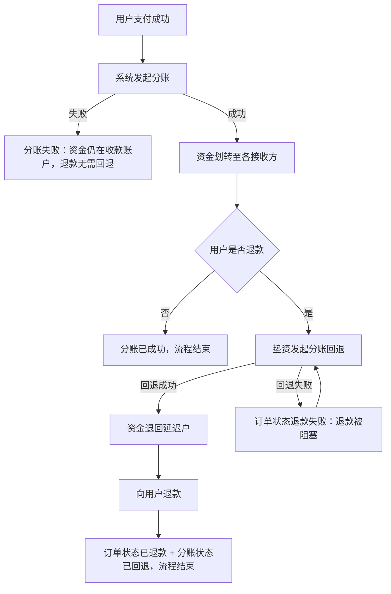
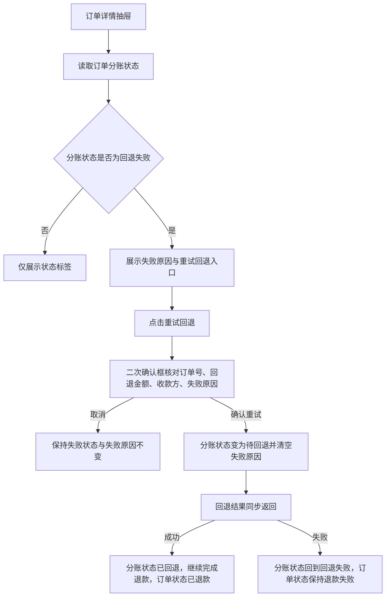
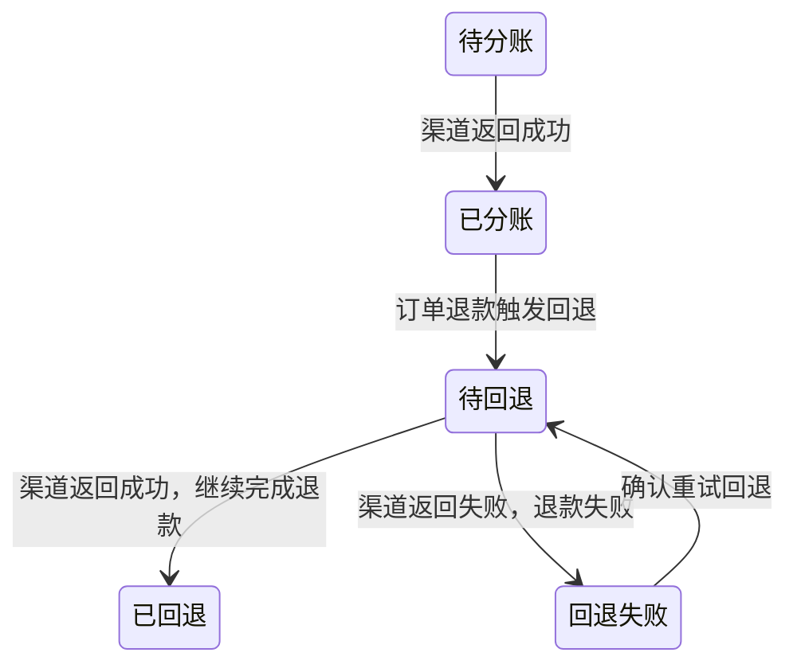

# 订单详情-分账回退失败原因与重试 PRD

> 本文只覆盖**回退阶段**的失败与重试。分账阶段（待分账、已分账、分账失败）的失败原因与重试，见《订单详情-分账失败原因与重试 PRD》。

## 一、需求背景

* 线上自动分账订单在支付后由系统自动发起分账，订单退款时由系统自动发起分账回退，分账与回退均通过汇付斗拱渠道完成。当前订单详情仅展示「回退失败」状态，不展示失败原因，运营无法判断失败原因，也无法在后台重新发起回退。
* 分账成功后资金已划转至各接收方。按汇付斗拱的处理顺序，用户退款前必须先将已分账资金回退（交易确认退款），回退成功后才能将资金退还给用户；回退过程可动用垫资完成，且回退结果为同步返回。
* 回退失败会**阻塞**退款：订单停在「退款失败」，用户拿不到退款，必须重试回退成功后才能继续完成退款。
* 本次需求解决范围：订单管理 → 订单详情抽屉中，分账状态为「回退失败」时展示异常原因，并支持人工重试回退。

---

## 二、需求目标

* 支持在订单详情中查看分账回退失败的异常原因。
* 支持在订单详情中对回退失败订单重新发起回退，使被阻塞的退款可以继续完成。
* 明确回退阶段取值与订单状态之间的约束关系，使状态异常可被识别。

---

## 三、核心业务流程

回退与退款的先后关系，决定「回退失败」为什么会阻塞退款：

订单详情中的展示与重试链路：

---

## 四、需求功能清单

| ID | 终端 | 模块 | 功能 | 描述 |
| --- | --- | --- | --- | --- |
| F01 | 后台 | 订单管理 | 回退失败原因展示 | 订单详情分账状态为「回退失败」时展示异常原因 |
| F02 | 后台 | 订单管理 | 重试回退 | 支持对回退失败订单二次确认后重新发起回退，回退成功后继续完成退款 |

---

# 五、需求功能详述

## 5.1 F01｜回退失败原因展示

### 5.1.1 功能说明

在订单详情抽屉的「收款信息」分区内，随分账状态展示回退失败的异常原因，使运营在不下钻渠道系统的前提下定位失败原因，并识别被阻塞的退款。

### 5.1.2 用户操作

1. 进入「订单管理」列表。
2. 点击目标订单的「详情」。
3. 在抽屉「收款信息」分区查看「分账状态」及其失败原因。

### 5.1.3 页面 / 交互

展示位置：订单详情抽屉 →「收款信息」→「分账状态」字段。

| 元素 | 内容 | 展示规则 |
| --- | --- | --- |
| 状态标签 | 订单分账状态 | 始终展示；订单非线上自动分账时展示「-」 |
| 失败原因 | `原因：{失败原因}` | 仅分账状态为「回退失败」时展示 |
| 重试入口 | 「重试回退」链接按钮 | 仅分账状态为「回退失败」时展示，允许条件见 R06 |

* 状态标签、失败原因、重试入口在同一单元格内纵向排列，自左对齐。
* 失败原因使用错误色（红色）文本，字号小于正文，与状态标签同列展示。
* 失败原因文本过长时按单元格宽度换行展示，不截断、不折叠。
* 抽屉关闭后重新打开同一订单，展示依据订单当前分账状态重新计算，不保留上次打开的展示状态。

### 5.1.4 核心业务规则

**R01｜分账状态口径**

订单分账状态为**单一字段**，不为分账与回退分别维护状态。该字段的取值覆盖分账与回退两个阶段，同一订单同一时刻只有一个分账状态：

| 阶段 | 取值 |
| --- | --- |
| 分账阶段 | 待分账、已分账、分账失败 |
| 回退阶段 | 待回退、已回退、回退失败 |

分账与回退是同一笔订单资金在时间上的先后阶段，两者互斥、不会并存：进入回退阶段后不再回到分账阶段取值。本文只处理取值「回退失败」的情况。

**R02｜回退阶段取值与订单状态的约束**

回退先于退款，因此订单状态与分账状态存在固定约束：

| 订单状态 | 分账状态 | 处理口径 |
| --- | --- | --- |
| 待付款 / 已取消 | 无 | 允许；未支付订单不分账 |
| 待使用 / 已使用 / 已完成 | 待分账、已分账、分账失败 | 允许；尚未进入退款流程 |
| 待使用 / 已使用 / 已完成 | 待回退、已回退、回退失败 | 不允许；未发起退款不应产生回退 |
| 退款中 | 待回退 | 允许；回退处理中 |
| 退款中 | 回退失败 | 允许；回退失败待重试 |
| 退款失败 | 回退失败 | 允许；回退失败阻塞退款，需重试回退 |
| 已退款 | 已回退 | 允许；回退成功后完成退款 |
| 已退款 | 待分账、分账失败、无 | 允许；分账未成功或退款发生在分账前，无需回退 |
| 已退款 | 已分账、回退失败 | 不允许；退款已完成即说明回退已成功 |

两组不允许组合说明：

* 未退款订单出现回退阶段状态（待回退、已回退、回退失败）属于状态异常。
* 已退款订单停留在回退阶段之外的状态（已分账、回退失败）属于状态异常。
* 两种状态异常的处理方式见 Q01。

**R03｜非线上自动分账订单**

订单资金归属方式不是线上自动分账时，「分账状态」展示「-」，不展示失败原因，也不展示重试入口。

**R04｜回退失败原因取值**

失败原因取订单记录的分账失败原因字段；该字段为空时展示「未返回失败原因」。

**R05｜失败原因与重试入口的展示条件**

* 仅当分账状态为「回退失败」时展示失败原因；其余取值（待分账、已分账、分账失败、待回退、已回退、-）不展示回退失败原因。
* 满足上述状态条件后，重试入口还需同时满足 R06 的允许条件与 R12 的权限条件；不满足时仅展示状态与失败原因，不展示重试入口。

### 5.1.5 数据 / 状态变化

无。F01 为只读展示，不修改订单数据。

### 5.1.6 异常与边界

| 场景 | 触发条件 | 系统处理 | 用户反馈 |
| --- | --- | --- | --- |
| 失败原因为空 | 订单记录无失败原因字段或为空字符串 | 使用兜底文案 | 展示「原因：未返回失败原因」 |
| 非线上自动分账订单 | 订单资金归属方式不是线上自动分账 | 不展示原因与重试入口 | 分账状态展示「-」 |
| 状态已流转 | 该订单已被重试，回退成功并完成退款 | 按最新状态展示 | 展示「已回退」，不再展示失败原因与重试入口 |
| 未退款却处于回退阶段 | 订单状态为待使用、已使用或已完成，分账状态为待回退、已回退或回退失败 | 按状态异常处理 | 展示当前状态，具体处理见 Q01 |
| 已退款却停留在回退阶段之外 | 订单状态为「已退款」，分账状态为「已分账」或「回退失败」 | 按状态异常处理 | 展示当前状态，具体处理见 Q01 |
| 回退成功但退款未完成 | 分账状态为「已回退」，订单状态为「退款失败」 | 不在本需求的回退重试范围 | 展示「已回退」，不展示重试入口 |
| 分账未成功订单退款 | 订单已退款，分账状态为「分账失败」或「待分账」 | 展示分账阶段口径 | 见《订单详情-分账失败原因与重试 PRD》 |

### 5.1.7 验收标准

涉及重试入口的验收场景，均以「当前登录角色具备重试权限」为前提；权限相关验收见 AC19、AC20。

**AC01｜回退失败原因展示**

Given 存在一笔分账状态为「回退失败」且有失败原因的订单，When 打开该订单详情，Then「分账状态」展示「回退失败」标签，并在其下方展示「原因：{失败原因}」与「重试回退」入口。

**AC02｜失败原因缺失兜底**

Given 存在一笔分账状态为「回退失败」但无失败原因的订单，When 打开该订单详情，Then 原因区展示「原因：未返回失败原因」。

**AC03｜非失败状态不展示**

Given 存在一笔分账状态为「待回退」的订单，When 打开该订单详情，Then 仅展示「待回退」标签，不展示失败原因与重试入口。

**AC04｜非线上自动分账订单**

Given 存在一笔资金归属方式为线下对公结算的订单，When 打开该订单详情，Then「分账状态」展示「-」，不展示失败原因与重试入口。

**AC05｜分账状态为单一状态**

Given 一笔订单分账成功后用户发起退款且回退失败，When 打开该订单详情，Then「分账状态」仅展示「回退失败」一个状态，不同时展示「已分账」。

**AC06｜回退失败阻塞退款**

Given 存在一笔订单状态为「退款失败」、分账状态为「回退失败」的订单，When 打开该订单详情，Then「分账状态」展示「回退失败」并展示失败原因，且展示「重试回退」入口。

**AC07｜退款完成后展示已回退**

Given 存在一笔订单状态为「已退款」、分账状态为「已回退」的订单，When 打开该订单详情，Then「分账状态」展示「已回退」，不展示失败原因与重试入口。

**AC08｜已退款订单停留在回退阶段之外**

Given 存在一笔订单状态为「已退款」、分账状态为「分账失败」的订单，When 打开该订单详情，Then「分账状态」按分账阶段口径展示，不展示「重试回退」入口，具体处理见 Q01。

---

## 5.2 F02｜重试回退

### 5.2.1 功能说明

对回退失败的订单提供人工重试能力，重新向渠道发起回退；回退成功后继续完成退款，使被阻塞的退款可在订单管理内闭环处理。

### 5.2.2 用户操作

1. 在订单详情「收款信息」的「分账状态」中查看失败原因。
2. 点击「重试回退」。
3. 在二次确认框中核对订单号、回退金额、分账接收方商户号与失败原因。
4. 点击「确认重试」提交；或点击「取消」放弃本次操作。

### 5.2.3 页面 / 交互

| 元素 | 内容 | 规则 |
| --- | --- | --- |
| 重试入口 | 「重试回退」链接按钮 | 展示条件按 R06 判定 |
| 确认框标题 | 「确认重试回退？」 | 固定文案 |
| 确认框内容-订单号 | 当前订单订单号 | 只读 |
| 确认框内容-金额 | `回退金额：￥{金额}` | 金额按 R07 计算 |
| 确认框内容-收款方 | 分账接收方商户号 | 按 R08 取值 |
| 确认框内容-失败原因 | `失败原因：{失败原因}` | 与 F01 展示的原因一致，缺失时展示「未返回失败原因」 |
| 确认框按钮 | 「确认重试」「取消」 | 取消后不提交，抽屉保持打开并停留在当前失败状态 |

* 确认框为模态弹窗，弹出后遮挡抽屉；取消或提交后回到抽屉，抽屉不关闭。
* 金额统一保留 2 位小数并使用千分位展示，前缀「￥」。
* 提交并回退成功后的提示文案为「订单 {订单号} 回退成功，退款已完成」；提交后回退结果未同步返回成功的提示文案见 Q03。
* 无重试权限的角色不展示重试入口，无法进入确认框，权限口径见 R12。

### 5.2.4 核心业务规则

**R06｜重试回退允许条件**

分账状态为「回退失败」时，展示「重试回退」入口并允许提交；订单状态不作为「重试回退」的额外限制条件（回退失败时订单状态必然为「退款中」或「退款失败」，见 R02）。

**R07｜重试金额口径**

重试金额为订单各结算参与方金额合计；不存在参与方金额或合计为 0 时，取订单金额。金额保留 2 位小数。

**R08｜收款方口径**

确认框「收款方」展示分账接收方商户号，即该订单分账时实际划付的目标商户号；无分账接收方商户号时展示「-」。

**R09｜重试后状态与失败原因**

* 提交成功后：分账状态由「回退失败」变为「待回退」，并清空该订单的失败原因。
* 回退结果为同步返回：
  * 返回成功时，分账状态变为「已回退」，并按 R10 继续完成退款。
  * 返回失败时，分账状态回到「回退失败」，并用渠道最新返回的失败原因**覆盖**原有失败原因，不保留历史失败原因。
* 因回退结果同步返回，「待回退」不作为可观察的停留状态；分账状态在提交后直接落到「已回退」或「回退失败」。
* 订单详情不记录重试操作日志，不展示重试次数、操作人与操作时间。

**R10｜回退成功后继续完成退款**

* 回退成功后，系统继续完成该订单的退款：订单状态由「退款失败」变为「已退款」，并生成退款单号。
* 回退失败时不进入退款环节，订单状态保持「退款失败」。
* 订单状态与分账状态的组合需持续满足 R02 的约束。

**R11｜重试次数**

重试次数不设上限，失败订单可重复发起重试，每次重试按 R09 更新状态与失败原因。

**R12｜重试操作权限**

* 重试回退仅对超级管理员、财务及拥有重试权限的其他角色开放。
* 无重试权限的角色可查看失败状态与失败原因，但不展示重试入口。

**R13｜状态更新生效范围**

重试结果对同一订单生效；再次打开该订单详情时按更新后的分账状态与订单状态展示，并展示最新一次失败原因。

### 5.2.5 数据 / 状态变化

| 分账状态 | 含义 | 进入条件 | 可执行操作 |
| --- | --- | --- | --- |
| 待回退 | 回退请求已发出，等待回退结果 | 订单退款触发回退；或回退重试提交成功 | 查看 |
| 已回退 | 回退成功，资金已退回 | 回退结果返回成功 | 查看 |
| 回退失败 | 系统发起回退后渠道返回失败 | 回退结果返回失败；或重试后再次失败 | 查看原因、重试回退 |

进入回退阶段后不再回到分账阶段取值：订单一旦退款，分账状态只会在待回退、已回退、回退失败三个取值之间流转，不再出现「待分账」「已分账」「分账失败」。

失败原因的覆盖更新：同一订单多次重试失败时，订单详情只展示最近一次渠道返回的失败原因，不保留历史失败原因，也不展示重试次数。

### 5.2.6 异常与边界

| 场景 | 触发条件 | 系统处理 | 用户反馈 |
| --- | --- | --- | --- |
| 非失败状态触发 | 分账状态不是「回退失败」 | 不执行重试 | 不展示重试入口 |
| 失败原因缺失 | 订单无失败原因 | 允许重试 | 确认框展示「失败原因：未返回失败原因」 |
| 无参与方金额 | 订单无结算参与方或金额合计为 0 | 使用订单金额作为重试金额 | 确认框展示订单金额 |
| 取消确认框 | 点击「取消」 | 不提交重试，不修改订单状态 | 关闭确认框，抽屉保留原失败状态与原因 |
| 回退成功但退款未完成 | 分账状态为「已回退」、订单状态为「退款失败」 | 不在回退重试范围 | 展示「已回退」，不展示重试入口；处理方式见 Q03 |
| 无重试权限 | 当前角色无重试权限 | 不允许提交重试 | 不展示重试入口 |
| 重试后再次失败 | 重试后渠道再次返回失败 | 回到「回退失败」并覆盖失败原因 | 展示最新失败原因，重试入口保持可用 |
| 重试超过一定次数 | 同一订单多次重试 | 不做次数限制，按重试后结果处理 | 每次重试均按 R09 更新状态与失败原因 |
| 重复点击重试 | 提交过程中再次点击入口 | 不重复提交 | 待确认，见 Q05 |

### 5.2.7 验收标准

除 AC19 外，以下场景均以「当前登录角色具备重试权限」为前提。

**AC09｜回退重试提交成功**

Given 一笔订单状态为「退款失败」、分账状态为「回退失败」且有失败原因，When 点击「重试回退」并在确认框点击「确认重试」，Then 分账状态由「回退失败」转为「待回退」，失败原因被清空。

**AC10｜回退重试成功后继续退款**

Given 一笔订单状态为「退款失败」、分账状态为「回退失败」，When 点击「重试回退」并在确认框点击「确认重试」且渠道返回成功，Then 分账状态变为「已回退」、订单状态变为「已退款」，并展示「订单 {订单号} 回退成功，退款已完成」提示。

**AC11｜确认框信息一致**

Given 订单分账状态为「回退失败」，When 点击「重试回退」，Then 确认框标题为「确认重试回退？」，内容包含该订单订单号、回退金额、分账接收方商户号和与 F01 一致的失败原因。

**AC12｜取消不生效**

Given 已打开重试确认框，When 点击「取消」，Then 订单分账状态与失败原因保持原值，重试入口仍展示。

**AC13｜重试金额口径**

Given 一笔订单存在结算参与方且金额合计为 ￥120.00，When 打开重试确认框，Then 展示「回退金额：￥120.00」。

**AC14｜无参与方金额兜底**

Given 一笔订单不存在结算参与方金额、订单金额为 ￥299.00，When 打开重试确认框，Then 展示「回退金额：￥299.00」。

**AC15｜收款方展示分账接收方商户号**

Given 一笔订单存在分账接收方商户号 `MCH0001`，When 打开重试确认框，Then「收款方」展示 `MCH0001`。

**AC16｜状态更新生效**

Given 在订单详情中对「回退失败」订单完成重试回退，When 关闭抽屉后重新打开该订单详情，Then 分账状态展示为「已回退」（回退未成功时展示「回退失败」），且不再展示原失败原因。

**AC17｜重试后再次失败覆盖原因**

Given 订单回退失败原因为「原因 A」，When 重试后渠道返回「原因 B」，Then 订单分账状态展示「回退失败」，失败原因展示「原因 B」，不再展示「原因 A」，订单状态保持「退款失败」。

**AC18｜重试次数不设上限**

Given 同一订单已连续重试失败 3 次，When 第 4 次仍返回失败，Then 分账状态仍为「回退失败」，重试入口保持可用，可继续发起重试。

**AC19｜无权限角色不可重试**

Given 当前登录角色无重试权限，When 打开一笔「回退失败」订单详情，Then 展示「回退失败」标签与失败原因，但不展示「重试回退」入口。

**AC20｜有权限角色可重试**

Given 当前登录角色为财务，When 打开一笔「回退失败」订单详情，Then 展示「重试回退」入口，确认后可提交重试。

---

## 六、非功能性需求

* 回退重试不得产生重复的有效退款：回退成功并完成退款后，同一订单不得再次进入退款流程。

---

## 七、待确认事项

| ID | 待确认事项 | 影响功能 | 状态 |
| --- | --- | --- | --- |
| Q01 | R02 中两组不允许组合（未退款却出现回退阶段状态；已退款却停留在「已分账」「回退失败」）的订单详情展示与可执行操作，以及是否需要向运营告警 | F01、F02 | 待确认 |
| Q02 | 垫资回退失败的具体原因是否需单独提示（如垫资账户余额不足、垫资方未参与该笔交易分账），以便运营判断需先充值还是先调整分账关系 | F01、F02 | 待确认 |
| Q03 | 回退结果同步返回失败、分账状态停在「待回退」时的处理方式，以及对应的用户提示文案 | F02 | 待确认 |
| Q04 | 账期金额口径：应结算金额未扣减退款金额；已退款且分账失败的订单仍以全额进入账期，重试成功后可能向已退款订单的分账接收方付款（属结算中心范围） | 关联结算中心 | 待确认 |
| Q05 | 重试提交过程中是否需 Loading 与防重复提交机制 | F02 | 待确认 |
