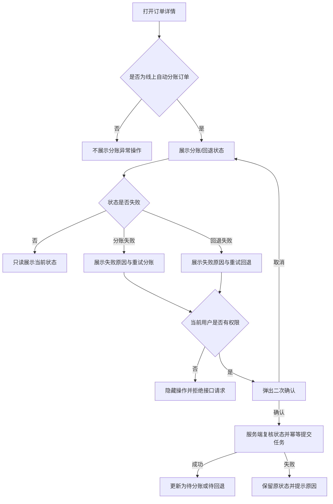

# 订单详情——分账异常处理 PRD

> 文档状态：已确认  
> 对应页面：订单管理－订单详情抽屉  
> 需求基线：[结算能力改造需求分析](./结算能力改造-需求分析-20260916.md)

## 一、需求背景

线上自动分账订单可能因接收方状态、金额校验、支付渠道异常等原因发生分账失败；已分账订单退款时，也可能发生分账回退失败。现有订单详情若只展示失败状态，财务无法判断故障原因，也无法在问题解除后重新发起处理。

本需求在订单详情中补充失败原因、重试动作、二次确认、状态回写及权限控制，形成订单级异常处理闭环。线下对公结算订单不适用本功能。

## 二、需求目标

- 在订单详情的收款信息区准确展示分账或回退状态。
- 对“分账失败”“回退失败”紧邻显示失败原因。
- 仅自营管理员、财务等授权角色可以发起重试。
- 重试前展示订单、金额、接收方与原失败原因，防止误操作。
- 通过鉴权、状态校验和幂等键防止越权及重复执行。

## 三、需求核心业务流程图

## 四、需求功能清单

| 终端 | 模块 | 功能 | 描述 |
|------|------|------|------|
| 后台 | 订单详情 | 分账状态展示 | 在收款信息中展示分账或回退当前状态 |
| 后台 | 订单详情 | 失败原因展示 | 失败状态下展示渠道返回原因和兜底文案 |
| 后台 | 订单详情 | 分账失败重试 | 授权角色二次确认后重试分账 |
| 后台 | 订单详情 | 回退失败重试 | 授权角色二次确认后重试回退 |
| 后端 | 资金任务 | 权限、幂等与审计 | 校验角色、订单状态、业务单号并记录操作 |

## 五、需求功能详述

### 5.1 后台——订单详情——分账状态与失败原因

**原型描述**：
订单详情抽屉的“收款信息”区展示“分账状态”。失败时在状态标签下方展示红色原因文案，并在同一区域展示重试链接。

**用户故事**：
> 作为财务人员，我想直接看到订单资金任务失败原因，以便判断问题并采取处理动作。

**前置条件**：

- 订单资金方式为线上自动分账。
- 系统已获得分账或回退任务结果。

**核心逻辑**：

- 优先展示回退状态；无回退任务时展示分账状态。
- 支持状态：待分账、已分账、分账失败、待回退、已回退、回退失败。
- “分账失败”与“回退失败”下方展示“原因：{失败原因}”。
- 渠道未返回原因时展示“未返回失败原因”，不得留空。
- 线下对公结算订单不展示重试入口。

**边界条件与异常处理**：

- 同一订单存在分账失败和回退任务时，以最新有效资金任务状态为准。
- 原因过长时允许换行或省略展示，悬浮可查看完整内容。
- 查询资金状态失败时不覆盖已保存状态，提示刷新重试。

**技术难点分析**：

- 分账与回退状态的优先级和异步回写一致性。

**验收标准 (Acceptance Criteria)**：

- 🎯 失败订单可同时看到失败状态和原因。
- ✔️ 非失败状态不展示失败原因与重试按钮。
- ✔️ 原因为空时展示兜底文案。
- ❌ 状态接口失败时保留原数据。

**测试用例**：

- 展示分账失败原因
- 展示回退失败原因
- 空原因显示兜底
- 非失败隐藏重试
- 线下订单无重试

### 5.2 后台——订单详情——分账/回退重试

**原型描述**：
点击“重试分账”或“重试回退”后弹出确认框，展示订单号、重试金额、收款方和失败原因；底部为“取消”“确认重试”。

**用户故事**：
> 作为自营管理员或财务，我想在问题解除后重新发起资金任务，以便完成应执行的分账或回退。

**前置条件**：

- 用户具有资金异常重试权限。
- 当前状态分别为分账失败或回退失败。

**核心逻辑**：

- 分账失败展示“重试分账”；回退失败展示“重试回退”。
- 确认框展示订单号、分账/回退金额、收款方“账号（姓名）”、原失败原因。
- 确认后由服务端再次校验权限、订单状态、退款状态、原资金流水及幂等锁。
- 接受任务后，状态分别更新为“待分账”或“待回退”，清空当前失败原因；最终结果异步回写。
- 取消确认不修改任何数据。

**边界条件与异常处理**：

- 无权限用户前端不展示入口，直接调用接口返回无权限。
- 状态已被其他人处理时拒绝重试，提示刷新最新状态。
- 重复点击或请求超时使用同一业务幂等键，不生成重复资金任务。
- 回退重试前若原分账流水不存在、退款状态变化或可回退金额不足，拒绝提交并给出原因。
- 接口提交失败时保留失败状态与原因，允许再次操作。

**技术难点分析**：

- 支付渠道超时情况下的幂等查询和最终一致性。
- 回退金额、退款流水与原分账流水的关联校验。

**验收标准 (Acceptance Criteria)**：

- 🎯 授权用户确认重试后状态进入待处理。
- ✔️ 二次确认信息与当前订单一致。
- ✔️ 重复提交只产生一个有效任务。
- ❌ 无权限、状态冲突或流水异常时不创建任务。

**测试用例**：

- 成功重试分账
- 成功重试回退
- 取消不改状态
- 拦截越权重试
- 拦截重复提交
- 拦截状态冲突

## 六、非功能性需求

### 6.1 性能

- 订单详情 P95 加载时间不超过 2 秒。
- 重试请求在 3 秒内返回“已受理”或明确失败结果。

### 6.2 可用性

- 支付渠道超时不得直接判定最终失败，应进入结果查询。
- 重试接口失败不得丢失原失败状态和原因。

### 6.3 安全

- 重试接口必须执行服务端 RBAC、订单归属和状态校验。
- 银行/商户敏感信息按角色脱敏；全链路使用 HTTPS。

### 6.4 监控

- 记录订单号、资金任务号、动作、操作人、前后状态和渠道返回码。
- 分账/回退失败率连续 5 分钟超过 5% 时告警。

